# Container deployment topology

Records the container deployment on `vps_oracle` (Oracle Cloud VPS, single host) as of 2026-08-02, compiled from this repo's compose stacks plus live `docker ps` / `docker network` inspection.

## Topology diagram

```mermaid
flowchart TB
    Internet((Internet))
    VlessClient([VLESS client])

    subgraph VPS["vps_oracle · Oracle Cloud VPS (single host)"]
        direction TB

        Port80443["host port 80 / 443"]
        Port39876["host port 39876"]

        npm["npm<br/>Nginx Proxy Manager"]
        xui["3x-ui<br/>VLESS+Reality node"]

        subgraph ProxyNet["docker network: proxy (external, created manually once)"]
            direction TB
            portainer["portainer"]
            homepage["homepage"]
            trilium["trilium"]
            vikunja["vikunja"]
            apprise["apprise"]
            grafana["grafana"]

            subgraph LLM["vps_oracle/compose/llm"]
                direction LR
                llamacpp["llama-cpp<br/>router mode · internal access only"]
                openwebui["open-webui"]
            end

            difyweb["dify-web"]
            difyapi["dify-api"]
            difyplugin["dify-plugin-daemon"]
        end

        subgraph DifyInternal["vps_oracle/compose/dify · dify_default (internal network, not on proxy)"]
            direction TB
            difydb[("dify-db<br/>postgres:15")]
            difypgvector[("dify-pgvector<br/>pgvector:pg16")]
            difyredis[("dify-redis")]
            difyworker["dify-worker"]
            difyworkerbeat["dify-worker-beat"]
            difyssrf["dify-ssrf-proxy<br/>squid"]
        end

        subgraph Monitoring["vps_oracle/compose/monitoring · monitoring_default (internal network)"]
            direction TB
            prometheus[("prometheus")]
            nodeexp["node-exporter"]
            blackbox["blackbox-exporter"]
        end

        DockerSock{{"/var/run/docker.sock"}}

        subgraph OtherWorkloads["other projects on the host · not managed by this repo"]
            direction TB
            labenv["lab-environment_default<br/>consul / api-gateway / customers-service<br/>vets-service / visits-service / postgres / redis<br/>prometheus / grafana / jaeger / loki / promtail<br/>toxiproxy / mcp-toolkit (some directly published to host ports)"]
            plp["programming-learning-platform<br/>api-server / mysql / nginx / prometheus<br/>grafana / sandbox / backup (some directly published to host ports)"]
        end
    end

    Internet --> Port80443 --> npm
    VlessClient --> Port39876 --> xui

    npm -."reverse-proxies *.jerome.cloudns.asia".-> xui
    npm -.-> portainer
    npm -.-> homepage
    npm -.-> trilium
    npm -.-> vikunja
    npm -.-> apprise
    npm -.-> grafana
    npm -.-> openwebui
    npm -."Custom Location: /console/api /api /v1 /files /mcp /triggers /openapi".-> difyapi
    npm -."Custom Location: /e/ (plugin webhook)".-> difyplugin
    npm -."default location (everything else)".-> difyweb

    openwebui --> llamacpp

    difyweb --> difyapi
    difyapi <--> difyplugin
    difyapi --> difydb
    difyapi --> difypgvector
    difyapi --> difyredis
    difyapi -.outbound requests pass through.-> difyssrf
    difyworker --> difydb
    difyworker --> difyredis
    difyworker -.outbound requests pass through.-> difyssrf
    difyworkerbeat --> difydb
    difyworkerbeat --> difyredis
    difyplugin --> difydb
    difyplugin --> difyredis
    difyplugin -.outbound requests pass through.-> difyssrf

    grafana --> prometheus
    prometheus --> nodeexp
    prometheus --> blackbox

    homepage -."read-only: container status / resource widget".-> DockerSock
    portainer -."read-write: manages all host containers (including the two non-repo projects below)".-> DockerSock
    DockerSock -.-> OtherWorkloads

    classDef proxynet fill:#dbeafe,stroke:#3b82f6,color:#1e3a8a
    classDef internalnet fill:#f3f4f6,stroke:#9ca3af,color:#374151
    classDef other fill:#fef3c7,stroke:#d97706,color:#78350f,stroke-dasharray: 4 3
    classDef entry fill:#dcfce7,stroke:#16a34a,color:#14532d

    class npm,xui,portainer,homepage,trilium,vikunja,apprise,grafana,openwebui,difyweb,difyapi,difyplugin,llamacpp proxynet
    class difydb,difypgvector,difyredis,difyworker,difyworkerbeat,difyssrf,prometheus,nodeexp,blackbox internalnet
    class labenv,plp other
    class Internet,VlessClient entry
```

## Legend

| Color | Meaning |
|---|---|
| 🟩 green | external entry (Internet / VLESS client) |
| 🟦 blue | containers on the `proxy` network — reachable via NPM reverse proxy, or themselves an entry container like NPM/3x-ui |
| ⬜ gray | only on internal networks (`dify_default`, `monitoring_default`), not on `proxy`, no domain to reach them by |
| 🟨 yellow (dashed border) | other projects running on the host but **not managed by this repo**, drawn only because they share the host and are managed together by Portainer |

## Section notes

### Entry layer
- **npm** (`vps_oracle/compose/npm`) is the only container publishing 80/443; every `*.jerome.cloudns.asia` domain reaches it first, then is forwarded by Forward Hostname/Port (or Dify's Custom Locations) to the target container on the `proxy` network. The management panel is served via `npm.jerome.cloudns.asia`; port 81 is not published to the host.
- **3x-ui** (`vps_oracle/compose/3x-ui`) exceptionally publishes `39876` on its own (the VLESS+Reality node port, which clients connect to directly and which cannot go through an HTTP reverse proxy); its panel `46213` / subscription `51234` go through NPM like the other services. 3x-ui deliberately has no homepage card (sensitive service).

### The `proxy` network (external bridge, `docker network create proxy`, created once manually)
Except for 3x-ui, every other container that NPM needs to reach is attached to this network: `portainer`, `homepage`, `trilium`, `vikunja`, `apprise`, `grafana`, and the outward-facing parts of the `llm`/`dify` stacks. Except for npm/3x-ui, none publish host ports; they reach each other via Docker DNS (container name).

### `vps_oracle/compose/llm`
`llama-cpp` is the Ampere Altra-optimized build (not ollama), running in router mode, loading `.gguf` files under `/models` on demand; `--models-max 1` limits it to keeping one model resident at a time. It is **not on NPM, publishes no ports**, and is reached only inside the `proxy` network by `open-webui` via the OpenAI-compatible endpoint. Resource cap of 3 cores / 9G memory, leaving headroom for npm/3x-ui and other services.

### `vps_oracle/compose/dify`
Only the three containers `dify-web`, `dify-api`, `dify-plugin-daemon` join `proxy` (for NPM to forward to); everything else is only on internal networks:
- `dify_default`: Dify's own default network; `api`/`worker`/`worker_beat`/`plugin_daemon` reach `db_postgres` (metadata), `pgvector` (vector store, a separate instance), and `redis` (cache + Celery broker) all over it.
- `dify_ssrf_proxy_network` (`internal: true`, no outbound route): `api`/`worker`/`worker_beat`/`plugin_daemon` outbound HTTP requests (workflow HTTP nodes, plugin requests) all go through `ssrf-proxy` (squid) to prevent them being used to hit the internal network/cloud metadata endpoint; unrelated to sandbox.
- Slimmed from the official compose: dropped the bundled nginx (use NPM for path forwarding), sandbox (Code nodes unavailable), certbot (certificates handed to NPM); pinned to 1.14.2, not using the 1.16.x agent subsystem, nor 1.15.x (that version has a known login-redirect infinite-loop bug; see `vps_oracle/compose/dify/README.md` for details).

### `vps_oracle/compose/monitoring`
`prometheus`/`node-exporter`/`blackbox-exporter` are only on the internal `monitoring_default` network, with no authentication, deliberately not on `proxy` and not publishing ports; for ad-hoc debugging use `docker exec` or a temporary port. Only `grafana` additionally joins `proxy`, serving dashboards externally via NPM reverse proxy.

### Privileged mount (`/var/run/docker.sock`)
`portainer` (read-write, managing all host containers) and `homepage` (read-only, only for the container-status widget) both mount the docker socket — a known high-risk exception explicitly marked in the repo conventions, which must not be quietly replicated with a new equivalent mount. Being socket-level, both can in practice see/manage **all** containers on the host, including the two projects below that don't belong to this repo.

### Other projects not managed by this repo
The two groups `lab-environment_default` and `programming-learning-platform_exercise-platform-net` run on the same host but have no corresponding `<host>/<compose>/` directory in this repo — most likely projects independently `docker compose up`-ed in other working directories (dev/test environments). This document only faithfully reflects what `docker ps` shows; it does not mean they follow this repo's conventions (timezone, log limits, minimal port exposure, etc.). Both have services publishing host ports directly (such as `180`, `8600`, `3100`, `16786`, `8865`, `9190`, `3001`, `8080`, `9090`), unlike this repo's "internal services don't publish host ports, everything goes through NPM" convention.

## Data sources

- this repo's various `vps_oracle/compose/*/docker-compose.yml`
- `docker ps` / `docker network ls` / `docker inspect` (live container and network attribution, 2026-08-02)
- `vps_oracle/compose/homepage/config/services.yaml` (service cards shown externally)