# 容器部署拓扑图

记录 `vps_oracle`（Oracle Cloud VPS，单主机）上截至 2026-08-02 的容器部署情况，基于本仓库各 compose 栈 + `docker ps` / `docker network` 实测结果整理。

## 拓扑图

```mermaid
flowchart TB
    Internet((Internet))
    VlessClient([VLESS 客户端])

    subgraph VPS["vps_oracle · Oracle Cloud VPS（单主机）"]
        direction TB

        Port80443["宿主机端口 80 / 443"]
        Port39876["宿主机端口 39876"]

        npm["npm<br/>Nginx Proxy Manager"]
        xui["3x-ui<br/>VLESS+Reality 节点"]

        subgraph ProxyNet["docker network: proxy（external, 手动创建一次）"]
            direction TB
            portainer["portainer"]
            homepage["homepage"]
            trilium["trilium"]
            vikunja["vikunja"]
            apprise["apprise"]
            grafana["grafana"]

            subgraph LLM["vps_oracle/compose/llm"]
                direction LR
                llamacpp["llama-cpp<br/>router 模式・仅内部访问"]
                openwebui["open-webui"]
            end

            difyweb["dify-web"]
            difyapi["dify-api"]
            difyplugin["dify-plugin-daemon"]
        end

        subgraph DifyInternal["vps_oracle/compose/dify · dify_default（内部网络，不接 proxy）"]
            direction TB
            difydb[("dify-db<br/>postgres:15")]
            difypgvector[("dify-pgvector<br/>pgvector:pg16")]
            difyredis[("dify-redis")]
            difyworker["dify-worker"]
            difyworkerbeat["dify-worker-beat"]
            difyssrf["dify-ssrf-proxy<br/>squid"]
        end

        subgraph Monitoring["vps_oracle/compose/monitoring · monitoring_default（内部网络）"]
            direction TB
            prometheus[("prometheus")]
            nodeexp["node-exporter"]
            blackbox["blackbox-exporter"]
        end

        DockerSock{{"/var/run/docker.sock"}}

        subgraph OtherWorkloads["宿主机上其他项目 · 不受本仓库管理"]
            direction TB
            labenv["lab-environment_default<br/>consul / api-gateway / customers-service<br/>vets-service / visits-service / postgres / redis<br/>prometheus / grafana / jaeger / loki / promtail<br/>toxiproxy / mcp-toolkit（部分直接发布宿主机端口）"]
            plp["programming-learning-platform<br/>api-server / mysql / nginx / prometheus<br/>grafana / sandbox / backup（部分直接发布宿主机端口）"]
        end
    end

    Internet --> Port80443 --> npm
    VlessClient --> Port39876 --> xui

    npm -."反代 *.jerome.cloudns.asia".-> xui
    npm -.-> portainer
    npm -.-> homepage
    npm -.-> trilium
    npm -.-> vikunja
    npm -.-> apprise
    npm -.-> grafana
    npm -.-> openwebui
    npm -."Custom Location: /console/api /api /v1 /files /mcp /triggers /openapi".-> difyapi
    npm -."Custom Location: /e/（plugin webhook）".-> difyplugin
    npm -."默认 location（其余路径）".-> difyweb

    openwebui --> llamacpp

    difyweb --> difyapi
    difyapi <--> difyplugin
    difyapi --> difydb
    difyapi --> difypgvector
    difyapi --> difyredis
    difyapi -.出站请求经过.-> difyssrf
    difyworker --> difydb
    difyworker --> difyredis
    difyworker -.出站请求经过.-> difyssrf
    difyworkerbeat --> difydb
    difyworkerbeat --> difyredis
    difyplugin --> difydb
    difyplugin --> difyredis
    difyplugin -.出站请求经过.-> difyssrf

    grafana --> prometheus
    prometheus --> nodeexp
    prometheus --> blackbox

    homepage -."只读：容器状态/资源小组件".-> DockerSock
    portainer -."读写：管理宿主机全部容器（含下方两个非本仓库项目）".-> DockerSock
    DockerSock -.-> OtherWorkloads

    classDef proxynet fill:#dbeafe,stroke:#3b82f6,color:#1e3a8a
    classDef internalnet fill:#f3f4f6,stroke:#9ca3af,color:#374151
    classDef other fill:#fef3c7,stroke:#d97706,color:#78350f,stroke-dasharray: 4 3
    classDef entry fill:#dcfce7,stroke:#16a34a,color:#14532d

    class npm,xui,portainer,homepage,trilium,vikunja,apprise,grafana,openwebui,difyweb,difyapi,difyplugin,llamacpp proxynet
    class difydb,difypgvector,difyredis,difyworker,difyworkerbeat,difyssrf,prometheus,nodeexp,blackbox internalnet
    class labenv,plp other
    class Internet,VlessClient entry
```

## 图例

| 颜色 | 含义 |
|---|---|
| 🟩 绿 | 外部入口（Internet / VLESS 客户端） |
| 🟦 蓝 | 接入 `proxy` 网络的容器 —— 能被 NPM 反代访问，或本身就是 NPM/3x-ui 这类入口容器 |
| ⬜ 灰 | 仅在内部网络（`dify_default`、`monitoring_default`）里，不接 `proxy`，没有域名可访问 |
| 🟨 黄（虚线框） | 宿主机上运行、但**不属于本仓库**管理的其他项目，仅因为共享同一台宿主机 + 被 Portainer 一并管理而画出来 |

## 分区说明

### 入口层
- **npm**（`vps_oracle/compose/npm`）是唯一发布 80/443 的容器，所有 `*.jerome.cloudns.asia` 域名都先到它，再按 Forward Hostname/Port（或 Dify 的 Custom Locations）转发到 `proxy` 网络内的目标容器。管理面板走 `npm.jerome.cloudns.asia`，81 端口不发布到宿主机。
- **3x-ui**（`vps_oracle/compose/3x-ui`）例外地单独发布 `39876`（VLESS+Reality 节点端口，客户端直连，不能走 HTTP 反代），面板 `46213`/订阅 `51234` 则跟其他服务一样走 NPM。3x-ui 有意不上 homepage 卡片（敏感服务）。

### `proxy` 网络（外部 bridge，`docker network create proxy` 手动建一次）
除 3x-ui 外，其余所有需要被 NPM 访问到的容器都挂在这张网络上：`portainer`、`homepage`、`trilium`、`vikunja`、`apprise`、`grafana`、以及 `llm`/`dify` 两个栈里对外的部分。除 npm/3x-ui 外均不发布宿主机端口，靠 Docker DNS（容器名）互相访问。

### `vps_oracle/compose/llm`
`llama-cpp` 是 Ampere Altra 优化版（非 ollama），router 模式，按需加载 `/models` 下的 `.gguf` 文件；`--models-max 1` 限制同时只常驻一个模型。它**不接 NPM、不发布端口**，只在 `proxy` 网络内被 `open-webui` 通过 OpenAI 兼容端点访问。资源上限 3 核 / 9G 内存，留给 npm/3x-ui 等其他服务余量。

### `vps_oracle/compose/dify`
只有 `dify-web`、`dify-api`、`dify-plugin-daemon` 三个容器加入 `proxy`（给 NPM 转发），其余全部只在内部网络：
- `dify_default`：Dify 自己的默认网络，`api`/`worker`/`worker_beat`/`plugin_daemon` 访问 `db_postgres`（元数据）、`pgvector`（向量库，独立实例）、`redis`（缓存 + Celery broker）都走这里。
- `dify_ssrf_proxy_network`（`internal: true`，无出网路由）：`api`/`worker`/`worker_beat`/`plugin_daemon` 的出站 HTTP 请求（workflow 的 HTTP 节点、插件请求）统一经 `ssrf-proxy`（squid）转发，防止被用来打内网/云元数据端点，跟 sandbox 无关。
- 精简自官方 compose：去掉了官方自带 nginx（改用 NPM 做路径转发）、sandbox（Code 节点不可用）、certbot（证书交给 NPM）；锁定 1.14.2，不用 1.16.x 的 agent 子系统，也不用 1.15.x（该版本有个已知的登录重定向死循环 bug，详见 `vps_oracle/compose/dify/README.md`）。

### `vps_oracle/compose/monitoring`
`prometheus`/`node-exporter`/`blackbox-exporter` 只在 `monitoring_default` 内部网络，没有登录认证，故意不接 `proxy`、不发布端口，需要临时调试就用 `docker exec` 或临时端口。只有 `grafana` 额外挂了 `proxy`，走 NPM 反代对外提供仪表盘。

### 特权挂载（`/var/run/docker.sock`）
`portainer`（读写，管理宿主机全部容器）和 `homepage`（只读，仅用于容器状态小组件）都挂载了 docker socket ——这是仓库约定里明确标注的已知高风险例外，不能悄悄再引入新的等价挂载。由于是 socket 级别，两者实际上能看到/管理到宿主机上的**全部**容器，包括下面两个不属于本仓库的项目。

### 不受本仓库管理的其他项目
`lab-environment_default` 和 `programming-learning-platform_exercise-platform-net` 这两组容器运行在同一台宿主机上，但没有对应的 `<host>/<compose>/` 目录在本仓库里 —— 大概率是其他工作目录里独立 `docker compose up` 出来的项目（开发/测试环境），本文档只是如实反映 `docker ps` 看到的现状，不代表它们遵循本仓库的约定（时区、日志限制、端口最少暴露等）。两者都有服务直接发布了宿主机端口（如 `180`、`8600`、`3100`、`16786`、`8865`、`9190`、`3001`、`8080`、`9090`），跟本仓库"内部服务不发布宿主机端口，统一走 NPM"的约定不同。

## 数据来源

- 本仓库各 `vps_oracle/compose/*/docker-compose.yml`
- `docker ps` / `docker network ls` / `docker inspect`（实测容器与网络归属，2026-08-02）
- `vps_oracle/compose/homepage/config/services.yaml`（对外展示的服务卡片）
