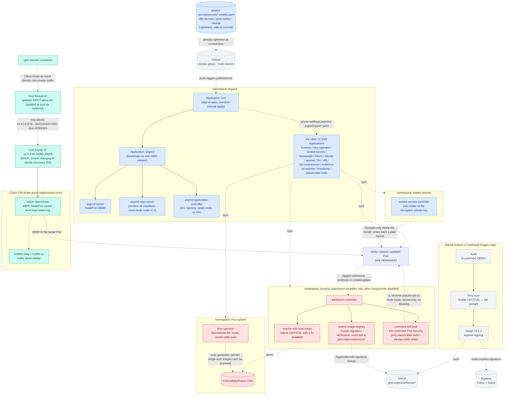

# Container deployment topology v2

Records the container deployment on `vps_oracle` (Oracle Cloud VPS, single host, 4 cores/23G + 4G swap) as of **2026-08-17**. Data sources: this repo's `docker-compose.yml`/k8s manifests + live inspection (`docker ps`, `kubectl get ns/pods -A`, NPM API `/api/nginx/proxy-hosts`).

**Biggest structural change from [v1](v1.md) (2026-08-02)**: in the v1 era there was only a docker-compose layer, and the host also ran two "not managed by this repo" projects. Now there's an entire k3s cloud-native platform (9 namespaces, ArgoCD GitOps + Kyverno/Trivy/Sealed Secrets supply-chain security), 6 compose services migrated onto it, one "unmanaged" project (`lab-environment`) was fully taken over into k3s, and the other (`programming-learning-platform`) was decommissioned entirely. See "Major changes vs v1" at the end.

## Diagram 1: overall topology (host panorama)

```mermaid
flowchart TB
    Internet((Internet))
    VlessClient([VLESS client])

    subgraph VPS["vps_oracle · Oracle Cloud VPS (single host)"]
        direction TB

        Port80443["host port 80 / 443"]
        Port39876["host port 39876"]

        npm["npm<br/>Nginx Proxy Manager"]
        xui["3x-ui<br/>VLESS+Reality node"]

        subgraph ProxyNet["docker network: proxy (172.19.0.0/16, external bridge)"]
            direction LR
            portainer["portainer"]
            grafana["grafana"]
            ccr["ccr<br/>Claude Code Router"]
            switchboard["switchboard"]
            plans["plans"]
        end

        subgraph MonNet["docker network: monitoring_default (internal)"]
            direction LR
            prometheus[("prometheus")]
            nodeexp["node-exporter"]
            blackbox["blackbox-exporter"]
        end

        DockerSock{{"/var/run/docker.sock"}}

        subgraph K3S["k3s cluster (Cilium pod network 10.42.0.0/16, physically isolated from the two docker networks above)"]
            direction TB

            subgraph NS_workloads["namespace: workloads (quota 2C/4G)"]
                direction TB
                homepage["homepage<br/>NodePort 30081"]
                trilium[("trilium<br/>NodePort 30082")]
                evidence["evidence-os-website<br/>NodePort 30083"]
                vikunja[("vikunja<br/>NodePort 30084")]
                apprise["apprise<br/>NodePort 30085"]
                relay["vikunja-notify-relay"]
                placeholder["placeholder-hello<br/>(GitOps demo)"]
            end

            subgraph NS_dify["namespace: dify (quota 3C/4G, NetworkPolicy restricts egress)"]
                direction TB
                difyweb["web<br/>NodePort 30086"]
                difyapi["api<br/>NodePort 30087"]
                difyplugin["plugin-daemon<br/>NodePort 30088"]
                difydb[("db-postgres")]
                difypgvector[("pgvector")]
                difyredis[("redis")]
                difyworker["worker"]
                difyworkerbeat["worker-beat"]
                difyssrf["ssrf-proxy<br/>squid"]
            end

            subgraph NS_llm["namespace: llm (quota 4C/12.5G)"]
                direction LR
                llamacpp["llama-cpp<br/>NodePort 30091<br/>(for the host CCR local provider)"]
                openwebui["open-webui<br/>NodePort 30089"]
            end

            subgraph NS_lab["namespace: lab-environment (quota 2.5C/4G, SRE practice platform)"]
                direction TB
                consul["consul<br/>NodePort 30092"]
                apigw["api-gateway<br/>NodePort 30097"]
                customers["customers-service"]
                vets["vets-service"]
                visits["visits-service"]
                labpg[("postgres")]
                labredis[("redis")]
                labprom[("prometheus<br/>NodePort 30093, internal only")]
                labgrafana["grafana<br/>NodePort 30094"]
                jaeger["jaeger<br/>NodePort 30095"]
                loki[("loki")]
                promtail["promtail"]
                toxiproxy["toxiproxy"]
                mcptoolkit["mcp-toolkit<br/>NodePort 30096"]
            end

            headlampNode["headlamp (standalone namespace)<br/>NodePort 30098"]
            argocdsrv["argocd-server (namespace: argocd)<br/>NodePort 30090"]
            kyvernoNode["kyverno-admission-controller (namespace: kyverno)"]
            trivyNode["trivy-operator (namespace: trivy-system)"]
            sealedNode["sealed-secrets controller (namespace: sealed-secrets)"]
            kubesysNode["kube-system: cilium / coredns /<br/>metrics-server / local-path-provisioner"]
        end

        subgraph Inspector["vps_oracle/inspector (host-native, non-container, systemd timer 09:00/21:00)"]
            inspectsh["inspect.sh<br/>docker-layer + k3s-layer inspection"]
        end
    end

    Telegram(("Telegram"))
    DeadPL["⚠️ 172.19.0.1:3001 / 8080 / 9090<br/>programming-learning-platform<br/>(containers decommissioned, NPM records not cleaned up, see the note below)"]

    Internet --> Port80443 --> npm
    VlessClient --> Port39876 --> xui

    npm -."reverse-proxies *.jerome.cloudns.asia".-> xui
    npm -.-> portainer
    npm -.-> grafana
    npm -.-> ccr
    npm -.-> switchboard
    npm -.-> plans

    npm -."NodePort 30081".-> homepage
    npm -."NodePort 30082".-> trilium
    npm -."NodePort 30083".-> evidence
    npm -."NodePort 30084".-> vikunja
    npm -."NodePort 30085".-> apprise
    npm -."NodePort 30089".-> openwebui
    npm -."NodePort 30090".-> argocdsrv
    npm -."NodePort 30098".-> headlampNode
    npm -."default location · NodePort 30086".-> difyweb
    npm -."/console/api /api /v1 /files /mcp /triggers /openapi · NodePort 30087".-> difyapi
    npm -."/e/ · NodePort 30088".-> difyplugin
    npm -."NodePort 30092".-> consul
    npm -."NodePort 30094".-> labgrafana
    npm -."NodePort 30095".-> jaeger
    npm -."NodePort 30097".-> apigw
    npm -."⚠️ backend no longer exists".-> DeadPL

    openwebui --> llamacpp

    difyweb --> difyapi
    difyapi <--> difyplugin
    difyapi --> difydb
    difyapi --> difypgvector
    difyapi --> difyredis
    difyapi -.egress via.-> difyssrf
    difyworker --> difydb
    difyworker --> difyredis
    difyworker -.egress via.-> difyssrf
    difyworkerbeat --> difydb
    difyworkerbeat --> difyredis
    difyplugin --> difydb
    difyplugin --> difyredis
    difyplugin -.egress via.-> difyssrf

    vikunja -."webhook".-> relay
    relay -."forward".-> apprise

    apigw --> customers
    apigw --> vets
    apigw --> visits
    customers --> labpg
    vets --> labpg
    visits --> labpg
    customers -.-> labredis
    consul -."service discovery".-> apigw
    labgrafana --> labprom
    labgrafana --> loki
    jaeger -."trace".-> apigw
    promtail --> loki
    toxiproxy -."fault-injection proxy".-> labpg

    grafana --> prometheus
    prometheus --> nodeexp
    prometheus --> blackbox

    portainer -."read-write: manages all host docker containers".-> DockerSock

    inspectsh -."k3s-layer inspection (least-privilege SA)".-> K3S
    inspectsh -."alert".-> apprise
    apprise -."Telegram".-> Telegram

    classDef entry fill:#dcfce7,stroke:#16a34a,color:#14532d
    classDef proxynet fill:#dbeafe,stroke:#3b82f6,color:#1e3a8a
    classDef internalnet fill:#f3f4f6,stroke:#9ca3af,color:#374151
    classDef k8sapp fill:#ede9fe,stroke:#7c3aed,color:#4c1d95
    classDef k8splatform fill:#ccfbf1,stroke:#0d9488,color:#134e4a
    classDef dead fill:#fef3c7,stroke:#d97706,color:#78350f,stroke-dasharray: 4 3

    class Internet,VlessClient entry
    class npm,xui,portainer,grafana,ccr,switchboard,plans proxynet
    class prometheus,nodeexp,blackbox internalnet
    class homepage,trilium,evidence,vikunja,apprise,relay,placeholder,difyweb,difyapi,difyplugin,difydb,difypgvector,difyredis,difyworker,difyworkerbeat,difyssrf,llamacpp,openwebui,consul,apigw,customers,vets,visits,labpg,labredis,labprom,labgrafana,jaeger,loki,promtail,toxiproxy,mcptoolkit k8sapp
    class headlampNode,argocdsrv,kyvernoNode,trivyNode,sealedNode,kubesysNode k8splatform
    class DeadPL dead
```

### Diagram 1 legend

| Color | Meaning |
|---|---|
| 🟩 green | external entry (Internet / VLESS client) |
| 🟦 blue | containers on the docker `proxy` network — NPM reverse-proxies directly by container name |
| ⬜ gray | docker `monitoring_default` internal network, not on `proxy`, no domain |
| 🟪 purple | Pods in k3s application namespaces (`workloads`/`dify`/`llm`/`lab-environment`/`headlamp`), reverse-proxied by NPM via host NodePort |
| 🟩🟦 mixed (teal) | k3s platform governance components (`argocd`/`kyverno`/`trivy-system`/`sealed-secrets`/`kube-system`), details in diagram 2 |
| 🟨 yellow (dashed border) | orphaned / stale config — backend confirmed nonexistent, recorded as current state only |

## Diagram 2: k3s platform governance layer (GitOps + supply-chain security + NodePort addressing mechanism)

Diagram 1 compressed k3s's governance namespaces into single nodes; this diagram unfolds what each does and how they chain together — a layer that didn't exist at all in v1 and is newly added by this topology.

### Diagram 2 legend

| Color | Meaning |
|---|---|
| ⬜ gray | outside the cluster (GitHub / GHCR / Sigstore / CI) |
| 🟦 blue | GitOps chain (ArgoCD itself + Sealed Secrets) |
| 🟥 red | supply-chain security / admission control (Kyverno + Trivy Operator) — **all three policies are currently only in Audit mode and don't actually block Pods** |
| 🟩🟦 mixed (teal) | network addressing mechanism (NPM → host firewall → Cilium NodePort → Pod) |

## Section notes

### Entry layer
- **npm** (`vps_oracle/compose/npm`) is still the only container publishing 80/443, mechanism unchanged from v1: `*.jerome.cloudns.asia` reaches it first, then it forwards by Forward Host/Port (or dify's Custom Locations). The difference is **the forward target changed** — before, most targets were container names on the `proxy` network; now most are `10.0.0.95:<NodePort>` (host private IP + k3s NodePort), because the corresponding services have moved into k3s.
- **3x-ui** usage unchanged: `39876` published alone, the node port reached directly by clients; panel/subscription via NPM; deliberately no homepage card.

### docker `proxy` network (172.19.0.0/16)
Much slimmer than in v1 — `homepage`/`trilium`/`vikunja`/`apprise`/`dify`/`llm` (`open-webui`) have all moved from this network into k3s. Still attached here are only: `npm`, `3x-ui` (static IPs `.2`/`.3`, mechanism in the README), `portainer`, `grafana`, and three new faces — `ccr` (Claude Code Router gateway), `switchboard` (config-driven switch framework), `plans`. All three are new services since v1, evaluated and decided not to move to k3s (reason in the root README's "services that won't migrate to k3s" table).
- `--ip-range` has divided the dynamic allocation pool as `172.19.1.0/24`, with the entire `172.19.0.0/24` reserved for explicit `ipv4_address:` static IPs (a structural fix added after the 2026-08-16 unexpected host reboot let 3x-ui's `.2` get taken by dynamic allocation).

### `vps_oracle/compose/monitoring`
Unchanged: `prometheus`/`node-exporter`/`blackbox-exporter` only on the internal network, no auth, not on `proxy`; only `grafana` additionally joins `proxy` to serve dashboards externally. **The "monitoring is independent of what it monitors" principle** is also the reason `lab-environment`, after migrating into k3s, did not merge its own Prometheus/Grafana into the host's — see the k3s section below.

### k3s cluster (new; phase D in progress)
`vps_oracle/k3s/` is this topology's biggest addition over v1: K3s v1.36.2 + Cilium 1.20.0 (CNI, `kube-proxy-replacement: true`) + ArgoCD 10.3.0 (GitOps) + Sealed Secrets 2.19.1 + Kyverno 3.8.2 + Trivy Operator 0.35.0. The goal is to migrate compose stacks to k8s **service by service**, keeping domains/ports unchanged externally; the phase breakdown is in [K3s cloud-native experiment platform roadmap](../superpowers/specs/2026-08-05-k3s-cloud-native-platform-roadmap.md).

**Namespace overview** (quotas are all `request==limit`, no elastic headroom):

| namespace | Purpose | quota (cpu / mem) | Notes |
|---|---|---|---|
| `workloads` | general applications | 2C / 4G | homepage, trilium, apprise, vikunja+relay, evidence-os-website, placeholder-hello (GitOps demo) |
| `dify` | LLM app orchestration | 3C / 4G | the 9-container full suite, a dedicated `NetworkPolicy` restricting `api`/`worker`/`worker-beat` egress to go through `ssrf-proxy` |
| `llm` | local LLM | 4C / 12.5G | `llama-cpp` (Ampere-optimized build, router mode, `--models-max 1`) + `open-webui` |
| `lab-environment` | SRE practice platform | 2.5C / 4G | a complete microservices demo: Spring Petclinic family (`api-gateway`/`customers`/`vets`/`visits`) + `consul` service discovery + `postgres`/`redis` + its own `prometheus`/`grafana`/`jaeger`/`loki`/`promtail` (kept separate from the host monitoring) + `toxiproxy`/`mcp-toolkit` |
| `headlamp` | read-only k8s panel | 200m-500m / 256-640Mi | minimal resources, observation only |
| `argocd` | GitOps control plane | no separate quota | see diagram 2 |
| `kyverno` | admission control | no separate quota | see diagram 2, Audit mode only |
| `trivy-system` | vulnerability scanning | no separate quota | see diagram 2 |
| `sealed-secrets` | secret decryption | no separate quota | see diagram 2 |
| `kube-system` | cluster base components | deliberately no quota | Cilium agent/envoy DaemonSets don't declare resources; a quota would make them unschedulable after reboot |

**NodePort overview** (`30080` is a temporary port for verification only, not resident): `30081` homepage, `30082` trilium, `30083` evidence-os-website, `30084` vikunja, `30085` apprise, `30086` dify-web, `30087` dify-api, `30088` dify-plugin-daemon, `30089` open-webui, `30090` argocd-server, `30091` llama-cpp, `30092` consul, `30093` lab-prometheus (internal only, no NPM record), `30094` lab-grafana, `30095` jaeger, `30096` mcp-toolkit, `30097` api-gateway, `30098` headlamp.

**NPM → k3s addressing mechanism** (didn't exist in v1; a key newly-added mechanism): the NPM container isn't inside the k3s cluster, and Cilium treats its traffic as a `world` identity. When NPM reverse-proxies to k3s services, `Forward Hostname/IP` must be filled with the host private IP `10.0.0.95` (DHCP-assigned; Oracle changing the IP silently becomes 502), not `host.docker.internal` or `host-gateway` — Cilium's NodePort eBPF program only binds to the physical NIC. For the full mechanism and why the host firewall specifically allows the pod CIDR to reach `6443`/`4244`/`10250`, see diagram 2.

### Privileged mount (`/var/run/docker.sock`)
Narrowed from v1: after `homepage` moved to k3s, the docker-container-status widget (along with its read-only mount of `docker.sock`) was dropped entirely — there's no k8s equivalent worth opening RBAC for. Now only `portainer` still mounts it (read-write, managing all host docker containers), the known high-risk exception explicitly marked in the repo conventions.

### `vps_oracle/inspector` (new)
host-native bash inspection script (non-container), triggered by a systemd timer at 09:00/21:00 daily, spanning the docker layer and the k3s layer: cleans up orphaned VS Code/Claude sessions, accumulated server version directories, over-age stopped containers / dangling images / build cache / ownerless networks, evicted pods / completed Jobs / ownerless containerd images in k3s, and so on; alert-level checks (restart storms, ownerless volumes, log-config drift, oversized logs, Released PVs, stuck Terminating pods) go through apprise (now k3s NodePort `30085`, no longer a docker container) to forward to Telegram. The k3s layer uses a least-privilege ServiceAccount (only pods/jobs get+list+delete, PV get+list).

### `vps_oracle/host-firewall` (new)
`host-firewall.sh` is the single source of truth for hand-written iptables rules, applied idempotently at boot by `host-firewall.service`. Background: on 2026-08-16, `iptables-save` once froze Docker's runtime rules together into `/etc/iptables/rules.v4`, and `netfilter-persistent` replaying that snapshot at boot black-holed inter-container traffic — `netfilter-persistent` is now fully disabled, and **rules must never again be persisted via `iptables-save`**. Besides OCI's default INPUT allow-list (22/80/443), three allow rules were added specifically for Cilium (pod CIDR `10.42.0.0/16` reaching host `6443`/`4244`/`10250`), plus one `DOCKER-USER` hardcoded drop rule (external access to `3001`/`9090`/`8080` — the three ports left behind by the decommissioned `programming-learning-platform`; see known issues below).

## Known issue: 3 orphaned NPM reverse-proxy configs

On-site NPM API check (`/api/nginx/proxy-hosts`) found `grafana.pl.jerome.cloudns.asia`, `prometheus.pl.jerome.cloudns.asia`, `www.pl.jerome.cloudns.asia` three records still `enabled: true`, forwarding to `172.19.0.1:3001` / `:9090` / `:8080` (the docker0 bridge gateway IP, pointing at ports published directly on the host). But the `programming-learning-platform` project's containers are **completely absent** from `docker ps -a` (not exited, genuinely nonexistent), and the three ports are confirmed unreachable on the host (`curl: Failed to connect`).

This is a pure current-state record, not a change made this time — **nothing was cleaned up**, only faithfully annotated. If confirmed that this project will no longer be used, the three NPM records, the corresponding `DOCKER-USER` drop rule in `host-firewall.sh`, and any leftover related entries in the access lists can be removed; if it might be brought back up, leave the status quo.

## Major changes vs v1 (2026-08-02)

- **k3s platform built from scratch**: K3s + Cilium + ArgoCD (GitOps app-of-apps) + Sealed Secrets + Kyverno + Trivy Operator, phases A~E complete, phase D (remaining service migrations) in progress.
- **6 services migrated into k3s**: `homepage`, `trilium`, `vikunja` (including `vikunja-notify-relay`), `apprise`, `llm` (`llama-cpp`+`open-webui`), `dify` (9-container full suite). The corresponding compose directories (`vps_oracle/compose/{homepage,trilium,dify}`) were deleted in the 2026-08-16 cleanup commit; the README's mention of "old containers kept as a rollback path" no longer holds.
- **`lab-environment` went from "not managed by this repo" to formally taken over**: in v1 it was a project running independently on the host, unrelated to this repo; now it has moved entirely into k3s's `lab-environment` namespace, with its own quota, homepage card (Lab category), and NPM reverse proxy.
- **`programming-learning-platform` fully decommissioned**: in v1 it was another "unmanaged" project; now its containers have disappeared entirely, leaving only 3 orphaned NPM reverse-proxy records and 1 firewall rule uncleaned (see above).
- **`sillytavern` deleted**: decommissioned outright on 2026-08-16 due to an unfixable `tar` CVE (and the only image that the phase E supply-chain scan would reject), not migrated.
- **3 new docker compose services**: `ccr` (Claude Code Router gateway), `switchboard` (config-driven switch framework), `plans` (personal itinerary planning) — all evaluated and decided not to move to k3s.
- **3 new k3s-native services**: `evidence-os-website`, `headlamp` (read-only k8s panel), `placeholder-hello` (GitOps CI/CD demo).
- **Supply-chain security**: self-built images (`homepage`/`trilium`/`placeholder-hello`/`vikunja-notify-relay`) go through GitHub Actions CI for Trivy scanning + Cosign keyless signing; Kyverno's three `ClusterPolicy`s (image signature verification, CVE gate, Pod Security) are all currently in **Audit mode**, not yet enforced.
- **Secret management**: the `workloads/vikunja`, `dify/dify-secrets`, `llm/open-webui` three Secrets were changed from hand-created to `SealedSecret` (ciphertext committed).
- **Two new host-level guard systems**: `vps_oracle/inspector` (orphaned-resource inspection + Telegram alerting), `vps_oracle/host-firewall` (iptables rules as code).
- **`portainer` became the only container mounting `docker.sock`**: after `homepage` moved to k3s, its read-only mount was dropped along with it.
- **The `proxy` network split into static/dynamic address segments** to prevent dynamic allocation from grabbing static IPs on container rebuild.

## Data sources

- this repo's `vps_oracle/compose/*/docker-compose.yml`, `vps_oracle/k3s/**/*.yaml`, `vps_oracle/k3s/README.md`, root `README.md`, `vps_oracle/inspector/README.md`, `vps_oracle/host-firewall/host-firewall.sh`
- live inspection (2026-08-17): `docker ps -a`, `docker network ls`, `kubectl get ns` / `kubectl get pods -A`
- NPM API `GET /api/nginx/proxy-hosts` (on-site verification of all 24 reverse-proxy records' `forward_host`/`forward_port`/`locations`/`access_list_id`)