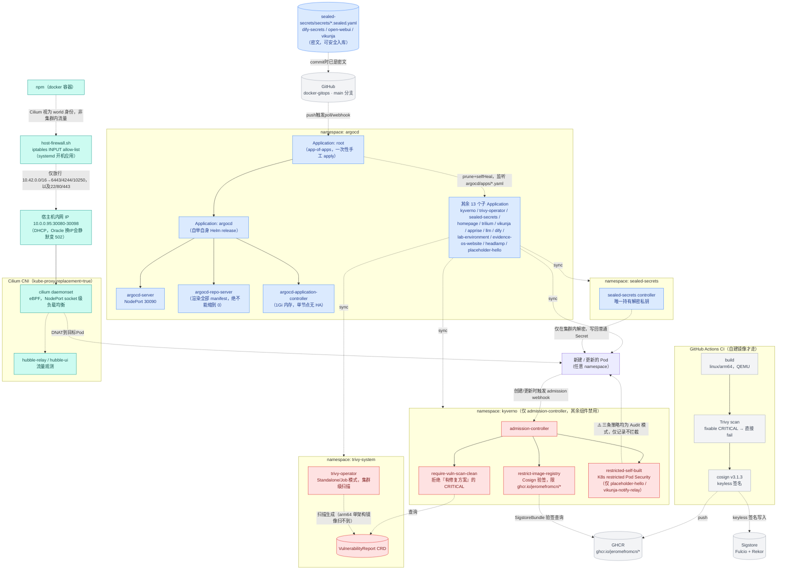

# 容器部署拓扑图 v2

记录 `vps_oracle`（Oracle Cloud VPS，单主机，4核/23G + 4G swap）上截至 **2026-08-17** 的容器部署情况。数据来源：本仓库各 `docker-compose.yml`/k8s manifest + 现场实测（`docker ps`、`kubectl get ns/pods -A`、NPM API `/api/nginx/proxy-hosts`）。

**相比 [v1](v1.md)（2026-08-02）最大的结构性变化**：v1 时期只有 docker compose 一层，且宿主机上还跑着两个"不受本仓库管理"的项目。现在多了一整套 k3s 云原生平台（9 个 namespace，ArgoCD GitOps + Kyverno/Trivy/Sealed Secrets 供应链安全），原本 6 个 compose 服务迁移过去，其中一个"不受管理"的项目（`lab-environment`）被整体接管进 k3s，另一个（`programming-learning-platform`）被彻底下线。详见文末「与 v1 相比的主要变化」。

## 图一：总体拓扑图（宿主机全景）

```mermaid
flowchart TB
    Internet((Internet))
    VlessClient([VLESS 客户端])

    subgraph VPS["vps_oracle · Oracle Cloud VPS（单主机）"]
        direction TB

        Port80443["宿主机端口 80 / 443"]
        Port39876["宿主机端口 39876"]

        npm["npm<br/>Nginx Proxy Manager"]
        xui["3x-ui<br/>VLESS+Reality 节点"]

        subgraph ProxyNet["docker network: proxy（172.19.0.0/16，外部 bridge）"]
            direction LR
            portainer["portainer"]
            grafana["grafana"]
            ccr["ccr<br/>Claude Code Router"]
            switchboard["switchboard"]
            plans["plans"]
        end

        subgraph MonNet["docker network: monitoring_default（内部）"]
            direction LR
            prometheus[("prometheus")]
            nodeexp["node-exporter"]
            blackbox["blackbox-exporter"]
        end

        DockerSock{{"/var/run/docker.sock"}}

        subgraph K3S["k3s 集群（Cilium pod 网络 10.42.0.0/16，与上面两张 docker 网络物理隔离）"]
            direction TB

            subgraph NS_workloads["namespace: workloads（quota 2C/4G）"]
                direction TB
                homepage["homepage<br/>NodePort 30081"]
                trilium[("trilium<br/>NodePort 30082")]
                evidence["evidence-os-website<br/>NodePort 30083"]
                vikunja[("vikunja<br/>NodePort 30084")]
                apprise["apprise<br/>NodePort 30085"]
                relay["vikunja-notify-relay"]
                placeholder["placeholder-hello<br/>（GitOps demo）"]
            end

            subgraph NS_dify["namespace: dify（quota 3C/4G，NetworkPolicy 限制出站）"]
                direction TB
                difyweb["web<br/>NodePort 30086"]
                difyapi["api<br/>NodePort 30087"]
                difyplugin["plugin-daemon<br/>NodePort 30088"]
                difydb[("db-postgres")]
                difypgvector[("pgvector")]
                difyredis[("redis")]
                difyworker["worker"]
                difyworkerbeat["worker-beat"]
                difyssrf["ssrf-proxy<br/>squid"]
            end

            subgraph NS_llm["namespace: llm（quota 4C/12.5G）"]
                direction LR
                llamacpp["llama-cpp<br/>NodePort 30091<br/>（供宿主机 CCR 本地 provider 用）"]
                openwebui["open-webui<br/>NodePort 30089"]
            end

            subgraph NS_lab["namespace: lab-environment（quota 2.5C/4G，SRE 练习平台）"]
                direction TB
                consul["consul<br/>NodePort 30092"]
                apigw["api-gateway<br/>NodePort 30097"]
                customers["customers-service"]
                vets["vets-service"]
                visits["visits-service"]
                labpg[("postgres")]
                labredis[("redis")]
                labprom[("prometheus<br/>NodePort 30093，仅内部")]
                labgrafana["grafana<br/>NodePort 30094"]
                jaeger["jaeger<br/>NodePort 30095"]
                loki[("loki")]
                promtail["promtail"]
                toxiproxy["toxiproxy"]
                mcptoolkit["mcp-toolkit<br/>NodePort 30096"]
            end

            headlampNode["headlamp（独立 namespace）<br/>NodePort 30098"]
            argocdsrv["argocd-server（namespace: argocd）<br/>NodePort 30090"]
            kyvernoNode["kyverno-admission-controller（namespace: kyverno）"]
            trivyNode["trivy-operator（namespace: trivy-system）"]
            sealedNode["sealed-secrets controller（namespace: sealed-secrets）"]
            kubesysNode["kube-system：cilium / coredns /<br/>metrics-server / local-path-provisioner"]
        end

        subgraph Inspector["vps_oracle/inspector（host-native，非容器，systemd timer 09:00/21:00）"]
            inspectsh["inspect.sh<br/>docker层 + k3s层巡检"]
        end
    end

    Telegram(("Telegram"))
    DeadPL["⚠️ 172.19.0.1:3001 / 8080 / 9090<br/>programming-learning-platform<br/>（容器已下线，NPM 记录未清理，见下方说明）"]

    Internet --> Port80443 --> npm
    VlessClient --> Port39876 --> xui

    npm -."反代 *.jerome.cloudns.asia".-> xui
    npm -.-> portainer
    npm -.-> grafana
    npm -.-> ccr
    npm -.-> switchboard
    npm -.-> plans

    npm -."NodePort 30081".-> homepage
    npm -."NodePort 30082".-> trilium
    npm -."NodePort 30083".-> evidence
    npm -."NodePort 30084".-> vikunja
    npm -."NodePort 30085".-> apprise
    npm -."NodePort 30089".-> openwebui
    npm -."NodePort 30090".-> argocdsrv
    npm -."NodePort 30098".-> headlampNode
    npm -."默认location · NodePort 30086".-> difyweb
    npm -."/console/api /api /v1 /files /mcp /triggers /openapi · NodePort 30087".-> difyapi
    npm -."/e/ · NodePort 30088".-> difyplugin
    npm -."NodePort 30092".-> consul
    npm -."NodePort 30094".-> labgrafana
    npm -."NodePort 30095".-> jaeger
    npm -."NodePort 30097".-> apigw
    npm -."⚠️ 后端已不存在".-> DeadPL

    openwebui --> llamacpp

    difyweb --> difyapi
    difyapi <--> difyplugin
    difyapi --> difydb
    difyapi --> difypgvector
    difyapi --> difyredis
    difyapi -.出站经.-> difyssrf
    difyworker --> difydb
    difyworker --> difyredis
    difyworker -.出站经.-> difyssrf
    difyworkerbeat --> difydb
    difyworkerbeat --> difyredis
    difyplugin --> difydb
    difyplugin --> difyredis
    difyplugin -.出站经.-> difyssrf

    vikunja -."webhook".-> relay
    relay -."转发".-> apprise

    apigw --> customers
    apigw --> vets
    apigw --> visits
    customers --> labpg
    vets --> labpg
    visits --> labpg
    customers -.-> labredis
    consul -."服务发现".-> apigw
    labgrafana --> labprom
    labgrafana --> loki
    jaeger -."trace".-> apigw
    promtail --> loki
    toxiproxy -."故障注入代理".-> labpg

    grafana --> prometheus
    prometheus --> nodeexp
    prometheus --> blackbox

    portainer -."读写：管理宿主机全部 docker 容器".-> DockerSock

    inspectsh -."k3s层巡检（最小权限 SA）".-> K3S
    inspectsh -."alert".-> apprise
    apprise -."Telegram".-> Telegram

    classDef entry fill:#dcfce7,stroke:#16a34a,color:#14532d
    classDef proxynet fill:#dbeafe,stroke:#3b82f6,color:#1e3a8a
    classDef internalnet fill:#f3f4f6,stroke:#9ca3af,color:#374151
    classDef k8sapp fill:#ede9fe,stroke:#7c3aed,color:#4c1d95
    classDef k8splatform fill:#ccfbf1,stroke:#0d9488,color:#134e4a
    classDef dead fill:#fef3c7,stroke:#d97706,color:#78350f,stroke-dasharray: 4 3

    class Internet,VlessClient entry
    class npm,xui,portainer,grafana,ccr,switchboard,plans proxynet
    class prometheus,nodeexp,blackbox internalnet
    class homepage,trilium,evidence,vikunja,apprise,relay,placeholder,difyweb,difyapi,difyplugin,difydb,difypgvector,difyredis,difyworker,difyworkerbeat,difyssrf,llamacpp,openwebui,consul,apigw,customers,vets,visits,labpg,labredis,labprom,labgrafana,jaeger,loki,promtail,toxiproxy,mcptoolkit k8sapp
    class headlampNode,argocdsrv,kyvernoNode,trivyNode,sealedNode,kubesysNode k8splatform
    class DeadPL dead
```

### 图一图例

| 颜色 | 含义 |
|---|---|
| 🟩 绿 | 外部入口（Internet / VLESS 客户端） |
| 🟦 蓝 | docker `proxy` 网络里的容器 —— NPM 直接按容器名反代 |
| ⬜ 灰 | docker `monitoring_default` 内部网络，不接 `proxy`，无域名 |
| 🟪 紫 | k3s 应用类 namespace 里的 Pod（`workloads`/`dify`/`llm`/`lab-environment`/`headlamp`），NPM 经宿主机 NodePort 反代 |
| 🟩🟦混（青） | k3s 平台治理类组件（`argocd`/`kyverno`/`trivy-system`/`sealed-secrets`/`kube-system`），细节见图二 |
| 🟨 黄（虚线框） | 孤立/失效配置 —— 已确认后端不存在，仅作现状记录 |

## 图二：k3s 平台治理层（GitOps + 供应链安全 + NodePort 寻址机制）

图一把 k3s 的治理类 namespace 都压缩成了单个节点，这张图展开它们各自在做什么、彼此怎么串起来 —— 这套东西在 v1 时完全不存在，是本次拓扑图新增的一层。

### 图二图例

| 颜色 | 含义 |
|---|---|
| ⬜ 灰 | 集群外部（GitHub / GHCR / Sigstore / CI） |
| 🟦 蓝 | GitOps 链路（ArgoCD 自身 + Sealed Secrets） |
| 🟥 红 | 供应链安全 / 准入控制（Kyverno + Trivy Operator）—— **当前全部三条策略都只是 Audit 模式，不会真的拦截 Pod** |
| 🟩🟦混（青） | 网络寻址机制（NPM → 宿主机防火墙 → Cilium NodePort → Pod） |

## 分区说明

### 入口层
- **npm**（`vps_oracle/compose/npm`）仍是唯一发布 80/443 的容器，机制跟 v1 时一致：`*.jerome.cloudns.asia` 先到它，再按 Forward Host/Port（或 dify 的 Custom Locations）转发。区别在于**转发目标变了**——过去大多数目标是 `proxy` 网络里的容器名，现在大部分目标是 `10.0.0.95:<NodePort>`（宿主机内网 IP + k3s NodePort），因为对应服务已经搬进 k3s。
- **3x-ui** 用法不变：`39876` 单独发布，节点端口客户端直连；面板/订阅走 NPM；有意不上 homepage 卡片。

### docker `proxy` 网络（172.19.0.0/16）
比 v1 时精简了很多——`homepage`/`trilium`/`vikunja`/`apprise`/`dify`/`llm`（`open-webui`）都已经从这张网络搬进了 k3s。现在还挂在这里的只剩：`npm`、`3x-ui`（静态 IP `.2`/`.3`，机制见 README）、`portainer`、`grafana`、以及三个新面孔——`ccr`（Claude Code Router 网关）、`switchboard`（配置驱动的开关框架）、`plans`。这三个都是 v1 之后新增的服务，评估后决定不迁 k3s（原因见根 README「不会迁移到 k3s 的服务」表格）。
- `--ip-range` 已划定动态分配池为 `172.19.1.0/24`，`172.19.0.0/24` 整段只给显式 `ipv4_address:` 静态 IP 用（2026-08-16 host 意外重启导致 3x-ui 的 `.2` 被动态分配抢走之后加的结构性修复）。

### `vps_oracle/compose/monitoring`
不变：`prometheus`/`node-exporter`/`blackbox-exporter` 只在内部网络，无认证，不接 `proxy`；只有 `grafana` 额外挂了 `proxy` 对外提供仪表盘。**监控系统独立于被监控对象**这条原则也是 `lab-environment` 迁移进 k3s 后没有把它自己的 Prometheus/Grafana 跟宿主机这套合并的原因——见下面 k3s 部分。

### k3s 集群（新增，phase D 进行中）
`vps_oracle/k3s/` 是这次拓扑图相比 v1 最大的新增部分：K3s v1.36.2 + Cilium 1.20.0（CNI，`kube-proxy-replacement: true`）+ ArgoCD 10.3.0（GitOps）+ Sealed Secrets 2.19.1 + Kyverno 3.8.2 + Trivy Operator 0.35.0。目标是**逐服务**把 compose 栈迁到 k8s，域名/端口对外保持不变，具体阶段拆解见 [K3s 云原生实验平台路线图](../superpowers/specs/2026-08-05-k3s-cloud-native-platform-roadmap.md)。

**namespace 一览**（quota 均为 `request==limit`，无弹性余量）：

| namespace | 用途 | quota (cpu / mem) | 说明 |
|---|---|---|---|
| `workloads` | 通用应用 | 2C / 4G | homepage、trilium、apprise、vikunja+relay、evidence-os-website、placeholder-hello（GitOps demo） |
| `dify` | LLM 应用编排 | 3C / 4G | 9 容器全家桶，独立 `NetworkPolicy` 限制 `api`/`worker`/`worker-beat` 出站必须经 `ssrf-proxy` |
| `llm` | 本地大模型 | 4C / 12.5G | `llama-cpp`（Ampere 优化版，router 模式，`--models-max 1`）+ `open-webui` |
| `lab-environment` | SRE 练习平台 | 2.5C / 4G | 完整微服务 demo：Spring Petclinic 系（`api-gateway`/`customers`/`vets`/`visits`）+ `consul` 服务发现 + `postgres`/`redis` + 独立一套 `prometheus`/`grafana`/`jaeger`/`loki`/`promtail`（不跟宿主机 monitoring 混用）+ `toxiproxy`/`mcp-toolkit` |
| `headlamp` | 只读 k8s 面板 | 200m-500m / 256-640Mi | 最小资源，纯观测用途 |
| `argocd` | GitOps 控制面 | 无独立 quota | 见图二 |
| `kyverno` | 准入控制 | 无独立 quota | 见图二，仅 Audit 模式 |
| `trivy-system` | 漏洞扫描 | 无独立 quota | 见图二 |
| `sealed-secrets` | 密钥解密 | 无独立 quota | 见图二 |
| `kube-system` | 集群基础组件 | 故意不设 quota | Cilium agent/envoy 的 DaemonSet 未声明 resources，quota 会导致重启后无法调度 |

**NodePort 一览**（`30080` 是仅验证用的临时端口，不常驻）：`30081` homepage、`30082` trilium、`30083` evidence-os-website、`30084` vikunja、`30085` apprise、`30086` dify-web、`30087` dify-api、`30088` dify-plugin-daemon、`30089` open-webui、`30090` argocd-server、`30091` llama-cpp、`30092` consul、`30093` lab-prometheus（仅内部，无 NPM 记录）、`30094` lab-grafana、`30095` jaeger、`30096` mcp-toolkit、`30097` api-gateway、`30098` headlamp。

**NPM → k3s 的寻址机制**（v1 时不存在，是这次新增的关键机制）：NPM 容器不在 k3s 集群内，Cilium 把它的流量识别成 `world` 身份。NPM 反代到 k3s 服务时，`Forward Hostname/IP` 必须填宿主机内网 IP `10.0.0.95`（DHCP 分配，Oracle 换 IP 会静默变 502），不能填 `host.docker.internal` 或 `host-gateway`——Cilium 的 NodePort eBPF 程序只绑定在物理网卡上。完整机制、host 防火墙为什么要专门放行 pod 网段访问 `6443`/`4244`/`10250`，见图二。

### 特权挂载（`/var/run/docker.sock`）
比 v1 时**收窄了**：`homepage` 迁到 k3s 后，docker-container-status 小组件（连带它对 `docker.sock` 的只读挂载）被整体去掉了——k8s 里没有等价机制值得为此开 RBAC。现在只剩 `portainer` 一家还挂着（读写，管理宿主机全部 docker 容器），这是仓库约定里明确标注的已知高风险例外。

### `vps_oracle/inspector`（新增）
host-native bash 巡检脚本（非容器），systemd timer 每天 09:00/21:00 触发，横跨 docker 层和 k3s 层：清理游离 VS Code/Claude session、堆积的 server 版本目录、超期停止的容器/dangling image/build cache/无主 network、k3s 里的 evicted pod/完成的 Job/无主 containerd image 等；告警级别的检查（重启风暴、无主 volume、日志配置漂移、超大日志、Released PV、卡住的 Terminating pod）走 apprise（现在是 k3s NodePort `30085`，不再是 docker 容器）转发 Telegram。k3s 层用最小权限 ServiceAccount（仅 pods/jobs 的 get+list+delete、PV 的 get+list）。

### `vps_oracle/host-firewall`（新增）
`host-firewall.sh` 是手写 iptables 规则的唯一权威来源，开机由 `host-firewall.service` 幂等应用。背景：2026-08-16 曾经用 `iptables-save` 把 Docker 的运行时规则也一起冻结进 `/etc/iptables/rules.v4`，`netfilter-persistent` 开机重放这份快照导致容器间流量被黑洞——现已彻底停用 `netfilter-persistent`，**规则永远不能再用 `iptables-save` 落盘**。除了 OCI 默认的 INPUT allow-list（22/80/443）之外，专门为 Cilium 加了 3 条放行（pod 网段 `10.42.0.0/16` 访问宿主机 `6443`/`4244`/`10250`），以及一条 `DOCKER-USER` 硬编码丢弃规则（外网访问 `3001`/`9090`/`8080`——这三个端口是已下线的 `programming-learning-platform` 遗留下来的，见下文已知问题）。

## 已知问题：3 条孤立的 NPM 反代配置

现场核对 NPM API（`/api/nginx/proxy-hosts`）时发现 `grafana.pl.jerome.cloudns.asia`、`prometheus.pl.jerome.cloudns.asia`、`www.pl.jerome.cloudns.asia` 三条记录仍然 `enabled: true`，转发目标是 `172.19.0.1:3001` / `:9090` / `:8080`（docker0 网桥网关 IP，指向宿主机上直接发布的端口）。但 `programming-learning-platform` 项目的容器在 `docker ps -a` 里已经**完全找不到**（既不是 exited，是彻底不存在），实测这三个端口在宿主机上也连不上（`curl: Failed to connect`）。

这是纯粹的现状记录，不是本次改动——**没有做任何清理**，只是如实标注。如果确认这个项目已经不会再用，可以清掉这三条 NPM 记录、`host-firewall.sh` 里那条对应的 `DOCKER-USER` 丢弃规则、以及 access list 里可能残留的关联条目；如果它可能会重新拉起，则保持现状即可。

## 与 v1（2026-08-02）相比的主要变化

- **k3s 平台从零搭建**：K3s + Cilium + ArgoCD（GitOps app-of-apps）+ Sealed Secrets + Kyverno + Trivy Operator，phase A~E 已完成，phase D（剩余服务迁移）进行中。
- **6 个服务迁入 k3s**：`homepage`、`trilium`、`vikunja`（含 `vikunja-notify-relay`）、`apprise`、`llm`（`llama-cpp`+`open-webui`）、`dify`（9 容器全家桶）。对应的 compose 目录（`vps_oracle/compose/{homepage,trilium,dify}`）已在 2026-08-16 的清理提交中删除，README 里提到的"旧容器保留作为回滚路径"目前已不成立。
- **`lab-environment` 从"不受本仓库管理"变成正式接管**：v1 时它是宿主机上独立跑的、跟本仓库无关的项目；现在整体搬进了 k3s 的 `lab-environment` namespace，有自己的 quota、homepage 卡片（Lab 分类）、NPM 反代。
- **`programming-learning-platform` 彻底下线**：v1 时是另一个"不受管理"的项目；现在容器已完全消失，只留下 3 条孤立的 NPM 反代记录和 1 条防火墙规则未清理（见上）。
- **`sillytavern` 被删除**：2026-08-16 因为一个不可修复的 `tar` CVE（且是 phase E 供应链扫描里唯一会被拒绝的镜像）直接整体下线，不迁移。
- **新增 3 个 docker compose 服务**：`ccr`（Claude Code Router 网关）、`switchboard`（配置驱动开关框架）、`plans`（个人行程规划）—— 均评估后决定不迁 k3s。
- **新增 3 个 k3s 原生服务**：`evidence-os-website`、`headlamp`（只读 k8s 面板）、`placeholder-hello`（GitOps CI/CD demo）。
- **供应链安全**：自建镜像（`homepage`/`trilium`/`placeholder-hello`/`vikunja-notify-relay`）走 GitHub Actions CI 做 Trivy 扫描 + Cosign keyless 签名；Kyverno 三条 `ClusterPolicy`（镜像签名验证、CVE 网关、Pod Security）目前都停在 **Audit 模式**，尚未 Enforce。
- **密钥管理**：`workloads/vikunja`、`dify/dify-secrets`、`llm/open-webui` 三个 Secret 已从手工创建改为 `SealedSecret`（密文入库）。
- **新增两个主机级守护系统**：`vps_oracle/inspector`（游离资源巡检 + Telegram 告警）、`vps_oracle/host-firewall`（iptables 规则即代码）。
- **`portainer` 成为唯一挂 `docker.sock` 的容器**：`homepage` 迁到 k3s 后连带丢弃了它的只读挂载。
- **`proxy` 网络划分了静态/动态地址段**，避免容器重建时动态分配抢占静态 IP。

## 数据来源

- 本仓库各 `vps_oracle/compose/*/docker-compose.yml`、`vps_oracle/k3s/**/*.yaml`、`vps_oracle/k3s/README.md`、根 `README.md`、`vps_oracle/inspector/README.md`、`vps_oracle/host-firewall/host-firewall.sh`
- 现场实测（2026-08-17）：`docker ps -a`、`docker network ls`、`kubectl get ns` / `kubectl get pods -A`
- NPM API `GET /api/nginx/proxy-hosts`（现场查证全部 24 条反代记录的 `forward_host`/`forward_port`/`locations`/`access_list_id`）
