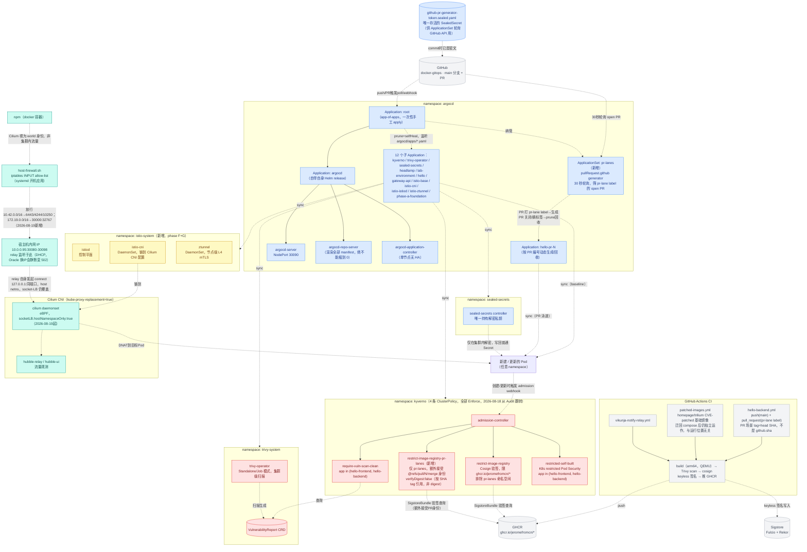
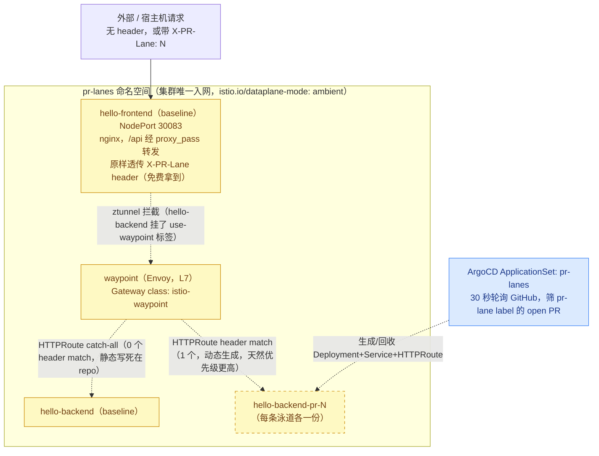

# 容器部署拓扑图 v3

记录 `vps_oracle`（Oracle Cloud VPS，单主机，4核/23G + 4G swap）上截至 **2026-08-19** 的容器部署情况。数据来源：本仓库各 `docker-compose.yml`/k8s manifest + 现场实测（`docker ps`、`docker network inspect`、`kubectl get ns/pods -A/application -n argocd/clusterpolicy/sealedsecret -A`、`docker exec npm` 读取全部 24 条 `/data/nginx/proxy_host/*.conf`）。

**相比 [v2](v2.md)（2026-08-17）最大的结构性变化**：v2 时期 k3s 刚接手 6 个 compose 服务 + 1 个原生服务（9 个 namespace 的应用平台）。**仅仅两天后**，2026-08-18 用户主导把其中 7 个服务（`homepage`/`trilium`/`dify`/`evidence-os-website`/`vikunja`/`apprise`/`llm`）整体迁回 compose——不是技术故障，是评估后的主动决定。同一天 phase E 供应链安全从 Audit 全部翻正式 Enforce。2026-08-19 当天又完成了 phase F+G：`placeholder-hello` 退场，代之以 `hello-frontend`→`hello-backend` 两层拓扑 + Istio Ambient service mesh + ArgoCD ApplicationSet 驱动的 PR 预览泳道机制；同日还发生并修复了一起事故——Cilium 为支持这套网格收窄了 `socketLB` 覆盖范围，意外导致 NPM 到全部 k3s NodePort 服务失联。k3s 现在只剩 `lab-environment`/`headlamp`/`pr-lanes` 三个工作负载 namespace，规模比 v2 时明显收缩。详见文末「与 v2 相比的主要变化」。

## 图一：总体拓扑图（宿主机全景）

```mermaid
flowchart TB
    Internet((Internet))
    VlessClient([VLESS 客户端])

    subgraph VPS["vps_oracle · Oracle Cloud VPS（单主机）"]
        direction TB

        Port80443["宿主机端口 80 / 443"]
        Port39876["宿主机端口 39876"]

        npm["npm<br/>Nginx Proxy Manager"]
        xui["3x-ui<br/>VLESS+Reality 节点"]

        subgraph ProxyNet["docker network: proxy（172.19.0.0/16，外部 bridge）"]
            direction TB

            subgraph PlatformSvcs["面板/网关（v1 起就在这里，未变）"]
                direction LR
                portainer["portainer"]
                grafana["grafana"]
                ccr["ccr<br/>Claude Code Router"]
                switchboard["switchboard"]
                plans["plans"]
            end

            subgraph ReversedApps["2026-08-18 从 k3s 迁回 compose 的 7 个服务"]
                direction TB
                homepage["homepage"]
                trilium[("trilium")]
                evidence["evidence-os-website"]
                vikunja[("vikunja")]
                vjrelay["vikunja-notify-relay"]
                apprise["apprise"]
                llamacpp["llama-cpp"]
                openwebui["open-webui<br/>（域名沿用旧名 ollama.*）"]

                subgraph DifyGroup["dify（9 容器全家桶；仅 web/api/plugin-daemon 额外挂 proxy，其余在独立内部网络 + ssrf_proxy_network）"]
                    direction TB
                    difyweb["dify-web"]
                    difyapi["dify-api"]
                    difyplugin["dify-plugin-daemon"]
                    difydb[("dify-db")]
                    difypgvector[("dify-pgvector")]
                    difyredis[("dify-redis")]
                    difyworker["dify-worker"]
                    difyworkerbeat["dify-worker-beat"]
                    difyssrf["dify-ssrf-proxy"]
                end
            end
        end

        subgraph MonNet["docker network: monitoring_default（内部）"]
            direction LR
            prometheus[("prometheus")]
            nodeexp["node-exporter"]
            blackbox["blackbox-exporter"]
        end

        DockerSock{{"/var/run/docker.sock"}}

        subgraph NPRelay["宿主机 host netns：nodeport-relay@PORT.service（socat，2026-08-19 新增）"]
            npRelayNode["6 个常驻实例：30090/92/94/95/97/98<br/>监听同端口，自身转发到 127.0.0.1:同端口"]
        end

        subgraph K3S["k3s 集群（Cilium socketLB.hostNamespaceOnly:true，与 docker 网络物理隔离）"]
            direction TB

            subgraph NS_lab["namespace: lab-environment（quota 2.5C/4G，SRE 练习平台，未变）"]
                direction TB
                consul["consul<br/>NodePort 30092"]
                apigw["api-gateway<br/>NodePort 30097"]
                customers["customers-service"]
                vets["vets-service"]
                visits["visits-service"]
                labpg[("postgres")]
                labredis[("redis")]
                labprom[("prometheus<br/>NodePort 30093，仅内部")]
                labgrafana["grafana<br/>NodePort 30094"]
                jaeger["jaeger<br/>NodePort 30095"]
                loki[("loki")]
                promtail["promtail"]
                toxiproxy["toxiproxy"]
                mcptoolkit["mcp-toolkit<br/>NodePort 30096，无 NPM 记录"]
            end

            subgraph NS_prlanes["namespace: pr-lanes（集群唯一 Istio Ambient 入网命名空间，新增）"]
                direction TB
                frontend["hello-frontend（baseline）<br/>NodePort 30083，未接 NPM"]
                waypoint["waypoint（Envoy L7 代理）"]
                backend["hello-backend（baseline）"]
            end

            headlampNode["headlamp（独立 namespace）<br/>NodePort 30098"]
            argocdsrv["argocd-server（namespace: argocd）<br/>NodePort 30090"]
            kyvernoNode["kyverno-admission-controller（namespace: kyverno）<br/>4 条 ClusterPolicy，全部 Enforce"]
            trivyNode["trivy-operator（namespace: trivy-system）"]
            sealedNode["sealed-secrets controller（namespace: sealed-secrets）<br/>仅 1 个存活密文"]
            istioNode["istiod / ztunnel / istio-cni<br/>（namespace: istio-system，新增）"]
            kubesysNode["kube-system：cilium / coredns /<br/>metrics-server / local-path-provisioner"]
        end

        subgraph Inspector["vps_oracle/host-native/inspector（host-native，非容器，systemd timer 09:00/21:00）"]
            inspectsh["inspect.sh<br/>docker层 + k3s层巡检"]
        end
    end

    Telegram(("Telegram"))
    DeadPL["⚠️ 172.19.0.1:3001 / 8080 / 9090<br/>programming-learning-platform<br/>（容器已下线，NPM 记录未清理，v2 起未变）"]

    Internet --> Port80443 --> npm
    VlessClient --> Port39876 --> xui

    npm -."反代 *.jerome.cloudns.asia".-> xui
    npm -.-> portainer
    npm -.-> grafana
    npm -.-> ccr
    npm -.-> switchboard
    npm -.-> plans

    npm -."容器名直连（compose 原生方式，NodePort 已不需要）".-> homepage
    npm -.-> trilium
    npm -.-> evidence
    npm -.-> vikunja
    npm -.-> apprise
    npm -.-> openwebui
    npm -."默认location".-> difyweb
    npm -."/console/api /api /v1 /files /mcp /triggers /openapi".-> difyapi
    npm -."/e/".-> difyplugin

    npm -."10.0.0.95:30090/92/94/95/97/98".-> npRelayNode
    npRelayNode -."host netns connect()，socket-LB 仍覆盖".-> argocdsrv
    npRelayNode -.-> consul
    npRelayNode -.-> labgrafana
    npRelayNode -.-> jaeger
    npRelayNode -.-> apigw
    npRelayNode -.-> headlampNode

    npm -."⚠️ 后端已不存在".-> DeadPL

    openwebui --> llamacpp

    difyweb --> difyapi
    difyapi <--> difyplugin
    difyapi --> difydb
    difyapi --> difypgvector
    difyapi --> difyredis
    difyapi -.出站经.-> difyssrf
    difyworker --> difydb
    difyworker --> difyredis
    difyworker -.出站经.-> difyssrf
    difyworkerbeat --> difydb
    difyworkerbeat --> difyredis
    difyplugin --> difydb
    difyplugin --> difyredis
    difyplugin -.出站经.-> difyssrf

    vikunja -."webhook".-> vjrelay
    vjrelay -."转发".-> apprise

    apigw --> customers
    apigw --> vets
    apigw --> visits
    customers --> labpg
    vets --> labpg
    visits --> labpg
    customers -.-> labredis
    consul -."服务发现".-> apigw
    labgrafana --> labprom
    labgrafana --> loki
    jaeger -."trace".-> apigw
    promtail --> loki
    toxiproxy -."故障注入代理".-> labpg

    frontend -."ztunnel 拦截（hello-backend 挂了 use-waypoint）".-> waypoint
    waypoint -."catch-all（详见图三）".-> backend

    grafana --> prometheus
    prometheus --> nodeexp
    prometheus --> blackbox

    portainer -."读写：管理宿主机全部 docker 容器".-> DockerSock

    inspectsh -."k3s层巡检（最小权限 SA）".-> K3S
    inspectsh -."alert".-> apprise
    apprise -."Telegram".-> Telegram

    classDef entry fill:#dcfce7,stroke:#16a34a,color:#14532d
    classDef proxynet fill:#dbeafe,stroke:#3b82f6,color:#1e3a8a
    classDef internalnet fill:#f3f4f6,stroke:#9ca3af,color:#374151
    classDef k8sapp fill:#ede9fe,stroke:#7c3aed,color:#4c1d95
    classDef k8splatform fill:#ccfbf1,stroke:#0d9488,color:#134e4a
    classDef dead fill:#fef3c7,stroke:#d97706,color:#78350f,stroke-dasharray: 4 3
    classDef relay fill:#fce7f3,stroke:#db2777,color:#831843

    class Internet,VlessClient entry
    class npm,xui,portainer,grafana,ccr,switchboard,plans,homepage,trilium,evidence,vikunja,vjrelay,apprise,llamacpp,openwebui,difyweb,difyapi,difyplugin,difydb,difypgvector,difyredis,difyworker,difyworkerbeat,difyssrf proxynet
    class prometheus,nodeexp,blackbox internalnet
    class consul,apigw,customers,vets,visits,labpg,labredis,labprom,labgrafana,jaeger,loki,promtail,toxiproxy,mcptoolkit,frontend,waypoint,backend k8sapp
    class headlampNode,argocdsrv,kyvernoNode,trivyNode,sealedNode,istioNode,kubesysNode k8splatform
    class DeadPL dead
    class npRelayNode relay
```

### 图一图例

| 颜色 | 含义 |
|---|---|
| 🟩 绿 | 外部入口（Internet / VLESS 客户端） |
| 🟦 蓝 | docker `proxy` 网络里的容器 —— NPM 直接按容器名反代（现在覆盖 v2 迁去 k3s 的全部 7 个服务） |
| ⬜ 灰 | docker `monitoring_default` 内部网络，不接 `proxy`，无域名 |
| 🟪 紫 | k3s 应用类工作负载（`lab-environment`/`pr-lanes`），NPM 经宿主机 NodePort 反代 |
| 🟩🟦混（青） | k3s 平台治理/网格组件（`argocd`/`kyverno`/`trivy-system`/`sealed-secrets`/`istio-system`/`kube-system`），细节见图二、图三 |
| 🌸 粉 | 2026-08-19 新增的 NodePort relay 机制（host netns 里的 `socat`），修复 Cilium socket-LB 收窄导致的 NPM→k3s 黑洞 |
| 🟨 黄（虚线框） | 孤立/失效配置 —— 已确认后端不存在，v2 起未变 |

## 图二：k3s 平台治理层（GitOps + 供应链安全 + NodePort 寻址机制）

### 图二图例

| 颜色 | 含义 |
|---|---|
| ⬜ 灰 | 集群外部（GitHub / GHCR / Sigstore / CI） |
| 🟦 蓝 | GitOps 链路（ArgoCD 自身 + ApplicationSet + Sealed Secrets） |
| 🟥 红 | 供应链安全 / 准入控制（Kyverno 4 条策略 + Trivy Operator）—— **现在全部 Enforce，不再是 v2 时的 Audit** |
| 🟨 黄 | Istio Ambient 网格控制/数据平面组件（新增） |
| 🟩🟦混（青） | 网络寻址机制（NPM → host firewall → NodePort relay → Cilium socket-LB → Pod） |

## 图三：PR 预览泳道流量路由机制（Istio Ambient waypoint，phase F+G 新增）

图一、图二把 `pr-lanes` 压缩成了单个 workload/单条 edge，这张图展开它具体怎么做「不带 header 打到共享基线、带 `X-PR-Lane` header 才路由到对应 PR 版本」——这套东西在 v2 时完全不存在，是 2026-08-19 当天新增的一整层机制。

### 图三图例

| 颜色 | 含义 |
|---|---|
| 🟨 黄（实线） | mesh 常驻 baseline 组件，不随 PR 变化 |
| 🟨 黄（虚线） | ApplicationSet 按 PR 动态生成/回收的泳道资源，非常驻 |
| 🟦 蓝 | GitOps 触发源（ApplicationSet 轮询 GitHub） |

不需要手动排序优先级：Gateway API 规范定义同一 parent 上多份 `HTTPRoute` 合并时按「header match 数量」比优先序——泳道规则 1 个 match 永远优先于 baseline 的 0 个，新增/移除泳道都不用碰 baseline 文件。PR 关闭后，ApplicationSet 下一轮询该 PR 不再匹配，对应 Application 连同它管理的 Deployment/Service/HTTPRoute 一并被 `prune: true` 回收，不留残留。完整机制、CI 整合、Kyverno 命名空间例外的取舍见 [`docs/misc/2026-08-19-k3s-phase-fg-pr-lanes-summary.md`](../misc/2026-08-19-k3s-phase-fg-pr-lanes-summary.md)。

## 分区说明

### 入口层
跟 v2 一致：**npm**（`vps_oracle/compose/npm`）仍是唯一发布 80/443 的容器，`*.jerome.cloudns.asia` 先到它，再按 Forward Host/Port（或 dify 的 Custom Locations）转发。**3x-ui** 用法也不变：`39876` 单独发布，节点端口客户端直连。

### docker `proxy` 网络（172.19.0.0/16）
比 v2 时**膨胀了**——`homepage`/`trilium`/`evidence-os-website`/`vikunja`+`vikunja-notify-relay`/`apprise`/`dify`（9 容器）/`llm`（`llama-cpp`+`open-webui`）这 7 个服务 2026-08-18 从 k3s 迁回，全部重新直接挂在这张网络上，NPM 反代方式回到「按容器名」，不再经 NodePort。加上 v1 起就在这里的 `portainer`/`grafana`/`ccr`/`switchboard`/`plans`，动态 IP 池（`172.19.1.0/24`）里现在约有 17 个成员。钉死静态 IP 的仍然只有 `3x-ui`（`.2`）/`npm`（`.3`）/`prometheus`（`.4`）三个，未变。

### `vps_oracle/compose/monitoring`
不变：`prometheus`/`node-exporter`/`blackbox-exporter` 只在内部网络，`grafana` 额外挂 `proxy` 对外提供仪表盘。

### k3s 集群（规模比 v2 明显收缩）
`vps_oracle/k3s/` 现在只剩两个真正跑应用的 namespace：`lab-environment`（SRE 练习平台，quota/内容跟 v2 一致，未受这两天的迁移影响）和 `pr-lanes`（phase F+G 新增，`hello-frontend`/`hello-backend`/`waypoint`，Istio Ambient 服务网格的唯一入网命名空间，详见图三）。`headlamp`（只读 k8s 面板）继续独立存在。治理类 namespace 从 4 个变成 5 个：`argocd`/`kyverno`/`trivy-system`/`sealed-secrets` 之外新增 `istio-system`（`istiod`+`ztunnel`+`istio-cni`）。**`workloads` namespace 仍然 Active 但已空**——`placeholder-hello` 2026-08-19 退场，其余应用（`homepage` 等）2026-08-18 就已迁走，目前没有任何 Pod 挂在这个 namespace 下。

`placeholder-hello` 为什么被拆成两层：PR 预览泳道的「共享底座 + 流量路由」设计，价值只有在「至少两层服务、东西向有一跳可以做路由决策」时才成立——单层服务的话任何 ingress controller 的 header 分流都能做到，用不上 service mesh。完整取舍见 [phase F+G 设计文档](../superpowers/specs/2026-08-18-k3s-phase-fg-mesh-pr-lanes-design.md)。

**NodePort 一览**（比 v2 大幅缩减，dify/homepage/trilium/vikunja/apprise/open-webui/llama-cpp 的 NodePort 随迁移全部消失）：`30083` hello-frontend（未接 NPM）、`30090` argocd-server、`30092` consul、`30093` lab-prometheus（仅内部，无 NPM 记录）、`30094` lab-grafana、`30095` jaeger、`30096` mcp-toolkit（无 NPM 记录）、`30097` api-gateway、`30098` headlamp。

### NPM → k3s 的寻址机制（2026-08-19 事故与修复，机制变化）
v2 时 NPM 反代到 k3s NodePort 全靠 Cilium socket-LB「Full」覆盖范围**意外兜底**——任何进程（含 docker 容器）的 `connect()` 调用都会被直接改写到后端 Pod IP，`host-firewall.sh` 从未为 NodePort 范围（30000-32767）开过口子，因为从来不需要。2026-08-19 phase F+G 为了让 waypoint 收到流量，把 `socketLB.hostNamespaceOnly` 设为 `true`（这是正确、必要的修复，不能回退），副作用是这条兜底只留给宿主机自己的网络命名空间，docker bridge 容器（NPM 所在的 `proxy` 网络）被排除，NPM 到全部 6 个它依赖的 k3s NodePort（argocd/consul/lab-grafana/jaeger/api-gateway/headlamp）瞬间全部黑洞。

修复两部分，缺一不可：(1) `host-firewall.sh` 新增一条 `INPUT` 规则显式放行 `172.19.0.0/16 → 30000:32767`；(2) 新增 [`vps_oracle/host-native/npm-nodeport-relay/`](../../vps_oracle/host-native/npm-nodeport-relay/)——一个 systemd 模板服务，给 NPM 依赖的每个 NodePort 各起一个 `socat` 实例，监听在 host netns、转发到 `127.0.0.1:<同端口>`，因为这个转发本身是从 host netns 发起的 `connect()`，依然被 socket-LB 正确改写到后端 Pod。NPM 的配置完全不用改。完整排查过程、根因两层分析见 [`docs/incidents/2026-08-19-npm-to-k3s-nodeport-outage.md`](../incidents/2026-08-19-npm-to-k3s-nodeport-outage.md)。

### 特权挂载（`/var/run/docker.sock`）
跟 v2 一致：只有 `portainer` 一家挂着（读写，管理宿主机全部 docker 容器）。`homepage` 迁回 compose 后，README 明确记录「本可以恢复 `container`/`server` 字段（挂 docker.sock），但决定继续不挂，保持跟迁移前 k3s 状态一致」——迁移没有反向扩大特权面。

### `vps_oracle/host-native/inspector`
机制不变（host-native bash，systemd timer 09:00/21:00，横跨 docker 层和 k3s 层）。`APPRISE_URL` 已随 apprise 迁回 compose 更新为容器名直连，不再是 k3s NodePort `30085`（那个 NodePort 现在已经不存在）。

### `vps_oracle/host-native/host-firewall`
在 v2 已有规则基础上新增一条（见上面「NPM → k3s 的寻址机制」）：`-s 172.19.0.0/16 -p tcp --dport 30000:32767 -j ACCEPT`，风格跟既有的 pod CIDR → 特定端口规则一致，来源限定在 docker `proxy` 网络，不对外开放。

### `vps_oracle/host-native/npm-nodeport-relay`（新增）
host-native systemd 模板服务（非容器），`nodeport-relay@<port>.service`，每个 NPM 依赖的 k3s NodePort 各一个常驻 `socat` 实例。新增一条走 NodePort 的 NPM 反代记录时，必须同步在这里加一个新实例，否则会撞上同样的黑洞——README 里专门标注了这条。

## 已知问题：3 条孤立的 NPM 反代配置

跟 v2 一致，**没有做任何清理**：`grafana.pl.jerome.cloudns.asia`、`prometheus.pl.jerome.cloudns.asia`、`www.pl.jerome.cloudns.asia` 三条记录仍然 `enabled: true`，转发目标是 `172.19.0.1:3001` / `:9090` / `:8080`（docker0 网桥网关 IP），对应的 `programming-learning-platform` 项目容器仍然彻底不存在。纯粹的现状记录，不是本次改动。

## 与 v2（2026-08-17）相比的主要变化

- **7 个服务从 k3s 迁回 compose**：`homepage`/`trilium`/`dify`/`evidence-os-website`（第一批）、`vikunja`+`vikunja-notify-relay`/`apprise`/`llm`（第二批，~45-90 分钟后）。2026-08-18 用户主导的评估性迁移，不是技术故障。删除 k3s 侧资源需要同时清理 3 个不同位置（ArgoCD Application、`sealed-secrets` 的独立 Application、`phase-a-foundation` 共享的 namespace 声明），漏一个都会被 `selfHeal` 静默复活。
- **k3s 规模大幅收缩**：应用类 namespace 从 v2 的 4 个（`workloads`/`dify`/`llm`/`lab-environment`）+ 1 独立（`headlamp`）变成只剩 `lab-environment`/`pr-lanes`/`headlamp` 三个，`workloads` namespace 空置。
- **`placeholder-hello` 退场**，代之以两层拓扑 `hello-frontend`→`hello-backend`（部署在新 namespace `pr-lanes`），为 PR 预览泳道的「东西向路由」机制提供必要的第二跳。
- **新增 Istio Ambient service mesh**：`istiod`+`ztunnel`+`istio-cni`（namespace `istio-system`），爆炸半径刻意限定在 `pr-lanes` 一个命名空间（`istio.io/dataplane-mode: ambient` 标签）。
- **新增 ArgoCD ApplicationSet `pr-lanes`**：`pullRequest.github` generator，30 秒轮询 GitHub，按 `pr-lane` label 自动生成/回收 `hello-pr-N` Application，含配套的 Kyverno 命名空间范围例外策略、CI `pull_request` 触发。
- **Kyverno 三条既有策略从 Audit 全部翻正式 Enforce**（2026-08-18）：`require-vuln-scan-clean` 从计划中的 cluster-wide 收窄为 `app in (placeholder-hello, vikunja-notify-relay)`，之后再随 `placeholder-hello` 退场变成 `app in (hello-frontend, hello-backend)`；新增第 4 条 `restrict-image-registry-pr-lanes` 处理 PR 分支镜像签名身份的命名空间级例外。
- **Sealed Secrets 大幅缩减**：v2 时 `dify-secrets`/`open-webui`/`vikunja` 三个密文，现在随服务迁回 compose 全部移除，只剩 1 个新增的 `github-pr-generator-token`（供 ApplicationSet 轮询 GitHub API 用）。迁回 compose 的服务改用未加密的 `.env`（gitignored）。
- **Cilium `socketLB` 收紧为 `hostNamespaceOnly: true`**（phase F+G 为 istio-cni 路由所需，正确且不能回退），意外导致 NPM 到全部 k3s NodePort 服务黑洞（2026-08-19 事故），两部分修复：`host-firewall.sh` 新增放行规则 + 新增 `vps_oracle/host-native/npm-nodeport-relay/`（host netns `socat` 中继）。这是本仓库第二次在改 Cilium/网络层配置时踩到「集群内部一切正常，外部消费者悄悄断开」的坑（第一次见 v1/v2 的 host-firewall 事故记录）。
- **NodePort 一览大幅缩减**：`dify`/`homepage`/`trilium`/`vikunja`/`apprise`/`open-webui`/`llama-cpp` 的全部 NodePort 随迁移消失，只剩 `lab-environment`（未变）+ `headlamp`/`argocd`（未变）+ 新增的 `pr-lanes`/`hello-frontend`（30083，未接 NPM）。
- **`homepage`/`trilium` 的镜像构建管线独立于运行位置**：即使两者已离开 k3s，`patched-images.yml` 这条 CI 仍继续给 `ghcr.io/jeromefromcn/{homepage,trilium}` 发布 CVE-patched 镜像——构建管线原本就没有 k3s 运行时依赖。
- **NPM 反代记录总数不变（24 条）**：迁移只是把目标从「容器名」换回「容器名」（v1 时的方式）或从「NodePort」换成「NodePort」（k3s 原生服务 headlamp/argocd/lab-environment 未参与这轮迁移），没有新增/删除域名，3 条孤立的 `pl.*` 记录依旧原样保留。

## 数据来源

- 本仓库各 `vps_oracle/compose/*/docker-compose.yml`、`vps_oracle/k3s/**/*.yaml`、`vps_oracle/k3s/README.md`、根 `README.md`、`vps_oracle/host-native/npm-nodeport-relay/README.md`、`vps_oracle/host-native/host-firewall/host-firewall.sh`、`docs/incidents/2026-08-19-npm-to-k3s-nodeport-outage.md`、`docs/misc/2026-08-19-k3s-phase-fg-pr-lanes-summary.md`
- 现场实测（2026-08-19）：`docker ps`、`docker network inspect proxy`、`kubectl get ns` / `get pods -A` / `get application -n argocd` / `get clusterpolicy` / `get sealedsecret -A` / `get svc -A`（NodePort）/ `get applicationset -n argocd` / `get gateway,httproute -n pr-lanes`
- NPM 现场配置核对：`docker exec npm` 读取全部 24 份 `/data/nginx/proxy_host/*.conf`（逐条核对 `server_name`/`$server`/`$port`/`proxy_pass`/`location`）
