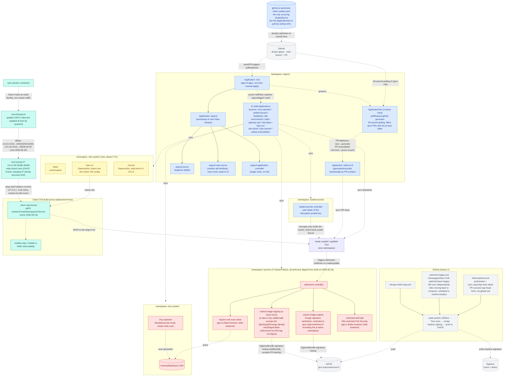
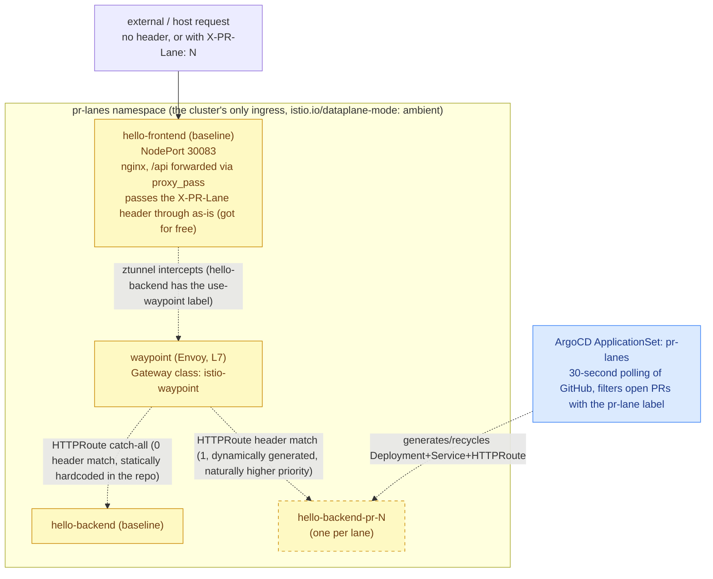

# Deployment topology v3

Records the container deployment on `vps_oracle` (Oracle Cloud VPS, single host, 4 cores/23G + 4G swap) as of **2026-08-19**. Data sources: this repo's `docker-compose.yml`/k8s manifests + live inspection (`docker ps`, `docker network inspect`, `kubectl get ns/pods -A/application -n argocd/clusterpolicy/sealedsecret -A`, `docker exec npm` reading all 24 `/data/nginx/proxy_host/*.conf`).

**Biggest structural change from [v2](v2.md) (2026-08-17)**: in the v2 era k3s had just taken over 6 compose services + 1 native service (a 9-namespace application platform). **Barely two days later**, on 2026-08-18 the user led moving 7 of those services (`homepage`/`trilium`/`dify`/`evidence-os-website`/`vikunja`/`apprise`/`llm`) back to compose wholesale — not a technical failure but an evaluated, deliberate decision. The same day, phase E supply-chain security flipped from Audit to fully enforced. On 2026-08-19 phases F+G were completed: `placeholder-hello` decommissioned, replaced by a `hello-frontend`→`hello-backend` two-tier topology + Istio Ambient service mesh + ArgoCD ApplicationSet-driven PR preview lanes; the same day also saw an incident hit and get fixed — Cilium narrowed its `socketLB` coverage to support this mesh, which unexpectedly cut off NPM from all k3s NodePort services. k3s now has only three workload namespaces left — `lab-environment`/`headlamp`/`pr-lanes` — clearly shrunk from v2. See "Major changes vs v2" at the end.

## Diagram 1: overall topology (host panorama)

```mermaid
flowchart TB
    Internet((Internet))
    VlessClient([VLESS client])

    subgraph VPS["vps_oracle · Oracle Cloud VPS (single host)"]
        direction TB

        Port80443["host port 80 / 443"]
        Port39876["host port 39876"]

        npm["npm<br/>Nginx Proxy Manager"]
        xui["3x-ui<br/>VLESS+Reality node"]

        subgraph ProxyNet["docker network: proxy (172.19.0.0/16, external bridge)"]
            direction TB

            subgraph PlatformSvcs["panels/gateways (here since v1, unchanged)"]
                direction LR
                portainer["portainer"]
                grafana["grafana"]
                ccr["ccr<br/>Claude Code Router"]
                switchboard["switchboard"]
                plans["plans"]
            end

            subgraph ReversedApps["the 7 services moved back from k3s to compose on 2026-08-18"]
                direction TB
                homepage["homepage"]
                trilium[("trilium")]
                evidence["evidence-os-website"]
                vikunja[("vikunja")]
                vjrelay["vikunja-notify-relay"]
                apprise["apprise"]
                llamacpp["llama-cpp"]
                openwebui["open-webui<br/>(domain keeps the old ollama.* name)"]

                subgraph DifyGroup["dify (9-container full suite; only web/api/plugin-daemon additionally on proxy, the rest on a separate internal network + ssrf_proxy_network)"]
                    direction TB
                    difyweb["dify-web"]
                    difyapi["dify-api"]
                    difyplugin["dify-plugin-daemon"]
                    difydb[("dify-db")]
                    difypgvector[("dify-pgvector")]
                    difyredis[("dify-redis")]
                    difyworker["dify-worker"]
                    difyworkerbeat["dify-worker-beat"]
                    difyssrf["dify-ssrf-proxy"]
                end
            end
        end

        subgraph MonNet["docker network: monitoring_default (internal)"]
            direction LR
            prometheus[("prometheus")]
            nodeexp["node-exporter"]
            blackbox["blackbox-exporter"]
        end

        DockerSock{{"/var/run/docker.sock"}}

        subgraph NPRelay["host netns: nodeport-relay@PORT.service (socat, new 2026-08-19)"]
            npRelayNode["6 resident instances: 30090/92/94/95/97/98<br/>listening on the same port, itself forwarding to 127.0.0.1:<same port>"]
        end

        subgraph K3S["k3s cluster (Cilium socketLB.hostNamespaceOnly:true, physically isolated from docker networks)"]
            direction TB

            subgraph NS_lab["namespace: lab-environment (quota 2.5C/4G, SRE practice platform, unchanged)"]
                direction TB
                consul["consul<br/>NodePort 30092"]
                apigw["api-gateway<br/>NodePort 30097"]
                customers["customers-service"]
                vets["vets-service"]
                visits["visits-service"]
                labpg[("postgres")]
                labredis[("redis")]
                labprom[("prometheus<br/>NodePort 30093, internal only")]
                labgrafana["grafana<br/>NodePort 30094"]
                jaeger["jaeger<br/>NodePort 30095"]
                loki[("loki")]
                promtail["promtail"]
                toxiproxy["toxiproxy"]
                mcptoolkit["mcp-toolkit<br/>NodePort 30096, no NPM record"]
            end

            subgraph NS_prlanes["namespace: pr-lanes (the cluster's only Istio Ambient ingress namespace, new)"]
                direction TB
                frontend["hello-frontend (baseline)<br/>NodePort 30083, not on NPM"]
                waypoint["waypoint (Envoy L7 proxy)"]
                backend["hello-backend (baseline)"]
            end

            headlampNode["headlamp (standalone namespace)<br/>NodePort 30098"]
            argocdsrv["argocd-server (namespace: argocd)<br/>NodePort 30090"]
            kyvernoNode["kyverno-admission-controller (namespace: kyverno)<br/>4 ClusterPolicies, all enforced"]
            trivyNode["trivy-operator (namespace: trivy-system)"]
            sealedNode["sealed-secrets controller (namespace: sealed-secrets)<br/>only 1 surviving ciphertext"]
            istioNode["istiod / ztunnel / istio-cni<br/>(namespace: istio-system, new)"]
            kubesysNode["kube-system: cilium / coredns /<br/>metrics-server / local-path-provisioner"]
        end

        subgraph Inspector["vps_oracle/host-native/inspector (host-native, non-container, systemd timer 09:00/21:00)"]
            inspectsh["inspect.sh<br/>docker-layer + k3s-layer inspection"]
        end
    end

    Telegram(("Telegram"))
    DeadPL["⚠️ 172.19.0.1:3001 / 8080 / 9090<br/>programming-learning-platform<br/>(containers decommissioned, NPM records not cleaned up, unchanged since v2)"]

    Internet --> Port80443 --> npm
    VlessClient --> Port39876 --> xui

    npm -."reverse-proxies *.jerome.cloudns.asia".-> xui
    npm -.-> portainer
    npm -.-> grafana
    npm -.-> ccr
    npm -.-> switchboard
    npm -.-> plans

    npm -."direct by container name (compose-native way, NodePort no longer needed)".-> homepage
    npm -.-> trilium
    npm -.-> evidence
    npm -.-> vikunja
    npm -.-> apprise
    npm -.-> openwebui
    npm -."default location".-> difyweb
    npm -."/console/api /api /v1 /files /mcp /triggers /openapi".-> difyapi
    npm -."/e/".-> difyplugin

    npm -."10.0.0.95:30090/92/94/95/97/98".-> npRelayNode
    npRelayNode -."host netns connect(), socket-LB still covers".-> argocdsrv
    npRelayNode -.-> consul
    npRelayNode -.-> labgrafana
    npRelayNode -.-> jaeger
    npRelayNode -.-> apigw
    npRelayNode -.-> headlampNode

    npm -."⚠️ backend no longer exists".-> DeadPL

    openwebui --> llamacpp

    difyweb --> difyapi
    difyapi <--> difyplugin
    difyapi --> difydb
    difyapi --> difypgvector
    difyapi --> difyredis
    difyapi -.egress via.-> difyssrf
    difyworker --> difydb
    difyworker --> difyredis
    difyworker -.egress via.-> difyssrf
    difyworkerbeat --> difydb
    difyworkerbeat --> difyredis
    difyplugin --> difydb
    difyplugin --> difyredis
    difyplugin -.egress via.-> difyssrf

    vikunja -."webhook".-> vjrelay
    vjrelay -."forward".-> apprise

    apigw --> customers
    apigw --> vets
    apigw --> visits
    customers --> labpg
    vets --> labpg
    visits --> labpg
    customers -.-> labredis
    consul -."service discovery".-> apigw
    labgrafana --> labprom
    labgrafana --> loki
    jaeger -."trace".-> apigw
    promtail --> loki
    toxiproxy -."fault-injection proxy".-> labpg

    frontend -."ztunnel intercepts (hello-backend has the use-waypoint label)".-> waypoint
    waypoint -."catch-all (details in diagram 3)".-> backend

    grafana --> prometheus
    prometheus --> nodeexp
    prometheus --> blackbox

    portainer -."read-write: manages all host docker containers".-> DockerSock

    inspectsh -."k3s-layer inspection (least-privilege SA)".-> K3S
    inspectsh -."alert".-> apprise
    apprise -."Telegram".-> Telegram

    classDef entry fill:#dcfce7,stroke:#16a34a,color:#14532d
    classDef proxynet fill:#dbeafe,stroke:#3b82f6,color:#1e3a8a
    classDef internalnet fill:#f3f4f6,stroke:#9ca3af,color:#374151
    classDef k8sapp fill:#ede9fe,stroke:#7c3aed,color:#4c1d95
    classDef k8splatform fill:#ccfbf1,stroke:#0d9488,color:#134e4a
    classDef dead fill:#fef3c7,stroke:#d97706,color:#78350f,stroke-dasharray: 4 3
    classDef relay fill:#fce7f3,stroke:#db2777,color:#831843

    class Internet,VlessClient entry
    class npm,xui,portainer,grafana,ccr,switchboard,plans,homepage,trilium,evidence,vikunja,vjrelay,apprise,llamacpp,openwebui,difyweb,difyapi,difyplugin,difydb,difypgvector,difyredis,difyworker,difyworkerbeat,difyssrf proxynet
    class prometheus,nodeexp,blackbox internalnet
    class consul,apigw,customers,vets,visits,labpg,labredis,labprom,labgrafana,jaeger,loki,promtail,toxiproxy,mcptoolkit,frontend,waypoint,backend k8sapp
    class headlampNode,argocdsrv,kyvernoNode,trivyNode,sealedNode,istioNode,kubesysNode k8splatform
    class DeadPL dead
    class npRelayNode relay
```

### Diagram 1 legend

| Color | Meaning |
|---|---|
| 🟩 green | external entry (Internet / VLESS client) |
| 🟦 blue | containers on the docker `proxy` network — NPM reverse-proxies directly by container name (now covering all 7 services moved to k3s in v2) |
| ⬜ gray | docker `monitoring_default` internal network, not on `proxy`, no domain |
| 🟪 purple | k3s application workloads (`lab-environment`/`pr-lanes`), reverse-proxied by NPM via host NodePort |
| 🟩🟦 mixed (teal) | k3s platform governance / mesh components (`argocd`/`kyverno`/`trivy-system`/`sealed-secrets`/`istio-system`/`kube-system`), details in diagrams 2 and 3 |
| 🌸 pink | the NodePort relay mechanism added 2026-08-19 (`socat` in the host netns), fixing the NPM→k3s black hole caused by Cilium socket-LB narrowing |
| 🟨 yellow (dashed border) | orphaned / stale config — backend confirmed nonexistent, unchanged since v2 |

## Diagram 2: k3s platform governance layer (GitOps + supply-chain security + NodePort addressing mechanism)

### Diagram 2 legend

| Color | Meaning |
|---|---|
| ⬜ gray | outside the cluster (GitHub / GHCR / Sigstore / CI) |
| 🟦 blue | GitOps chain (ArgoCD itself + ApplicationSet + Sealed Secrets) |
| 🟥 red | supply-chain security / admission control (Kyverno's 4 policies + Trivy Operator) — **now all enforced, no longer the v2 Audit** |
| 🟨 yellow | Istio Ambient mesh control/data-plane components (new) |
| 🟩🟦 mixed (teal) | network addressing mechanism (NPM → host firewall → NodePort relay → Cilium socket-LB → Pod) |

## Diagram 3: PR preview lane traffic-routing mechanism (Istio Ambient waypoint, new in phase F+G)

Diagrams 1 and 2 compressed `pr-lanes` into a single workload/single edge; this diagram unfolds exactly how it does "no header → shared baseline, `X-PR-Lane` header present → routed to the corresponding PR version" — a mechanism that didn't exist at all in v2 and is an entire newly-added layer as of 2026-08-19.

### Diagram 3 legend

| Color | Meaning |
|---|---|
| 🟨 yellow (solid) | mesh resident baseline components, not affected by PR changes |
| 🟨 yellow (dashed) | lane resources dynamically generated/recycled by the ApplicationSet per PR, non-resident |
| 🟦 blue | GitOps trigger source (ApplicationSet polling GitHub) |

No need to manually order priority: the Gateway API spec defines merging multiple `HTTPRoute`s on the same parent compared by "number of header matches" — the lane rule's 1 match always wins over the baseline's 0, and adding/removing lanes never touches the baseline file. After a PR closes, the ApplicationSet's next poll no longer matches that PR, and the corresponding Application along with its managed Deployment/Service/HTTPRoute are recycled by `prune: true`, leaving no residue. For the full mechanism, CI integration, and the Kyverno namespace-exception trade-off, see [`docs/misc/2026-08-19-k3s-phase-fg-pr-lanes-summary.md`](../misc/2026-08-19-k3s-phase-fg-pr-lanes-summary.md).

## Section notes

### Entry layer
Consistent with v2: **npm** (`vps_oracle/compose/npm`) is still the only container publishing 80/443, `*.jerome.cloudns.asia` reaches it first, then it forwards by Forward Host/Port (or dify's Custom Locations). **3x-ui** usage is also unchanged: `39876` published alone, the node port reached directly by clients.

### docker `proxy` network (172.19.0.0/16)
Grew compared to v2 — the 7 services `homepage`/`trilium`/`evidence-os-website`/`vikunja`+`vikunja-notify-relay`/`apprise`/`dify` (9 containers)/`llm` (`llama-cpp`+`open-webui`) moved back from k3s on 2026-08-18 and are all reattached directly to this network, with NPM reverse-proxying back to "by container name", no longer via NodePort. Added to `portainer`/`grafana`/`ccr`/`switchboard`/`plans` (here since v1), the dynamic IP pool (`172.19.1.0/24`) now has about 17 members. Those with pinned static IPs are still only the three `3x-ui` (`.2`)/`npm` (`.3`)/`prometheus` (`.4`), unchanged.

### `vps_oracle/compose/monitoring`
Unchanged: `prometheus`/`node-exporter`/`blackbox-exporter` only on the internal network, `grafana` additionally joins `proxy` to serve dashboards externally.

### k3s cluster (clearly shrunk from v2)
`vps_oracle/k3s/` now has only two namespaces actually running applications: `lab-environment` (SRE practice platform, quota/content consistent with v2, unaffected by these two days' migrations) and `pr-lanes` (new in phase F+G, `hello-frontend`/`hello-backend`/`waypoint`, the only ingress namespace of the Istio Ambient service mesh; see diagram 3). `headlamp` (read-only k8s panel) continues standalone. Governance namespaces went from 4 to 5: `istio-system` (`istiod`+`ztunnel`+`istio-cni`) added alongside `argocd`/`kyverno`/`trivy-system`/`sealed-secrets`. **The `workloads` namespace is still Active but empty** — `placeholder-hello` decommissioned on 2026-08-19, and the remaining apps (`homepage` etc.) had already moved away on 2026-08-18, so no Pod is attached to this namespace now.

Why `placeholder-hello` was split into two tiers: the PR preview lane's "shared base + traffic routing" design only pays off when there are "at least two tiers of service with one east-west hop where a routing decision can be made" — with a single-tier service, any ingress controller's header-based splitting suffices and the service mesh is pointless. For the full trade-off, see the [phase F+G design doc](../superpowers/specs/2026-08-18-k3s-phase-fg-mesh-pr-lanes-design.md).

**NodePort overview** (greatly shrunk from v2; the NodePorts of dify/homepage/trilium/vikunja/apprise/open-webui/llama-cpp all disappeared with the migration): `30083` hello-frontend (not on NPM), `30090` argocd-server, `30092` consul, `30093` lab-prometheus (internal only, no NPM record), `30094` lab-grafana, `30095` jaeger, `30096` mcp-toolkit (no NPM record), `30097` api-gateway, `30098` headlamp.

### NPM → k3s addressing mechanism (2026-08-19 incident and fix; mechanism changed)
In v2, NPM reverse-proxying to k3s NodePorts relied entirely on Cilium socket-LB's `Full` coverage **accidentally backing it** — any process (including docker containers) `connect()` call was rewritten straight to the backend Pod IP, and `host-firewall.sh` never opened the NodePort range (30000-32767) because it never needed to. On 2026-08-19 phase F+G, to get the waypoint receiving traffic, `socketLB.hostNamespaceOnly` was set to `true` (a correct, necessary fix that can't be reverted), the side effect being that this backing is left only to the host's own network namespace, excluding docker bridge containers (the `proxy` network NPM is on), so NPM's access to all 6 k3s NodePorts it depends on (argocd/consul/lab-grafana/jaeger/api-gateway/headlamp) black-holed instantly.

The fix has two parts, both required: (1) `host-firewall.sh` adds an `INPUT` rule explicitly allowing `172.19.0.0/16 → 30000:32767`; (2) add [`vps_oracle/host-native/npm-nodeport-relay/`](../../vps_oracle/host-native/npm-nodeport-relay/) — a systemd template service that starts one `socat` instance per NodePort NPM depends on, listening in the host netns and forwarding to `127.0.0.1:<same port>`, because this forward itself is a `connect()` initiated from the host netns and is still correctly rewritten to the backend Pod by socket-LB. NPM's config needs no changes at all. For the full troubleshooting and the two-layer root-cause analysis, see [`docs/incidents/2026-08-19-npm-to-k3s-nodeport-outage.md`](../incidents/2026-08-19-npm-to-k3s-nodeport-outage.md).

### Privileged mount (`/var/run/docker.sock`)
Consistent with v2: only `portainer` mounts it (read-write, managing all host docker containers). After `homepage` moved back to compose, the README explicitly records "the `container`/`server` fields (mounting docker.sock) could have been restored, but the decision is to keep not mounting, staying consistent with the pre-migration k3s state" — the migration did not expand the privilege surface back out.

### `vps_oracle/host-native/inspector`
Mechanism unchanged (host-native bash, systemd timer 09:00/21:00, spanning the docker layer and k3s layer). `APPRISE_URL` has been updated to direct-by-container-name now that apprise has moved back to compose, no longer the k3s NodePort `30085` (that NodePort no longer exists).

### `vps_oracle/host-native/host-firewall`
Adds one rule on top of v2's existing rules (see "NPM → k3s addressing mechanism" above): `-s 172.19.0.0/16 -p tcp --dport 30000:32767 -j ACCEPT`, consistent in style with the existing pod-CIDR → specific-ports rules, with the source limited to the docker `proxy` network and not open to the public.

### `vps_oracle/host-native/npm-nodeport-relay` (new)
A host-native systemd template service (non-container), `nodeport-relay@<port>.service`, one resident `socat` instance per k3s NodePort that NPM depends on. When adding a new NPM reverse-proxy record that goes through a NodePort, a new instance must be added here in sync, otherwise it hits the same black hole — the README specifically calls this out.

## Known issue: 3 orphaned NPM reverse-proxy configs

Consistent with v2, **nothing has been cleaned up**: `grafana.pl.jerome.cloudns.asia`, `prometheus.pl.jerome.cloudns.asia`, `www.pl.jerome.cloudns.asia` three records are still `enabled: true`, forwarding to `172.19.0.1:3001` / `:9090` / `:8080` (the docker0 bridge gateway IP), and the corresponding `programming-learning-platform` project containers are still completely nonexistent. A pure current-state record, not a change made this time.

## Major changes vs v2 (2026-08-17)

- **7 services moved back from k3s to compose**: `homepage`/`trilium`/`dify`/`evidence-os-website` (first batch), `vikunja`+`vikunja-notify-relay`/`apprise`/`llm` (second batch, ~45-90 minutes later). A user-led evaluative migration on 2026-08-18, not a technical failure. Deleting the k3s-side resources requires cleaning up 3 different places at once (the ArgoCD Application, `sealed-secrets`'s standalone Application, the shared namespace declaration in `phase-a-foundation`); missing one lets `selfHeal` silently resurrect it.
- **k3s shrunk greatly**: application namespaces went from v2's 4 (`workloads`/`dify`/`llm`/`lab-environment`) + 1 standalone (`headlamp`) to only `lab-environment`/`pr-lanes`/`headlamp` three, with the `workloads` namespace left empty.
- **`placeholder-hello` decommissioned**, replaced by the two-tier topology `hello-frontend`→`hello-backend` (deployed in the new namespace `pr-lanes`), providing the necessary second hop for the PR preview lane's "east-west routing" mechanism.
- **New Istio Ambient service mesh**: `istiod`+`ztunnel`+`istio-cni` (namespace `istio-system`), blast radius deliberately limited to the single `pr-lanes` namespace (the `istio.io/dataplane-mode: ambient` label).
- **New ArgoCD ApplicationSet `pr-lanes`**: `pullRequest.github` generator, 30-second polling of GitHub, auto-generates/recycles `hello-pr-N` Applications by the `pr-lane` label, with the matching Kyverno namespace-scoped exception policy and the CI `pull_request` trigger.
- **Kyverno's three existing policies all flipped from Audit to enforced** (2026-08-18): `require-vuln-scan-clean` narrowed from the planned cluster-wide to `app in (placeholder-hello, vikunja-notify-relay)`, then became `app in (hello-frontend, hello-backend)` after `placeholder-hello` decommissioned; a 4th policy `restrict-image-registry-pr-lanes` added to handle the namespace-level exception for PR-branch image signature identity.
- **Sealed Secrets greatly shrunk**: v2 had the three ciphertexts `dify-secrets`/`open-webui`/`vikunja`; now, with the services moved back to compose, all removed, leaving only the one new `github-pr-generator-token` (for the ApplicationSet to poll the GitHub API). Services moved back to compose switched to unencrypted `.env` (gitignored).
- **Cilium `socketLB` tightened to `hostNamespaceOnly: true`** (required by phase F+G for istio-cni routing; correct and not revertable), which unexpectedly black-holed NPM from all k3s NodePort services (2026-08-19 incident), fixed in two parts: a new allow rule in `host-firewall.sh` + a new `vps_oracle/host-native/npm-nodeport-relay/` (host-netns `socat` relay). This is the repo's second time hitting the "everything is normal inside the cluster, external consumers silently disconnect" gotcha when changing Cilium/network-layer config (the first is in the v1/v2 host-firewall incident records).
- **NodePort overview greatly shrunk**: all NodePorts of `dify`/`homepage`/`trilium`/`vikunja`/`apprise`/`open-webui`/`llama-cpp` disappeared with the migration; only `lab-environment` (unchanged) + `headlamp`/`argocd` (unchanged) + the new `pr-lanes`/`hello-frontend` (30083, not on NPM) remain.
- **`homepage`/`trilium`'s image build pipeline is independent of runtime location**: even after both left k3s, the `patched-images.yml` CI keeps publishing CVE-patched images to `ghcr.io/jeromefromcn/{homepage,trilium}` — the build pipeline never had k3s runtime dependencies.
- **NPM reverse-proxy record count unchanged (24)**: the migration only swapped targets from "container name" back to "container name" (the v1 way) or from "NodePort" to "NodePort" (k3s-native services headlamp/argocd/lab-environment didn't take part in this round of migration), with no domains added/removed, and the 3 orphaned `pl.*` records kept as before.

## Data sources

- this repo's `vps_oracle/compose/*/docker-compose.yml`, `vps_oracle/k3s/**/*.yaml`, `vps_oracle/k3s/README.md`, root `README.md`, `vps_oracle/host-native/npm-nodeport-relay/README.md`, `vps_oracle/host-native/host-firewall/host-firewall.sh`, `docs/incidents/2026-08-19-npm-to-k3s-nodeport-outage.md`, `docs/misc/2026-08-19-k3s-phase-fg-pr-lanes-summary.md`
- live inspection (2026-08-19): `docker ps`, `docker network inspect proxy`, `kubectl get ns` / `get pods -A` / `get application -n argocd` / `get clusterpolicy` / `get sealedsecret -A` / `get svc -A` (NodePort) / `get applicationset -n argocd` / `get gateway,httproute -n pr-lanes`
- on-site NPM config check: `docker exec npm` reading all 24 `/data/nginx/proxy_host/*.conf` (item-by-item check of `server_name`/`$server`/`$port`/`proxy_pass`/`location`)