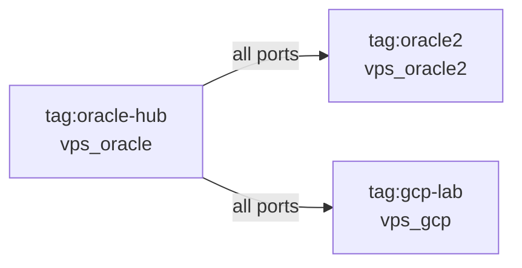
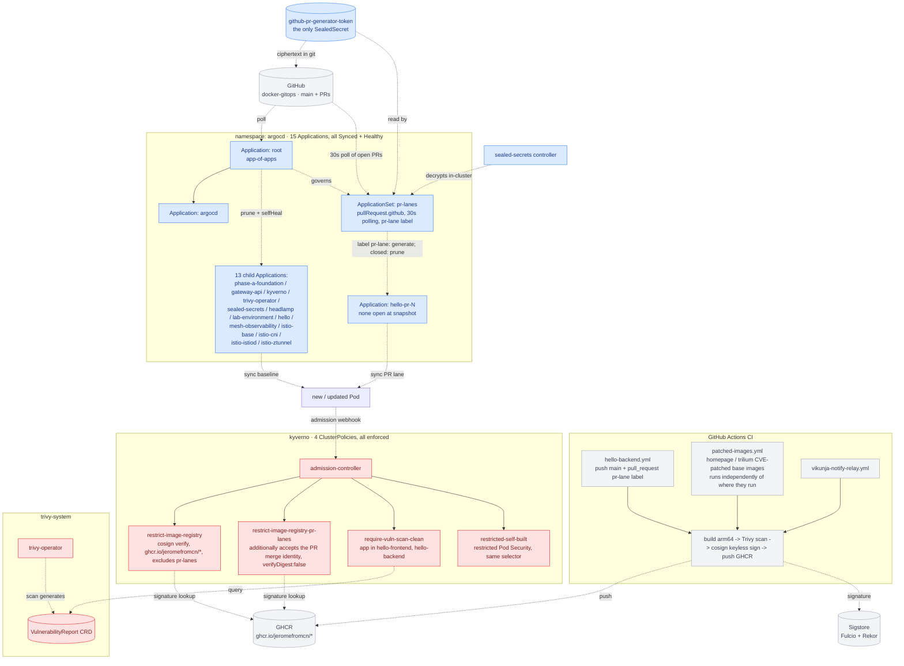
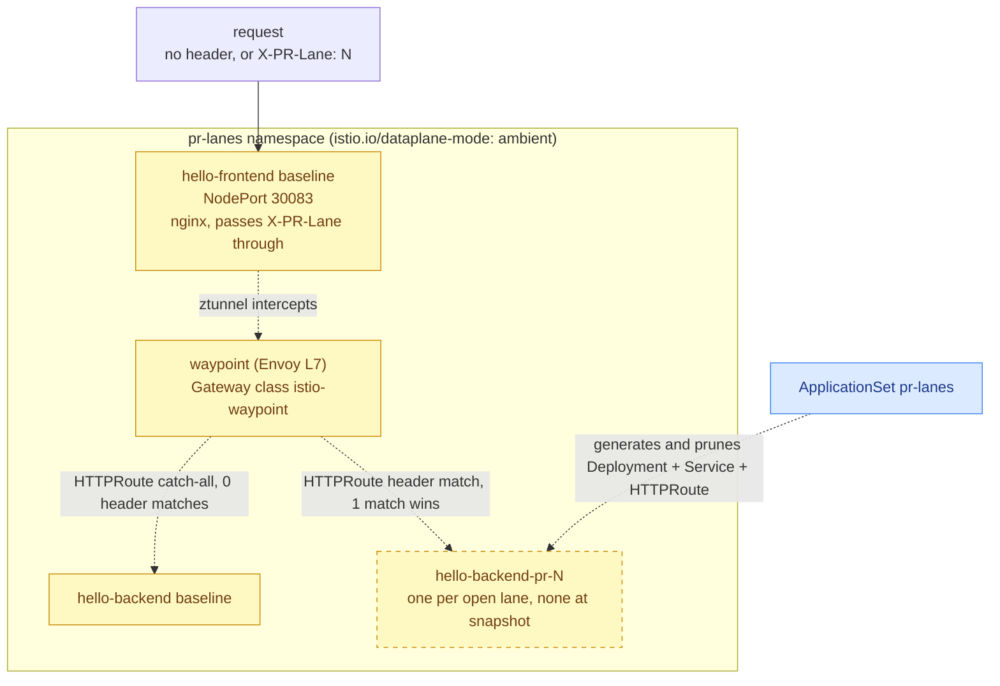
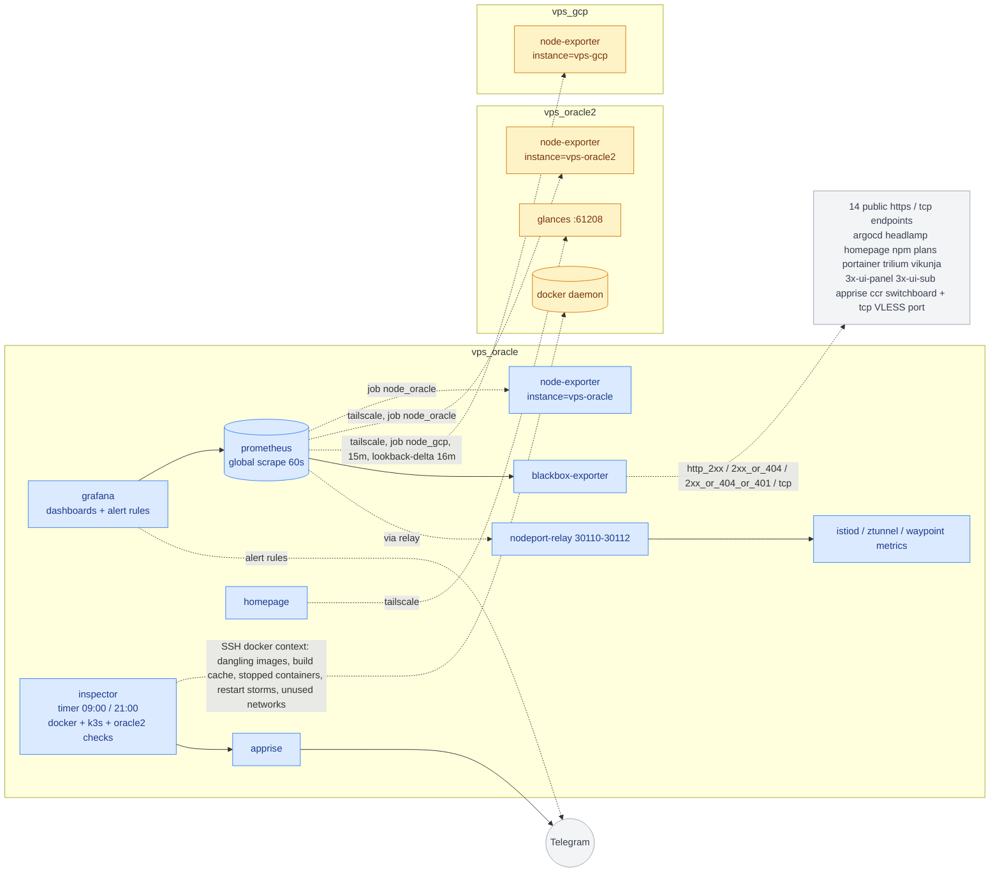

# Deployment topology v4

Records the deployment across **all three hosts** — `vps_oracle`, `vps_oracle2` and `vps_gcp` — as of **2026-09-19**. v1–v3 covered `vps_oracle` only; v4 is the first snapshot that spans the whole tailnet.

Data sources: this repo's compose files / k8s manifests / tofu / READMEs + live inspection of every host (`docker ps -a`, `docker network inspect`, `free`, `uptime`, `tailscale status`, `systemctl`, `kubectl get ns/pods/deploy/svc/application/applicationset/clusterpolicy/sealedsecret/resourcequota`, `docker exec npm` reading all 29 `/data/nginx/proxy_host/*.conf`, Prometheus `/api/v1/targets`). Full list at the end.

**Biggest structural changes from [v3](v3.md) (2026-08-19):**

1. **Two more hosts joined.** `vps_gcp` (GCP e2-micro, greenfield OpenTofu practice, from 2026-09-09) and `vps_oracle2` (a second, separate OCI tenancy, created 2026-09-18) now sit behind the same Tailscale mesh as `vps_oracle`. `vps_oracle` is the hub: it can reach both, neither can initiate anything back.
2. **dify left `vps_oracle`.** The 9-container stack moved to `vps_oracle2` on 2026-09-19; NPM on `vps_oracle` now forwards to oracle2's tailscale IP. The docker `proxy` network on `vps_oracle` lost those 9 containers.
3. **`lab-environment` is paused** (all 14 Deployments at 0 replicas since 2026-08-19, "to relieve host memory pressure"). v3 still drew it as running; its NPM records now point at NodePorts with no backends.
4. **New k3s namespace `mesh-observability`** (Loki + Jaeger + Promtail, phase K) and NodePort relays grew from 6 to 11.
5. **Monitoring and inspection became multi-host**: Prometheus scrapes all three hosts, the inspector also runs checks against oracle2's docker daemon over SSH, homepage shows oracle2 Glances cards.
6. **`plans` moved to `vps_gcp`, `gcp-verify` removed** (2026-09-19): the only workload on gcp is now a real (private) app, reached by NPM over the tailscale mesh.
7. Several things v3 never drew are now included because they exist: the shared data services (`minio` / `postgres` / `redis` + their UIs), the `love-bird-boss-dev` dev environment, and two stray test containers.

Two discrepancies between the repo and the live state were found while collecting this snapshot; see "Known issues".

## Host inventory

| | `vps_oracle` | `vps_oracle2` | `vps_gcp` |
|---|---|---|---|
| Provider | Oracle Cloud (OCI tenancy 1) | Oracle Cloud (OCI tenancy 2, `ap-singapore-1`) | GCP (`us-central1-a`) |
| Shape | Always Free Ampere A1, arm64, 4 cores / 23 GiB + 4 GiB swap | Always Free A1.Flex, arm64, 2 OCPU / 12 GiB + 4 GiB swap | e2-micro, 2 shared vCPU / ~1 GiB, no swap |
| Uptime at snapshot | 34 days | 21 hours (recreated 2026-09-18) | 9 days |
| Memory at snapshot | 12 GiB used, 11 GiB available; 971 MiB swap used | 2.1 GiB used, 9.6 GiB available | 461 MiB used, 492 MiB available |
| Tailscale IP | `100.84.203.73` (hub) | `100.100.140.33` (`tag:oracle2`) | `100.96.184.44` (`tag:gcp-lab`) |
| IaC | `tofu/`: brownfield import of the OCI network only (`destroy` is a red line) | `tofu/`: network imported, instance created by tofu (`destroy` allowed) | `tofu/`: full greenfield (VPC, firewall, instance, API enablement, budget alert) |
| Runs | 14 compose stacks running (15 defined), a single-node k3s cluster, 3 host-native services | 4 compose stacks | 3 compose stacks |
| Reached from the repo checkout | local | `docker --context oracle2` / `ssh vps-oracle2` | `docker --context gcp` / `ssh vps-gcp` |
| Public entry | 80/443 (NPM), VLESS port (3x-ui), 22 | 22 only | 22 only |
| Repo README | [vps_oracle/README.md](../../vps_oracle/README.md) | [vps_oracle2/README.md](../../vps_oracle2/README.md) | [vps_gcp/README.md](../../vps_gcp/README.md) |

The repo (and therefore every compose file for the two remote hosts) lives only on `vps_oracle`. Remote stacks are deployed through docker contexts over SSH; bind-mount paths resolve on the remote daemon, which is why oracle2's dify inlines its squid config as compose `configs: content:`.

## Diagram 1: cross-host panorama (three hosts, one tailnet)

```mermaid
flowchart TB
    Internet((Internet))
    VlessClient([VLESS client])
    Telegram(("Telegram"))
    GitHub[("GitHub + GHCR")]

    subgraph ORACLE["vps_oracle · OCI tenancy 1 · arm64 4C/23G · the hub, where this repo runs"]
        direction TB
        onpm["npm<br/>only 80/443 entry, 28 proxy records"]
        oxui["3x-ui<br/>VLESS+Reality, host port (VLESS)"]
        odockerapps["docker layer: 25 running containers<br/>(diagram 2)"]
        ok3s["k3s single-node cluster<br/>(diagrams 3-5)"]
        oprom[("prometheus + grafana + blackbox")]
        oinsp["inspector<br/>host-native, systemd timer 09:00/21:00"]
        oport["portainer"]
        ohome["homepage"]
        oapprise["apprise"]
        ohost["host-native: host-firewall, npm-nodeport-relay x11"]
        otofu["tofu/: OCI network only"]
    end

    subgraph ORACLE2["vps_oracle2 · OCI tenancy 2 · arm64 2C/12G · ports bound to tailscale IP only"]
        direction TB
        o2dify["dify x9 containers<br/>web :3000, api :5001, plugin-daemon :5002"]
        o2ne["node-exporter :9100"]
        o2gl["glances :61208"]
        o2pa["portainer-agent :9001"]
        o2tofu["tofu/: full control"]
    end

    subgraph GCP["vps_gcp · GCP e2-micro · x86_64 ~1G · ports bound to tailscale IP only"]
        direction TB
        gplans["plans nginx :8081<br/>private content"]
        gne["node-exporter :9100"]
        gpa["portainer-agent :9001"]
        gtofu["tofu/: greenfield lifecycle"]
    end

    Internet --> onpm
    VlessClient --> oxui

    onpm -."tailscale, default + 8 custom locations".-> o2dify
    onpm -."tailscale, plans.*".-> gplans

    oprom -."tailscale, scrape 60s, job node_oracle".-> o2ne
    oprom -."tailscale, scrape 15m, job node_gcp".-> gne
    ohome -."tailscale, 3 Monitor cards".-> o2gl
    oport -."agent :9001, endpoint registration not verified".-> o2pa
    oport -."agent :9001, endpoint registration not verified".-> gpa
    oinsp -."SSH docker context, 5 docker checks".-> ORACLE2

    oprom -."Grafana alert rules".-> Telegram
    oinsp --> oapprise
    oapprise --> Telegram
    otofu -."tofu apply".-> ORACLE
    o2tofu -."tofu apply, ~/.oci API key".-> ORACLE2
    gtofu -."tofu apply, SA key".-> GCP
    GitHub -."ArgoCD pull, CI push".-> ok3s

    classDef entry fill:#dcfce7,stroke:#16a34a,color:#14532d
    classDef hub fill:#dbeafe,stroke:#3b82f6,color:#1e3a8a
    classDef spoke fill:#fef3c7,stroke:#d97706,color:#78350f
    classDef k8s fill:#ede9fe,stroke:#7c3aed,color:#4c1d95
    classDef ext fill:#f3f4f6,stroke:#9ca3af,color:#374151

    class Internet,VlessClient entry
    class onpm,oxui,odockerapps,oprom,oinsp,oport,ohome,oapprise,ohost,otofu hub
    class ok3s k8s
    class o2dify,o2ne,o2gl,o2pa,o2tofu,gplans,gne,gpa,gtofu spoke
    class Telegram,GitHub ext
```

### Diagram 1 legend

| Color | Meaning |
|---|---|
| 🟩 green | external entry (Internet / VLESS client) |
| 🟦 blue | `vps_oracle` components (the hub) |
| 🟪 purple | the k3s cluster on `vps_oracle` |
| 🟨 amber | spoke hosts `vps_oracle2` / `vps_gcp` |
| ⬜ gray | external services |

### Tailnet ACL (from the root README; lives in the Tailscale admin console, not in git)

One direction only. Neither spoke can initiate anything toward the hub or toward each other, and a spoke must never be given `tag:oracle-hub`, or it would inherit the hub's reach. The OCI security lists (oracle2) and GCP firewall (gcp) allow only 22/TCP + ICMP from outside; everything else is tailscale-only.

## Diagram 2: `vps_oracle` docker layer (25 running containers, 10 networks)

```mermaid
flowchart TB
    Internet((Internet))
    VlessClient([VLESS client])

    subgraph HOST["vps_oracle host"]
        direction TB
        P80["host 80 / 443"]
        PVLESS["host VLESS port"]
        P8080["host 0.0.0.0:8080<br/>love-bird-boss-dev-backend"]
        DockerSock{{"/var/run/docker.sock"}}

        npm["npm<br/>static .3"]
        xui["3x-ui<br/>static .2"]

        subgraph ProxyNet["docker network: proxy (172.19.0.0/16, external bridge, 18 members)"]
            direction TB

            subgraph Panels["panels / gateways"]
                direction LR
                portainer["portainer"]
                grafana["grafana"]
                ccr["ccr<br/>Claude Code Router<br/>127.0.0.1:3456, :3458"]
                switchboard["switchboard"]
            end

            subgraph Apps["apps"]
                direction LR
                homepage["homepage v2.0.0"]
                trilium[("trilium v0.104.1")]
                vikunja[("vikunja 2.4.0")]
                vjrelay["vikunja-notify-relay"]
                apprise["apprise v1.5.1<br/>127.0.0.1:8000"]
            end

            subgraph DataUI["shared-resource consoles"]
                direction LR
                minio[("minio")]
                pgadmin["pgadmin4"]
                redisinsight["redisinsight"]
            end

            prometheus[("prometheus<br/>static .4")]

            subgraph BossDev["love-bird-boss-dev (project lives outside this repo)"]
                direction LR
                bossfe["frontend"]
                bossbe["backend"]
                bossbk["backup"]
            end
        end

        subgraph MonNet["monitoring_default"]
            direction LR
            nodeexp["node-exporter"]
            blackbox["blackbox-exporter<br/>also on monitoring_egress"]
        end

        subgraph PgNet["postgres_default"]
            postgres[("postgres 17")]
        end

        subgraph RedisNet["redis_default"]
            redis[("redis 7, ACL users")]
        end

        subgraph StrayNet["backup-e2e-test-net (leftover)"]
            stray1["jovial_brown<br/>boss-backup-test"]
            stray2["wizardly_torvalds<br/>boss-backup-test"]
        end
    end

    Internet --> P80 --> npm
    VlessClient --> PVLESS --> xui

    npm -."by container name".-> portainer
    npm -.-> grafana
    npm -.-> ccr
    npm -.-> switchboard
    npm -.-> homepage
    npm -.-> trilium
    npm -.-> vikunja
    npm -.-> apprise
    npm -.-> minio
    npm -.-> pgadmin
    npm -.-> redisinsight
    npm -.-> bossfe
    npm -.-> xui

    grafana --> prometheus
    prometheus --> nodeexp
    prometheus --> blackbox
    blackbox -."probes the public https URLs via monitoring_egress".-> Internet

    pgadmin --> postgres
    redisinsight --> redis
    bossbe --> postgres
    bossbk --> postgres
    bossbe --> redis
    bossfe --> bossbe
    P8080 -.-> bossbe

    vikunja -."webhook".-> vjrelay
    vjrelay -."forward".-> apprise

    portainer -."read-write, manages all docker containers on this host".-> DockerSock

    classDef entry fill:#dcfce7,stroke:#16a34a,color:#14532d
    classDef proxynet fill:#dbeafe,stroke:#3b82f6,color:#1e3a8a
    classDef internal fill:#f3f4f6,stroke:#9ca3af,color:#374151
    classDef data fill:#e0e7ff,stroke:#6366f1,color:#312e81
    classDef stray fill:#fef3c7,stroke:#d97706,color:#78350f,stroke-dasharray: 4 3

    class Internet,VlessClient entry
    class npm,xui,portainer,grafana,ccr,switchboard,homepage,trilium,vikunja,vjrelay,apprise,minio,pgadmin,redisinsight,prometheus,bossfe,bossbe,bossbk proxynet
    class nodeexp,blackbox internal
    class postgres,redis data
    class stray1,stray2 stray
```

### Diagram 2 legend

| Color | Meaning |
|---|---|
| 🟩 green | external entry |
| 🟦 blue | containers on the `proxy` network, reverse-proxied by NPM by container name |
| ⬜ gray | `monitoring_default` internal-only containers |
| 🟪 indigo | shared data stores (`postgres` / `redis`), on their own networks and **not** on `proxy`; only reachable by the consoles and by consumers that join those networks |
| 🟨 amber (dashed) | leftover test containers, no compose project, not in the repo |

## Diagram 3: `vps_oracle` k3s cluster: workloads, platform and the NPM addressing path

```mermaid
flowchart TB
    NPM["npm (docker container on proxy 172.19.0.0/16)"]
    HostFW["host-firewall.sh<br/>INPUT allow 172.19.0.0/16 -> 30000:32767"]
    Relay["nodeport-relay@PORT x11 (socat, host netns)<br/>30090 30092 30094 30095 30097 30098<br/>30110 30111 30112 30113 30114<br/>listens on the same port in the host netns, forwards to 127.0.0.1:same port"]

    subgraph K3S["k3s v1.36.2 · single node instance-20260321-2043 · Cilium 1.20.0 (kube-proxy replacement, socketLB.hostNamespaceOnly:true) · containerd 2.3.2"]
        direction TB

        subgraph NS_lab["lab-environment · PAUSED since 2026-08-19 · 14 Deployments at 0 replicas · quota 1.5C/3.5G req"]
            direction LR
            labgw["api-gateway 30097"]
            labconsul["consul 30092"]
            labgraf["grafana 30094"]
            labjaeger["jaeger 30095"]
            labprom["prometheus 30093, no NPM record"]
            labmcp["mcp-toolkit 30096, no NPM record"]
            labrest["customers / vets / visits / postgres / redis / loki / promtail / toxiproxy"]
        end

        subgraph NS_prl["pr-lanes · Istio Ambient · 4 pods"]
            direction LR
            frontend["hello-frontend 30083, no NPM record"]
            waypoint["waypoint (Envoy L7)<br/>metrics 30112"]
            backend["hello-backend"]
            canary["hello-backend-canary"]
        end

        subgraph NS_obs["mesh-observability · phase K · 3 pods"]
            direction LR
            loki[("loki 30113")]
            jaeger2["jaeger-query 30114"]
            promtail["promtail"]
        end

        subgraph NS_head["headlamp · 2 pods"]
            direction LR
            headlamp["headlamp 30098"]
            extprom["external-prometheus-proxy"]
        end

        subgraph NS_argo["argocd · 5 pods · v3.5.0"]
            argosrv["argocd-server 30090"]
        end

        subgraph NS_gov["governance"]
            direction LR
            kyverno["kyverno<br/>4 ClusterPolicies enforced"]
            trivy["trivy-system<br/>trivy-operator"]
            sealed["sealed-secrets<br/>1 SealedSecret"]
            istio["istio-system 1.30.3<br/>istiod 30110, ztunnel 30111"]
        end

        subgraph NS_sys["kube-system · 8 pods"]
            direction LR
            cilium["cilium + cilium-envoy"]
            cop["cilium-operator"]
            hubble["hubble-relay + hubble-ui"]
            core["coredns / metrics-server / local-path-provisioner"]
        end

        NS_empty["workloads: Active, empty<br/>inspector: Active, empty (quota only, reserved for the least-privilege inspector SA)"]
    end

    NPM -."10.0.0.95:PORT".-> HostFW
    HostFW --> Relay
    Relay -."connect() from host netns, socket-LB rewrites to the Pod".-> argosrv
    Relay -.-> headlamp
    Relay -.-> jaeger2
    Relay -.-> loki
    Relay -."backend has 0 replicas, so 502".-> labgw
    Relay -.-> labconsul
    Relay -.-> labgraf
    Relay -.-> labjaeger
    Relay -."metrics scrape by prometheus".-> istio
    Relay -.-> waypoint

    frontend -."ztunnel intercept, use-waypoint label".-> waypoint
    waypoint --> backend

    classDef proxynet fill:#dbeafe,stroke:#3b82f6,color:#1e3a8a
    classDef k8sapp fill:#ede9fe,stroke:#7c3aed,color:#4c1d95
    classDef paused fill:#f3f4f6,stroke:#9ca3af,color:#6b7280,stroke-dasharray: 4 3
    classDef platform fill:#ccfbf1,stroke:#0d9488,color:#134e4a
    classDef relay fill:#fce7f3,stroke:#db2777,color:#831843

    class NPM proxynet
    class HostFW,Relay relay
    class labgw,labconsul,labgraf,labjaeger,labprom,labmcp,labrest paused
    class frontend,waypoint,backend,canary,loki,jaeger2,promtail k8sapp
    class headlamp,extprom,argosrv,kyverno,trivy,sealed,istio,cilium,cop,hubble,core platform
```

### Diagram 3 legend

| Color | Meaning |
|---|---|
| 🟦 blue | NPM, the docker-side origin of the path |
| 🌸 pink | the host-firewall rule + NodePort relay that make NPM → k3s work (see the 2026-08-19 incident) |
| ⬜ gray (dashed) | `lab-environment`: defined and synced by ArgoCD, but every Deployment is scaled to 0 |
| 🟪 purple | live application workloads (`pr-lanes`, `mesh-observability`) |
| 🟩🟦 teal | platform components (argocd / headlamp / governance / kube-system) |

NodePorts at snapshot (14 Services, 15 ports): `30083` hello-frontend · `30090` argocd-server · `30092` consul · `30093` lab-prometheus · `30094` lab-grafana · `30095` lab-jaeger (+ `30512` zipkin) · `30096` mcp-toolkit · `30097` api-gateway · `30098` headlamp · `30110` istiod-metrics · `30111` ztunnel-metrics · `30112` waypoint-metrics · `30113` loki · `30114` mesh-observability jaeger-query.

## Diagram 4: k3s platform governance (GitOps + supply-chain security)

Unchanged in mechanism since v3; the deltas are `mesh-observability` joining the child Applications (13 children now, v3 had 12) and `lab-environment` still being synced but scaled to zero. Compose-hosted services (everything in diagrams 1 and 2, on all three hosts) are **not** part of this loop: they deploy by `docker compose up -d`, images either upstream, locally built, or the `ghcr.io/jeromefromcn/{homepage,trilium}` patched builds.

### Diagram 4 legend

| Color | Meaning |
|---|---|
| ⬜ gray | outside the cluster (GitHub / GHCR / Sigstore / CI) |
| 🟦 blue | GitOps chain (ArgoCD, ApplicationSet, Sealed Secrets) |
| 🟥 red | supply-chain security and admission control (Kyverno + Trivy Operator) |

## Diagram 5: PR preview lane traffic routing (unchanged since v3)

Full mechanism: [`docs/misc/2026-08-19-k3s-phase-fg-pr-lanes-summary.md`](../misc/2026-08-19-k3s-phase-fg-pr-lanes-summary.md). One `hello-backend-canary` Deployment also exists in `pr-lanes` at snapshot; its role was not investigated.

## Diagram 6: monitoring and inspection plane across the three hosts

Prometheus targets at snapshot: 23 active, all `up`. Jobs: `node_oracle` ×2 (vps-oracle, vps-oracle2), `node_gcp` ×1, `blackbox_http_2xx` ×8, `blackbox_http_2xx_or_404` ×2, `blackbox_http_2xx_or_404_or_401` ×3, `blackbox_tcp` ×1, `blackbox_exporter_self`, `grafana`, `prometheus`, and three mesh jobs (`istiod`, `ztunnel`, `waypoint`) through the relayed NodePorts. GCP is scraped every 15 minutes because its response bodies count against the 1 GB/month free-tier egress.

## NPM reverse-proxy records (29, live)

Grouped by where the upstream lives. This table is the authoritative inventory of what is publicly reachable via `*.jerome.cloudns.asia`.

| Upstream | Records (domain prefix → target) | State |
|---|---|---|
| docker `proxy` network, by container name | `portainer`, `grafana`, `trilium`, `vikunja`, `apprise`, `homepage`, `switchboard`, `ccr`, `minio`, `pgadmin`, `redisinsight`, `boss.dev` | live |
| NPM itself | `npm` → 127.0.0.1:81 | live |
| **vps_oracle2** over tailscale | `dify` → `100.100.140.33:3000`, plus 8 custom locations (`/console/api /api /v1 /files /mcp /triggers /openapi` → `:5001`, `/e/` → `:5002`) | live |
| **vps_gcp** over tailscale | `plans` → `100.96.184.44:8081` (moved here from the `proxy` network on 2026-09-19; access list `self-only`) | live |
| k3s NodePort, `10.0.0.95` | `argocd` 30090, `headlamp` 30098, `jaeger` 30114 (mesh-observability) | live |
| k3s NodePort, `lab-environment` | `consul.lab` 30092, `api.lab` 30097, `grafana.lab` 30094, `jaeger.lab` 30095 | **502: backends scaled to 0** |
| docker container that no longer exists | `ollama` → `open-webui:8080` | **dead: no `open-webui` container** |
| `172.19.0.1` (docker bridge gateway) | `www.pl` :8080, `prometheus.pl` :9090, `grafana.pl` :3001 | **dead orphans, unchanged since v2** |

## Section notes

### Entry layer
Same as v3: **npm** is the only container publishing 80/443, **3x-ui** publishes its VLESS port directly, sshd on 22. Nothing on oracle2 or gcp is published on a public interface: every `ports:` binding is `100.x.x.x:PORT`, and the cloud-side rules allow only 22. To expose a spoke service publicly, add an NPM record on `vps_oracle` that forwards to the spoke's tailscale IP (this is how dify and gcp-verify work).

### docker `proxy` network (172.19.0.0/16) on vps_oracle
Now 18 members. Shrank by the 9 dify containers (moved to oracle2), by `plans` (moved to vps_gcp) and by `evidence-os-website` and `cc-window` (all removed 2026-09-19); grew with `minio`, `pgadmin`, `redisinsight` and the three `love-bird-boss-dev` containers, which v3 did not draw. Static IPs are unchanged: `3x-ui` `.2`, `npm` `.3`, `prometheus` `.4`.

### Shared data services
`postgres` (17-alpine) and `redis` (7-alpine, ACL users) are deliberately **off** the `proxy` network, each on its own `<name>_default` network with its console (`pgadmin`, `redisinsight`) and, at snapshot, the `love-bird-boss-dev` backend as their only other members. `minio` is on `proxy` (console reached through NPM). dify does not use these: it carries its own `dify-db`, `dify-pgvector` and `dify-redis`.

### vps_oracle2
Everything here is deployed from `vps_oracle` with `docker --context oracle2`. The dify stack is 9 containers on two networks: `dify_default` (all nine) and `dify_ssrf_proxy_network` (api, worker, worker-beat, plugin-daemon, ssrf-proxy). Only web / api / plugin-daemon publish ports, bound to `100.100.140.33`. Egress from dify (model APIs, plugins, workflow HTTP nodes) now leaves from oracle2's public IP, not vps_oracle's. The three support stacks (`node-exporter`, `glances`, `portainer-agent`) are bound to the same tailscale IP.

### vps_gcp
A deliberately minimal practice node: `plans` (a static nginx site with private content, built on this host's docker daemon from the source checkout on vps_oracle via `docker --context gcp build` — no source or git credentials are stored on gcp), `node-exporter`, `portainer-agent`. With ~1 GiB and no swap it has ~490 MiB available; it is not a place to add real workloads. The former `gcp-verify` smoke-test stack and its NPM record were removed on 2026-09-19. Its IP is ephemeral (changes on `tofu destroy`/`apply`); the tailscale IP is what the rest of the fleet uses.

### k3s cluster
Only one node, so "cluster" here means one Cilium/Istio/ArgoCD control plane, not HA. 28 pods run: kube-system 8, argocd 5, mesh-observability 3, istio-system 3, pr-lanes 4, headlamp 2, kyverno 1, sealed-secrets 1, trivy-system 1. `lab-environment` and `workloads` run nothing. Resource quotas exist on `headlamp`, `inspector`, `lab-environment`, `mesh-observability` and `pr-lanes`.

### NPM → k3s addressing mechanism
Unchanged since the 2026-08-19 incident ([`docs/incidents/2026-08-19-npm-to-k3s-nodeport-outage.md`](../incidents/2026-08-19-npm-to-k3s-nodeport-outage.md)): Cilium `socketLB.hostNamespaceOnly:true` means docker-bridge containers can no longer reach NodePorts through socket-LB, so a host-netns `socat` relay per NodePort plus an `INPUT` allow rule for `172.19.0.0/16 → 30000:32767` bridge the gap. The relay set grew from 6 to 11 instances: the five new ones (30110–30114) serve Prometheus (mesh metrics) and Grafana/NPM (loki, jaeger-query), not only NPM. Adding a NodePort consumer on the docker side without a matching relay instance reproduces the black hole.

### Privileged mount (`/var/run/docker.sock`)
Still only `portainer` on vps_oracle, read-write. The two `portainer-agent` containers on oracle2 and gcp are, by design, the same class of privilege on those hosts (an agent has docker socket access); they are reachable only on the tailscale IP. Whether they are registered as endpoints in the vps_oracle portainer was not checked.

### `vps_oracle/host-native`
Three systemd-managed pieces, no containers: `host-firewall.service` (hand-written iptables, applied idempotently at boot; `netfilter-persistent` is disabled and `iptables-save` is a red line), `nodeport-relay@PORT.service` ×11, and `docker-gitops-inspector.timer` (twice daily). `tailscaled` and `k3s` are also native services.

### inspector
Now the single inspector for the whole fleet: it runs its own checks (docker + k3s + host hygiene, plus a direnv-trust check added 2026-09-13) and folds in `vps_oracle2/inspector-checks/` (5 docker checks executed against oracle2's daemon over SSH with a timeout wrapper). The report is grouped by instance and lists every inspected instance. Running the full test suite or `./inspect.sh` by hand sends real Telegram messages even under `DRY_RUN`.

## Known issues

- **`llm` stack is defined but not running.** `vps_oracle/compose/llm/` (llama-cpp + open-webui) exists in the repo and the root README lists it, but neither container exists on the host (not exited, simply absent), and NPM record `ollama.*` points at a non-existent `open-webui`. Why it stopped was not investigated.
- **`lab-environment` paused with live NPM records.** Four `*.lab.*` records return 502 by design of the pause; they are not cleaned up. Un-pausing is a git change to the replica counts (ArgoCD `selfHeal`), not a `kubectl scale`.
- **3 orphaned `*.pl.*` NPM records** to `172.19.0.1:3001/8080/9090`, unchanged since v2, backends long gone.
- **`love-bird-boss-dev`** is a compose project outside this repo (`/home/ubuntu/bridget/love-bird-boss`), and its backend publishes `0.0.0.0:8080`. Whether the host firewall / OCI security list blocks that externally was not verified.
- **Two leftover test containers** (`jovial_brown`, `wizardly_torvalds`, image `boss-backup-test`, network `backup-e2e-test-net`), created 2026-08-28, no compose project, still running.
- **Portainer endpoint registration** for the two remote agents was not verified.

## Major changes vs v3 (2026-08-19)

- **Fleet grew from 1 to 3 hosts.** `vps_gcp` (greenfield tofu, 2026-09-09→13) and `vps_oracle2` (second OCI tenancy, adopted then recreated with a public IP on 2026-09-18) joined a Tailscale mesh (2026-09-13 for gcp, 2026-09-19 for oracle2) with a one-directional hub ACL.
- **dify moved vps_oracle → vps_oracle2** (2026-09-19), NPM host 24 re-pointed at the tailscale IP; squid config inlined into the compose file because bind mounts would resolve on oracle2.
- **`evidence-os-website` and `cc-window` removed** (2026-09-19).
- **`plans` moved vps_oracle → vps_gcp** (2026-09-19) because its content is sensitive and gcp accepts no public ingress; NPM host 31 re-pointed at `100.96.184.44:8081`. **`gcp-verify` removed** (container, image, repo stack and NPM record).
- **`lab-environment` paused** (2026-08-19, memory pressure). v3 drew it as running.
- **`mesh-observability` namespace added** (2026-08-24, phase K: Loki + Jaeger + Promtail), with the follow-on mesh phases I–L complete.
- **Cross-host monitoring**: `node_oracle` job extended to oracle2, new `node_gcp` job at 15 minutes (with Prometheus `lookback-delta` raised to 16m), host names as `instance` labels, node-exporter `hostname` pinned so Nodename dropdowns are distinct, alert templates show the instance name.
- **Cross-host operations**: `portainer-agent` on both spokes, Glances on oracle2 feeding a top "Monitor" group on homepage, inspector extended to oracle2 over SSH and reporting per instance.
- **OpenTofu** introduced for all three hosts (`vps_oracle` network import, `vps_gcp` greenfield, `vps_oracle2` full control) with CI fmt/validate and a `tofu-conventions.md` rule.
- **NodePort relays 6 → 11**; **NPM records 24 → 28**.
- **Repo-level guardrails**: compose-convention checker (CI + PostToolUse hook), inspector check/test pairing enforced in CI, documentation language convention (English), and `docs/deployment-topology/` renamed from `container-topology/` because the snapshots now span k3s, NPM and three hosts.

## Data sources

- repo: `vps_oracle/compose/*/docker-compose.yml`, `vps_oracle/k3s/**`, `vps_oracle/host-native/*/README.md`, `vps_oracle2/README.md` and `compose/*`, `vps_oracle2/tofu/README.md`, `vps_gcp/README.md` and `compose/*`, `vps_oracle/compose/monitoring/prometheus/prometheus.yml`, root `README.md` (tailnet ACL), `CLAUDE.local.md`, `git log --since=2026-08-19`
- live, 2026-09-19: on each of the three hosts `hostname`, `uptime`, `free -h`, `docker ps`, `docker network ls`, `tailscale ip`; on `vps_oracle` additionally `docker ps -a` (+ compose labels), `docker network inspect` for every network, `docker inspect` of the two stray containers, `systemctl list-units`, `ss -ltn`, `tailscale status`, `kubectl get ns/pods/deploy/sts/svc/application/applicationset/gateway/clusterpolicy/sealedsecret/resourcequota/nodes`, `docker exec npm` over all `/data/nginx/proxy_host/*.conf`, Prometheus `/api/v1/targets`; on `vps_oracle2` `docker network inspect` for the dify networks
- earlier snapshots: [v3](v3.md) for the k3s governance and PR-lane diagrams, carried forward and updated
