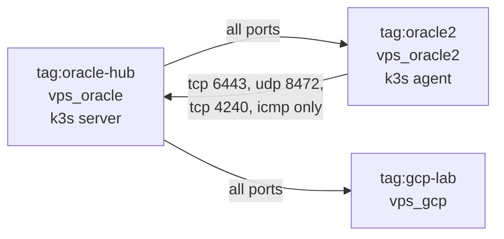
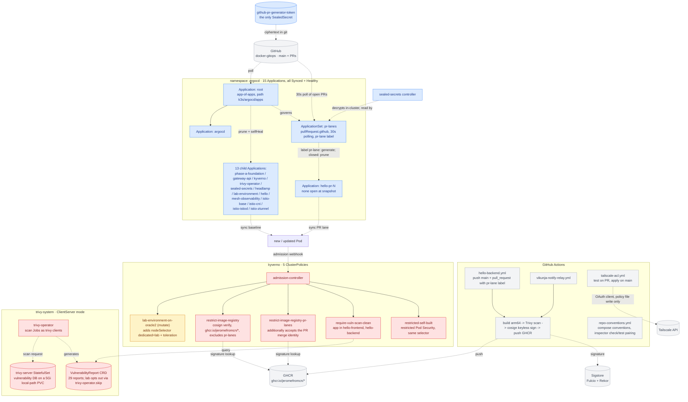
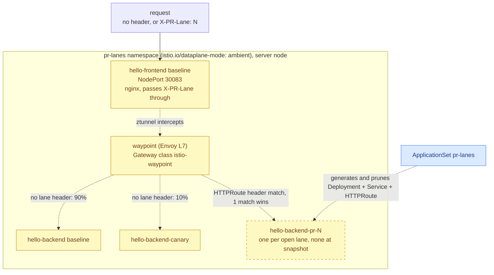

# Deployment topology v5

Records the deployment across the three hosts — `vps_oracle`, `vps_oracle2` and `vps_gcp` — as of **2026-09-24**. The k3s cluster spans two of them: its server runs on `vps_oracle` and `vps_oracle2` is a tainted agent node that runs `lab-environment`.

Data sources: this repo's compose files / k8s manifests / tofu / tailscale policy / READMEs + live inspection of every host (`docker ps`, `docker network ls`, `free`, `uptime`, `df`, `tailscale ip`, `systemctl`, `kubectl get nodes/ns/pods/svc/pv/resourcequota/clusterpolicy/sealedsecret/vulnerabilityreport`, `kubectl top nodes`, `docker exec npm` reading all 24 `/data/nginx/proxy_host/*.conf`, Prometheus `/api/v1/targets`). Full list at the end.

## Host inventory

| | `vps_oracle` | `vps_oracle2` | `vps_gcp` |
|---|---|---|---|
| Provider | Oracle Cloud (OCI tenancy 1) | Oracle Cloud (OCI tenancy 2, `ap-singapore-1`) | GCP (`us-central1-a`) |
| Shape | Always Free Ampere A1, arm64, 4 cores / 23 GiB + 4 GiB swap | Always Free A1.Flex, arm64, 2 OCPU / 12 GiB + 4 GiB swap | e2-micro, 2 shared vCPU / ~1 GiB, no swap |
| Uptime at snapshot | 5 weeks | 6 days | 2 weeks |
| Memory at snapshot | 12 GiB used, 11 GiB available; 768 MiB swap used | 4.2 GiB used, 7.4 GiB available | 547 MiB used, 405 MiB available |
| Root disk | 83 G / 193 G | 21 G / 193 G | 5.1 G / 29 G |
| Tailscale IP / tag | `100.84.203.73` / `tag:oracle-hub` | `100.100.140.33` / `tag:oracle2` | `100.96.184.44` / `tag:gcp-lab` |
| IaC | `tofu/`: brownfield import of the OCI network only (`destroy` is a red line) | `tofu/`: network imported, instance created by tofu (`destroy` allowed) | `tofu/`: full greenfield (VPC, firewall, instance, API enablement, budget alert) |
| Runs | 13 compose stacks + 1 compose project outside the repo, k3s **server** node, 3 host-native services | 4 compose stacks, k3s **agent** node | 4 compose stacks |
| Reached from the repo checkout | local | `docker --context oracle2` / `ssh vps-oracle2` / k3s API | `docker --context gcp` / `ssh vps-gcp` |
| Public entry | 80/443 (NPM), VLESS port (3x-ui), 22 | 22 only | 22 only |
| Repo README | [vps_oracle/README.md](../../vps_oracle/README.md) | [vps_oracle2/README.md](../../vps_oracle2/README.md) | [vps_gcp/README.md](../../vps_gcp/README.md) |

The repo lives only on `vps_oracle`; nothing is cloned onto the other two hosts. Remote compose stacks are deployed through docker contexts over SSH (bind-mount paths resolve on the remote daemon, `.env` is read locally). The k3s agent on oracle2 is installed and reconciled by [`k3s/install/agent-vps-oracle2/install.sh`](../../k3s/install/agent-vps-oracle2/install.sh), run on vps_oracle over SSH. Components spanning hosts sit at the repo root: [`k3s/`](../../k3s/README.md) and [`tailscale/`](../../tailscale/README.md).

## Diagram 1: cross-host panorama

```mermaid
flowchart TB
    Internet((Internet))
    VlessClient([VLESS client])
    Telegram(("Telegram"))
    GitHub[("GitHub + GHCR<br/>+ Tailscale API")]

    subgraph ORACLE["vps_oracle · OCI tenancy 1 · arm64 4C/23G · the hub, where this repo runs"]
        direction TB
        onpm["npm<br/>only 80/443 entry, 24 proxy records"]
        oxui["3x-ui<br/>VLESS+Reality, host port"]
        odockerapps["docker layer: 22 running containers<br/>(diagram 2)"]
        ok3ss["k3s server node<br/>control plane + all management components<br/>(diagrams 3-5)"]
        oprom[("prometheus + grafana + blackbox")]
        oinsp["inspector<br/>host-native, systemd timer 09:00/21:00"]
        oport["portainer"]
        ohome["homepage"]
        oapprise["apprise"]
        ohost["host-native: host-firewall, npm-nodeport-relay x11"]
        otofu["tofu/: OCI network only"]
    end

    subgraph ORACLE2["vps_oracle2 · OCI tenancy 2 · arm64 2C/12G · ports bound to tailscale IP only"]
        direction TB
        o2agent["k3s agent node<br/>taint dedicated=lab:NoSchedule<br/>lab-environment x14 pods"]
        o2dify["dify x9 containers<br/>web :3000, api :5001, plugin-daemon :5002"]
        o2ne["node-exporter :9100"]
        o2gl["glances :61208"]
        o2pa["portainer-agent :9001"]
        o2tofu["tofu/: full control"]
    end

    subgraph GCP["vps_gcp · GCP e2-micro · x86_64 ~1G · ports bound to tailscale IP only"]
        direction TB
        gplans["plans nginx :8081<br/>private content"]
        gne["node-exporter :9100"]
        ggl["glances :61208"]
        gpa["portainer-agent :9001"]
        gtofu["tofu/: greenfield lifecycle"]
    end

    Internet --> onpm
    VlessClient --> oxui

    onpm -."tailscale, default + 8 custom locations".-> o2dify
    onpm -."tailscale, plans.*".-> gplans
    onpm -."NodePort relay, *.lab.*".-> ok3ss

    o2agent -."joins: k3s API 6443, Cilium VXLAN 8472, health 4240<br/>inside tailscale WireGuard".-> ok3ss

    oprom -."tailscale, node_oracle job, kubelet + lab API probes".-> ORACLE2
    oprom -."tailscale, scrape 15m, job node_gcp".-> gne
    ohome -."tailscale, CPU/Memory/Disk cards".-> o2gl
    ohome -."tailscale, CPU/Memory/Disk cards".-> ggl
    oport -."agent :9001".-> o2pa
    oport -."agent :9001".-> gpa
    oinsp -."SSH: docker + k3s containerd checks".-> ORACLE2
    oinsp -."SSH: docker checks".-> GCP

    oprom -."Grafana alert rules".-> Telegram
    oinsp --> oapprise
    oapprise --> Telegram
    otofu -."tofu apply".-> ORACLE
    o2tofu -."tofu apply, ~/.oci API key".-> ORACLE2
    gtofu -."tofu apply, SA key".-> GCP
    GitHub -."ArgoCD pull, CI push".-> ok3ss

    classDef entry fill:#dcfce7,stroke:#16a34a,color:#14532d
    classDef hub fill:#dbeafe,stroke:#3b82f6,color:#1e3a8a
    classDef spoke fill:#fef3c7,stroke:#d97706,color:#78350f
    classDef k8s fill:#ede9fe,stroke:#7c3aed,color:#4c1d95
    classDef ext fill:#f3f4f6,stroke:#9ca3af,color:#374151

    class Internet,VlessClient entry
    class onpm,oxui,odockerapps,oprom,oinsp,oport,ohome,oapprise,ohost,otofu hub
    class ok3ss,o2agent k8s
    class o2dify,o2ne,o2gl,o2pa,o2tofu,gplans,gne,ggl,gpa,gtofu spoke
    class Telegram,GitHub ext
```

### Diagram 1 legend

| Color | Meaning |
|---|---|
| 🟩 green | external entry (Internet / VLESS client) |
| 🟦 blue | `vps_oracle` components (the hub) |
| 🟪 purple | the k3s cluster, whose two nodes sit on two hosts |
| 🟨 amber | spoke-host components on `vps_oracle2` / `vps_gcp` |
| ⬜ gray | external services |

### Tailnet ACL

The policy is GitOps-managed in [`tailscale/policy.hujson`](../../tailscale/policy.hujson): the `tailscale-acl` workflow runs its `tests` on pull requests and applies it on push to `main`, authenticating with an OAuth client scoped to policy-file writes only. Console edits are overwritten on the next apply.

The hub reaches both spokes on every port. The only traffic a spoke may initiate is oracle2's k3s agent traffic to the hub: the API server (6443), Cilium VXLAN (8472) and Cilium health (4240). The policy's `tests` pin both sides: those ports accepted; 22/80/443/9090/10250 and DNS on the hub denied to oracle2; everything from gcp denied. gcp and oracle2 cannot reach each other. A spoke must never be given `tag:oracle-hub`, or it would inherit the hub's reach. From outside the tailnet, the OCI security lists (oracle2) and GCP firewall (gcp) allow only 22/TCP + ICMP.

## Diagram 2: `vps_oracle` docker layer (22 running containers, 6 networks)

```mermaid
flowchart TB
    Internet((Internet))
    VlessClient([VLESS client])

    subgraph HOST["vps_oracle host"]
        direction TB
        P80["host 80 / 443"]
        PVLESS["host VLESS port"]
        P8080["host 0.0.0.0:8080<br/>love-bird-boss-dev-backend"]
        DockerSock{{"/var/run/docker.sock"}}

        npm["npm 2.15.1<br/>static .3"]
        xui["3x-ui<br/>static .2"]

        subgraph ProxyNet["docker network: proxy (172.19.0.0/16, external bridge)"]
            direction TB

            subgraph Panels["panels / gateways"]
                direction LR
                portainer["portainer"]
                grafana["grafana"]
                ccr["ccr<br/>Claude Code Router<br/>127.0.0.1:3456, :3458"]
                switchboard["switchboard<br/>CC provider / account toggles"]
            end

            subgraph Apps["apps"]
                direction LR
                homepage["homepage v2.0.0"]
                trilium[("trilium v0.104.1")]
                vikunja[("vikunja 2.4.0")]
                vjrelay["vikunja-notify-relay"]
                apprise["apprise v1.5.1<br/>127.0.0.1:8000"]
            end

            subgraph DataUI["shared-resource consoles"]
                direction LR
                minio[("minio")]
                pgadmin["pgadmin4 8.14"]
                redisinsight["redisinsight"]
            end

            prometheus[("prometheus<br/>static .4")]

            subgraph BossDev["love-bird-boss-dev (project lives outside this repo)"]
                direction LR
                bossfe["frontend"]
                bossbe["backend"]
                bossbk["backup"]
            end
        end

        subgraph MonNet["monitoring_default"]
            direction LR
            nodeexp["node-exporter"]
            blackbox["blackbox-exporter<br/>also on monitoring_egress"]
        end

        subgraph PgNet["postgres_default"]
            postgres[("postgres 17")]
        end

        subgraph RedisNet["redis_default"]
            redis[("redis 7, ACL users")]
        end
    end

    Internet --> P80 --> npm
    VlessClient --> PVLESS --> xui

    npm -."by container name".-> portainer
    npm -.-> grafana
    npm -.-> ccr
    npm -.-> switchboard
    npm -.-> homepage
    npm -.-> trilium
    npm -.-> vikunja
    npm -.-> apprise
    npm -.-> minio
    npm -.-> pgadmin
    npm -.-> redisinsight
    npm -.-> bossfe
    npm -.-> xui

    grafana --> prometheus
    prometheus --> nodeexp
    prometheus --> blackbox
    blackbox -."probes public URLs and tailscale targets via monitoring_egress".-> Internet

    pgadmin --> postgres
    redisinsight --> redis
    bossbe --> postgres
    bossbk --> postgres
    bossbe --> redis
    bossfe --> bossbe
    P8080 -.-> bossbe

    vikunja -."webhook".-> vjrelay
    vjrelay -."forward".-> apprise

    portainer -."read-write, manages all docker containers on this host".-> DockerSock

    classDef entry fill:#dcfce7,stroke:#16a34a,color:#14532d
    classDef proxynet fill:#dbeafe,stroke:#3b82f6,color:#1e3a8a
    classDef internal fill:#f3f4f6,stroke:#9ca3af,color:#374151
    classDef data fill:#e0e7ff,stroke:#6366f1,color:#312e81

    class Internet,VlessClient entry
    class npm,xui,portainer,grafana,ccr,switchboard,homepage,trilium,vikunja,vjrelay,apprise,minio,pgadmin,redisinsight,prometheus,bossfe,bossbe,bossbk proxynet
    class nodeexp,blackbox internal
    class postgres,redis data
```

### Diagram 2 legend

| Color | Meaning |
|---|---|
| 🟩 green | external entry |
| 🟦 blue | containers on the `proxy` network, reverse-proxied by NPM by container name |
| ⬜ gray | `monitoring_default` internal-only containers |
| 🟪 indigo | shared data stores (`postgres` / `redis`), on their own networks and **not** on `proxy`; only reachable by the consoles and by consumers that join those networks |

## Diagram 3: k3s cluster: two nodes, placement and the NPM addressing path

```mermaid
flowchart TB
    NPM["npm (docker container on proxy 172.19.0.0/16)"]
    HostFW["host-firewall.sh<br/>INPUT allow 172.19.0.0/16 -> 30000:32767"]
    Relay["nodeport-relay@PORT x11 (socat, host netns)<br/>30090 30092 30094 30095 30097 30098<br/>30110 30111 30112 30113 30114"]

    subgraph K3S["k3s v1.36.2 · Cilium 1.20.0 (kube-proxy replacement, VXLAN over tailscale, pod MTU 1230) · Istio 1.30.3 ambient · ArgoCD v3.5.0"]
        direction TB

        subgraph N1["node instance-20260321-2043 · vps_oracle · server · node-ip 100.84.203.73 · no taint"]
            direction TB

            subgraph NS_argo["argocd · 5 pods"]
                argosrv["argocd-server 30090"]
            end

            subgraph NS_prl["pr-lanes · Istio Ambient · 4 pods"]
                direction LR
                frontend["hello-frontend 30083, no NPM record"]
                waypoint["waypoint (Envoy L7)<br/>metrics 30112"]
                backend["hello-backend"]
                canary["hello-backend-canary"]
            end

            subgraph NS_obs["mesh-observability · 3 pods"]
                direction LR
                loki[("loki 30113")]
                jaeger2["jaeger-query 30114"]
                promtail["promtail"]
            end

            headlamp["headlamp · 1 pod · 30098"]

            subgraph NS_gov["governance"]
                direction LR
                kyverno["kyverno · 2 pods<br/>5 ClusterPolicies"]
                trivy["trivy-system<br/>trivy-operator + trivy-server"]
                sealed["sealed-secrets<br/>1 SealedSecret"]
                istiod["istiod 30110"]
            end

            subgraph NS_sys1["per-node + cluster services"]
                direction LR
                cilium1["cilium + cilium-envoy"]
                zt1["ztunnel 30111 + istio-cni"]
                core["cilium-operator / hubble / coredns /<br/>metrics-server / local-path-provisioner"]
            end
        end

        subgraph N2["node vps-oracle2 · agent · node-ip 100.100.140.33 · taint dedicated=lab:NoSchedule"]
            direction TB

            subgraph NS_lab["lab-environment · 14 pods · quota 1.5C/3.5Gi req, 5C/4.25Gi lim"]
                direction LR
                labgw["api-gateway 30097"]
                labconsul["consul 30092"]
                labgraf["grafana 30094"]
                labjaeger["jaeger 30095"]
                labprom["prometheus 30093, no NPM record"]
                labmcp["mcp-toolkit 30096, no NPM record"]
                labsvc["customers / vets / visits<br/>Spring Boot, startup + readiness probes"]
                labdata[("postgres + consul data<br/>static local PVs, Retain")]
                labrest["redis / loki / promtail / toxiproxy"]
            end

            subgraph NS_sys2["per-node DaemonSets"]
                direction LR
                cilium2["cilium + cilium-envoy"]
                zt2["ztunnel + istio-cni"]
            end
        end
    end

    NPM -."10.0.0.95:PORT".-> HostFW
    HostFW --> Relay
    Relay -."connect() from host netns, socket-LB rewrites to the Pod".-> argosrv
    Relay -.-> headlamp
    Relay -.-> jaeger2
    Relay -.-> loki
    Relay -."metrics scrape by prometheus".-> istiod
    Relay -.-> zt1
    Relay -.-> waypoint
    Relay -."Pod IP on oracle2: VXLAN inside tailscale".-> labgw
    Relay -.-> labconsul
    Relay -.-> labgraf
    Relay -.-> labjaeger

    frontend -."ztunnel intercept, use-waypoint label".-> waypoint
    waypoint --> backend
    waypoint --> canary

    classDef proxynet fill:#dbeafe,stroke:#3b82f6,color:#1e3a8a
    classDef k8sapp fill:#ede9fe,stroke:#7c3aed,color:#4c1d95
    classDef lab fill:#fef3c7,stroke:#d97706,color:#78350f
    classDef platform fill:#ccfbf1,stroke:#0d9488,color:#134e4a
    classDef relay fill:#fce7f3,stroke:#db2777,color:#831843

    class NPM proxynet
    class HostFW,Relay relay
    class labgw,labconsul,labgraf,labjaeger,labprom,labmcp,labsvc,labdata,labrest lab
    class frontend,waypoint,backend,canary,loki,jaeger2,promtail k8sapp
    class headlamp,argosrv,kyverno,trivy,sealed,istiod,cilium1,zt1,core,cilium2,zt2 platform
```

### Diagram 3 legend

| Color | Meaning |
|---|---|
| 🟦 blue | NPM, the docker-side origin of the path |
| 🌸 pink | the host-firewall rule + NodePort relay that make NPM → k3s work |
| 🟨 amber | `lab-environment`, the only workload on the agent node |
| 🟪 purple | application workloads on the server node (`pr-lanes`, `mesh-observability`) |
| 🟩🟦 teal | platform components (argocd / headlamp / governance / per-node networking) |

Pods at snapshot: 47. Server node: kube-system 8, argocd 5, pr-lanes 4, istio-system 3, mesh-observability 3, kyverno 2, trivy-system 2, headlamp 1, sealed-secrets 1. Agent node: lab-environment 14, plus the four per-node DaemonSet pods (cilium, cilium-envoy, istio-cni, ztunnel).

NodePorts at snapshot (14 Services, 15 ports): `30083` hello-frontend · `30090` argocd-server · `30092` consul · `30093` lab-prometheus · `30094` lab-grafana · `30095` lab-jaeger (+ `30512` zipkin) · `30096` mcp-toolkit · `30097` api-gateway · `30098` headlamp · `30110` istiod-metrics · `30111` ztunnel-metrics · `30112` waypoint-metrics · `30113` loki · `30114` mesh-observability jaeger-query. NodePorts are open on both nodes; everything on the docker side targets `10.0.0.95` (vps_oracle's VCN address), and Cilium forwards to the Pod wherever it runs.

## Diagram 4: k3s platform governance (GitOps + supply-chain security)

Compose-hosted services (diagrams 1 and 2, on all three hosts) are **not** part of this loop: they deploy by `docker compose up -d`, with images either upstream or built locally. The `lab-environment` images (`ops-lab/*`) are also built locally, with no registry: `build.sh` on vps_oracle, then `docker save | ssh vps-oracle2 'k3s ctr images import'`; the pods use `imagePullPolicy: IfNotPresent`.

### Diagram 4 legend

| Color | Meaning |
|---|---|
| ⬜ gray | outside the cluster (GitHub / GHCR / Sigstore / Tailscale API / CI) |
| 🟦 blue | GitOps chain (ArgoCD, ApplicationSet, Sealed Secrets) |
| 🟥 red | supply-chain security and admission control (Kyverno validate policies + Trivy) |
| 🟨 amber | scheduling placement (Kyverno mutate policy that pins lab onto the agent node) |

## Diagram 5: PR preview lane traffic routing

A request carrying `X-PR-Lane: N` for a lane that exists goes to `hello-backend-pr-N`; any other request falls through to the baseline service, which the canary split sends 90/10 between `hello-backend` and `hello-backend-canary`. The whole pipeline (labelled PR → CI build/scan/sign on the head SHA → lane generated → header routing → lane pruned on close) was exercised end to end on 2026-09-24. Mechanism: [`docs/misc/2026-08-19-k3s-phase-fg-pr-lanes-summary.md`](../misc/2026-08-19-k3s-phase-fg-pr-lanes-summary.md) and the "Istio Ambient / PR Lanes" section of [`k3s/README.md`](../../k3s/README.md).

## Diagram 6: monitoring and inspection plane

```mermaid
flowchart TD
    subgraph ORACLE["vps_oracle"]
        direction TB
        prom[("prometheus<br/>global scrape 60s")]
        graf["grafana<br/>37 alert rules"]
        bb["blackbox-exporter"]
        one["node-exporter<br/>instance=vps-oracle"]
        insp["inspector<br/>timer 09:00 / 21:00"]
        apprise["apprise"]
        home["homepage"]
        relay["nodeport-relay 30110-30112"]
        k3sm["istiod / ztunnel / waypoint metrics"]
        kapi["k3s API<br/>read-only inspector SA"]
    end

    subgraph O2["vps_oracle2"]
        o2ne["node-exporter<br/>instance=vps-oracle2"]
        o2gl["glances :61208"]
        o2docker[("docker daemon")]
        o2ctr[("k3s containerd")]
        o2kubelet["kubelet :10250"]
        o2lab["lab api-gateway<br/>NodePort 30097"]
    end

    subgraph G["vps_gcp"]
        gne["node-exporter<br/>instance=vps-gcp"]
        ggl["glances :61208"]
        gdocker[("docker daemon")]
    end

    Web["public https / tcp endpoints<br/>argocd headlamp homepage npm plans portainer trilium vikunja<br/>3x-ui-panel 3x-ui-sub apprise ccr switchboard + tcp VLESS port"]
    TG(("Telegram"))

    prom -."job node_oracle".-> one
    prom -."tailscale, job node_oracle".-> o2ne
    prom -."tailscale, job node_gcp, 15m, lookback-delta 16m".-> gne
    prom --> bb
    bb -."http_2xx / 2xx_or_404 / 2xx_or_404_or_401 / tcp".-> Web
    bb -."tailscale, tcp: node liveness".-> o2kubelet
    bb -."tailscale, http_2xx: /api/vet/vets end to end".-> o2lab
    prom -."via relay".-> relay
    relay --> k3sm
    graf --> prom
    graf -."alert rules".-> TG

    insp -."docker + k3s + host checks".-> kapi
    insp -."SSH: docker hygiene + containerd image prune, ops-lab protected".-> o2docker
    insp -.-> o2ctr
    insp -."SSH: docker hygiene".-> gdocker
    insp --> apprise
    apprise --> TG
    home -."tailscale".-> o2gl
    home -."tailscale".-> ggl

    classDef hub fill:#dbeafe,stroke:#3b82f6,color:#1e3a8a
    classDef spoke fill:#fef3c7,stroke:#d97706,color:#78350f
    classDef ext fill:#f3f4f6,stroke:#9ca3af,color:#374151
    class prom,graf,bb,one,insp,apprise,home,relay,k3sm,kapi hub
    class o2ne,o2gl,o2docker,o2ctr,o2kubelet,o2lab,gne,ggl,gdocker spoke
    class Web,TG ext
```

Prometheus targets at snapshot: 25 active, all `up`. Jobs: `node_oracle` ×2 (vps-oracle, vps-oracle2), `node_gcp` ×1, `blackbox_http_2xx` ×9 (including the lab API end-to-end probe), `blackbox_http_2xx_or_404` ×2, `blackbox_http_2xx_or_404_or_401` ×3, `blackbox_tcp` ×2 (VLESS port, oracle2 kubelet), `blackbox_exporter_self`, `grafana`, `prometheus`, and three mesh jobs (`istiod`, `ztunnel`, `waypoint`) through the relayed NodePorts. GCP is scraped every 15 minutes because its response bodies count against the 1 GB/month free-tier egress.

Grafana carries 37 alert rules (17 host metrics, 16 service probes, 4 self-monitoring). The two added for the agent node are `vps-oracle2 k3s Kubelet Down` (critical, 3m), which catches a dead k3s-agent that node_exporter alone would not, and `Lab API Down` (warning, 5m).

The inspector runs 19 local checks plus every `<host>/inspector-checks/checks/*.sh` it finds: 6 against oracle2 (5 docker hygiene + containerd image pruning that never touches `ops-lab/*`, the only copy of those local builds on that node) and 5 against gcp. `k3s-node-not-ready` flags any node whose Ready condition is not True. The report is grouped by instance.

## NPM reverse-proxy records (24, live)

Grouped by where the upstream lives. This table is the inventory of what is publicly reachable via `*.jerome.cloudns.asia`.

| Upstream | Records (domain prefix → target) | State |
|---|---|---|
| docker `proxy` network, by container name | `portainer`, `grafana`, `trilium`, `vikunja`, `apprise`, `homepage`, `switchboard`, `ccr`, `minio`, `pgadmin`, `redisinsight`, `boss.dev`, `panel.3x`, `sub.3x` | live |
| NPM itself | `npm` → 127.0.0.1:81 | live |
| **vps_oracle2** docker, over tailscale | `dify` → `100.100.140.33:3000`, plus 8 custom locations (`/console/api /api /v1 /files /mcp /triggers /openapi` → `:5001`, `/e/` → `:5002`) | live |
| **vps_gcp** over tailscale | `plans` → `100.96.184.44:8081` (access list `self-only`) | live |
| k3s NodePort on `10.0.0.95`, Pod on the server node | `argocd` 30090, `headlamp` 30098, `jaeger` 30114 (mesh-observability) | live |
| k3s NodePort on `10.0.0.95`, Pod on the agent node | `api.lab` 30097, `grafana.lab` 30094, `consul.lab` 30092, `jaeger.lab` 30095 | live (behind an access list) |

## Section notes

### Entry layer
**npm** is the only container publishing 80/443, **3x-ui** publishes its VLESS port directly, and sshd listens on 22. Nothing on oracle2 or gcp is published on a public interface: every `ports:` binding is `100.x.x.x:PORT`, the k3s agent's own ports are reachable only over tailscale, and the cloud-side rules allow only 22. To expose a spoke service publicly, add an NPM record on `vps_oracle` that forwards to the spoke's tailscale IP (dify, plans), or, for a k3s workload, to a NodePort on `10.0.0.95` with a matching relay instance (lab).

### docker `proxy` network (172.19.0.0/16) on vps_oracle
Static IPs: `3x-ui` `.2`, `npm` `.3`, `prometheus` `.4`. Prometheus's static IP currently has no consumer; it is kept reserved in the compose conventions' static-IP registry.

### Shared data services
`postgres` (17-alpine) and `redis` (7-alpine, ACL users) are deliberately **off** the `proxy` network, each on its own `<name>_default` network with its console (`pgadmin`, `redisinsight`) and the `love-bird-boss-dev` backend as their only other members. `minio` is on `proxy` (console reached through NPM). dify does not use these: it carries its own `dify-db`, `dify-pgvector` and `dify-redis` on oracle2.

### vps_oracle2
Two roles on one host. **Compose:** the dify stack is 9 containers on `dify_default` (all nine) and `dify_ssrf_proxy_network` (api, worker, worker-beat, plugin-daemon, ssrf-proxy); only web / api / plugin-daemon publish ports, bound to `100.100.140.33`, and dify's egress leaves from oracle2's public IP. `node-exporter`, `glances` and `portainer-agent` are bound to the same tailscale IP. **k3s agent:** joined the cluster on 2026-09-24 with its tailscale IP as node IP, tainted `dedicated=lab:NoSchedule` so only workloads that the Kyverno placement policy tolerates land there. Its stateful data (`lab-environment` postgres and consul) lives in static `local` PersistentVolumes under `/var/lib/lab-environment/`, because the local-path provisioner's helper pod cannot tolerate the taint.

### vps_gcp
A deliberately minimal practice node: `plans` (a static nginx site with private content, built on this host's docker daemon from the source checkout on vps_oracle via `docker --context gcp build`; no source or git credentials are stored on gcp), `node-exporter`, `glances`, `portainer-agent`. With ~1 GiB and no swap it has ~400 MiB available; it is not a place to add real workloads. Its public IP is ephemeral (changes on `tofu destroy`/`apply`); the tailscale IP is what the rest of the fleet uses.

### k3s cluster
One server node on vps_oracle holds the control plane (embedded datastore, API server) and every management component: ArgoCD, Kyverno, Trivy, sealed-secrets, istiod, cilium-operator, hubble, coredns, metrics-server and headlamp. The agent node adds capacity only; losing it takes down `lab-environment` and nothing else. Both nodes advertise their tailscale IP, so Cilium's VXLAN overlay runs inside tailscale's WireGuard (pod MTU 1230, auto-detected), while NodePorts still bind `enp0s6`. The agent points `lb-server-port` at 6443 so Cilium's `k8sServiceHost: 127.0.0.1:6443` resolves on both nodes. Resource quotas exist on `headlamp`, `inspector`, `lab-environment`, `mesh-observability` and `pr-lanes`; `workloads` and `inspector` run no pods. At snapshot the server node used 551m CPU / 13.3 GiB (56%) and the agent 169m / 4.4 GiB (37%).

### lab-environment
14 Deployments, all on vps-oracle2: the Spring PetClinic microservices (`api-gateway`, `customers`, `vets`, `visits`, each with a 1000m CPU limit, a startup probe on `/actuator/health/liveness` and a readiness probe on `/actuator/health/readiness`), `consul` (single-server, on-disk KV), `postgres`, `redis`, an observability set (`prometheus`, `grafana`, `loki`, `promtail`, `jaeger`), `toxiproxy` and `mcp-toolkit`. Every pod template carries `trivy-operator.skip: "true"`: the images are local builds that cannot be re-pulled and the namespace is a practice target, so it stays out of vulnerability scanning.

### Vulnerability scanning
Trivy Operator runs in ClientServer mode: a resident `trivy-server` StatefulSet (on the server node) holds the vulnerability DB on a 5Gi local-path PVC, and each scan Job is a thin client. Infra assessment (node-collector) is disabled: it expects the kubeadm file layout and finds nothing on k3s. Kyverno's `require-vuln-scan-clean` consults the resulting reports only for the self-built `hello-*` images.

### NPM → k3s addressing mechanism
Cilium `socketLB.hostNamespaceOnly:true` means docker-bridge containers cannot reach NodePorts through socket-LB, so a host-netns `socat` relay per NodePort plus an `INPUT` allow rule for `172.19.0.0/16 → 30000:32767` bridge the gap ([`docs/incidents/2026-08-19-npm-to-k3s-nodeport-outage.md`](../incidents/2026-08-19-npm-to-k3s-nodeport-outage.md)). 11 relay instances serve NPM (argocd, headlamp, jaeger, the four lab hosts), Prometheus (istiod / ztunnel / waypoint metrics) and Grafana (loki, jaeger-query). For a lab NodePort the relay's connection is rewritten to a Pod IP on vps-oracle2 and carried over the VXLAN tunnel, so the path is unchanged on the docker side. Adding a NodePort consumer on the docker side without a matching relay instance reproduces the black hole.

### Privileged mount (`/var/run/docker.sock`)
Only `portainer` on vps_oracle, read-write. The two `portainer-agent` containers on oracle2 and gcp are, by design, the same class of privilege on those hosts; they are reachable only on the tailscale IP.

### `vps_oracle/host-native`
Three systemd-managed pieces, no containers: `host-firewall.service` (hand-written iptables, applied idempotently at boot; `netfilter-persistent` is disabled and `iptables-save` is a red line), `nodeport-relay@PORT.service` ×11, and `docker-gitops-inspector.timer` (twice daily). `tailscaled` and `k3s` are also native services; on oracle2 the native services are `tailscaled` and `k3s-agent`.

## Known issues

- **`lab-environment` images have no registry.** The only runtime copy on the agent is its containerd store; the build output kept in vps_oracle's docker is the fallback. Rebuilding oracle2 (`tofu destroy`/`apply`) requires re-importing them before the lab can start.
- **Trivy scans of `registry.istio.io` images can hang.** Observed during a full rescan: a scan job stalled pulling `install-cni`, timed out, and the operator did not requeue the missing reports until its pod was restarted. Reports for istio images may go stale when this recurs; admission is unaffected (the vulnerability gate only covers `hello-*`).
- **`love-bird-boss-dev`** is a compose project outside this repo (`/home/ubuntu/bridget/love-bird-boss`), and its backend publishes `0.0.0.0:8080`. Whether the host firewall / OCI security list blocks that externally was not verified. Three untagged test builds of its backup image (`boss-backup-test`, `-test2`, `-final`) remain in the local image store.
- **Portainer endpoint registration** for the two remote agents was not verified.

## Data sources

- repo: `vps_oracle/compose/*/docker-compose.yml`, `k3s/**`, `tailscale/policy.hujson`, `vps_oracle/host-native/*/README.md` and `inspector/checks/`, `vps_oracle2/README.md` and `compose/*` and `inspector-checks/`, `vps_gcp/README.md` and `compose/*` and `inspector-checks/`, `vps_oracle/compose/monitoring/prometheus/prometheus.yml` and `grafana/provisioning/alerting/*`, `vps_oracle/compose/homepage/config/services.yaml`, `.github/workflows/`, `CLAUDE.local.md`
- live, 2026-09-24: on each of the three hosts `hostname`, `uptime`, `free -h`, `df -h /`, `docker ps`, `docker network ls`, `tailscale ip`; on `vps_oracle` additionally `systemctl list-units 'nodeport-relay@*'`, `systemctl is-active` for host-firewall / inspector timer / k3s / tailscaled, `kubectl get nodes/ns/pods/svc/pv/resourcequota/clusterpolicy/sealedsecret/vulnerabilityreports/application`, `kubectl top nodes`, `docker exec npm` over all `/data/nginx/proxy_host/*.conf`, curl from the npm container to each lab NodePort, Prometheus `/api/v1/targets`; on `vps_oracle2` `k3s crictl images` and `/etc/rancher/k3s/config.yaml`
