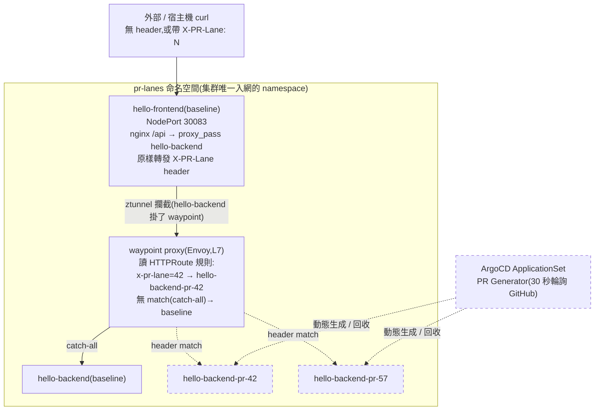

# K3s Phase F+G:Istio Ambient Mesh 與 PR 預覽泳道機制

日期:2026-08-19
狀態:已上線並端到端驗證通過
環境:Oracle VPS 單節點 k3s(Cilium CNI,`kubeProxyReplacement: true`),ArgoCD GitOps
關聯文檔:[設計文檔](../superpowers/specs/2026-08-18-k3s-phase-fg-mesh-pr-lanes-design.md)(完整的方案取捨與理由)、[實施計劃](../superpowers/plans/2026-08-18-k3s-phase-fg-mesh-pr-lanes.md)(14 個任務的逐步執行記錄)、[`vps_oracle/k3s/README.md`](../../vps_oracle/k3s/README.md#istio-ambient--pr-lanes)(運維操作手冊,含 GitHub PAT 輪換、回滾路徑)
本文檔:面向「這個階段到底做出了什麼、怎麼用、怎麼確認它還活著」的功能總結與驗證手冊,不重複設計文檔的決策過程與計劃文檔的執行細節。

---

## 1. 一句話總結

給集群裝上 Istio Ambient service mesh(僅 `pr-lanes` 一個命名空間入網),讓帶 `pr-lane` label 的 GitHub PR 能自動獲得一條「只複製被改動的那顆服務、其餘全部共用常駐基準環境」的預覽泳道——不帶特殊 header 的請求打到共享的 baseline,帶 `x-pr-lane: <PR 編號>` header 的請求會被 L7 路由到該 PR 專屬的服務版本,PR 關閉後泳道自動回收乾淨,不留殘留資源。

## 2. 為什麼要做這個

業界做 PR 預覽環境有兩派做法:「namespace-per-PR」把整套服務複製一份(成本隨服務數 × PR 數線性成長),或「共享底座 + 流量路由」只複製被改動的那一顆服務(Signadot 等工具的思路)。本階段實作後者,但這個做法的價值只有在「至少兩層服務、東西向有一跳可以做路由決策」時才成立——單層服務的話,任何 ingress controller 的 header 分流都能做到,用不上 service mesh。這也是為什麼本階段把原本單層的練手 app `placeholder-hello` 拆成了兩層(`hello-frontend` → `hello-backend`):沒有這第二跳,B 派設計就無從談起。完整的取捨分析見[設計文檔](../superpowers/specs/2026-08-18-k3s-phase-fg-mesh-pr-lanes-design.md)開頭的「為什麼是共享底座 + 流量路由」一節。

## 3. 架構總覽



命名空間佈局:整個集群只有 `pr-lanes` 一個命名空間帶 `istio.io/dataplane-mode: ambient` 標籤,其餘命名空間(`workloads`、`lab-environment`、`headlamp`、`argocd`、`kube-system` 等)完全不進網格——這是刻意的爆炸半徑控制,不是「網格只給練手用」,而是漸進式納管的第一批。虛線框的節點是由 ApplicationSet 動態生成/回收的部分,不是常駐資源。

## 4. 功能詳解

### 4.1 Istio Ambient mesh(範圍限定在 `pr-lanes`)

裝的元件:`istiod`(控制平面)+ `ztunnel`(每節點一份的 L4 mTLS 透明代理,DaemonSet)+ `istio-cni`(在 pod 建立時設置流量重定向規則的 CNI chain 插件,DaemonSet)。全部走 Helm + ArgoCD,版本 `1.30.3`。這一批元件本身**不**代表任何命名空間入網——入網與否完全由命名空間的 `istio.io/dataplane-mode: ambient` 標籤決定,目前只有 `pr-lanes` 有這個標籤。

Ambient 模式不用 sidecar(每個 pod 額外掛一個 Envoy 容器),而是節點級共享的 `ztunnel` 做 L4 mTLS,只有需要 L7 能力(這裡是 header 路由)的服務才額外掛一個獨立的 waypoint proxy——這是 ambient 相對 sidecar 模式的核心資源優勢,本階段的元件實測記憶體佔用遠低於預算(見第 5.4 節)。

### 4.2 兩層應用拓撲:`hello-frontend` → `hello-backend`

`hello-frontend`:baseline 恆定一份,永遠不隨 PR 複製。nginx,`/` 回自己的靜態頁,`/api` 透過 `proxy_pass` 轉給 `hello-backend`,原樣轉發客戶端帶的 `x-pr-lane` header(nginx `proxy_pass` 預設行為,免費拿到,不需要額外程式碼)。

`hello-backend`:baseline 一份 + 每條泳道各一份。PR 改的就是它——這是刻意的簡化,真實世界的「哪個服務被改」判斷會更複雜,但本階段驗證的是機制骨架而非那個判斷邏輯。

檔案位置:`vps_oracle/k3s/apps/hello/k8s/`(baseline 的 Deployment/Service/ConfigMap)、`vps_oracle/k3s/apps/hello/backend/`(Dockerfile + CI 用的靜態頁)、`vps_oracle/k3s/apps/hello/lane/`(泳道用的 Kustomize base,見 4.4)。

### 4.3 waypoint L7 路由:HTTP header 分流

`hello-backend` 這個 Service 掛 `istio.io/use-waypoint: waypoint` 標籤(`vps_oracle/k3s/apps/hello/k8s/backend-service.yaml`),對應一個 waypoint `Gateway` 資源(`waypoint-gateway.yaml`)。路由規則由多份 `HTTPRoute` 疊加:一份**靜態、寫死在 repo 裡**的 catch-all(`backend-httproute.yaml`,無 match 條件,→ baseline),加上**每條泳道各一份、由 ApplicationSet 動態生成**的帶 header match 規則(→ 該 PR 的專屬 Service)。

不需要手動排序:Gateway API 規範定義同一 parent 上的多份 `HTTPRoute` 合併時,按「header match 數量」等維度比優先序——泳道規則有 1 個 header match,baseline 規則有 0 個,泳道規則永遠優先,新增/移除泳道都不用碰 baseline 的檔案。

### 4.4 ArgoCD ApplicationSet:PR 觸發的自動生成/更新/回收

`vps_oracle/k3s/argocd/apps/pr-lanes-appset.yaml`,用 `pullRequest.github` generator,每 30 秒輪詢一次 GitHub,篩選**帶 `pr-lane` 這個 GitHub label** 的 open PR。每個匹配的 PR 生成一個 `hello-pr-<N>` Application,套用 `vps_oracle/k3s/apps/hello/lane/` 這個 Kustomize base,用 JSON6902 patch 把佔位名稱換成 `hello-backend-pr-<N>`,image tag 換成該 PR 的 head commit SHA。

生命週期完全自動:PR 打上 label → 下一輪詢生成泳道;PR 推新 commit → CI 重新構建簽章,ApplicationSet 下一輪詢更新泳道鏡像;PR 關閉/合併 → 下一輪詢該 PR 不再匹配,Application 連同它管理的 Deployment/Service/HTTPRoute 一併被 ArgoCD 的 `prune: true` + `resources-finalizer.argocd.argoproj.io` 回收,不留殘留。

### 4.5 CI 整合:PR 觸發的簽章構建

`.github/workflows/hello-backend.yml` 新增 `pull_request` 觸發條件(`types: [opened, synchronize, reopened, labeled]`),job 級 `if` 條件過濾掉沒有 `pr-lane` label 的 PR(不浪費 CI 分鐘數)。Tag 用 `github.event.pull_request.head.sha`(**不是** `github.sha`——`pull_request` 事件下 `github.sha` 是 GitHub 自動生成的 merge commit SHA,跟 ApplicationSet 的 `{{.head_sha}}` 對不上,這是這條 pipeline 最容易踩的坑)。構建鏈路(QEMU → buildx arm64 → Trivy 掃描 → Cosign keyless 簽章 → 推 GHCR)跟既有的 `push`-觸發流程共用同一個 job,只是觸發條件和 tag 表達式不同。

### 4.6 Kyverno 安全邊界

集群既有的 `restrict-image-registry` 政策(Enforce)只認 `@refs/heads/main` 簽出的 image 簽章。PR 分支構建的 image 簽章身分是 `@refs/pull/<N>/merge`,不符合,會被擋。處理方式是**命名空間範圍的例外**,不是放寬既有政策:

1. `restrict-image-registry` 排除 `pr-lanes` 命名空間(`vps_oracle/k3s/kyverno/policies/restrict-image-registry.yaml`)
2. 新增 `restrict-image-registry-pr-lanes`,只匹配 `pr-lanes`,`subjectRegExp` 同時接受 `@refs/heads/main` 與 `@refs/pull/[0-9]+/merge`,另外因為泳道的 image 是「按 tag(commit SHA)引用,不是按 digest」,額外設了 `verifyDigest: false`(Kyverno 這個欄位預設要求 image 已經是 digest-pinned,PR 泳道刻意不這麼做——SHA tag 本身已經是不可變的,詳見設計文檔的說明)

刻意不直接放寬原政策的 regex——那會讓 PR 分支簽章在**整個集群**都能通過驗證,等於用一個練手功能的需求削弱全集群的主幹分支保證。命名空間範圍的例外把代價侷限在 `pr-lanes` 內。另外 `restricted-self-built`(Pod Security Standard 強制)與 `require-vuln-scan-clean`(Trivy CVE 閘門)這兩條政策的 selector 也已更新為涵蓋 `hello-frontend`/`hello-backend`。

## 5. 如何驗證

以下全部是實際跑過、有真實輸出的命令,不是理論上「應該可以」。

### 5.1 基礎設施健康檢查

```bash
# mesh 三元件全部 Running,四個對應的 ArgoCD Application 全部 Synced/Healthy
kubectl -n istio-system get pods
kubectl -n argocd get application istio-base istio-istiod istio-cni istio-ztunnel \
  -o custom-columns=NAME:.metadata.name,SYNC:.status.sync.status,HEALTH:.status.health.status

# 爆炸半徑:整個集群只有 pr-lanes 帶 ambient 標籤
kubectl get ns -l istio.io/dataplane-mode=ambient
# 期望輸出只有一行:pr-lanes

# waypoint 已 Programmed,對應 Deployment Running
kubectl -n pr-lanes get gateway waypoint \
  -o jsonpath='{.status.conditions[?(@.type=="Programmed")].status}{"\n"}'
kubectl -n pr-lanes get deploy waypoint

# Gateway API CRD 已就位
kubectl get crd | grep gateway.networking.k8s.io
```

### 5.2 端到端功能驗證(用真實 PR)

```bash
# 1. 開一個改動 hello-backend 的 PR,打上 pr-lane label(標籤不存在的話先建一個)
gh label create pr-lane --description "Triggers a PR preview lane" --color 0E8A16
git checkout -b test/verify-pr-lane
sed -i 's/baseline/baseline — verify test/' vps_oracle/k3s/apps/hello/backend/index.html
git add vps_oracle/k3s/apps/hello/backend/index.html
git commit -m "Test change"
git push -u origin test/verify-pr-lane
gh pr create --title "Test: verify PR lane" --body "..." --label pr-lane

# 2. 等 CI 構建完成(通常一兩分鐘),ApplicationSet 下一輪詢(≤30 秒)生成泳道
PR_NUM=$(gh pr view test/verify-pr-lane --json number --jq .number)
gh run watch --exit-status $(gh run list --workflow=hello-backend.yml --limit=1 --json databaseId --jq '.[0].databaseId')
sleep 35
kubectl -n argocd get application hello-pr-$PR_NUM \
  -o jsonpath='{.status.sync.status} {.status.health.status}{"\n"}'
# 期望:Synced Healthy

# 3. 核心驗證——baseline 路徑不受泳道影響
NODE_IP=$(hostname -I | awk '{print $1}')
curl -s http://$NODE_IP:30083/api
# 期望:<h1>hello-backend (baseline)</h1>,不是 PR 改過的內容

# 4. 核心驗證——帶 header 才會拿到 PR 的內容
curl -s -H "x-pr-lane: $PR_NUM" http://$NODE_IP:30083/api
# 期望:<h1>hello-backend (baseline — verify test)</h1>

# 5. 收尾:關閉 PR,確認完全回收
gh pr close $PR_NUM --delete-branch
sleep 35
kubectl -n argocd get application hello-pr-$PR_NUM 2>&1   # 期望 NotFound
kubectl -n pr-lanes get deployment,svc,httproute 2>&1 | grep "pr-$PR_NUM"  # 期望空
```

### 5.3 安全邊界驗證(負面測試——拒絕才是通過)

```bash
# PR 分支簽出的 image 必須能在 pr-lanes 通過驗簽(前面 5.2 步驟 4 能拿到內容已經間接證明這點,
# 這裡是更直接的驗證:查 Kyverno 準入日誌)
kubectl -n kyverno logs -l app.kubernetes.io/component=admission-controller --tail=200 \
  | grep "hello-backend-pr-$PR_NUM"

# 反向驗證:同一個 PR 分支簽出的 image,部署到 pr-lanes 以外的命名空間,必須被拒絕
NEW_SHA=$(git rev-parse HEAD)
kubectl -n workloads run kyverno-scope-check --restart=Never \
  --image=ghcr.io/jeromefromcn/hello-backend:$NEW_SHA
# 期望:被 admission webhook 拒絕,錯誤訊息提到簽章驗證失敗,而不是成功建立 pod
kubectl -n workloads delete pod kyverno-scope-check --ignore-not-found

# 未打 pr-lane label 的 PR 不應該生成任何資源
gh pr create --title "Test: no label" --body "..."   # 不帶 --label
NO_LABEL_PR=$(gh pr view --json number --jq .number)
sleep 35
kubectl -n argocd get application hello-pr-$NO_LABEL_PR 2>&1   # 期望 NotFound
gh pr close $NO_LABEL_PR --delete-branch
```

### 5.4 資源佔用檢查

```bash
kubectl top pods -n istio-system
kubectl top pods -n pr-lanes
free -h   # 重點看 swap 有沒有比裝之前明顯上升,而不是看 k8s 配額還剩多少
```

2026-08-19 實測參考值(單條泳道存在時):`istiod` 102Mi、`istio-cni` 30Mi、`ztunnel` 12-29Mi、`waypoint` 26Mi,全部遠低於設計文檔的預算上限;host swap 使用量沒有因為本階段安裝而上升。判斷標準是「swap 有沒有惡化 / 既有服務有沒有被 OOMKill」,不是「k8s 配額還剩多少」——配額寬鬆可能只是同機其他服務遷走造成的假象。

## 6. 已知限制

以下是設計上刻意接受、不在本階段範圍內的限制,完整討論見設計文檔的「已知限制 / 失敗模式」一節:

- 這是單服務深度的簡化模型——真實系統的多跳 header 傳播、有狀態服務的資料污染問題,本階段沒有驗證
- header 在 `hello-frontend` 這一跳能免費透傳是因為用了 nginx `proxy_pass` 的預設行為,換成任何自寫服務都需要應用程式碼顯式轉發 inbound header
- 30 秒輪詢 + ArgoCD 自身同步週期,從 CI 完成到泳道更新有數十秒到分鐘級延遲,不是即時的
- `pr-lanes` 內任何從本 repo PR 分支簽出的 image 都能部署——範圍侷限在這個命名空間,但命名空間是範圍邊界不是沙箱
- ApplicationSet 沒有硬性的並發泳道數量上限,靠 `pr-lanes` 的 `ResourceQuota` 當背壓,超額的泳道 pod 會卡在 `Pending`(優雅降級,不是叢集受損)

## 7. 運維要點:上線過程中踩過、值得記住的坑

**Cilium 的 `socketLB` 相關設定,`helm upgrade` 之後必須手動重啟 `cilium-agent`,否則會靜默不生效。** 這是本階段耗時最長的一個問題:waypoint 的 L7 路由規則從頭到尾都是對的,`ztunnel`、`istiod` 的所有配置狀態位也全部顯示正常,但 waypoint 實際上一個請求都沒收到過——根因是 Cilium 這個 chart 沒有把 `cilium-config` ConfigMap 的內容做成 checksum 放在 `cilium` DaemonSet 的 pod template 上,所以純改 Helm values 只會更新 ConfigMap,不會觸發 pod 重啟,而 `socketLB.hostNamespaceOnly` 這類設定是 agent 啟動時讀一次、編譯進 eBPF 程式的——ConfigMap 顯示新值,但運行中的資料面(`node_config.h` 裡的 `ENABLE_SOCKET_LB_FULL` vs `ENABLE_SOCKET_LB_HOST_ONLY`)依然是舊的,全程沒有任何錯誤或告警。

驗證標準必須是**運行中的資料面**,不是 ConfigMap:

```bash
kubectl -n kube-system rollout restart daemonset/cilium
kubectl -n kube-system rollout status daemonset/cilium --timeout=180s
kubectl -n kube-system exec ds/cilium -c cilium-agent -- \
  cilium-dbg status --verbose | grep 'Socket LB Coverage'
# 期望 Hostns-only;顯示 Full 就代表重啟沒真的發生
```

完整的根因分析、為什麼會誤判「已生效」、以及防復發的注釋,都記錄在 `vps_oracle/k3s/cilium/values.yaml` 的 `socketLB:` 區塊上方,以及 `vps_oracle/k3s/README.md` 的 Cilium 升級指令旁邊。

**GitOps 資源不能用 `kubectl apply`/`patch` 做「先試後定」式的驗證性改動。** ArgoCD 的 `selfHeal: true` 會把任何跟 git 不一致的即時改動視為 drift,下一輪 reconcile 就靜默撤銷,不留錯誤訊息——這條規則已經寫進本 repo 根目錄 `CLAUDE.md`,作為長期鐵律。確實需要大量試錯的場景,正確做法是先臨時關掉對應 Application 的 `selfHeal`,實驗完把最終版本寫回 git 再重新打開。

## 8. 相關文檔

- [設計文檔](../superpowers/specs/2026-08-18-k3s-phase-fg-mesh-pr-lanes-design.md) —— 完整的方案取捨(為什麼是兩層拓撲、為什麼是命名空間範圍的 Kyverno 例外、資源預算試算)
- [實施計劃](../superpowers/plans/2026-08-18-k3s-phase-fg-mesh-pr-lanes.md) —— 14 個任務的逐步執行記錄與驗收標準
- [`vps_oracle/k3s/README.md` 的 Istio Ambient / PR Lanes 章節](../../vps_oracle/k3s/README.md#istio-ambient--pr-lanes) —— 日常運維操作手冊,包含如何開一個真實的測試 PR、GitHub PAT 輪換步驟、回滾路徑
