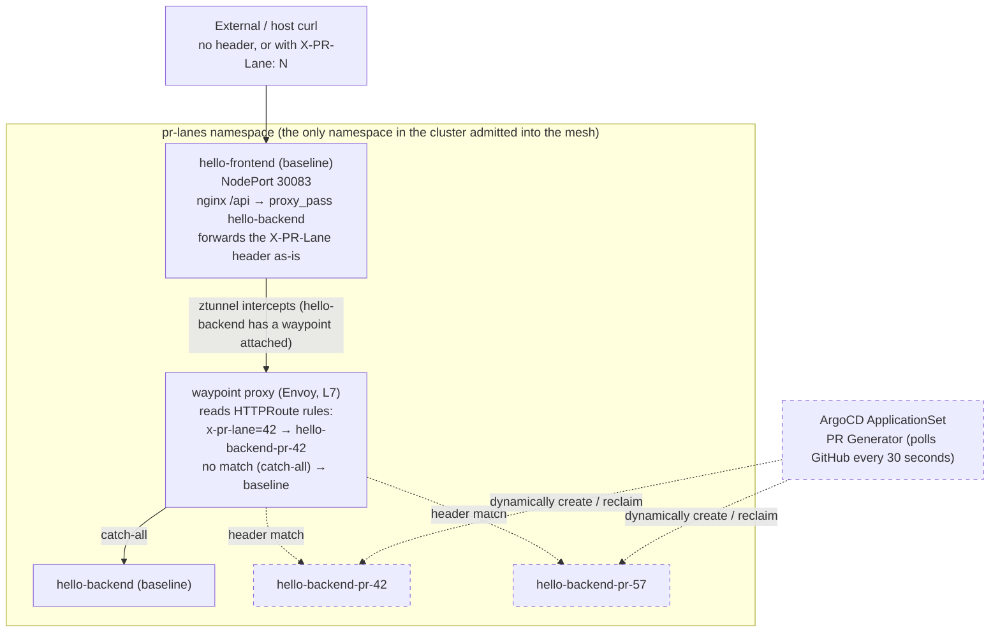

# K3s Phase F+G: Istio Ambient Mesh and PR Preview Lane Mechanism

Date: 2026-08-19
Status: live and verified end to end
Environment: Oracle VPS single-node k3s (Cilium CNI, `kubeProxyReplacement: true`), ArgoCD GitOps
Related docs: [design doc](../superpowers/specs/2026-08-18-k3s-phase-fg-mesh-pr-lanes-design.md) (the full trade-off analysis and rationale), [implementation plan](../superpowers/plans/2026-08-18-k3s-phase-fg-mesh-pr-lanes.md) (step-by-step execution record of 14 tasks), [`vps_oracle/k3s/README.md`](../../vps_oracle/k3s/README.md#istio-ambient--pr-lanes) (the day-to-day operations manual, including GitHub PAT rotation and rollback path)
This document: a feature summary and verification manual aimed at "what exactly this phase produced, how to use it, how to confirm it's still alive" — it does not repeat the decision process in the design doc or the execution details in the plan.

---

## 1. One-line summary

Install an Istio Ambient service mesh on the cluster (only the single `pr-lanes` namespace is admitted into the mesh), so that a GitHub PR carrying a `pr-lane` label automatically gets a preview lane that "copies only the service that was changed; everything else shares the resident baseline environment" — requests without the special header hit the shared baseline, requests carrying an `x-pr-lane: <PR number>` header are L7-routed to the PR-specific service version, and when the PR closes the lane is cleaned up automatically, leaving no leftover resources.

## 2. Why do this

The industry has two schools of PR preview environments: "namespace-per-PR" copies the entire set of services (cost grows linearly with services × PRs), or "shared base + traffic routing" copies only the single changed service (the approach of tools like Signadot). This phase implements the latter, but that approach's value only holds when there are "at least two layers of services and an east-west hop where a routing decision can be made" — with a single-layer service, any ingress controller's header splitting can do it, and a service mesh is unneeded. That is also why this phase split the originally single-layer practice app `placeholder-hello` into two layers (`hello-frontend` → `hello-backend`): without that second hop, the "B" school design is moot. The full trade-off analysis is in the "Why shared base + traffic routing" section at the start of the [design doc](../superpowers/specs/2026-08-18-k3s-phase-fg-mesh-pr-lanes-design.md).

## 3. Architecture overview



Namespace layout: the entire cluster has only the single `pr-lanes` namespace carrying the `istio.io/dataplane-mode: ambient` label; all other namespaces (`workloads`, `lab-environment`, `headlamp`, `argocd`, `kube-system`, etc.) are entirely outside the mesh — this is deliberately scoped blast-radius control, not "the mesh is only for practice"; it is the first batch of gradual adoption. The dashed-border nodes are the parts dynamically created/reclaimed by the ApplicationSet, not resident resources.

## 4. Feature details

### 4.1 Istio Ambient mesh (scoped to `pr-lanes`)

Installed components: `istiod` (control plane) + `ztunnel` (one-per-node L4 mTLS transparent proxy, DaemonSet) + `istio-cni` (a CNI chain plugin that sets up traffic-redirection rules when a pod is created, DaemonSet). All via Helm + ArgoCD, version `1.30.3`. This batch of components by itself does **not** mean any namespace is admitted — admission is entirely determined by a namespace's `istio.io/dataplane-mode: ambient` label, and currently only `pr-lanes` has it.

Ambient mode does not use sidecars (an extra Envoy container per pod), but a node-level shared `ztunnel` for L4 mTLS; only services that need L7 capability (here, header routing) get an additional standalone waypoint proxy — this is ambient's core resource advantage over the sidecar model, and the components in this phase measured far below the memory budget (see section 5.4).

### 4.2 Two-layer app topology: `hello-frontend` → `hello-backend`

`hello-frontend`: always a single baseline copy, never replicated per PR. nginx, `/` serves its own static page, `/api` forwards via `proxy_pass` to `hello-backend`, forwarding the client's `x-pr-lane` header as-is (nginx `proxy_pass` default behavior, gotten for free, no extra code needed).

`hello-backend`: one baseline copy + one per lane. The PR changes it — this is a deliberate simplification; the real-world "which service was changed" determination would be more complex, but this phase validates the mechanism skeleton rather than that determination logic.

File locations: `vps_oracle/k3s/apps/hello/k8s/` (baseline Deployment/Service/ConfigMap), `vps_oracle/k3s/apps/hello/backend/` (Dockerfile + static page for CI), `vps_oracle/k3s/apps/hello/lane/` (Kustomize base for lanes, see 4.4).

### 4.3 waypoint L7 routing: HTTP header splitting

The `hello-backend` Service carries the `istio.io/use-waypoint: waypoint` label (`vps_oracle/k3s/apps/hello/k8s/backend-service.yaml`), corresponding to a waypoint `Gateway` resource (`waypoint-gateway.yaml`). Routing rules are composed of multiple `HTTPRoute`s overlaid: one **static, hard-written in the repo** catch-all (`backend-httproute.yaml`, no match condition, → baseline), plus **one per lane, dynamically created by the ApplicationSet** with a header match rule (→ that PR's dedicated Service).

No manual ordering needed: the Gateway API spec defines that when multiple `HTTPRoute`s on the same parent are merged, priority is compared on dimensions such as "number of header matches" — lane rules have 1 header match, the baseline rule has 0, so lane rules always win; adding/removing lanes never touches the baseline file.

### 4.4 ArgoCD ApplicationSet: PR-triggered auto create/update/reclaim

`vps_oracle/k3s/argocd/apps/pr-lanes-appset.yaml`, using the `pullRequest.github` generator, polls GitHub every 30 seconds, filtering for open PRs carrying the `pr-lane` GitHub label. Each matching PR generates a `hello-pr-<N>` Application, applying the `vps_oracle/k3s/apps/hello/lane/` Kustomize base and using a JSON6902 patch to replace the placeholder name with `hello-backend-pr-<N>` and the image tag with that PR's head commit SHA.

Lifecycle is fully automatic: PR labeled → next poll creates the lane; PR pushed a new commit → CI rebuilds and signs, ApplicationSet updates the lane image on the next poll; PR closed/merged → the next poll no longer matches, and the Application together with the Deployment/Service/HTTPRoute it manages is reclaimed by ArgoCD's `prune: true` + `resources-finalizer.argocd.argoproj.io`, leaving no leftovers.

### 4.5 CI integration: PR-triggered signed build

`.github/workflows/hello-backend.yml` adds the `pull_request` trigger condition (`types: [opened, synchronize, reopened, labeled]`), with a job-level `if` condition filtering out PRs without the `pr-lane` label (not wasting CI minutes). Tag uses `github.event.pull_request.head.sha` (**not** `github.sha` — under a `pull_request` event `github.sha` is the merge commit SHA auto-generated by GitHub, which does not match the ApplicationSet's `{{.head_sha}}`; this is the easiest pitfall in this pipeline). The build chain (QEMU → buildx arm64 → Trivy scan → Cosign keyless signing → push to GHCR) reuses the same job as the existing `push`-triggered flow, only the trigger condition and tag expression differ.

### 4.6 Kyverno security boundary

The cluster's existing `restrict-image-registry` policy (Enforce) only accepts image signatures checked out from `@refs/heads/main`. PR-branch-built images have a signature identity of `@refs/pull/<N>/merge`, which does not match and gets blocked. The handling is a **namespace-scoped exception**, not a relaxation of the existing policy:

1. `restrict-image-registry` excludes the `pr-lanes` namespace (`vps_oracle/k3s/kyverno/policies/restrict-image-registry.yaml`)
2. A new `restrict-image-registry-pr-lanes` matches only `pr-lanes`, with `subjectRegExp` accepting both `@refs/heads/main` and `@refs/pull/[0-9]+/merge`; additionally, because the lane images are "referenced by tag (commit SHA), not by digest", it also sets `verifyDigest: false` (Kyverno's default for this field requires the image to already be digest-pinned; the PR lane deliberately does not do this — the SHA tag is already immutable, see the design doc for details).

Deliberately not widening the original policy's regex — that would let PR-branch signatures pass verification across the **entire cluster**, weakening the whole cluster's main-branch guarantee to satisfy one practice feature. The namespace-scoped exception confines the cost to `pr-lanes`. Additionally, `restricted-self-built` (Pod Security Standard enforcement) and `require-vuln-scan-clean` (Trivy CVE gate) both had their selectors updated to cover `hello-frontend`/`hello-backend`.

## 5. How to verify

Everything below is actually run with real output, not theoretical "should work".

### 5.1 Infrastructure health checks

```bash
# The three mesh components all Running; the four corresponding ArgoCD Applications all Synced/Healthy
kubectl -n istio-system get pods
kubectl -n argocd get application istio-base istio-istiod istio-cni istio-ztunnel \
  -o custom-columns=NAME:.metadata.name,SYNC:.status.sync.status,HEALTH:.status.health.status

# Blast radius: the whole cluster only has pr-lanes carrying the ambient label
kubectl get ns -l istio.io/dataplane-mode=ambient
# Expected output is a single line: pr-lanes

# waypoint is Programmed, corresponding Deployment Running
kubectl -n pr-lanes get gateway waypoint \
  -o jsonpath='{.status.conditions[?(@.type=="Programmed")].status}{"\n"}'
kubectl -n pr-lanes get deploy waypoint

# Gateway API CRDs are in place
kubectl get crd | grep gateway.networking.k8s.io
```

### 5.2 End-to-end functional verification (with a real PR)

```bash
# 1. Open a PR that changes hello-backend, label it pr-lane (create the label first if it does not exist)
gh label create pr-lane --description "Triggers a PR preview lane" --color 0E8A16
git checkout -b test/verify-pr-lane
sed -i 's/baseline/baseline — verify test/' vps_oracle/k3s/apps/hello/backend/index.html
git add vps_oracle/k3s/apps/hello/backend/index.html
git commit -m "Test change"
git push -u origin test/verify-pr-lane
gh pr create --title "Test: verify PR lane" --body "..." --label pr-lane

# 2. Wait for CI to finish building (usually a minute or two); ApplicationSet's next poll (≤30s) creates the lane
PR_NUM=$(gh pr view test/verify-pr-lane --json number --jq .number)
gh run watch --exit-status $(gh run list --workflow=hello-backend.yml --limit=1 --json databaseId --jq '.[0].databaseId')
sleep 35
kubectl -n argocd get application hello-pr-$PR_NUM \
  -o jsonpath='{.status.sync.status} {.status.health.status}{"\n"}'
# Expected: Synced Healthy

# 3. Core verification — baseline path is not affected by the lane
NODE_IP=$(hostname -I | awk '{print $1}')
curl -s http://$NODE_IP:30083/api
# Expected: <h1>hello-backend (baseline)</h1>, not the PR-modified content

# 4. Core verification — only with the header do you get the PR content
curl -s -H "x-pr-lane: $PR_NUM" http://$NODE_IP:30083/api
# Expected: <h1>hello-backend (baseline — verify test)</h1>

# 5. Wrap up: close the PR, confirm full reclamation
gh pr close $PR_NUM --delete-branch
sleep 35
kubectl -n argocd get application hello-pr-$PR_NUM 2>&1   # Expected NotFound
kubectl -n pr-lanes get deployment,svc,httproute 2>&1 | grep "pr-$PR_NUM"  # Expected empty
```

### 5.3 Security-boundary verification (negative test — rejection is the pass)

```bash
# A PR-branch-signed image must pass verification inside pr-lanes (step 4 of 5.2 above already indirectly proves this
# by returning content; here is more direct verification: check the Kyverno admission logs)
kubectl -n kyverno logs -l app.kubernetes.io/component=admission-controller --tail=200 \
  | grep "hello-backend-pr-$PR_NUM"

# Reverse verification: the same PR-branch-signed image, deployed to a namespace other than pr-lanes, must be rejected
NEW_SHA=$(git rev-parse HEAD)
kubectl -n workloads run kyverno-scope-check --restart=Never \
  --image=ghcr.io/jeromefromcn/hello-backend:$NEW_SHA
# Expected: rejected by the admission webhook, with an error message mentioning signature verification failure, not a successfully created pod
kubectl -n workloads delete pod kyverno-scope-check --ignore-not-found

# A PR without the pr-lane label should produce no resources
gh pr create --title "Test: no label" --body "..."   # without --label
NO_LABEL_PR=$(gh pr view --json number --jq .number)
sleep 35
kubectl -n argocd get application hello-pr-$NO_LABEL_PR 2>&1   # Expected NotFound
gh pr close $NO_LABEL_PR --delete-branch
```

### 5.4 Resource-usage check

```bash
kubectl top pods -n istio-system
kubectl top pods -n pr-lanes
free -h   # focus on whether swap rose noticeably vs before the install, not how much k8s quota remains
```

2026-08-19 measured reference values (with a single lane present): `istiod` 102Mi, `istio-cni` 30Mi, `ztunnel` 12-29Mi, `waypoint` 26Mi, all far below the design doc's budget ceiling; host swap usage did not rise due to this phase's install. The judgment criterion is "has swap worsened / have any existing services been OOMKilled", not "how much k8s quota remains" — loose quota may just be an illusion caused by other same-host services migrating away.

## 6. Known limitations

The following are deliberately accepted design limitations outside this phase's scope; the full discussion is in the design doc's "Known limitations / failure modes" section:

- This is a simplified single-service-depth model — multi-hop header propagation in a real system and data-contamination issues for stateful services were not verified in this phase
- The header passes through `hello-frontend` for free because of nginx `proxy_pass` default behavior; any self-written service would need application code to explicitly forward the inbound header
- 30-second polling + ArgoCD's own sync cycle means tens of seconds to minute-level delay from CI completion to lane update — not instant
- Any image in `pr-lanes` checked out from a PR branch of this repo can be deployed — the scope is confined to this namespace, but the namespace is a scope boundary, not a sandbox
- The ApplicationSet has no hard cap on the number of concurrent lanes; `pr-lanes`'s `ResourceQuota` acts as the backpressure, and excess lane pods stall in `Pending` (graceful degradation, not cluster damage)

## 7. Operations notes: pitfalls hit and worth remembering during rollout

**Cilium's `socketLB`-related settings require manually restarting `cilium-agent` after `helm upgrade`, otherwise they silently fail to take effect.** This was the longest-running problem of this phase: the waypoint's L7 routing rules were correct from start to finish, and every config status bit of `ztunnel` and `istiod` showed normal, yet the waypoint actually received zero requests — the root cause is that the Cilium chart does not checksum the contents of the `cilium-config` ConfigMap into the `cilium` DaemonSet pod template, so merely changing Helm values only updates the ConfigMap and does not trigger a pod restart, whereas settings like `socketLB.hostNamespaceOnly` are read once at agent startup and compiled into the eBPF program — the ConfigMap shows the new value, but the running data plane (the `ENABLE_SOCKET_LB_FULL` vs `ENABLE_SOCKET_LB_HOST_ONLY` in `node_config.h`) is still the old one, with no error or alert anywhere in the process.

The verification standard must be the **running data plane**, not the ConfigMap:

```bash
kubectl -n kube-system rollout restart daemonset/cilium
kubectl -n kube-system rollout status daemonset/cilium --timeout=180s
kubectl -n kube-system exec ds/cilium -c cilium-agent -- \
  cilium-dbg status --verbose | grep 'Socket LB Coverage'
# Expected Hostns-only; showing Full means the restart did not actually happen
```

The full root-cause analysis, why it was misjudged as "already effective", and the recurrence-prevention notes are recorded above the `socketLB:` block in `vps_oracle/k3s/cilium/values.yaml`, and next to the Cilium upgrade instructions in `vps_oracle/k3s/README.md`.

**GitOps resources must not be modified with `kubectl apply`/`patch` for "try before committing" exploratory changes.** ArgoCD's `selfHeal: true` treats any live change inconsistent with git as drift, and silently reverts it on the next reconcile, leaving no error message — this rule is already written into this repo's root `CLAUDE.md` as a long-term iron rule. For scenarios that genuinely need extensive trial-and-error, the correct approach is to temporarily turn off `selfHeal` on the corresponding Application first, experiment, then write the final version back to git and re-enable it.

## 8. Related docs

- [Design doc](../superpowers/specs/2026-08-18-k3s-phase-fg-mesh-pr-lanes-design.md) — the full trade-off analysis (why a two-layer topology, why a namespace-scoped Kyverno exception, resource budget estimates)
- [Implementation plan](../superpowers/plans/2026-08-18-k3s-phase-fg-mesh-pr-lanes.md) — step-by-step execution record and acceptance criteria of 14 tasks
- [The Istio Ambient / PR Lanes section of `vps_oracle/k3s/README.md`](../../vps_oracle/k3s/README.md#istio-ambient--pr-lanes) — day-to-day operations manual, including how to open a real test PR, GitHub PAT rotation steps, and the rollback path