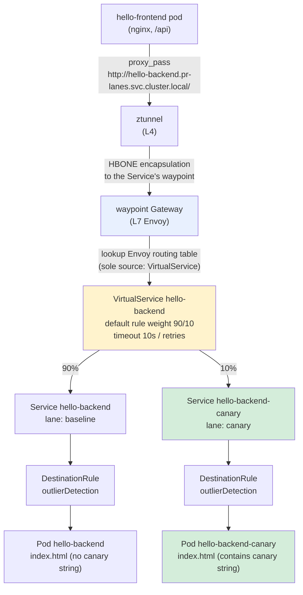
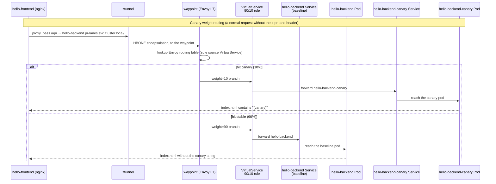

# K3s Canary Release (Phase I) Implementation Mechanism Walkthrough

Date: 2026-08-27
Environment: Oracle VPS single-node k3s (Cilium CNI), Istio Ambient mesh, `pr-lanes` namespace
Related docs: [Phase I design doc](../superpowers/specs/2026-08-22-k3s-phase-i-traffic-resilience-design.md), [summary and verification manual](2026-08-26-k3s-mesh-capabilities-roadmap-summary.md)
This document: explains how "canary release" is actually implemented — which modules are used, how a request flows, and the sequencing. Does not repeat verification steps (that is the summary manual's job).

---

## 1. One-line summary

Canary release = **Istio Ambient's `VirtualService` weight-based routing** + **dual Service dual Deployment (same pinned image, different `index.html` content)**. `hello-frontend`'s `/api` proxies to the `hello-backend` host; the traffic enters the `waypoint` and Envoy splits it by `weight: 90/10` to the stable / canary two Services, each with its own independent Pods. The version difference does not rely on different images, but on different content mounted via ConfigMap — distinguishable by `curl` or by eye.

---

## 2. Modules used

All in the `pr-lanes` namespace, defined in `vps_oracle/k3s/apps/hello/k8s/`.

| Module | Resource | File | Role |
|---|---|---|---|
| **Routing** | `VirtualService hello-backend` | `backend-virtualservice.yaml` | The sole routing source for the `hello-backend` host: 90/10 weight + timeout + retries + fault injection |
| **Service (stable)** | `hello-backend` | `backend-service.yaml` | selector `lane: baseline`, `istio.io/use-waypoint: waypoint` |
| **Service (canary)** | `hello-backend-canary` | `backend-canary-service.yaml` | selector `lane: canary`, `istio.io/use-waypoint: waypoint` |
| **Deployment (stable)** | `hello-backend` | `backend-deployment.yaml` | baseline, no ConfigMap override |
| **Deployment (canary)** | `hello-backend-canary` | `backend-canary-deployment.yaml` | mounts the canary ConfigMap |
| **ConfigMap** | `hello-backend-canary-conf` | `backend-canary-configmap.yaml` | the canary `index.html` (containing the `(canary)` string) |
| **DestinationRule (stable)** | `hello-backend` | `backend-destinationrule.yaml` | outlierDetection |
| **DestinationRule (canary)** | `hello-backend-canary` | `backend-canary-destinationrule.yaml` | outlierDetection |
| **Waypoint** | `Gateway waypoint` | `waypoint-gateway.yaml` | ambient's L7 processing point, `istio.io/waypoint-for: service` |
| **ServiceAccount** | `hello-backend-sa` | `backend-serviceaccount.yaml` | shared by stable/canary |

**Same pinned image**: `ghcr.io/jeromefromcn/hello-backend@sha256:8b3dc...` — the canary is not a different build, but the same image mounting different content. So **version distinction is via ConfigMap, not via image tag**. This is the design doc's stated "zero new components" trade-off: the canary is not new infra, just a second Deployment of the existing app.

**The PR lane mechanism is parallel and independent** (not part of the canary, but coexists on the same host):
- `lane/` kustomize + the `pr-lanes-appset.yaml` ApplicationSet
- Requests carrying an `x-pr-lane: <N>` header → `HTTPRoute hello-backend-lane-route` → `hello-backend-pr-N` lane Deployment/Service
- It is on `parentRefs: hello-backend`, but has a header match, so it does not override the canary's unconditional route

---

## 3. Data-plane route-selection sequencing (flow)

---

## 4. Full sequence of a single request

---

## 5. Three key design decisions (why this way)

1. **Use VirtualService rather than Gateway API HTTPRoute for weights**:
   The design doc records that the original plan was `HTTPRoute` for normal traffic and `VirtualService` for fault injection. But implementation found the two conflict on the same host — HTTPRoute's "unconditional" rule (no header match) would entirely override the same-host VirtualService rule, causing the fault-injection header match to never be evaluated. Final disposition: delete `backend-httproute.yaml` and let VirtualService carry all four functions at once — weight + timeout + retries + fault injection.

2. **Dual Service model rather than Istio subset**:
   The canary is two independent Services (`hello-backend` / `hello-backend-canary`), each with its own selector, its own Deployment, its own resource quota — non-interfering. DestinationRule has no subset, only outlierDetection — because the two hosts are inherently separate already, subsets are meaningless.

3. **Same image + ConfigMap to distinguish versions, rather than different images**:
   The canary reuses the pinned digest, only mounting different `index.html` via `hello-backend-canary-conf`. Benefit: no separate CI pipeline/new image needed; verification distinguishes by eye or `curl`. Cost: the canary cannot test "behavioral differences of different builds" — it is only a content variant, used to verify the weight-routing mechanism itself.

---

## 6. Canary verification surface vs module mapping

Verification manual 5.1 only verifies "weight splitting", but the canary capability fully covers 4 surfaces:

| Verification surface | Corresponding module | Verification manual section |
|---|---|---|
| Weight splitting 90/10 | `VirtualService` weight | 5.1 |
| Canary version actually running | `Deployment hello-backend-canary` + ConfigMap | (not covered by 5.1) |
| PR lane header routing unaffected | `lane/` ApplicationSet + HTTPRoute | (needs to create a lane temporarily) |
| Fault injection always hits stable, never the canary | `VirtualService` fault rule (fixed destination, no weight) | 5.2 |

---

## 7. Known limitations (supplemented by this document)

- The canary is also `replicas: 1`, so the canary weight reduces PR lane concurrent capacity from 8 to 7 (quota is the hard cap).
- The canary has no separate liveness/readiness probe difference (same as baseline).
- Canary weight only applies to normal requests "without the `x-pr-lane` header"; requests carrying the lane header go 100% to the lane and are not weight-split.
- Fault injection always hits stable, and does not test the canary's behavior under fault conditions (deliberately simplified by the design doc).

---

## 8. Related files

- `vps_oracle/k3s/apps/hello/k8s/backend-virtualservice.yaml` (weight routing core)
- `vps_oracle/k3s/apps/hello/k8s/backend-canary-deployment.yaml` / `backend-canary-service.yaml` / `backend-canary-configmap.yaml` / `backend-canary-destinationrule.yaml`
- `vps_oracle/k3s/apps/hello/k8s/backend-service.yaml` / `backend-deployment.yaml` / `backend-destinationrule.yaml`
- `vps_oracle/k3s/apps/hello/k8s/frontend-configmap.yaml` (the proxy_pass caller)
- `vps_oracle/k3s/apps/hello/k8s/waypoint-gateway.yaml` (waypoint)
- `vps_oracle/k3s/apps/hello/lane/` (PR lane, parallel to the canary)
- `vps_oracle/k3s/argocd/apps/pr-lanes-appset.yaml` (lane automation)