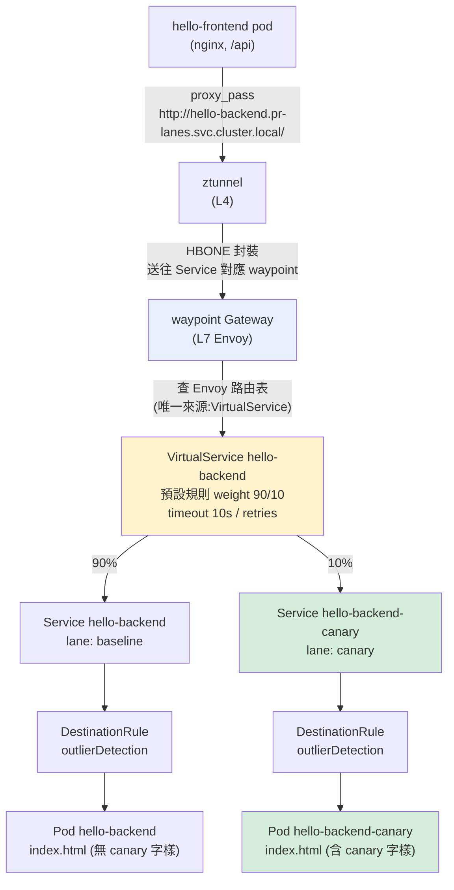
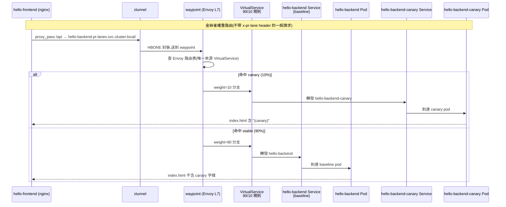

# K3s 金絲雀發佈(I 階段)實作機制解讀

日期:2026-08-27
環境:Oracle VPS 單節點 k3s(Cilium CNI),Istio Ambient mesh,`pr-lanes` 命名空間
關聯文檔:[I 階段設計文檔](../superpowers/specs/2026-08-22-k3s-phase-i-traffic-resilience-design.md)、[總結與驗證手冊](2026-08-26-k3s-mesh-capabilities-roadmap-summary.md)
本文件:解釋「金絲雀發佈」到底怎麼實現——用哪些模組、請求怎麼走、時序如何。不重複驗證步驟(那是總結手冊的事)。

---

## 1. 一句話總結

金絲雀發佈 = **Istio Ambient 的 `VirtualService` 權重路由** + **雙 Service 雙 Deployment(同一個 pinned image,不同 `index.html` 內容)**。`hello-frontend` 的 `/api` 代理到 `hello-backend` 這個 host,流量進 `waypoint` 後由 Envoy 按 `weight: 90/10` 切給 stable / canary 兩個 Service,各自有獨立 Pod。版本差異不靠不同 image,而是靠 ConfigMap 掛載不同內容,`curl`/肉眼即可分辨。

---

## 2. 用到的模組清單

全部位於 `pr-lanes` 命名空間,定義在 `vps_oracle/k3s/apps/hello/k8s/`。

| 模組 | 資源 | 檔案 | 角色 |
|---|---|---|---|
| **路由** | `VirtualService hello-backend` | `backend-virtualservice.yaml` | `hello-backend` host 唯一路由來源:90/10 權重 + timeout + retries + 故障注入 |
| **Service(stable)** | `hello-backend` | `backend-service.yaml` | selector `lane: baseline`,`istio.io/use-waypoint: waypoint` |
| **Service(canary)** | `hello-backend-canary` | `backend-canary-service.yaml` | selector `lane: canary`,`istio.io/use-waypoint: waypoint` |
| **Deployment(stable)** | `hello-backend` | `backend-deployment.yaml` | baseline,無 ConfigMap 覆蓋 |
| **Deployment(canary)** | `hello-backend-canary` | `backend-canary-deployment.yaml` | 掛載 canary ConfigMap |
| **ConfigMap** | `hello-backend-canary-conf` | `backend-canary-configmap.yaml` | canary 的 `index.html`(含 `(canary)` 字樣) |
| **DestinationRule(stable)** | `hello-backend` | `backend-destinationrule.yaml` | outlierDetection |
| **DestinationRule(canary)** | `hello-backend-canary` | `backend-canary-destinationrule.yaml` | outlierDetection |
| **Waypoint** | `Gateway waypoint` | `waypoint-gateway.yaml` | ambient 的 L7 處理點,`istio.io/waypoint-for: service` |
| **ServiceAccount** | `hello-backend-sa` | `backend-serviceaccount.yaml` | stable/canary 共用 |

**同一個 pinned image**:`ghcr.io/jeromefromcn/hello-backend@sha256:8b3dc...`——canary 不是不同 build,是同一鏡像掛不同內容。所以**版本區分靠 ConfigMap,不靠 image tag**。這是設計文檔明講的「零新元件」取捨:金絲雀不是新 infra,只是既有 app 的第二份 Deployment。

**PR 泳道機制是平行的、獨立的**(不屬於金絲雀,但同一 host 共存):
- `lane/` kustomize + `pr-lanes-appset.yaml` 的 ApplicationSet
- 帶 `x-pr-lane: <N>` header 的請求 → `HTTPRoute hello-backend-lane-route` → `hello-backend-pr-N` 泳道 Deployment/Service
- 它在 `parentRefs: hello-backend` 上,但帶 header 匹配,不會覆蓋金絲雀的無條件路由

---

## 3. 資料面路由選擇時序(flow)

---

## 4. 一次請求的完整時序(sequence)

---

## 5. 三個關鍵設計決策(為什麼這樣做)

1. **用 VirtualService 而非 Gateway API HTTPRoute 管權重**:
   設計文檔記載,原本規劃是 `HTTPRoute` 管一般流量、`VirtualService` 管故障注入。但實作發現兩者在同一 host 上衝突——HTTPRoute 的「無條件」規則(無 header 匹配)會整條覆蓋掉同 host 的 VirtualService 規則,導致故障注入的 header match 永遠不被評估。最終處置:刪除 `backend-httproute.yaml`,讓 VirtualService 一次扛起權重 + timeout + retries + 故障注入四種功能。

2. **雙 Service 模式而非 Istio subset**:
   金絲雀是兩個獨立 Service(`hello-backend` / `hello-backend-canary`),各自 selector、各自 Deployment、各自資源配額,互不干擾。DestinationRule 不設 subset,只有 outlierDetection——因為兩個 host 天生就分開了,subset 沒意義。

3. **同一 image + ConfigMap 區分版本,而非不同 image**:
   canary 沿用 pinned digest,只靠 `hello-backend-canary-conf` 掛載不同 `index.html`。優點:不用另建 CI pipeline/新 image,驗證時肉眼或 `curl` 就能分辨。代價:canary 無法測試「不同 build 的行為差異」,它只是內容變體,用途是驗證權重路由機制本身。

---

## 6. 金絲雀驗證面 vs 模組對照

驗證手冊 5.1 只驗了「權重分流」,但金絲雀能力完整覆蓋 4 個面:

| 驗證面 | 對應模組 | 驗證手冊章節 |
|---|---|---|
| 權重分流 90/10 | `VirtualService` weight | 5.1 |
| canary 版本真實在跑 | `Deployment hello-backend-canary` + ConfigMap | (5.1 未涵蓋) |
| PR 泳道 header 路由不受干擾 | `lane/` ApplicationSet + HTTPRoute | (需臨時建泳道) |
| 故障注入固定打 stable、不落 canary | `VirtualService` fault 規則(固定 destination 無 weight) | 5.2 |

---

## 7. 已知限制(本文件補充)

- canary 也是 `replicas: 1`,所以金絲雀權重把 PR 泳道並發容量從 8 條降到 7 條(quota 是硬上限)。
- canary 沒有獨立的 liveness/readiness probe 差異(與 baseline 相同)。
- 金絲雀權重只作用於「不帶 `x-pr-lane` header」的一般請求;帶泳道 header 的請求 100% 走泳道,不被權重分流。
- 故障注入固定打 stable,不測 canary 在故障情境下的行為(設計文檔刻意簡化)。

---

## 8. 關聯檔案

- `vps_oracle/k3s/apps/hello/k8s/backend-virtualservice.yaml`(權重路由核心)
- `vps_oracle/k3s/apps/hello/k8s/backend-canary-deployment.yaml` / `backend-canary-service.yaml` / `backend-canary-configmap.yaml` / `backend-canary-destinationrule.yaml`
- `vps_oracle/k3s/apps/hello/k8s/backend-service.yaml` / `backend-deployment.yaml` / `backend-destinationrule.yaml`
- `vps_oracle/k3s/apps/hello/k8s/frontend-configmap.yaml`(proxy_pass 呼叫方)
- `vps_oracle/k3s/apps/hello/k8s/waypoint-gateway.yaml`(waypoint)
- `vps_oracle/k3s/apps/hello/lane/`(PR 泳道,與金絲雀平行)
- `vps_oracle/k3s/argocd/apps/pr-lanes-appset.yaml`(泳道自動化)
