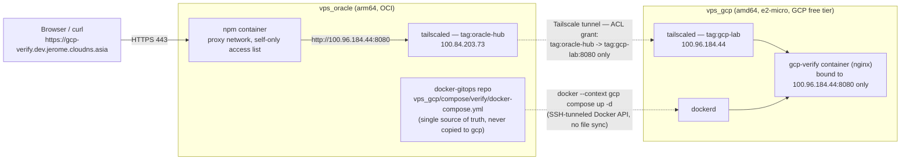

# Oracle ↔ GCP Mesh VPN via Tailscale, with Docker-Context-Driven Compose

Date: 2026-09-13
Status: live and verified end to end
Environment: `vps_oracle` (arm64, OCI, where this repo runs) ↔ `vps_gcp` (amd64, e2-micro, GCP free-tier practice instance, see `vps_gcp/tofu/README.md`)
Related docs: none — this was designed and built interactively in a single working session; no spec/plan document exists for it.
This document: what was built, why, and how — including two real near-misses that were caught and fixed along the way.

---

## 1. One-line summary

Connected `vps_oracle` and the `vps_gcp` practice instance with a Tailscale mesh VPN whose ACL policy only allows `vps_oracle` to reach `vps_gcp`, then reverse-proxied a GCP-hosted Docker service through oracle's existing NPM over that private tunnel — while keeping every `vps_gcp/compose/**` file living only in this repo (on oracle), driven remotely via `docker context` over SSH rather than any filesystem mount or second git clone.

## 2. Why do this

The original ask: build a mesh VPN between oracle and the GCP practice box, have oracle's NPM reverse-proxy a service that runs on GCP, and have GCP trust nothing except oracle — no one else, including someone who obtains the GCP instance's public IP directly, should be able to reach anything running there.

Underneath that, a second problem needed solving first: `vps_gcp` is a separate machine from where this repo lives, but `docker-gitops` is a single-repo, GitOps-first project (every `<host>/compose/<compose>/` directory is supposed to be "the actual working directory," no separate deploy path — see the root README). Naively that only holds for the machine the repo happens to be checked out on. Making GCP's compose stacks live under this repo without either duplicating the repo onto GCP or accepting a fragile live filesystem mount was a prerequisite for the VPN work to be worth doing at all.

## 3. Design decisions and alternatives considered

### 3.1 Getting `vps_gcp/compose/**` to run on GCP without moving the repo there

Three options were on the table:

| Option | Verdict | Why |
|---|---|---|
| sshfs mount, GCP is the real files, oracle mounts them in | Rejected | If the mount drops while `git commit` runs on oracle, git sees the whole `vps_gcp/` subtree as deleted and could stage that deletion. GCP's IP is also ephemeral (`tofu destroy`→`apply` changes it), so the mount needs a regenerate-on-IP-change script with no existing precedent here. |
| sshfs mount, reversed (oracle is the real files, GCP mounts them in) | Rejected | Moves the fragility rather than removing it: git on oracle becomes safe (real local disk), but every bind-mounted file a GCP container reads at runtime now depends on the tunnel back to oracle — exactly the dependency running Docker on GCP was meant to avoid. |
| **`docker context` (chosen)** | Adopted | The compose YAML and `.env` files stay purely on oracle, git is completely unaffected by network state. `docker context create gcp --docker "host=ssh://ubuntu@vps-gcp"` tunnels the Docker API over the *existing* SSH connection (`docker system dial-stdio` under the hood) — no new port on GCP, no TLS-less `dockerd -H tcp://` exposure. `docker --context gcp compose -f vps_gcp/compose/<stack>/docker-compose.yml up -d` builds/runs the containers on GCP's own daemon while being typed from oracle. |

A fourth option (a second, independent git clone on GCP + VS Code Remote-SSH multi-root workspace) was discussed as a valid alternative for a different problem — see §3.3 below for where it's actually the right tool.

**The one real limitation of `docker context`**: bind-mount (`volumes:`) paths in a compose file resolve against the *daemon's* filesystem (GCP), not the machine the CLI runs on (oracle) — because docker context is purely an API bridge, not a file-sync mechanism. `vps_gcp/compose/verify/docker-compose.yml` avoids this entirely by writing its one static file inline via `command:` instead of a bind mount. `.env` / `env_file:` values are unaffected by this limitation — compose reads and resolves those client-side (on oracle) before sending literal environment variables to the daemon, so no file needs to exist on GCP for those.

### 3.2 VPN choice: Tailscale

Considered Tailscale, plain WireGuard (hand-rolled `wg0.conf` on both ends), and Netbird (self-hosted coordination server). Chose **Tailscale**: minutes to stand up, NAT traversal and key exchange handled by its coordination plane, and its ACL "grants" model can express "only tag X may reach tag Y on port Z" directly, which is exactly the access shape this task needed. The trade-off accepted: a third-party coordination service is in the loop for control-plane traffic (data-plane traffic is still direct WireGuard between the two nodes, or relayed end-to-end encrypted via Tailscale's DERP when direct fails).

### 3.3 Which categories of infra in this repo can do "config on oracle, execution on GCP"

Asked and answered as a side discussion, since it generalizes past just `compose/`:

| Category | Verdict | Why |
|---|---|---|
| `compose/` | Yes (this doc) | Docker daemon has a real network API; `docker context` bridges it cleanly. |
| `k3s/` | Partially — different shape than compose | k8s's apiserver is also a network API, so ArgoCD/`kubectl` can already target a remote cluster. But standing up a *second, independent* k3s control plane on a 1 GB e2-micro is wasteful; the sounder version of "k3s on GCP" is joining GCP as an **agent** to oracle's existing cluster over the tailscale tunnel (`k3s agent --server https://<oracle-tailscale-ip>:6443`), scheduling specific pods there via `nodeSelector`. Not attempted in this session — flagged as a real resource question first (kubelet + containerd + CNI agent on 1 GB RAM, plus tunnel-in-tunnel overhead stacking k3s's own overlay on top of tailscale). |
| `host-native/` | No — but this was never a live-in-place model even on oracle itself | Things like `host-firewall.sh` and the inspector are already "edit in the repo → `cp` to `/usr/local/sbin` or `/etc/systemd/system` → `systemctl enable`," a copy-then-install pattern, not "runs directly out of the repo directory." Extending that to GCP is an explicit `scp` + `ssh systemctl ...` step — the same idiom this repo already uses, just now crossing a host boundary. |
| `dotfiles/` | No | Pure local symlinks (`vps_oracle/dotfiles/link.sh`) that shells/editors read from local disk at startup — there is no network-bridgeable API to lean on. Doing this for GCP would need either a `git sparse-checkout` clone of just `vps_gcp/dotfiles/` on GCP, or manual `scp`; either way the files must physically exist on GCP's disk. |

### 3.4 Restricting GCP to "only oracle, no one else"

Layered on purpose, not a single control:

1. **Tailscale ACL grants** — the tailnet's policy previously had a catch-all `{"src": ["*"], "dst": ["*"], "ip": ["*"]}` grant (default "allow everything" for a fresh tailnet). That was replaced with a single specific grant: `tag:oracle-hub` → `tag:gcp-lab`, `tcp:8080` only. Nothing else in the tailnet — including any future device added to it — can reach `tag:gcp-lab` at all unless another grant is added.
2. **Docker port binding** — `vps_gcp/compose/verify/docker-compose.yml` binds the service to GCP's own tailscale IP specifically (`100.96.184.44:8080:80`), not `0.0.0.0`. Nothing listens on GCP's public interface at all, regardless of what the ACL says — this is the mesh-VPN equivalent of putting a service on oracle's internal `proxy` docker network instead of publishing it to the host.
3. **GCP cloud firewall** — the `allow-http` / `allow-https` rules in `vps_gcp/tofu/firewall.tf` (previously `0.0.0.0/0` on 80/443) were deleted outright. GCP's public IP now only answers on port 22.

Tailscale itself needs none of these three to function: both peers connect *outward* (direct UDP hole-punch, or via DERP relay if that fails), so there is no inbound firewall rule to open for it either way.

## 4. How it was built

1. **Docker Engine installed on GCP** via the official `download.docker.com` apt repo (Ubuntu 24.04/noble); `ubuntu` added to the `docker` group so `docker context` over SSH needs no `sudo`.
2. **`docker context create gcp --docker "host=ssh://ubuntu@vps-gcp"`** created on oracle; verified with `docker --context gcp version` (confirms the SSH-tunneled Docker API reaches GCP's amd64 daemon from oracle's arm64 CLI).
3. **`vps_gcp/compose/verify/docker-compose.yml`** written: `nginx:1.27-alpine` (ships tzdata, per `compose-conventions.md`), no bind mount — the placeholder page is written inline via `command: sh -c "echo ... > /usr/share/nginx/html/index.html && nginx -g 'daemon off;'"`. First brought up with no published port at all, verified purely with `docker exec ... curl localhost` from inside the container, to prove the docker-context path worked before exposing anything.
4. **Tailscale installed on both hosts** via the official apt repo (both are Ubuntu 24.04/noble). `sudo tailscale up --hostname=<name>` run as a background task on each so the printed login URL could be handed to the human to authorize in a browser (Tailscale account auth isn't something an agent can complete on the user's behalf).
5. **Tailnet ACL policy rewritten** (the tailnet already used the newer `grants` syntax, not the legacy `acls` array) — see the final policy in §6. Applied by the user directly in the Tailscale admin console (`/admin/acls/file`); no API access to this was available from the agent side.
6. **Both nodes tagged**: `tailscale up --advertise-tags=tag:oracle-hub --reset` on oracle, `tag:gcp-lab` on GCP. (`tailscale set` does **not** support `--advertise-tags` — only `tailscale up` does; this had to be corrected mid-flight after the first attempt errored.)
7. **Compose file updated** to bind the service to GCP's tailscale IP (`100.96.184.44:8080:80`). This makes the stack a legitimate `compose-conventions.md` "publishes a host port" exception, so a `("verify", "verify")` entry with a reason was added to `PORT_EXCEPTIONS` in `.github/scripts/check-compose-conventions.py`.
8. **`docker --context gcp compose up -d`** to recreate the container with the new binding. Verified from oracle: tailscale IP:8080 → `HTTP 200`; GCP's public IP:8080 → connection timed out (confirms nothing is listening on the public interface, independent of the firewall).
9. **`vps_gcp/tofu/firewall.tf`**: removed the `google_compute_firewall.http` / `.https` resources, keeping only `allow-ssh`. Applied with `tofu apply` (see §5.1 for the near-miss this surfaced).
10. **NPM proxy host created** via `vps_oracle/compose/npm/add-proxy-host.sh gcp-verify.dev.jerome.cloudns.asia 100.96.184.44 8080` (domain follows the repo-wide `appName.dev.jerome.cloudns.asia` convention for dev/lab environments). Access list `self-only`. Before creating it, connectivity from **inside the `npm` container itself** was checked (`docker exec npm curl ... 100.96.184.44:8080`) rather than assumed from a host-shell test — this repo has a documented precedent (`docs/incidents/2026-08-19-npm-to-k3s-nodeport-outage.md`) of a docker-bridge container failing to reach an address that worked fine from the host shell.
11. End-to-end verified: `https://gcp-verify.dev.jerome.cloudns.asia/` → `HTTP 200`, body matches the container's inline placeholder content (see §5.2 for a wrinkle hit here too).

## 5. Two near-misses caught along the way

### 5.1 `tofu apply` almost deleted the live SSH key

`vps_gcp/tofu/instance.tf` computes the instance's `ssh-keys` metadata directly from `var.ssh_public_key`, which defaults to `""`. Per the (former) convention, that variable was meant to be injected only via `TF_VAR_ssh_public_key` at apply time, never persisted to `.auto.tfvars`. Because shell environment variables don't survive between separate shell invocations, any `tofu plan`/`apply` run without re-exporting it saw the *desired* metadata as empty — conflicting with the *live* metadata on GCP (which genuinely had a key installed, the one this session's own SSH access to GCP depends on). The plan for the unrelated firewall change also showed:

```
~ metadata = {
    - "ssh-keys" = "ubuntu:ssh-ed25519 ...claude-code@vps-gcp" -> null
  }
```

This was caught only because the full `tofu plan` output was read before applying, rather than assuming the diff would be limited to the two firewall resources actually being edited. Confirmed empirically (not just inferred) that this was the live, in-use key: `id_gcp.pub` on oracle, GCP's own `~/.ssh/authorized_keys`, and the value recorded in tofu state were byte-for-byte identical, and the drift was 100% reproducible by unsetting the env var and re-planning.

**Fix, two layers**:
- `ssh_public_key`'s actual value is now persisted directly in `vps_gcp/tofu/.auto.tfvars` — reclassified as non-secret (it's a *public* key, meant to be shared) rather than treated like a credential. The file is already gitignored for unrelated reasons (machine-specific identity values), so this adds no exposure.
- `google_compute_instance.vps` now has `lifecycle { ignore_changes = [metadata] }`, so no future `apply` — regardless of what `ssh_public_key` happens to resolve to in that shell — will ever touch this field again.
- `.claude/rules/tofu-conventions.md`'s "never keys" wording was clarified to mean private keys/credentials, not values like an SSH public key that are meant to be shared, so this fix doesn't read as a convention violation later.

### 5.2 NPM proxy host got the wrong access list

Right after creation, `https://gcp-verify.dev.jerome.cloudns.asia/` returned `HTTP 401 Authorization Required` instead of `200`. `add-proxy-host.sh` had printed `self-only -> id 1` during creation, and its "silently reset" recovery branch (a known NPM pitfall, documented in the `npm-proxy-host` skill) did not trigger. But the NPM API showed the live proxy host's `access_list_id` was actually `2` (`self-only-and-auth`, which layers HTTP Basic Auth on top) rather than `1` (`self-only`). The script's own logic reads correctly end to end; the discrepancy's exact cause wasn't confirmed — a concurrent session was independently using the same NPM API around the same time (see `docs/incidents/`-adjacent memory on concurrent sessions against this repo), which is the leading suspect but not proven. Fixed with a direct `PUT /api/nginx/proxy-hosts/40 {"access_list_id": 1}`; `HTTP 200` confirmed restored afterward.

## 6. Final verified state



| Check | Result |
|---|---|
| `curl http://100.96.184.44:8080/` from oracle | `HTTP 200`, body matches the container's content |
| `curl http://<gcp-public-ip>:8080/` from oracle | Connection timed out (no listener on the public interface) |
| `curl http://<gcp-public-ip>/` and `https://<gcp-public-ip>/` from oracle, after the firewall change | Both time out (80/443 rules removed; only 22 remains) |
| `ssh vps-gcp` | Still works — the SSH key survived the tofu apply |
| `tailscale ping 100.96.184.44` | Succeeded; observed both via DERP relay and, later, as a direct UDP connection |
| `docker exec npm curl http://100.96.184.44:8080/` | `HTTP 200` (verified from inside the npm container specifically, not just the host shell) |
| `curl https://gcp-verify.dev.jerome.cloudns.asia/` | `HTTP 200`, end to end |

Final Tailscale ACL policy (`grants` syntax):

```jsonc
{
	"tagOwners": {
		"tag:oracle-hub": ["autogroup:admin"],
		"tag:gcp-lab":    ["autogroup:admin"],
	},
	"grants": [
		// Only oracle-hub can reach gcp-lab, and only on the verify service's port.
		// The previous "allow all" default grant is intentionally removed —
		// nothing else in this tailnet can reach tag:gcp-lab at all.
		{"src": ["tag:oracle-hub"], "dst": ["tag:gcp-lab"], "ip": ["tcp:8080"]},
	],
	"ssh": [
		{
			"action": "check",
			"src":    ["autogroup:member"],
			"dst":    ["autogroup:self"],
			"users":  ["autogroup:nonroot", "root"],
		},
	],
}
```

## 7. What's left

- None of this session's changes were committed to git as of this writing — `vps_gcp/compose/verify/docker-compose.yml` (new), `.github/scripts/check-compose-conventions.py` (`PORT_EXCEPTIONS` entry), `.claude/rules/tofu-conventions.md` (wording), and `vps_gcp/tofu/firewall.tf`/`instance.tf` are pending a commit decision.
- A real service replacing the `verify` placeholder follows the exact same recipe: a new stack under `vps_gcp/compose/`, one more `grants` line in the tailnet ACL for its port, a docker-context `up -d`, and an NPM proxy host.
- k3s-agent-joins-GCP (§3.3) was analyzed but not attempted — worth a resource sanity check (RAM headroom on a 1 GB e2-micro) before pursuing it.
- Tailscale direct-vs-DERP-relay connectivity is informational only here; no action was needed since it self-selects automatically.
