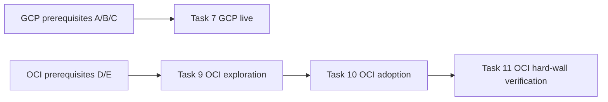

# OpenTofu integration — live-phase handoff checklist (runbook)

> This is the handoff material for the **live phase (Task 7 / 9–11)** of the OpenTofu integration plan. The static phase is complete and merged to `main`. This file is an operation guide + status snapshot, and can be deleted once the live phase has run to completion.

Related: plan [docs/superpowers/plans/2026-09-09-opentofu-integration.md](../superpowers/plans/2026-09-09-opentofu-integration.md), design [docs/superpowers/specs/2026-09-09-opentofu-integration-design.md](../superpowers/specs/2026-09-09-opentofu-integration-design.md).

## Status snapshot (2026-09-10)

| Item | Status |
|---|---|
| OpenTofu 1.12.6 | ✅ installed to `/usr/local/bin/tofu` (linux_arm64) |
| Static-phase Tasks 1–6, 8 | ✅ done, 8 commits, merged to `main` |
| Task 7 (GCP live acceptance) | ✅ done (user manually did the console prerequisites + apply; `tofu plan` = `No changes.`) |
| Task 9 (OCI exploration) | ✅ done, factsheet extracted (VCN `Claude code`, host is in public subnet 10.0.0.0/24) |
| Task 10 (OCI adoption) | ✅ done, 5 resources imported, `tofu plan` = `No changes.` (commit `524e313`) |
| Task 11 (OCI hard-wall verification) | ✅ done (negative verification: the instance data source returns an all-null empty shell; commit `c3cd47c`) |
| Four console prerequisites | ✅ all done |

## Execution order



**Recommend doing only the GCP side first (zero-risk warm-up); come back to the OCI side when there's time to build the Dynamic Group in the console.**

---

## 1. GCP side (Task 7 prerequisites, three items)

An empty free-tier e2-micro project; no need to create a project.

### A. Get the four IDs (needed for the tfvars)

1. **project_id**: the small text next to the name in the project selector at the top of the Console (looks like `my-project-123456`).
2. **project_number**: Console home → Project settings (or API & Services → Dashboard) → "Project number" (a pure number `123456789012`).
   - ⚠️ This is a **different ID from `project_id`**: `budget_filter` needs the numeric `project_number`, while the remaining resources need `project_id`.
3. **billing_account**: left-side Billing → billing account ID (looks like `A1B2C3-D4E5F6-G7H8I9`).

### B. Create a dedicated service account + three roles + key JSON

1. Console → IAM & Admin → Service Accounts → create a service account, name it `tofu-deploy`.
2. Grant three roles: `Compute Network Admin` (`roles/compute.networkAdmin`), `Compute Instance Admin (v1)` (`roles/compute.instanceAdmin.v1`), `Service Usage Admin` (`roles/serviceusage.serviceUsageAdmin`).
3. Go into the SA details → Keys → Add key → Create new key → **JSON**.
4. Store the downloaded `.json` outside the repo: `~/.config/tofu/gcp-tofu-deploy.json`, `chmod 600` to lock down.

### C. Grant `roles/billing.costsManager` at the billing-account level (easiest to miss)

The `google_billing_budget` permission **hangs off the billing account, not the project** — project-level roles, however complete, cannot govern the budget.

1. Console → Billing → enter the **billing account** (not the project page).
2. Account management / IAM permissions → Add member.
3. Add `tofu-deploy@<project>.iam.gserviceaccount.com` (the SA email), grant `Billing Account Costs Manager` (`roles/billing.costsManager`).

### D. Fill in `.auto.tfvars`

```bash
cd vps_gcp/tofu && cp .auto.tfvars.example .auto.tfvars
```

```hcl
project_id      = "my-project-123456"
project_number  = "123456789012"
billing_account = "A1B2C3-D4E5F6-G7H8I9"
```

```bash
export GOOGLE_APPLICATION_CREDENTIALS="$HOME/.config/tofu/gcp-tofu-deploy.json"
```

Once ready, Task 7 is run end-to-end by Claude: `tofu init → plan → apply → destroy → apply → plan` (final state `No changes.`).

---

## 2. OCI side (Task 9–11 prerequisites, two items)

This host is running all the services; **only network resources are adopted, compute instances are not touched** — so the IAM layer grants no instance-management capability.

### D. Get the host OCID + tenancy/compartment

```bash
curl -s http://169.254.169.254/opc/v2/instance/id   # local instance OCID
```

- **tenancy_ocid**: OCI Console → avatar at top-right → Tenancy → OCID.
- **compartment_id**: usually = the tenancy OCID (root compartment); if there's a dedicated compartment, use the corresponding value.
- **region**: the home region (looks like `ap-tokyo-1`).

### E. Create a Dynamic Group + a policy granting only `virtual-network-family`

1. **Dynamic Group**: Console → Identity & Security → Dynamic Groups → create, match rule (instance OCID):
   ```
   Any { instance.id = 'ocid1.instance.oc1...xxxx' }
   ```
2. **Policy**: Console → Identity & Security → Policies → create in the root compartment, **this one rule only**:
   ```
   allow dynamic-group <dynamic-group-name> to manage virtual-network-family in tenancy
   ```
   - ⚠️ **Do not** add `manage instance-family` / block storage — that is the IAM hard wall itself.

### F. Fill in `.auto.tfvars` (fill 3 items first, add the 5 OCIDs after exploration)

```bash
cd vps_oracle/tofu && cp .auto.tfvars.example .auto.tfvars
```

```hcl
region          = "ap-tokyo-1"
tenancy_ocid    = "ocid1.tenancy.oc1..xxxx"
compartment_id  = "ocid1.compartment.oc1..xxxx"
# leave the following 5 empty for now, fill in after Task 9 exploration:
vcn_ocid              = ""
subnet_ocid           = ""
internet_gateway_ocid = ""
route_table_ocid      = ""
security_list_ocid    = ""
```

OCI uses Instance Principal — **no key, zero credentials on disk**. Once the three items are filled in and the Dynamic Group/policy created, `tofu init` can explore.

---

## 3. How to resume after reopening a session

Tell Claude: **"Continue the OpenTofu live phase; first read `docs/opentofu-live-runbook.md` and the plan docs"**, and clearly state which of the console prerequisites above are done and which aren't. Claude will take over from Task 7 (GCP) or Task 9 (OCI) in order, and will still confirm the prerequisites with you item by item before the live steps.

## 4. Wrap-up self-check (before merge; re-check after the live phase has run)

- [x] `git status` clean, no `.tfstate`, no `.auto.tfvars` (with real values), no `probe.tf` / `wall-check.tf` leftovers.
- [x] `.terraform.lock.hcl` committed (one per module, two modules).
- [x] the CI `tofu` job passes on a clean checkout (`fmt -check` + `init` + `validate`) — ran all-green locally, plus fixed one pre-existing `instance.tf` fmt issue.
- [x] the `vps_oracle/tofu/` `destroy` red line is recorded in both `tofu-conventions.md` and `vps_oracle/tofu/README.md`.
- [x] Phase 3 (not promised in the spec) was not mistakenly included in this plan.

> This file's mission is complete (the live phase has fully run) and it can be deleted. The OCI-side operational knowledge has been distilled into `vps_oracle/tofu/README.md` (the `manage_default_resource_id` gotcha + the hard wall's silent behavior).