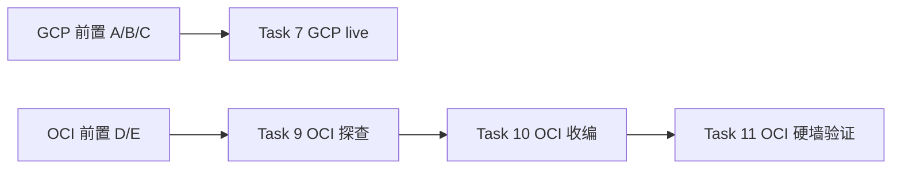

# OpenTofu 集成 — live 阶段交接清单（runbook）

> 这是 OpenTofu 集成计划的 **live 阶段（Task 7 / 9–11）** 交接材料。静态阶段已完成并合并到 `main`。本文件是操作指引 + 状态快照，live 阶段跑完后可删除。

关联：计划 [docs/superpowers/plans/2026-09-09-opentofu-integration.md](../superpowers/plans/2026-09-09-opentofu-integration.md)、设计 [docs/superpowers/specs/2026-09-09-opentofu-integration-design.md](../superpowers/specs/2026-09-09-opentofu-integration-design.md)。

## 状态快照（2026-09-09）

| 事项 | 状态 |
|---|---|
| OpenTofu 1.12.6 | ✅ 已装到 `/usr/local/bin/tofu`（linux_arm64） |
| 静态阶段 Task 1–6、8 | ✅ 完成，8 commit，合并 `main`（FF merge，尚未 push） |
| Task 7（GCP live 验收） | ⏳ 待前置 |
| Task 9–11（OCI 探查/收编/硬墙验证） | ⏳ 待前置 |
| 四个 console 前置 | ❌ 未做（只能用户手动） |

## 执行顺序



**建议先只做 GCP（零风险暖手）；OCI 那半等有空去 console 建 Dynamic Group 再上。**

---

## 一、GCP 侧（Task 7 前置，三项）

免费层 e2-micro 空置项目，不用建项目。

### A. 拿四个 ID（tfvars 要填）

1. **project_id**：Console 顶部项目选择器里名字旁的小字（形如 `my-project-123456`）。
2. **project_number**：Console 首页 → 项目设置（或 API & Services → 仪表板）→「项目编号 / Project number」（纯数字 `123456789012`）。
   - ⚠️ 与 `project_id` 是**两个不同 ID**：`budget_filter` 要数字型 `project_number`，其余资源要 `project_id`。
3. **billing_account**：左侧结算 / Billing → 账单账号 ID（形如 `A1B2C3-D4E5F6-G7H8I9`）。

### B. 建专用 service account + 三角色 + key JSON

1. Console → IAM 和管理 → 服务账号（Service Accounts）→ 创建服务账号，命名 `tofu-deploy`。
2. 授三个角色：`Compute Network Admin`（`roles/compute.networkAdmin`）、`Compute Instance Admin (v1)`（`roles/compute.instanceAdmin.v1`）、`Service Usage Admin`（`roles/serviceusage.serviceUsageAdmin`）。
3. 进入 SA 详情 → 密钥（Keys）→ 添加密钥 → 创建新密钥 → **JSON**。
4. 下载的 `.json` 存到仓库外：`~/.config/tofu/gcp-tofu-deploy.json`，`chmod 600` 收权。

### C. 账单账户层授 `roles/billing.costsManager`（最易踩空）

`google_billing_budget` 权限**挂在账单账户、不是项目**，项目层角色再全也管不到预算。

1. Console → 结算 / Billing → 进入**账单账户**（不是项目页）。
2. 账户管理 / IAM 权限 → 添加成员。
3. 把 `tofu-deploy@<project>.iam.gserviceaccount.com`（SA 邮箱）加进来，授 `Billing Account Costs Manager`（`roles/billing.costsManager`）。

### D. 填 `.auto.tfvars`

```bash
cd vps_gcp/tofu && cp .auto.tfvars.example .auto.tfvars
```

```hcl
project_id      = "pro-century-270314"
project_number  = "1072540592283"
billing_account = "010BE7-1329E9-4D635F"
```

```bash
export GOOGLE_APPLICATION_CREDENTIALS="$HOME/.config/tofu/gcp-tofu-deploy.json"
```

就绪后 Task 7 全程由 Claude 跑：`tofu init → plan → apply → destroy → apply → plan`（终态 `No changes.`）。

---

## 二、OCI 侧（Task 9–11 前置，两项）

这台正在跑所有服务，**只收编网络资源、不碰运算实例**，IAM 层就不给碰实例的能力。

### D. 拿本机 OCID + tenancy/compartment

```bash
curl -s http://169.254.169.254/opc/v2/instance/id   # 本机实例 OCID
```

- **tenancy_ocid**：OCI Console → 右上角头像 → 租户（Tenancy）→ OCID。
- **compartment_id**：通常 = tenancy OCID（根 compartment）；有专门 compartment 则取对应值。
- **region**：home region（形如 `ap-tokyo-1`）。

### E. 建 Dynamic Group + 只授 `virtual-network-family` 的 policy

1. **Dynamic Group**：Console → 身份与安全 → 动态组 → 创建，匹配规则（实例 OCID）：
   ```
   Any { instance.id = 'ocid1.instance.oc1...xxxx' }
   ```
2. **Policy**：Console → 身份与安全 → 策略 → 在 root compartment 创建，**只此一条**：
   ```
   allow dynamic-group <动态组名> to manage virtual-network-family in tenancy
   ```
   - ⚠️ **不要**加 `manage instance-family` / block storage——那是 IAM 硬墙本体。

### F. 填 `.auto.tfvars`（先填 3 项，5 个 OCID 探查后补）

```bash
cd vps_oracle/tofu && cp .auto.tfvars.example .auto.tfvars
```

```hcl
region          = "ap-tokyo-1"
tenancy_ocid    = "ocid1.tenancy.oc1..xxxx"
compartment_id  = "ocid1.compartment.oc1..xxxx"
# 下面 5 个先留空，Task 9 探查后填实：
vcn_ocid              = ""
subnet_ocid           = ""
internet_gateway_ocid = ""
route_table_ocid      = ""
security_list_ocid    = ""
```

OCI 用 Instance Principal，**无 key、磁盘零凭据**。填好三项 + 建完 Dynamic Group/policy 即可 `tofu init` 探查。

---

## 三、重开 session 后怎么继续

对 Claude 说：**「继续 OpenTofu live 阶段，先读 `docs/opentofu-live-runbook.md` 和计划文档」**，并把上面哪几项 console 前置已完成、哪几项还没做说清楚。Claude 会从 Task 7（GCP）或 Task 9（OCI）按序接管，live 步骤前仍会逐项跟你确认前置。

## 四、收尾自检（合并前，live 阶段跑完再核对）

- [ ] `git status` 干净，无 `.tfstate`、无 `.auto.tfvars`（含实值）、无 `probe.tf` / `wall-check.tf` 残留。
- [ ] `.terraform.lock.hcl` 已提交（两个 module 各一份）。
- [ ] CI `tofu` job 能在干净 checkout 上通过（`fmt -check` + `init` + `validate`）。
- [ ] `vps_oracle/tofu/` 禁 `destroy` 红线已在 `tofu-conventions.md` 与 `vps_oracle/tofu/README.md` 两处。
- [ ] spec 未承诺的 Phase 3 未误放进本计划。