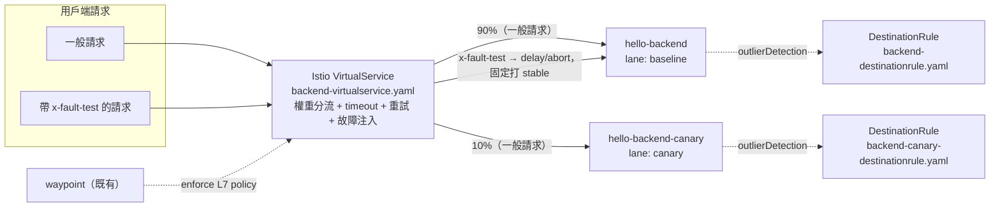

# K3s Phase I — 流量彈性與路由治理設計

日期：2026-08-22

對應 [K3s 服務網格能力補完路線圖](2026-08-19-k3s-mesh-capabilities-roadmap.md) 的 I 階段：金絲雀權重路由、超時重試、熱斷（outlier detection）、故障注入。交付物：`pr-lanes` 具備完整的流量治理能力，可用於後續的漸進式發布與 chaos 測試。

前置：[Phase F+G](2026-08-18-k3s-phase-fg-mesh-pr-lanes-design.md) 已完成並驗證通過，`pr-lanes` 命名空間裝好 Istio Ambient（istiod + ztunnel + istio-cni + waypoint）與 Gateway API，`hello-backend`/`hello-frontend` baseline 加上 PR 泳道的 header 路由都在跑。

## 範圍

**這階段要做的：**
- 新增 `hello-backend-canary`（`lane: canary`）作為真實的第二版本，`k8s/backend-httproute.yaml` 的 `backendRefs` 改成 `hello-backend`(90%) / `hello-backend-canary`(10%) 權重分流，同時加上 `timeouts`（`request: 10s`, `backendRequest: 8s`）
- `hello-backend`、`hello-backend-canary` 各自一份 `DestinationRule`，只放 `outlierDetection`（`consecutive5xxErrors: 3, interval: 30s, baseEjectionTime: 30s, maxEjectionPercent: 100`——原規劃 50，Task 4 實作時改為 100，因兩個 backend 都是 `replicas: 1`，50% 會無條件捨去成 0 個可踢出的 endpoint，等於整個功能靜默失效）
- 一份 `VirtualService`，只匹配 `x-fault-test: "true"` header 才注入 delay/abort，平時零流量影響
- 重試機制先在實作階段確認 Gateway API standard channel 的 `HTTPRoute` 是否原生支援 retry 欄位；若沒有，改用 `VirtualService.http[].retries`

**這階段不做的（留給後續階段或明確排除）：**
- PR 泳道（`lane/` 底下的 kustomize 模板與 `pr-lanes-appset.yaml`）不套用本階段任何資源——只動 `k8s/` 下的靜態 baseline 資源，不碰動態產生的每個 PR namespace 資源，範圍收斂、風險最小
- AuthorizationPolicy（細粒度存取控制）——路線圖已排到獨立的 J 階段，失敗模式與本階段完全不同（誤配置會直接斷流量），不混在一起
- 指標/日誌/追蹤接 `lab-environment`——K 階段的範圍
- 限流——L 階段的評估性範圍，且 Gateway API 目前裝的是 standard channel，不含限流需要的 experimental API
- `hello-frontend` 不做任何金絲雀/熱斷/故障注入——它只是靜態頁面轉發 `/api` 到 `hello-backend`，本階段的流量治理只對 `hello-backend` 有意義

## 現狀約束

延續路線圖本身列出的三項：
- 記憶體 headroom 比 F+G 當時更緊（2026-08-19 實測 available 6.2Gi，swap 用掉 85%），本階段新增 `hello-backend-canary` 這一個真實 Deployment 是唯一會消耗常駐資源的改動，其餘（`DestinationRule`、`VirtualService` 的權重/timeout/重試欄位）都是純控制面配置，零額外 pod
- `pr-lanes-quota` 卡得緊（`limits.cpu: 1200m / limits.memory: 1536Mi`），新增資源要先確認不會撞上限（見下方「資源預算」）
- Gateway API 是 standard channel，不含 experimental API——這點不影響本階段（金絲雀權重、timeout 都是 standard channel 已有的欄位），但直接限制了重試欄位是否可用，必須在實作階段查證

## 架構



`VirtualService` 是 `hello-backend` host 唯一的路由設定來源：一般請求（無 header）走預設規則的權重分流（90/10）與 timeout/重試；帶 `x-fault-test` header 的請求另外匹配到 delay/abort 規則，注入故障後固定打 `hello-backend`（stable），不含權重分流的隨機性，讓 chaos 測試結果可預期、可重現。這不是原本的設計——原本規劃是 `HTTPRoute` 管一般流量的金絲雀分流、`VirtualService` 只管故障注入（見下方「元件與設定」表），但實作階段（Task 3）發現兩者無法在同一 host 上共存：`HTTPRoute` 的規則沒有任何 header 匹配條件，Istio 把它與 `VirtualService` 的規則合併進 waypoint 的同一張 Envoy 路由表時，這種「無條件」規則會整條覆蓋掉同 host 的 `VirtualService` 規則，導致故障注入的 header match 完全不會被評估到。問題根源是規則「無條件」，不是它的 weight/timeout 內容——所以最終處置是刪除整份 `backend-httproute.yaml`，讓 `VirtualService` 一次扛起金絲雀權重、timeout、重試、故障注入四種功能，而不是收窄 HTTPRoute 的匹配範圍去跟 VirtualService 分工。詳見「已知限制」。

## 元件與設定

| 項目 | 決定 | 理由 |
|---|---|---|
| 金絲雀權重機制 | `VirtualService.http[].route[].weight`（`backend-virtualservice.yaml` 的預設路由規則），兩個獨立 Service（`hello-backend` / `hello-backend-canary`），不用 Istio 傳統的 subset 機制 | 原規劃走 Gateway API `HTTPRoute.backendRefs[].weight`，Task 3 因 HTTPRoute 與 VirtualService 在同一 host 上衝突而刪除 HTTPRoute 後，權重分流併入 VirtualService（見「架構」段落與已知限制）。語意不變：一樣是在多個目的地之間切，不是在同一 Service 底下切 subset；用兩個 Service 仍是 Gateway API 推薦的金絲雀模式精神延續，讓兩個版本各自的 Deployment/label/資源配額完全獨立、互不干擾 |
| DestinationRule 是否與金絲雀共用 | 不共用——`hello-backend`、`hello-backend-canary` 各一份，只放 outlier detection，不放 subset | 路線圖原本留的懸念（[待細化的設計取捨](2026-08-19-k3s-mesh-capabilities-roadmap.md)）。因為權重分流走 Gateway API 的雙 Service 模式，`DestinationRule` 沒有 subset 可切，共用一份沒有意義，兩個獨立 host 天生就要兩份 |
| 金絲雀比例 | 90/10 | demo 用途的示範值，之後要調整只是改一個數字，不影響機制本身 |
| canary 版本的實際差異 | 沿用同一張 pinned image（`nginxinc/nginx-unprivileged`），用 ConfigMap 掛載不同的 `index.html`（沿用 `frontend-configmap.yaml` 的 checksum annotation 慣例），顯示文字含「canary」字樣 | 不用另外建 CI pipeline/新 image，驗證時用肉眼或 `curl` 就能分辨打到哪個版本；符合路線圖「零新元件」精神——這裡新增的是既有 app 的另一份 Deployment，不是新的基礎設施元件 |
| Timeout 值 | `request: 10s`, `backendRequest: 8s` | `hello-backend` 是靜態頁面回應應在毫秒等級，10s/8s 是刻意寬鬆的示範值，用來驗證機制生效（可用故障注入的 delay 測試被 timeout 擋下），不是為了保護真實延遲敏感的服務 |
| Retry 實作方式 | 定案：`VirtualService.http[].retries`（`attempts: 2, perTryTimeout: 2s, retryOn: 5xx,reset,connect-failure`），與金絲雀權重、timeout、故障注入同一份 `backend-virtualservice.yaml` | 原規劃留待實作階段查證 Gateway API standard channel 的 `HTTPRoute` 是否原生支援 retry 欄位；但 Task 3 已因 HTTPRoute/VirtualService 衝突刪除 HTTPRoute，VirtualService 成為唯一路由來源後，retries 自然併入同一份 VirtualService，不再是需要另外決策的獨立問題 |
| 熱斷（outlier detection）參數 | `consecutive5xxErrors: 3, interval: 30s, baseEjectionTime: 30s, maxEjectionPercent: 100`（原規劃 50，Task 4 實作時改為 100） | Istio 官方文件/範例的典型示範值是 50%，換算成人話：連續 3 次 5xx 就丟出輪詢池 30 秒；但兩個 backend 都是 `replicas: 1`，50% 會無條件捨去成 0 個可踢出的 endpoint，等於整個功能靜默失效，所以改成 100——單一副本場景下，被踢出的上限本來就只有那唯一一個 endpoint |
| 故障注入觸發方式 | 只匹配 `x-fault-test: "true"` header，其餘規則不變 | 已跟你確認過——不常駐套用在正常流量上，平時零影響，要做 chaos 測試才手動加 header |
| 故障注入的目標版本 | 固定打 `hello-backend`（stable），不經過金絲雀權重 | 簡化設計：故障測試要的是「這個特定版本在故障情境下的行為」，如果還疊加隨機的權重分流，同一次測試兩次結果可能打到不同版本，結果不可預期、難以比對 |
| VirtualService 與 HTTPRoute 共存 | 不共存——`HTTPRoute`（`backend-httproute.yaml`）已在 Task 3 刪除，`VirtualService` 是 `hello-backend` host 唯一的路由設定來源，同時處理一般流量的權重分流、timeout、重試，以及 header 觸發的故障注入 | 路線圖原本預期兩者可以分工共存（「故障注入需要 VirtualService，CRD 已經在」），但實測發現 Istio 把 Gateway API 與傳統 API 的規則合併進同一張 Envoy 路由表時，`HTTPRoute` 的無條件規則（沒有 header 匹配條件）會整條覆蓋掉同 host 的 `VirtualService` 規則——故障注入的 header match 永遠不會被 Envoy 評估到。根源是規則「無條件」而非其 weight/timeout 內容，所以處置是刪除整份 HTTPRoute，不是收窄它，詳見已知限制 |

## Repo 佈局

```
vps_oracle/k3s/apps/hello/k8s/
  backend-canary-configmap.yaml       # 新增：canary 版本的 index.html 覆蓋內容
  backend-canary-deployment.yaml      # 新增：hello-backend-canary，lane: canary
  backend-canary-service.yaml         # 新增：hello-backend-canary Service
  backend-destinationrule.yaml        # 新增：hello-backend 的 outlier detection
  backend-canary-destinationrule.yaml # 新增：hello-backend-canary 的 outlier detection
  backend-virtualservice.yaml         # 新增：權重分流 + timeout + 重試 + header 觸發式故障注入，
                                       # 唯一路由設定來源。backend-httproute.yaml 曾短暫存在
                                       # （Task 2）又在 Task 3 刪除——見「架構」與「已知限制」
```

全部落在既有的 `k8s/` 目錄，沿用 `backend-*` 命名慣例，ArgoCD 既有的 `hello` Application 會自動撿到新檔案，不需要新增 Application 或改 Kustomization 入口（`k8s/` 目前沒有 `kustomization.yaml`，是 ArgoCD 直接指向目錄，新檔案自動生效）。

## 資源預算

新增的唯一常駐 workload 是 `hello-backend-canary`（沿用 `lane/deployment.yaml` 的資源配置：`requests: 25m/64Mi`, `limits: 100m/128Mi`）。

| | requests.cpu | requests.memory | limits.cpu | limits.memory |
|---|---|---|---|---|
| 既有靜態常駐（waypoint + frontend + backend baseline） | 100m | 256Mi | 400m | 512Mi |
| + hello-backend-canary | 25m | 64Mi | 100m | 128Mi |
| 小計 | 125m | 320Mi | 500m | 640Mi |
| `pr-lanes-quota` 上限 | 400m | 768Mi | 1200m | 1536Mi |
| 剩餘給 PR 泳道 | 275m | 448Mi | 700m | 896Mi |

每條 PR 泳道的 `hello-backend-pr-N`（`lane/deployment.yaml`）用量是 `requests: 25m/64Mi`, `limits: 100m/128Mi`。用 limits 算（quota 卡的是 limits）：`700m / 100m = 7`，`896Mi / 128Mi = 7`——**可同時開啟的 PR 泳道數從約 8 條降到約 7 條**。這是選擇部署真實 canary Deployment 的直接代價，屬於預期內、算過的取捨，不是本階段實作中才發現的意外。

`DestinationRule`、`VirtualService` 的權重/timeout/重試欄位都是純控制面配置，不佔用 quota。

## 驗證清單（phase I 過關標準）

**金絲雀權重：**
1. `kubectl -n pr-lanes get application hello` → `Synced` + `Healthy`
2. 連續發送多次請求（不帶任何特殊 header），統計打到 stable vs canary 的比例接近 90/10（用回應內容裡的「canary」字樣區分）
3. `hello-backend-canary` pod `Running`，不影響既有 PR 泳道路由（帶 `x-pr-lane` header 的請求仍 100% 打中對應泳道的 backend，不受權重分流影響）

**超時：**
4. 用故障注入的 delay（`fixedDelay: 15s` > 同一條規則的 `timeout: 10s`）驗證 timeout 是否能截斷同規則上的 `fault.delay`——結果：不能。實測請求跑完整整 ~15s 才回應 `200`（Task 5 smoke test：`200 15.007575s`），不是預期中 timeout 對應的錯誤碼。這是 `fault.delay` 與 `timeout` 疊加在同一條 Envoy 規則上時的行為限制（推測是 route timeout 計時器要到 router filter 開始處理 upstream request 才起算，晚於 fault filter 的 decode-time delay），不是本階段的設定錯誤，詳見「已知限制」

**重試：**
5. 依實作階段查證結果（Gateway API 原生 or VirtualService fallback），用暫時把某個 pod 故意調成不健康的方式驗證重試確實發生（觀察 waypoint/envoy 的 access log 有多次嘗試記錄）

**熱斷：**
6. 手動讓 `hello-backend` 其中一個 pod 連續回傳 5xx（可暫時改 readiness 邏輯或用 fault injection 的 abort 對內部測試），確認達到 `consecutive5xxErrors` 閾值後該 endpoint 被踢出輪詢池，`istioctl proxy-config endpoint` 或 waypoint 的統計指標能看到 ejection 記錄
7. `baseEjectionTime` 過後，確認該 endpoint 自動恢復回輪詢池

**故障注入：**
8. 不帶 `x-fault-test` header 的正常請求完全不受影響，延遲/成功率與本階段改動前一致
9. 帶 `x-fault-test: "true"` header 的請求確實被注入 delay/abort，且固定打中 `hello-backend`（stable），不會意外落到 canary

**共存驗證（本階段技術風險最高的一項，已在 Task 3 解決）：**
10. 同時存在 `HTTPRoute`（金絲雀）與 `VirtualService`（故障注入）時，用 `istioctl proxy-config route` 檢查 waypoint 實際下發的 Envoy 路由表，確認兩者規則是否都生效、有沒有互相覆蓋——結果：確實衝突。`HTTPRoute` 的規則沒有 header 匹配條件，屬於「無條件」規則，Istio 把兩者合併進同一張路由表時，這種無條件規則會整條覆蓋掉同 host 的 `VirtualService` 規則，導致故障注入的 header match 從未被 Envoy 評估到。處置：刪除 `backend-httproute.yaml`，讓 `VirtualService` 成為 `hello-backend` 唯一的路由設定來源，一次扛起權重、timeout、重試、故障注入四種功能，而不是收窄 HTTPRoute 的匹配範圍去跟 VirtualService 分工。詳見「架構」段落與「已知限制」

**資源：**
11. `kubectl describe resourcequota pr-lanes-quota -n pr-lanes` 確認新增資源後 used 未超過 hard 上限
12. 全部既有 Application 複查仍 `Synced` + `Healthy`，證明沒有誤傷任何現存服務（含正在跑的 PR 泳道，若當下有開啟中的 PR）

## 已知限制 / 失敗模式

- **HTTPRoute 與 VirtualService 混用同一 host 確實衝突，已在 Task 3 解決**：驗證清單第 10 項的疑慮成真——用 `istioctl proxy-config route` 對照兩者規則內容與 waypoint 實際下發的 Envoy 路由表後確認，`HTTPRoute` 的無條件規則（沒有 header 匹配條件）整條覆蓋掉了同 host 的 `VirtualService` 規則，`VirtualService` 的 header match 完全不會被評估到。根源是規則「無條件」，不是 weight/timeout 的內容本身——收窄 HTTPRoute 的匹配範圍理論上也能解，但既然 `VirtualService` 已經能表達同樣的權重分流語意，沒有理由維持兩份設定互相打架的架構，所以處置是直接刪除 `backend-httproute.yaml`，讓 `VirtualService` 成為 `hello-backend` 唯一的路由設定來源。詳見「架構」段落與「元件與設定」表
- **`x-fault-test: delay` 的 `timeout: 10s` 不會截斷 15s 的注入延遲**：實測請求跑完整整 ~15s 才回應，回應碼是 `200`，不是預期中 timeout 對應的錯誤碼。假說（現象已確認，根因尚未完全證實）：Envoy 的 route timeout 計時器似乎是從 router filter 開始處理 upstream request 才起算，而 fault filter 的 decode-time delay 是在 router filter 之前執行完的，所以延遲注入花掉的時間不算進 `route.timeout` 的計時窗口。透過 Envoy config dump 確認過設定本身編譯正確（欄位沒寫錯），這是 `fault.delay` 與 `timeout` 疊加使用時 Envoy 本身的行為限制，不是本階段的設定錯誤。不影響既有機制——Task 4 的熱斷驗證用的是 `abort`，不是 `delay`，沒有依賴這個組合生效
- **`x-fault-test: abort` 不會觸發熱斷（outlier detection）的 ejection，且是架構性、非偶發的限制**：Envoy 的 fault-injection abort 會直接回傳 local reply，請求根本不會派送到 upstream cluster——outlier detection 的 `consecutive5xxErrors` 計數器讀的是 upstream cluster 自己的請求/失敗統計，永遠看不到被 fault filter 短路掉的請求。實測用一個乾淨的自然實驗直接證明：連續發送 6 次帶 `x-fault-test: abort` 的請求後，upstream cluster 的 `rq_total` 計數器維持在 `0`；緊接著發一次不帶 header 的正常請求，`rq_total` 立刻跳到 `1`。這代表 fault-injected 的請求從頭到尾沒有被算進 upstream 的任何統計——這是 Envoy fault filter 在 router filter 之前短路的設計本身決定的，不是本階段配置錯誤，也不是「這次剛好沒測到」的偶發結果，換成任何用同樣方式配置的其他服務都會是一樣的結果。要真的驗證熱斷生效，需要讓 upstream 真的收到請求並回傳 5xx（例如讓 pod 本身故障，而非用 fault injection 模擬），這超出本階段用 fault injection 做 chaos 測試的既定範圍，留給後續階段視需要再處理
- **金絲雀權重降低了 PR 泳道並發容量**（8→7 條），如果之後同時開的 PR 數經常逼近這個上限，需要重新評估是否要把 canary 拆成非常駐（例如只在驗證金絲雀機制時才臨時開啟），但目前沒有跡象顯示會撞到，先不處理
- **故障注入固定打 stable，不會測試 canary 版本在故障情境下的行為**：如果之後需要測 canary 版本的故障恢復能力，本階段的 VirtualService 設計需要擴充成可選目標，目前刻意簡化
- **canary 版本目前沒有獨立的健康檢查/liveness probe 設定**：沿用最簡設定即可，因為 canary 只是同一個 nginx 靜態頁面換內容，跟 baseline 的 `backend-deployment.yaml` 一樣沒有特殊健康邏輯需要照顧

## 交棒給 phase J

Phase J（AuthorizationPolicy）會在同一個 `hello-backend`/`hello-backend-canary` 之上加東西向存取控制，需要確認本階段新增的 `hello-backend-canary` Service 也要被涵蓋進授權範圍（不能只授權 `hello-backend`，漏掉 canary 導致金絲雀流量被意外擋下）。J 階段設計時應該重新讀一次本文件的「元件與設定」表，把 canary 加進涵蓋清單。

本階段驗證出的「Gateway API 與傳統 Istio API 混用同一 host」的實際行為（驗證清單第 10 項）——確實有衝突，無條件的 Gateway API 規則會覆蓋掉同 host 的傳統 API 規則——也是後續 K/L 階段若要用 `EnvoyFilter` 或其他傳統 Istio 機制時的重要參考，L 階段評估 `EnvoyFilter` 限流路徑時務必把這個風險納入考量。
