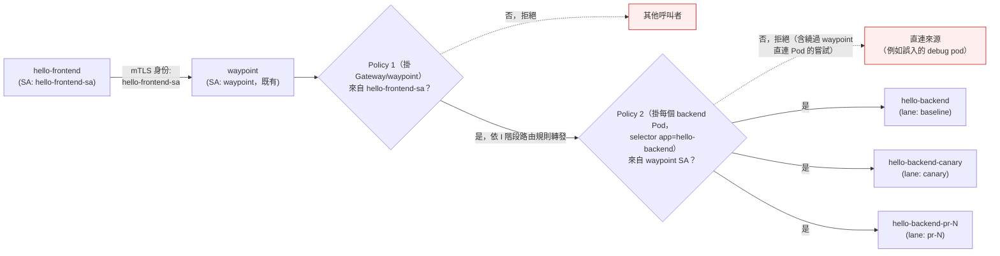

# K3s Phase J — 細粒度存取控制設計

日期：2026-08-23

對應 [K3s 服務網格能力補完路線圖](2026-08-19-k3s-mesh-capabilities-roadmap.md) 的 J 階段：AuthorizationPolicy，限定 `hello-frontend`→waypoint→`hello-backend`（及各 PR 泳道 backend）之間的合法呼叫關係。交付物：網格內東西向流量有身份層級的准入控制，非法呼叫在 ztunnel/waypoint 層被拒絕。

前置：[Phase I](2026-08-22-k3s-phase-i-traffic-resilience-design.md) 已完成並合入 main，`hello-backend`/`hello-backend-canary` 的金絲雀權重、timeout、重試、故障注入都由 `backend-virtualservice.yaml` 承載；PR 泳道路由（`lane/httproute.yaml`）維持 header match，未受影響。J 階段完全獨立於這些路由設定之上疊加身份層級的准入控制，不修改它們。

## 範圍

**這階段要做的：**
- 新增 `hello-frontend-sa`、`hello-backend-sa` 兩個 `ServiceAccount`，取代目前所有 `hello-*` workload 共用的 `default` ServiceAccount——這是做 workload 層級授權的前提，沒有可辨識身份就無法在 `AuthorizationPolicy` 裡表達「只有 frontend 能呼叫 backend」
- `hello-frontend`（`frontend-deployment.yaml`）掛 `hello-frontend-sa`；`hello-backend`（`backend-deployment.yaml`）、`hello-backend-canary`（`backend-canary-deployment.yaml`）、PR 泳道 backend 模板（`lane/deployment.yaml`）都掛 `hello-backend-sa`——backend 的三個變體視為同一個「角色」，共用身份，不逐版本區分
- 兩份 `AuthorizationPolicy`，缺一不可（原因見下方「元件與設定」與「已知限制」，這是設計過程中修正過的關鍵決策，不是隨意的雙保險）：
  - `backend-authorizationpolicy-waypoint.yaml`：用 `targetRefs` 掛在 `waypoint` 這個 Gateway 資源本身，`action: ALLOW`，只允許來自 `hello-frontend-sa` 身份——這是限制「誰能呼叫 backend」的主策略
  - `backend-authorizationpolicy-require-waypoint.yaml`：用 `selector.matchLabels: {app: hello-backend}` 掛在 backend Pod 上，`action: ALLOW`，只允許來自 `waypoint` 自己身份（`cluster.local/ns/pr-lanes/sa/waypoint`）——這是防止繞過 waypoint 直連 Pod 的配套策略，對沒有 `use-waypoint` label 的 PR 泳道 backend 而言是唯一防線
- 上線走 Audit-first 節奏：waypoint 掛載的主策略先以 `istio.io/dry-run: "true"` annotation 套用，觀察一輪確認無誤殺，再拿掉 annotation 正式生效（細節見下方「上線節奏」）

**這階段不做的（留給後續階段或明確排除）：**
- HTTP method/path 層級的請求授權——只做「哪個 workload 能呼叫哪個 workload」的服務層級控制。路線圖本身把這列為待細化取捨，這裡定案為服務層級：`hello-backend` 目前只有一個簡單端點，method/path 粒度沒有實際防禦收益，且會需要透過 waypoint 做 L7 判斷、策略數量隨 PR 泳道增長，維運成本不成比例
- 限制誰能呼叫 `hello-frontend`——它透過 NodePort（`frontend-service.yaml`）對外開放，是刻意設計的公開入口，不在授權收斂範圍內。**釐清這保證的實際邊界**：本階段保證的是「工作負載身份」——只有帶著 `hello-frontend-sa` 這個 mTLS 身份的呼叫者能到達 `hello-backend`，不是「傳遞可達性」——任何人都還是可以經由 `hello-frontend` 自己的 `/api` 反向代理路徑、以 `hello-frontend` 的身份間接打到 `hello-backend`，因為本階段完全沒有限制誰能先呼叫 `hello-frontend` 本身。這不是一個缺陷（`hello-frontend` 本來就是刻意設計的公開入口，這條間接路徑本來就沒有比既有 NodePort 曝露更多東西），但未來讀者不應該把這個安全保證過度解讀成「只有 hello-frontend 自身發起的流量、且限定某個來源，才能到達 hello-backend」
- 修改 I 階段的 `VirtualService`/`DestinationRule`/`httproute.yaml`——J 階段的 `AuthorizationPolicy` 是疊加在既有路由之上的獨立層，不改動路由規則本身
- 指標/日誌/追蹤——K 階段範圍
- 限流——L 階段的評估性範圍

## 現狀約束

延續路線圖本身列出的資源約束：`AuthorizationPolicy`、`ServiceAccount` 都是純控制面資源，不佔用 `pr-lanes-quota` 的 CPU/記憶體額度，不影響 I 階段算出的 7 條 PR 泳道並發容量。

延續路線圖對 J 階段的明文要求：授權策略配置錯誤（尤其誤切成 deny-by-default）會直接把 `pr-lanes` 內部東西向流量全部擋掉，等同重演 [2026-08-19 NPM NodePort 事故](../../incidents/2026-08-19-npm-to-k3s-nodeport-outage.md)的同類坑——本階段的驗證步驟必須包含觀察期，不能直接上生產模式。

## 架構



Policy 1 在 waypoint 這一跳評估「原始呼叫者是不是 `hello-frontend-sa`」——這一跳看得到真實身份，因為 waypoint 是流量第一個進入 mesh 強制點的地方。Policy 2 在每個 backend Pod 自己的 ztunnel 評估「這個連線是不是來自 waypoint」——這一跳看不到原始呼叫者身份（官方文件證實：waypoint 轉發給下游時，目的地 ztunnel 看到的是 waypoint 自己的身份，見「已知限制」），所以只能也只需要檢查「是不是從 waypoint 來的」，兩層合起來才等於「只有經過 waypoint 授權的 `hello-frontend` 呼叫能到達 backend」。三個 backend 變體都掛同一個 `hello-backend-sa`（Policy 1 判斷時用得到），也都被同一份 Policy 2 的 `selector.matchLabels: {app: hello-backend}` 選中——新增 PR 泳道時不需要修改或新增任何授權資源，`kustomize` 模板套用 `serviceAccountName` 後自動繼承兩層保護。

## 元件與設定

| 項目 | 決定 | 理由 |
|---|---|---|
| ServiceAccount 粒度 | 兩個：`hello-frontend-sa`（frontend 專用）、`hello-backend-sa`（baseline/canary/所有 PR 泳道共用） | 目前全部 workload 共用 `default` SA，無法用 mTLS 身份區分呼叫者。`source.namespaces` 因 frontend/backend 同在 `pr-lanes` 而無法區分；IP-based 規則在 Pod 重建後失效，不可靠。backend 三變體共用一個身份是因為它們是同一個「角色」，J 階段的授權語意是「frontend 能不能呼叫 backend 角色」，不是逐版本區分 |
| 授權粒度 | 服務層級（workload 對 workload），不含 HTTP method/path | 見上方「範圍」段落，路線圖列的待細化取捨在此定案 |
| 為什麼要兩份 `AuthorizationPolicy`，不是一份 | 官方文件證實（[istio.io](https://istio.io/latest/docs/tasks/security/authorization/authz-waypoint/)、[ambientmesh.io](https://ambientmesh.io/docs/security/waypoint-authz/)）：waypoint 轉發流量到下游 Service 時，若該 Service 沒有 `use-waypoint` label，目的地 ztunnel 看到的來源身份是 waypoint 自己，不是原始呼叫者。`hello-backend-pr-N` 正是這種情況（它的 Service 沒有 `use-waypoint`，靠 `hello-backend` 的 waypoint 轉發過去）。單一份掛在 backend Pod 上、檢查 `hello-frontend-sa` 的 `AuthorizationPolicy`，在 PR 泳道這條路徑上永遠看到的是 waypoint 身份，會誤擋所有合法流量——這正是原設計（見本文件先前版本）標記為「待查證」的風險，查證後證實會出錯，見「已知限制」 | 見下兩列 |
| Policy 1（主策略） | `targetRefs` 指向 `kind: Gateway, group: gateway.networking.k8s.io, name: waypoint`，`action: ALLOW`，`rules[].from.source.principals: ["cluster.local/ns/pr-lanes/sa/hello-frontend-sa"]` | 掛在 waypoint 本身而非個別 backend，在流量第一次進入 mesh 強制點（waypoint）這一跳評估，這裡看得到原始呼叫者的真實身份，不受「轉發給下游」的身份遮蔽影響。同一個 waypoint 承接 baseline/canary/所有 PR 泳道的路由（I 階段架構），掛在這裡天然涵蓋全部下游目標，不用逐一列舉 |
| Policy 2（配套策略，強制流量必須經過 waypoint） | `selector.matchLabels: {app: hello-backend}`，`action: ALLOW`，`rules[].from.source.principals: ["cluster.local/ns/pr-lanes/sa/waypoint"]` | 只允許來自 waypoint 自己身份的流量抵達 backend Pod，擋掉任何繞過 waypoint、直接打 Pod IP 或無 waypoint label 的 Service 的嘗試。對 baseline/canary 是 Policy 1 之外的縱深防禦；對 PR 泳道 backend（Service 本身沒有 `use-waypoint`）則是唯一防線——沒有這份策略，繞過 `hello-backend` 直接呼叫 `hello-backend-pr-N.pr-lanes.svc.cluster.local` 完全不受 Policy 1 管轄 |
| 不擔心 kubelet liveness/readiness probe 被 Policy 2 擋掉 | 已查證排除：ambient 對 kubelet 探測流量有專門豁免——探測封包被 SNAT 成固定 link-local 位址（`169.254.7.127`），ztunnel 辨識這個位址後直接放行，完全不經過 `AuthorizationPolicy` 身份檢查，這是 ambient 架構內建設計，J 階段不需要為此另外處理 | 這是實作前主動查證排除的風險，不是留到上線後才發現的意外 |
| 上線機制 | Policy 1（waypoint/Envoy 承載）先套 `istio.io/dry-run: "true"` annotation 觀察，確認無誤殺後拿掉 annotation；Policy 2（ztunnel 承載）直接走人工比對，不套 dry-run | Policy 1 掛在 waypoint（完整 Envoy），dry-run shadow 模式原生支援。Policy 2 的 dry-run 是 Istio 1.29 才加的 ztunnel 新功能，需要額外在 istiod 開一個叢集層級 feature flag（`AMBIENT_ENABLE_DRY_RUN_AUTHORIZATION_POLICY=true`）才能用，超出「只改 pr-lanes 應用層資源」的範圍，不值得為這一份策略去動 istiod 叢集層設定；Policy 2 的行為本身也很單純可預期（現有架構下只有 waypoint 會直連這些 Pod），人工比對足夠 |

## Repo 佈局

```
vps_oracle/k3s/apps/hello/k8s/
  frontend-serviceaccount.yaml               # 新增：hello-frontend-sa
  backend-serviceaccount.yaml                # 新增：hello-backend-sa
  backend-authorizationpolicy-waypoint.yaml  # 新增：Policy 1，targetRefs Gateway/waypoint，ALLOW from hello-frontend-sa
  backend-authorizationpolicy-require-waypoint.yaml
                                              # 新增：Policy 2，selector app=hello-backend，ALLOW from waypoint SA
  frontend-deployment.yaml         # 修改：加 spec.template.spec.serviceAccountName: hello-frontend-sa
  backend-deployment.yaml          # 修改：加 serviceAccountName: hello-backend-sa
  backend-canary-deployment.yaml   # 修改：加 serviceAccountName: hello-backend-sa

vps_oracle/k3s/apps/hello/lane/
  deployment.yaml                  # 修改：加 serviceAccountName: hello-backend-sa
                                    # （模板變更，未來每條動態 PR 泳道自動繼承，
                                    #  不需要改 pr-lanes-appset.yaml 的 patch 清單）
```

全部落在既有的 `k8s/` 與 `lane/` 目錄，沿用既有命名慣例。`k8s/` 下新檔案由 ArgoCD 既有的 `hello` Application 自動撿到，不需要新增 Application 或改 Kustomization 入口。`lane/kustomization.yaml` 目前只列出 `deployment.yaml`/`service.yaml`/`httproute.yaml` 三個 resources，不需要新增條目——只是編輯既有 `deployment.yaml` 的內容。

值得一提的新隱性依賴：`lane/deployment.yaml` 是由另一個 ArgoCD Application（`pr-lanes` ApplicationSet，跟建立 `hello-backend-sa` 的 `hello` Application 不是同一個）渲染出來的，現在引用了 `hello` Application 才會建立的 `hello-backend-sa`。若 `hello-backend-sa` 未來被誤刪、或 `hello` Application 的同步壞掉，新開的 PR 泳道 Pod 會因為找不到 ServiceAccount 而排程失敗——但錯誤訊息是 Kubernetes 常見的 serviceaccount-lookup 失敗，不會明顯指向「跟 mesh 授權有關」，除錯時容易繞遠路。機率低但目前沒有文件記錄，這裡點出即可。

## 上線節奏

1. 先合入本階段全部 YAML（兩個 `ServiceAccount`、Policy 2、四個 Deployment 的 `serviceAccountName` 欄位，以及帶 `istio.io/dry-run: "true"` annotation 的 Policy 1）——Policy 2 不走觀察期直接生效是刻意的，見下方理由
2. Policy 2 直接生效後先做人工比對：檢視現有架構（[Phase F+G](2026-08-18-k3s-phase-fg-mesh-pr-lanes-design.md)/I 階段設計）確認目前不存在任何非 waypoint 直連 backend Pod 的合法路徑，再用 smoke test 對 baseline/canary/（若有開啟中的 PR 泳道）逐一確認正常流量不受影響
3. Policy 1 觀察期：檢查 waypoint 的 log 或 `istio_dry_run_allow`/`istio_dry_run_deny` metric，確認：
   - 目前所有打到 `hello-backend`/`hello-backend-canary`/`hello-backend-pr-N` 的合法流量（來自 `hello-frontend`）都落在 `dry_run_allow`
   - 沒有非預期的 `dry_run_deny`
4. 若 dry-run annotation 在這個 waypoint 上沒有輸出任何記錄（判定為不支援）：降級為人工比對，直接檢視 waypoint access log／執行 smoke test，人工確認 `hello-backend` 系列目前的呼叫來源只有 `hello-frontend`，不依賴 dry-run 記錄
5. 觀察期無異常後，移除 Policy 1 的 `istio.io/dry-run` annotation，正式生效（Enforce）
6. 比照 E 階段：Audit→Enforce 的切換是人工判斷，不做自動定時切換

Policy 2 為什麼不比照 Policy 1 走 dry-run 觀察期：它的判斷條件極度單純（來源是不是 waypoint 的身份），且現有架構下（Policy 2 生效前）本來就只有 waypoint 會建立到 backend Pod 的連線——沒有其他元件曾經、或設計上會直連這些 Pod，人工比對「現狀確實如此」跟跑一輪自動化觀察期能確認的事情是一樣的，不因為省略觀察期而降低確定性。

## 驗證清單（phase J 過關標準，implement 階段會再細化成逐步驟）

**上線前置：**
1. `kubectl -n pr-lanes get application hello` → `Synced` + `Healthy`
2. 兩個 `ServiceAccount` 建立成功，三個 backend Deployment 與 frontend Deployment 的 Pod 都掛上對應 SA（`kubectl get pod -o jsonpath='{.spec.serviceAccountName}'`）

**Policy 2 生效後（人工比對，見上線節奏）：**
3. 正常走 `hello-frontend` 的請求（含帶 `x-pr-lane` header 打中對應泳道、金絲雀權重分流打中 canary）延遲/成功率不受影響
4. kubelet 對三個 backend 變體的 liveness/readiness probe 持續正常（`kubectl get pods -l app=hello-backend` 沒有非預期的 `Restarts` 增加），驗證「已知限制」裡排除的 kubelet 探測豁免機制在這個叢集上確實生效

**Policy 1 dry-run 觀察期：**
5. 正常走 `hello-frontend` 的請求在 dry-run 記錄裡全部是 allow，沒有非預期 deny
6. 若當下有開啟中的 PR 泳道，特別確認它的 dry-run 記錄也是 allow

**Policy 1 切 Enforce 後：**
7. 正常請求（同第 3、5 項的路徑）延遲/成功率與 J 階段改動前一致
8. 用一個不具備 `hello-frontend-sa` 身份的來源（例如臨時 debug pod，用 `default` SA）呼叫 `hello-backend`/`hello-backend-canary` 的 Service 主機名稱——因為這兩個 Service 本身就有 `use-waypoint` label，ztunnel 會自動把這個請求導去 waypoint，這就是 Policy 1 的驗證路徑，確認被拒絕（`PERMISSION_DENIED` 或連線被拒）
9. **繞過 waypoint 的直連測試**，驗證 Policy 2 這一層防線獨立生效、不依賴 Policy 1：
   - 對 `hello-backend`/`hello-backend-canary`：Service 主機名稱本身會被導去 waypoint（見第 8 項），要測真正的繞過必須直接打 **Pod IP**（`kubectl -n pr-lanes get pod -o wide` 取得 IP，直接 curl `http://<pod-ip>:8080/`），跳過 Service 層級的 waypoint 導流機制
   - 若當下有開啟中的 PR 泳道：`hello-backend-pr-N` 的 Service 本身沒有 `use-waypoint` label，直接 curl 它的 Service 主機名稱（不需要用 Pod IP）就已經是真正的繞過路徑
   - 兩種情況都應該被拒絕
10. 若當下有開啟中的 PR 泳道，重跑第 6 項對應的正常流量路徑，確認 Enforce 後仍然放行
11. `kubectl describe resourcequota pr-lanes-quota -n pr-lanes` 確認新增資源未消耗 quota（預期無變化，`ServiceAccount`/`AuthorizationPolicy` 不計入）
12. 全部既有 Application 複查仍 `Synced` + `Healthy`

## 已知限制 / 待查證風險

- **waypoint 轉發給無 `use-waypoint` label 的下游 Service 時身份會遮蔽——已查證確認，並已在設計裡修正**：原設計只用一份掛在 backend Pod 上的 `AuthorizationPolicy` 檢查 `hello-frontend-sa`，這份文件較早版本把這點列為「待查證風險」。查證結果（[istio.io](https://istio.io/latest/docs/tasks/security/authorization/authz-waypoint/)、[ambientmesh.io/docs/security/ztunnel-authz](https://ambientmesh.io/docs/security/ztunnel-authz/)）：確認會出錯——「waypoint 轉發給無 waypoint label 的下游時，目的地 ztunnel 看到的是 waypoint 自己的身份」是 Istio ambient 的既定行為，不是這個叢集特有的異常，`hello-backend-pr-N` 這種沒有 `use-waypoint` label 的 PR 泳道 Service 正中此問題。官方文件給的修正方式就是本文件現在採用的兩份策略設計（Policy 1 掛 Gateway/waypoint 檢查原始身份、Policy 2 掛 Pod 檢查是否來自 waypoint），已經是文件正式定案的部分，不再是待查證項目
- **`istio.io/dry-run` annotation 在 waypoint（完整 Envoy）上原生支援，在 ztunnel 上是 Istio 1.29+ 才有的新功能且需要額外的 istiod 叢集層 feature flag——這一點已在 Task 3 上線 Policy 1 時實地驗證，不再是待查證項目**：Policy 1 掛 `istio.io/dry-run: "true"` 上線後，觀察的正確訊號**不是**這份文件原先設想的 waypoint log grep（`kubectl logs deploy/waypoint | grep dry.run` 實測沒有任何輸出），而是 Envoy admin stats 端點（`pilot-agent request GET stats`）裡的 `rbac.istio_dry_run_allow_.shadow_denied` counter——在觀察期間精確跟著產生的測試流量遞增（1 筆呼叫後為 1，追加 20 筆後為 21），同時真正的 `rbac.allowed`/`rbac.denied` 全程維持 0，證實 dry-run 期間沒有任何真實攔截發生。這證實了「dry-run 在 waypoint 完整 Envoy 上原生支援」這句話在這個叢集上真的成立，且給出了具體可重複的觀察方法，取代原本上線節奏第 4 步「若沒有輸出則降級為人工比對」這個備案——備案沒有被觸發到。另外，Policy 1 存活期間 `status.conditions` 顯示 `type: ZtunnelAccepted, status: "False", reason: UnsupportedValue`，訊息提到「ztunnel 不支援 dry-run」——這是誤導性的紅鯡魚，因為 Policy 1 用 `targetRefs` 掛在 waypoint 這個 Gateway 上，走的是 waypoint 的 Envoy RBAC filter（L7），根本不經過 ztunnel，這個狀態欄位講的是 ztunnel（跟 Policy 2 這種 pod-selector 策略相關）的支援狀況，不反映 Policy 1 實際的執行路徑。但也因此浮現一個真正的可觀測性缺口：在這個 Istio 版本上，對於用 `targetRefs` 掛 Gateway 的策略，沒有任何 CRD status 欄位能給出「waypoint 已接受這份策略」的正面訊號——`ZtunnelAccepted` 講的是別的路徑，沒有對應的 `WaypointAccepted` 或等價欄位。唯一能確認的方法是行為觀察：Envoy admin stats、istiod 的 ADS push log、實際流量測試，三者都要靠人工執行，不是看一眼 `kubectl get authorizationpolicy` 的狀態就能判斷。日後為 waypoint-targeted 策略除錯時，直接跳過 `status.conditions`，改用這三種方法
- **誠實補充：上面這個觀察窗口從未實際觀察到一筆合法身份的請求被 shadow-allow，Audit-first 的紀律在這次實作裡沒有被完整落實**：整個 dry-run 觀察期間，`rbac.istio_dry_run_allow_.shadow_denied` 遞增的來源全部是刻意送入、不具備 `hello-frontend-sa` 身份的臨時 debug pod 呼叫；對應的 `rbac.istio_dry_run_allow_.shadow_allowed` counter 全程維持 `0`——也就是說，dry-run 窗口本身從未真的觀察到一筆帶有合法 `hello-frontend-sa` 身份的請求被 shadow-allow。真正的前端流量成功（`200`）第一次被確認，是在 Task 4 把 Policy 1 切到 Enforce 之後才發生的（見上方 Task 4/5 流量測試），不是在 dry-run 觀察窗口期間。理論上「先確認合法流量會被 shadow-allow，再切 Enforce」才是完整的 Audit-first 驗證，但實際上是切完 Enforce 後才第一次確認合法路徑可通，這中間存在一個真實的驗證缺口。緩解脈絡：`pr-lanes` 是驗證用的 lab 命名空間 demo app，沒有真實使用者流量；若切換出錯，回退是一次 `git revert` 就能修復的單一 commit；且實際上合法路徑（`hello-frontend` → `hello-backend`）在切 Enforce 後幾分鐘內就確認正常，曝險窗口很短
- **除了 stats counter，還有更直接的方法能判斷一份掛在 Gateway 上的 `AuthorizationPolicy` 現在是 dry-run 還是真的在 enforce，且不需要先有流量**：`kubectl -n pr-lanes exec deploy/waypoint -- pilot-agent request GET config_dump`——若該策略的規則出現在 RBAC filter 的 `rules` 區塊，代表正在 enforce；若出現在 `shadow_rules` 區塊，代表仍是 dry-run。這個方法直接讀 waypoint 自己的 proxy 設定，回答的是「這份策略現在是什麼模式」，不像上面的 stats counter 方法要有測試流量先打進來才會出現數字。兩種方法互補：config_dump 適合「不想等流量、想立刻確認當下模式」，stats counter 適合「已經有流量、想確認實際攔截/放行分布」
- **`status.conditions` 在拿掉 `istio.io/dry-run` annotation、切到 Enforce 之後，仍然停留在 dry-run 時代的舊訊息——已查證這是永久性的顯示缺陷，不是短暫的同步延遲**：Task 4 移除 annotation（只改 `metadata.annotations`，不改 `spec`）後，`status.conditions[0]` 持續顯示先前的 `UnsupportedValue` / dry-run 訊息，`observedGeneration` 卡在 `"1"` 不動；原因是 annotation-only 的編輯不會推進 Kubernetes 物件的 `metadata.generation`，而 Istio 這個狀態欄位的寫入邏輯看起來是以 generation 為觸發條件，generation 沒變就不會重新計算狀態。Task 4 完成後約 20 分鐘以上再次獨立複查，`status.conditions` 仍然逐字相同——排除了「只是同步還沒追上」的可能性，這個欄位在沒有 spec 層級變更的情況下大概率不會自行清除。實際生效與否已透過行為證據確認：istiod ADS push log（`Push debounce stable ... for config AuthorizationPolicy/pr-lanes/hello-backend-waypoint-frontend-only`）證實設定確實被重新推送到資料面；Task 4/5 的流量測試（非法身份收到 `403`，真實 `hello-frontend-sa` 身份收到 `200`）證實規則確實在生效。日後除錯這份策略時，不要等這個狀態欄位變乾淨——它很可能永遠不會，除非物件之後又有 spec 層級的變更帶動 generation 前進；應該直接看行為證據
- **kubelet 對 backend Pod 的健康檢查已查證不受 Policy 2 影響**：ambient 對 kubelet 探測流量的豁免機制（SNAT 成固定 link-local 位址）在架構層級解決了這個疑慮，但仍然列在驗證清單第 4 項用實際的 `Restarts` 計數確認這個叢集上的行為與文件記載一致，不完全只憑文件判斷
- **`hello-backend-sa` 是三個 backend 變體共用的單一身份，無法用這兩份 `AuthorizationPolicy` 區分「只允許呼叫 baseline，不允許呼叫 canary」這類更細的限制**：目前不需要——J 階段的授權語意本來就是「frontend 能不能呼叫 backend 角色」，不是版本層級的存取控制。若未來需要版本層級限制，需要重新拆分 ServiceAccount，屬於後續階段的範圍
- **Policy 1 掛在 waypoint 這個共用 Gateway 資源上，若未來有其他 Service 也開始使用同一個 waypoint（目前只有 hello-backend 系列使用），會自動被納入「只允許 hello-frontend-sa」的限制範圍**：這是刻意接受的耦合，不是疏漏——目前 `pr-lanes` 命名空間只有一個共用 waypoint，且路線圖現狀約束裡沒有其他服務計畫接入這個 waypoint。若未來有新服務要共用這個 waypoint 但需要不同的呼叫者限制，需要拆成多個 waypoint 或重新設計 Policy 1 的 targetRefs 範圍，屬於超出本階段的未來工作
- **Policy 2 對 PR 泳道 backend（`hello-backend-pr-N`）的保護，這整輪實作（Task 2、Task 4、Task 5 三次機會點）期間都沒有機會用真正存在的 PR 泳道實地測試過**：三次檢查時 `kubectl -n argocd get applications | grep hello-pr` 都回傳空——沒有任何 `hello-pr-*` Application 存在。如「Repo 佈局」與「Policy 2」那一列所述，`hello-backend-pr-N` 的 Service 沒有 `use-waypoint` label，Policy 2 是它唯一的防線；這條防線目前只透過架構分析（selector `app: hello-backend` 涵蓋所有 backend 變體，PR 泳道模板本來就繼承這個 label）與 Policy 2 對 baseline/canary 的通用機制驗證（Task 2、Task 4、Task 5 都確認 Policy 2 正常擋下直連 Pod IP 的繞過嘗試）間接佐證為有效，並未對一個真正的 `hello-backend-pr-N` 目標實地驗證過直連 Service 主機名稱（不需要 Pod IP，因為它本來就沒有 waypoint 導流）會被擋下。下次有真正的 PR 泳道開啟時，應該補做這項測試——對應驗證清單第 6、9、10 項——確認理論推導與實際行為一致

## 交棒給後續階段

K 階段（可觀測性接入）要把 `pr-lanes` 的指標/日誌/追蹤指向 `lab-environment`，這條路徑是 `lab-environment` 主動去 scrape/pull `pr-lanes` 內 istiod/ztunnel/waypoint 的既有 Prometheus 端點，不涉及呼叫 `hello-frontend`/`hello-backend` 應用層端點，也不會被本階段新增的 `AuthorizationPolicy`（`selector` 只選中 `app: hello-backend`）影響——K 階段設計時仍應重新確認這個假設，不要預設兩者一定不衝突。

L 階段若走 `EnvoyFilter` 路徑做限流，`EnvoyFilter` 與本階段的 `AuthorizationPolicy` 都是在 waypoint 的 Envoy 上疊加設定，理論上互相獨立的過濾器鏈不會衝突，但 L 階段評估時應該把「J 階段已經在 waypoint 上跑一份 RBAC filter」列入考量。
