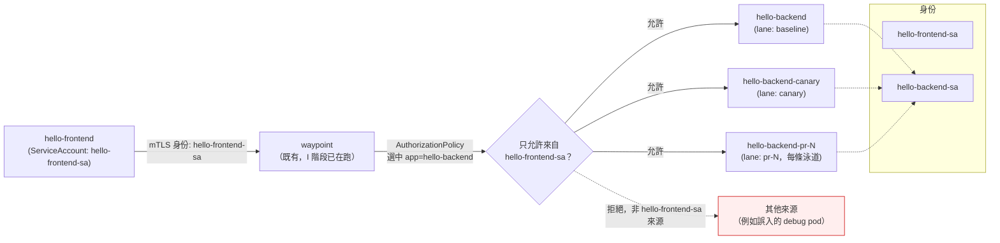

# K3s Phase J — 細粒度存取控制設計

日期：2026-08-23

對應 [K3s 服務網格能力補完路線圖](2026-08-19-k3s-mesh-capabilities-roadmap.md) 的 J 階段：AuthorizationPolicy，限定 `hello-frontend`→waypoint→`hello-backend`（及各 PR 泳道 backend）之間的合法呼叫關係。交付物：網格內東西向流量有身份層級的准入控制，非法呼叫在 ztunnel/waypoint 層被拒絕。

前置：[Phase I](2026-08-22-k3s-phase-i-traffic-resilience-design.md) 已完成並合入 main，`hello-backend`/`hello-backend-canary` 的金絲雀權重、timeout、重試、故障注入都由 `backend-virtualservice.yaml` 承載；PR 泳道路由（`lane/httproute.yaml`）維持 header match，未受影響。J 階段完全獨立於這些路由設定之上疊加身份層級的准入控制，不修改它們。

## 範圍

**這階段要做的：**
- 新增 `hello-frontend-sa`、`hello-backend-sa` 兩個 `ServiceAccount`，取代目前所有 `hello-*` workload 共用的 `default` ServiceAccount——這是做 workload 層級授權的前提，沒有可辨識身份就無法在 `AuthorizationPolicy` 裡表達「只有 frontend 能呼叫 backend」
- `hello-frontend`（`frontend-deployment.yaml`）掛 `hello-frontend-sa`；`hello-backend`（`backend-deployment.yaml`）、`hello-backend-canary`（`backend-canary-deployment.yaml`）、PR 泳道 backend 模板（`lane/deployment.yaml`）都掛 `hello-backend-sa`——backend 的三個變體視為同一個「角色」，共用身份，不逐版本區分
- 一份 `AuthorizationPolicy`（`k8s/backend-authorizationpolicy.yaml`），用 `selector.matchLabels: {app: hello-backend}` 選取所有 backend 變體的 Pod（baseline/canary/現在及未來的 PR 泳道，全部共用 `app: hello-backend` label，只有 `lane` 值不同），`action: ALLOW`，只允許來自 `hello-frontend-sa` 身份的請求
- 上線走 Audit-first 節奏：先以 `istio.io/dry-run: "true"` annotation 套用，觀察一輪確認無誤殺，再拿掉 annotation 正式生效（細節見下方「上線節奏」）

**這階段不做的（留給後續階段或明確排除）：**
- HTTP method/path 層級的請求授權——只做「哪個 workload 能呼叫哪個 workload」的服務層級控制。路線圖本身把這列為待細化取捨，這裡定案為服務層級：`hello-backend` 目前只有一個簡單端點，method/path 粒度沒有實際防禦收益，且會需要透過 waypoint 做 L7 判斷、策略數量隨 PR 泳道增長，維運成本不成比例
- 限制誰能呼叫 `hello-frontend`——它透過 NodePort（`frontend-service.yaml`）對外開放，是刻意設計的公開入口，不在授權收斂範圍內
- 修改 I 階段的 `VirtualService`/`DestinationRule`/`httproute.yaml`——J 階段的 `AuthorizationPolicy` 是疊加在既有路由之上的獨立層，不改動路由規則本身
- 指標/日誌/追蹤——K 階段範圍
- 限流——L 階段的評估性範圍

## 現狀約束

延續路線圖本身列出的資源約束：`AuthorizationPolicy`、`ServiceAccount` 都是純控制面資源，不佔用 `pr-lanes-quota` 的 CPU/記憶體額度，不影響 I 階段算出的 7 條 PR 泳道並發容量。

延續路線圖對 J 階段的明文要求：授權策略配置錯誤（尤其誤切成 deny-by-default）會直接把 `pr-lanes` 內部東西向流量全部擋掉，等同重演 [2026-08-19 NPM NodePort 事故](../../incidents/2026-08-19-npm-to-k3s-nodeport-outage.md)的同類坑——本階段的驗證步驟必須包含觀察期，不能直接上生產模式。

## 架構



三個 backend 變體都掛同一個 `hello-backend-sa`，也都被同一份 `selector.matchLabels: {app: hello-backend}` 的 `AuthorizationPolicy` 選中——新增 PR 泳道時不需要修改或新增任何授權資源，`kustomize` 模板套用 `serviceAccountName` 後自動繼承。

## 元件與設定

| 項目 | 決定 | 理由 |
|---|---|---|
| ServiceAccount 粒度 | 兩個：`hello-frontend-sa`（frontend 專用）、`hello-backend-sa`（baseline/canary/所有 PR 泳道共用） | 目前全部 workload 共用 `default` SA，無法用 mTLS 身份區分呼叫者。`source.namespaces` 因 frontend/backend 同在 `pr-lanes` 而無法區分；IP-based 規則在 Pod 重建後失效，不可靠。backend 三變體共用一個身份是因為它們是同一個「角色」，J 階段的授權語意是「frontend 能不能呼叫 backend 角色」，不是逐版本區分 |
| 授權粒度 | 服務層級（workload 對 workload），不含 HTTP method/path | 見上方「範圍」段落，路線圖列的待細化取捨在此定案 |
| AuthorizationPolicy 選取方式 | `selector.matchLabels: {app: hello-backend}`（Pod label），不用 `targetRefs` 指向個別 Service | `app: hello-backend` 是三個 backend 變體的共同 label，用 label selector 一次涵蓋現在與未來所有 PR 泳道 Pod，不需要逐一列舉 Service 或在 `pr-lanes-appset.yaml` 加 patch |
| ALLOW 規則內容 | `rules[].from.source.principals: ["cluster.local/ns/pr-lanes/sa/hello-frontend-sa"]`，不另寫 DENY | Istio 語意：一旦有 ALLOW policy 選中某 workload，未匹配流量自動變成預設拒絕，不需要額外 DENY 規則 |
| 上線機制 | 先套 `istio.io/dry-run: "true"` annotation 觀察，確認無誤殺後拿掉 annotation | 比照 E 階段 Kyverno `Audit`→`Enforce` 的先例，也是路線圖對 J 階段的明文要求。Istio 原生沒有等同 Kyverno `validationFailureAction: Audit` 的欄位，但 `AuthorizationPolicy` 有 alpha 的 dry-run annotation 可達到類似效果——是否在 ambient enforcement 路徑上有效還未驗證，見「已知限制」與「上線節奏」 |

## Repo 佈局

```
vps_oracle/k3s/apps/hello/k8s/
  frontend-serviceaccount.yaml     # 新增：hello-frontend-sa
  backend-serviceaccount.yaml      # 新增：hello-backend-sa
  backend-authorizationpolicy.yaml # 新增：selector app=hello-backend，ALLOW from hello-frontend-sa
  frontend-deployment.yaml         # 修改：加 spec.template.spec.serviceAccountName: hello-frontend-sa
  backend-deployment.yaml          # 修改：加 serviceAccountName: hello-backend-sa
  backend-canary-deployment.yaml   # 修改：加 serviceAccountName: hello-backend-sa

vps_oracle/k3s/apps/hello/lane/
  deployment.yaml                  # 修改：加 serviceAccountName: hello-backend-sa
                                    # （模板變更，未來每條動態 PR 泳道自動繼承，
                                    #  不需要改 pr-lanes-appset.yaml 的 patch 清單）
```

全部落在既有的 `k8s/` 與 `lane/` 目錄，沿用既有命名慣例。`k8s/` 下新檔案由 ArgoCD 既有的 `hello` Application 自動撿到，不需要新增 Application 或改 Kustomization 入口。`lane/kustomization.yaml` 目前只列出 `deployment.yaml`/`service.yaml`/`httproute.yaml` 三個 resources，不需要新增條目——只是編輯既有 `deployment.yaml` 的內容。

## 上線節奏

1. 先合入本階段全部 YAML（`ServiceAccount`、`AuthorizationPolicy`、三個 Deployment 的 `serviceAccountName` 欄位），`AuthorizationPolicy` 的 metadata 帶 `istio.io/dry-run: "true"` annotation
2. 觀察期：檢查 waypoint／ztunnel 的 log 或 `istio_dry_run_allow`/`istio_dry_run_deny` metric，確認：
   - 目前所有打到 `hello-backend`/`hello-backend-canary`/`hello-backend-pr-N` 的合法流量（來自 `hello-frontend`）都落在 `dry_run_allow`
   - 沒有非預期的 `dry_run_deny`（尤其緊盯 PR 泳道流量——見下方已知限制的身份傳遞風險）
3. 若 dry-run annotation 在 ambient enforcement 路徑上沒有輸出任何記錄（判定為不支援 ambient 場景）：降級為人工比對——直接檢視 waypoint access log／執行 smoke test，人工確認 `hello-backend` 系列目前的呼叫來源只有 `hello-frontend`，不依賴 dry-run 記錄
4. 觀察期無異常後，移除 `istio.io/dry-run` annotation，正式生效（Enforce）
5. 比照 E 階段：Audit→Enforce 的切換是人工判斷，不做自動定時切換

## 驗證清單（phase J 過關標準，implement 階段會再細化成逐步驟）

**上線前置：**
1. `kubectl -n pr-lanes get application hello` → `Synced` + `Healthy`
2. 兩個 `ServiceAccount` 建立成功，三個 backend Deployment 與 frontend Deployment 的 Pod 都掛上對應 SA（`kubectl get pod -o jsonpath='{.spec.serviceAccountName}'`）

**Dry-run 觀察期：**
3. 正常走 `hello-frontend` 的請求（含帶 `x-pr-lane` header 打中對應泳道、金絲雀權重分流打中 canary）在 dry-run 記錄裡全部是 allow，沒有非預期 deny
4. 若當下有開啟中的 PR 泳道，特別確認它的 dry-run 記錄也是 allow——這是驗證「waypoint 轉發給無 waypoint label 的下游 Service」身份傳遞風險的關鍵步驟

**切 Enforce 後：**
5. 正常請求（同第 3 項的路徑）延遲/成功率與 J 階段改動前一致
6. 用一個不具備 `hello-frontend-sa` 身份的來源（例如臨時 debug pod，用 `default` SA 或其他 SA）直接呼叫 `hello-backend`，確認被拒絕（`PERMISSION_DENIED` 或連線被拒）
7. 若當下有開啟中的 PR 泳道，重跑第 4 項對應的正常流量路徑，確認 Enforce 後仍然放行
8. `kubectl describe resourcequota pr-lanes-quota -n pr-lanes` 確認新增資源未消耗 quota（預期無變化，`ServiceAccount`/`AuthorizationPolicy` 不計入）
9. 全部既有 Application 複查仍 `Synced` + `Healthy`

## 已知限制 / 待查證風險

- **waypoint 轉發給無 `use-waypoint` label 的下游 Service 時，身份是否正確傳遞，目前未驗證**：`hello-backend` 的 Service 掛了 `istio.io/use-waypoint: waypoint`（I 階段路由需要），但 `hello-backend-pr-N`（PR 泳道 backend）的 Service 沒有這個 label——它的流量是 waypoint 收到打向 `hello-backend` 的請求後，依 `lane/httproute.yaml` 規則轉發過去，多繞了一手。如果這第二段連線在 ztunnel/waypoint 眼中的來源身份是 waypoint 自己（而非原始呼叫者 `hello-frontend-sa`），本階段的 `AuthorizationPolicy` 會誤擋所有 PR 泳道流量——這是本階段技術風險最高的一項，必須在實作階段用 `istioctl proxy-config` 或 dry-run 記錄實測驗證，不能只憑讀 YAML 判斷。若證實有問題，備案兩條：（a）把 waypoint 自己的 identity 也加進 `AuthorizationPolicy` 的 allow list；（b）幫 `hello-backend-pr-N` 的 Service 也補上 `use-waypoint` label，讓它與 baseline/canary 走同一個強制點。這個備案選擇留到實作階段依實測結果決定，不在設計階段預先定案
- **`istio.io/dry-run` annotation 在 ambient（ztunnel/waypoint）enforcement 路徑上是否生效，目前未驗證**：這是 Istio 的 alpha 功能，文件與範例多半以 sidecar 模式示範。若不支援，上線節奏會降級為人工比對（見「上線節奏」第 3 步），不影響最終能否切 Enforce，只是少了自動化的觀察記錄
- **`hello-backend-sa` 是三個 backend 變體共用的單一身份，無法用這份 `AuthorizationPolicy` 區分「只允許呼叫 baseline，不允許呼叫 canary」這類更細的限制**：目前不需要——J 階段的授權語意本來就是「frontend 能不能呼叫 backend 角色」，不是版本層級的存取控制。若未來需要版本層級限制，需要重新拆分 ServiceAccount，屬於後續階段的範圍

## 交棒給後續階段

K 階段（可觀測性接入）要把 `pr-lanes` 的指標/日誌/追蹤指向 `lab-environment`，這條路徑是 `lab-environment` 主動去 scrape/pull `pr-lanes` 內 istiod/ztunnel/waypoint 的既有 Prometheus 端點，不涉及呼叫 `hello-frontend`/`hello-backend` 應用層端點，也不會被本階段新增的 `AuthorizationPolicy`（`selector` 只選中 `app: hello-backend`）影響——K 階段設計時仍應重新確認這個假設，不要預設兩者一定不衝突。

L 階段若走 `EnvoyFilter` 路徑做限流，`EnvoyFilter` 與本階段的 `AuthorizationPolicy` 都是在 waypoint 的 Envoy 上疊加設定，理論上互相獨立的過濾器鏈不會衝突，但 L 階段評估時應該把「J 階段已經在 waypoint 上跑一份 RBAC filter」列入考量。
