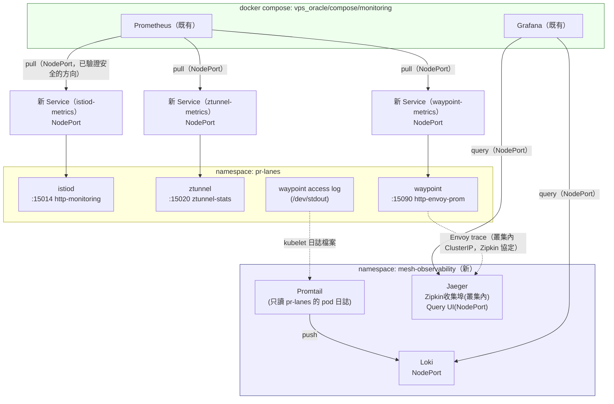

# K3s Phase K — 可觀測性接入設計

日期：2026-08-24

對應 [K3s 服務網格能力補完路線圖](2026-08-19-k3s-mesh-capabilities-roadmap.md) 的 K 階段：指標（istiod/ztunnel/waypoint 的 Prometheus 端點）、日誌（waypoint access log）、追蹤（Envoy trace）全部要能在既有的 Grafana/Jaeger UI 查到。

**本文件推翻路線圖原文對 K 階段的設計前提**（「複用 `lab-environment` 既有的 Prometheus/Loki/Jaeger」），原因與新設計見下方「範圍」與「已知限制」。前置：[Phase J](2026-08-23-k3s-phase-j-authorization-design.md) 已完成並合入 `main`，其 `AuthorizationPolicy` 的 `selector` 只選中 `app: hello-backend`，不影響本階段新增的任何資源（見下方「交棒」段落的查證）。

## 範圍

**這階段要做的：**
- 新增一個獨立的 k3s namespace（`mesh-observability`）承載 Loki + Jaeger + 一個範圍限定在 `pr-lanes` 的 Promtail，透過 NodePort 曝露給 compose 使用
- 幫 istiod / ztunnel / waypoint 現有的 Prometheus 端點各加一個小的 NodePort `Service`（不新增 Deployment，純曝露既有埠）
- compose 既有的 Prometheus 加 3 個新 scrape target；既有的 Grafana 加 Loki + Jaeger 兩個新資料源——**沿用 compose 現有的 Prometheus/Grafana，不在 compose 另外新裝一套**
- Istio 的 tracing 設定指向 `mesh-observability` 裡的 Jaeger（叢集內 ClusterIP，不跨網路邊界）
- compose 的 `prometheus`、`grafana` 兩個 service 修正 docker network 預設閘道優先權（見下方「已知限制」，這是本階段能成立的前提修正，不修就連不到任何 NodePort）

**這階段不做的（留給後續階段或明確排除）：**
- 不動 `lab-environment` 的任何東西——它自己那套 Prometheus/Grafana/Loki/Jaeger/Promtail（`replicas: 0`）原封不動保留給 SRE 練習自己用，`pr-lanes` 的可觀測性完全不依賴它、也不共用它的 pipeline（這正是 `lab-environment/README.md` 開頭宣告的「deliberate 不共用」邊界，路線圖原文的設計違反了這個邊界，本文件修正之）
- 不修 Cilium/istio-cni 那條 `fwmark 0x200/0xf00 → table 2004（route via lo）` 的重定向規則——這是叢集層級、影響任何 pod 對外連到私網位址的既有限制，不是本階段引入的問題，修復它風險高（可能動到 ztunnel/waypoint 現有流量重定向的核心機制），本階段的設計完全繞開它，見「已知限制」
- 不新增 HTTP method/path 層級的存取控制——J 階段範圍
- 限流——L 階段的評估性範圍

## 現狀約束

延續路線圖列出的資源約束（`pr-lanes-quota` 現況：`limits.cpu 500m/1200m`、`limits.memory 640Mi/1536Mi` 已用掉，見下方查證），但本階段新增的元件**完全不落在 `pr-lanes-quota` 裡**——Loki/Jaeger/Promtail 落在新開的 `mesh-observability` namespace，有自己獨立的 `ResourceQuota`；istiod/ztunnel/waypoint 的新 metrics `Service` 是純控制面資源，不佔 CPU/記憶體額度。

主機記憶體仍然吃緊（路線圖記錄的 2026-08-19 實測：23Gi 總量僅 813Mi 真空閒，swap 4Gi 用掉 3.4Gi）——`mesh-observability` 的資源請求刻意壓到最低（見下方元件表），且若上線後觀察到 swap 持續攀升或任何 OOMKilled，應優先暫停評估，不強行往下走，這條原則路線圖本身已經寫過一次，這裡重申。

## 架構



三種遙測全部走同一個方向：**compose（既有 Prometheus/Grafana）主動連出去打 k3s 的 NodePort**——這是這台機器上唯一已經在生產環境跑過的跨 docker/k3s 方向（NPM 反代 headlamp/lab-environment grafana/argocd 用的就是這條路，`host-firewall.sh` 2026-08-19 已經加過 `172.19.0.0/16 → NodePort range` 的允許規則，本階段**不需要新增任何防火牆規則**）。完全避開「pod 主動連出去打 docker bridge」這個方向——這條路在 fwmark/table 2004 那堵牆前面直接消失，見「已知限制」。

Promtail 讀 kubelet 的 pod 日誌檔案、推到 Loki，這段全程在 k3s pod 網段內部（Promtail → Loki 用 ClusterIP），不跨網路邊界。waypoint 的 Envoy trace 送到 Jaeger 的 Zipkin 收集埠，同樣是叢集內 ClusterIP，不跨邊界——只有 Grafana 查詢 Loki/Jaeger 這一段才跨邊界，而這段走的是已驗證方向。

## 元件與設定

| 項目 | 決定 | 理由 |
|---|---|---|
| `mesh-observability` namespace | 新建，獨立於 `pr-lanes`、`lab-environment`。`ResourceQuota`：`requests.cpu: 200m / requests.memory: 320Mi`，`limits.cpu: 500m / limits.memory: 640Mi` | 三個新元件（Loki 128Mi/256Mi、Jaeger 64Mi/256Mi、Promtail 32Mi/64Mi，數字沿用 `lab-environment` 已經跑過的規格）加總落在這個額度內，留一點餘裕。獨立 namespace 是刻意選擇：不進 `pr-lanes-quota`（避免跟泳道容量搶資源，路線圖本來就明講這點）、不進 `lab-environment`（避免違反它自己宣告的隔離邊界） |
| Loki / Jaeger 鏡像與設定 | 直接照抄 `lab-environment/k8s/loki.yaml`、`jaeger.yaml` 的鏡像版本與資源規格，改 namespace、改 Service 曝露方式（多加 NodePort） | 這兩份 YAML 在 `lab-environment` 已經跑過、驗證過能正常啟動，沒有理由重新造一輪——只是換個 namespace、換成常駐（不是 `replicas: 0`） |
| Promtail 範圍 | `promtail-config.yml` 的 scrape glob 改成只匹配 `/var/log/pods/pr-lanes_*`（`lab-environment` 的 promtail 用同樣手法把自己限定在自己的 namespace，見它的 `configmaps.yaml` 註解） | 只收 `pr-lanes` 的日誌，不是整個節點——避免把 `kube-system`/`argocd` 等其他 namespace 的日誌也一起吃進來，控制量體與資源用量 |
| istiod metrics 曝露 | 新增 `Service`（`istio-system` namespace，NodePort，selector `app=istiod,istio=pilot`，指到既有的 `15014` 埠），**不修改 istiod 自己那個由 istio-istiod Application 管理的 ClusterIP Service** | istiod 已經有 `http-monitoring:15014`，只是沒有對外曝露；另開一個獨立 Service 是為了不去動 ArgoCD 管理的既有資源（改了會被下次 sync 覆蓋，或造成不必要的 diff） |
| ztunnel metrics 曝露 | 新增 `Service`（`istio-system` namespace，NodePort，selector `app=ztunnel`，指到既有的 `15020 ztunnel-stats` 埠） | ztunnel 目前完全沒有 Service，這是新建，不涉及修改既有資源 |
| istiod/ztunnel metrics Service 歸屬哪個 ArgoCD Application | 併入新建的 `mesh-observability` Application（放進它的 `k8s/` 目錄，每個檔案顯式帶 `metadata.namespace: istio-system`），**不放進 `vps_oracle/k3s/istio/`** | `istio-istiod`/`istio-ztunnel` 兩個 Application 的 `source` 是遠端 Helm chart（`istio-release.storage.googleapis.com`），`vps_oracle/k3s/istio/` 底下的檔案只當 Helm values 用（`valueFiles: - $values/vps_oracle/k3s/istio/istiod-values.yaml`），不是「這個目錄下的檔案會被自動撿到」的 plain-manifests 模式——丟進去的新 YAML 不會被同步。ArgoCD 允許一個 Application 管理 `destination.namespace` 以外的資源，只要 manifest 自己寫明 `metadata.namespace`，`lab-environment` 底下的既有 YAML 也是這樣顯式寫 namespace 的慣例，沿用即可 |
| waypoint metrics 曝露 | 新增 `Service`（`pr-lanes` namespace，NodePort，selector 對齊 waypoint pod 的 label，指到既有的 `15090 http-envoy-prom` 埠） | waypoint 由 Gateway API 的 `Gateway` 資源自動建立了一個 Service，但只轉發 `15021`/`15008`，不含 metrics 埠——另開一個小 Service 補這個洞，不去動 Gateway 資源自動生成的那個 |
| NodePort 分配 | `istiod-metrics 30110`、`ztunnel-metrics 30111`、`waypoint-metrics 30112`、`loki 30113`、`jaeger-query 30114`（Jaeger 的 Zipkin 收集埠 `9411` 只用 ClusterIP，不需要 NodePort） | 目前已用：`30083`（hello-frontend）、`30090`（argocd）、`30092-30098`（lab-environment + headlamp）、`30512`（lab-environment jaeger zipkin，未顯式指定被自動分配）。挑一段連號、可讀的範圍，實作時要重新 `kubectl get svc -A --field-selector spec.type=NodePort` 確認沒有新的衝突（這幾天可能有變動） |
| compose Prometheus 新 scrape_configs | 3 個新 job，`static_configs.targets` 指向 `10.0.0.95:30110`／`:30111`／`:30112` | 沿用 `prometheus.yml` 現有的 `static_configs` 風格（這個檔案目前沒有用任何服務發現機制，跟其餘 job 一致） |
| compose Grafana 新資料源 | 在 `grafana/provisioning/datasources/` 新增 Loki（`http://10.0.0.95:30113`）與 Jaeger（`http://10.0.0.95:30114`）兩個 provisioning 檔 | 沿用現有 `prometheus.yml` provisioning 的模式 |
| Istio tracing 設定 | `istiod-values.yaml` 的 `meshConfig` 加 `extensionProviders`（`envoyOtelAls` 或 zipkin 類型，指向 `jaeger.mesh-observability.svc.cluster.local:9411`），`pr-lanes` 加一個 `Telemetry` CR 啟用 tracing、引用該 provider | Istio 標準做法（`extensionProviders` + `Telemetry` CR），沿用 lab-environment jaeger.yaml 已經配好的 `COLLECTOR_ZIPKIN_HOST_PORT: ":9411"`（Zipkin 協定相容，Envoy 原生支援送 Zipkin 格式的 span，不需要額外的 collector/sidecar） |
| **compose `prometheus`/`grafana` 的 docker network 優先權修正** | 兩個 service 的 `networks.proxy` 加 `priority: 1`（或等效機制，讓 `proxy` 網路成為預設閘道，蓋過 `default` 網路） | **本階段能成立的硬性前提**，完整診斷過程見[排查記錄](../../incidents/2026-08-24-compose-prometheus-grafana-k3s-nodeport-gateway.md)：這兩個容器目前預設閘道解析到 `monitoring_default`，不是 `proxy`，實測連 k3s NodePort 得到 `No route to host`。不修這個，`prometheus.yml`/Grafana 資料源即使配對了 IP:Port 也連不通 |

## Repo 佈局

```
vps_oracle/k3s/apps/mesh-observability/         # 新目錄
  k8s/
    namespace.yaml            # namespace + ResourceQuota
    loki.yaml                 # 抄 lab-environment/k8s/loki.yaml，改 namespace + NodePort
    jaeger.yaml                # 抄 lab-environment/k8s/jaeger.yaml，改 namespace + NodePort（UI/query）
    promtail.yaml              # 抄 lab-environment/k8s/promtail.yaml，改 namespace + scrape glob 限定 pr-lanes
    configmaps.yaml            # loki-config / promtail-config（scrape glob: /var/log/pods/pr-lanes_*）
    istiod-metrics-service.yaml  # 新增：NodePort Service，metadata.namespace 顯式寫 istio-system，指到既有 istiod Service 選中的 15014
    ztunnel-metrics-service.yaml # 新增：NodePort Service，metadata.namespace 顯式寫 istio-system，指到 ztunnel 的 15020

vps_oracle/k3s/argocd/apps/
  mesh-observability.yaml     # 新增，照抄 lab-environment.yaml 的格式，path 指到上面那個目錄

vps_oracle/k3s/apps/hello/k8s/
  waypoint-metrics-service.yaml   # 新增：NodePort Service，指到 waypoint pod 的 15090
  pr-lanes-telemetry.yaml         # 新增：Telemetry CR，啟用 tracing 並引用 istiod 的 zipkin provider

vps_oracle/k3s/istio/
  istiod-values.yaml           # 修改：meshConfig.extensionProviders 加 zipkin provider（這是 Helm values 檔，istiod-metrics-service.yaml 不放這裡，見「元件與設定」表的說明）

vps_oracle/compose/monitoring/
  docker-compose.yml           # 修改：prometheus + grafana 兩個 service 加 networks.proxy.priority
  prometheus/prometheus.yml    # 修改：加 3 個 scrape_configs job
  grafana/provisioning/datasources/
    loki.yml                   # 新增
    jaeger.yml                 # 新增
```

（`istiod-metrics-service.yaml`/`ztunnel-metrics-service.yaml` 併入 `mesh-observability` Application 這個決定已在「元件與設定」表定案，不再是待確認事項。）

## 驗證清單（phase K 過關標準，implement 階段會再細化成逐步驟）

1. `mesh-observability` namespace 建立、ArgoCD Application `Synced` + `Healthy`，Loki/Jaeger/Promtail 三個 Pod `Running`
2. `kubectl describe resourcequota -n mesh-observability` 確認用量在額度內，且**不影響** `pr-lanes-quota`（`kubectl describe resourcequota pr-lanes-quota -n pr-lanes` 用量應該完全不變，新增的三個 metrics Service 都是純控制面資源）
3. 修正 compose `prometheus`/`grafana` 的 network priority 後，`docker exec prometheus wget -qO- http://10.0.0.95:<istiod-metrics NodePort>` 成功回應（用這個當作「網路修正生效」的最小驗證，不用等整個 Prometheus scrape 迴圈跑一輪）
4. compose Prometheus targets 頁面（`http://172.19.0.4:9090/targets`，只走內網）三個新 job 都是 `UP`
5. compose Grafana 新增的 Loki/Jaeger 資料源測試連線成功（`Test` 按鈕綠燈）
6. 對 `hello-frontend`/`hello-backend` 打一輪測試流量，在 compose Grafana 裡：
   - 能查到 istiod/ztunnel/waypoint 的指標
   - 能在 Loki 裡查到對應的 waypoint access log
   - 能在 Jaeger 裡查到這次呼叫的 trace（**已知限制**：Envoy trace 預設是取樣的，不是每個請求都會產生 span，需要在 `Telemetry` CR 裡確認取樣率設定，或多打幾次請求提高命中機率）
7. `lab-environment` 的所有元件狀態不變（維持 `replicas: 0`，本階段沒有觸碰任何 `lab-environment` 底下的檔案）
8. 全部既有 Application 複查仍 `Synced` + `Healthy`

## 已知限制

- **路線圖原文對 K 階段的設計前提是錯的,本文件的架構是實地診斷後推翻重寫的結果**。原設計假設「指向 `lab-environment` 既有的 Prometheus/Loki/Jaeger」，但查證發現這套元件全部 `replicas: 0`（平時沒在跑），且 `lab-environment/README.md` 明文宣告「deliberate 不跟 `vps_oracle` 真實監控共用 pipeline」——原設計的方向本身就違反這條邊界。
- **pod → docker bridge 這個方向被叢集層級的網路重定向機制擋死，刻意不在本階段修復**：`pr-lanes` 內任一 pod（含非 ambient mesh 成員）連 compose 容器固定 IP 會 timeout，封包完全不出現在任何網路介面上；根因是 `ip rule` 一條 `fwmark 0x200/0xf00 → table 2004（route via lo）` 的既有規則，幾乎可以肯定是 Cilium/istio-cni 流量重定向機制的一部分。不是 `pr-lanes` 特有——任何 k3s pod 想連 docker compose 網路都會撞到同一堵牆。修這條重定向機制風險高（可能連帶弄壞現在正常運作的 mesh 流量重定向），本階段選擇完全繞開它，不依賴它被修好。完整診斷過程（tcpdump、cilium-dbg monitor、ip rule 逐步排除)見[排查記錄](../../incidents/2026-08-24-k3s-pod-to-docker-bridge-blackhole.md)
- **compose `prometheus`/`grafana` 目前連不到任何 k3s NodePort，根因是兩個容器的 docker network 預設閘道解析到錯的網段**（`monitoring_default` 而非 `proxy`），修法（`networks.proxy.priority`）已寫進「元件與設定」表，是本階段的硬性前提。完整診斷過程見[排查記錄](../../incidents/2026-08-24-compose-prometheus-grafana-k3s-nodeport-gateway.md)
- **Envoy trace 的取樣率**：`Telemetry` CR 若沒有明確設高取樣率，Jaeger 裡不會每個請求都看得到對應的 span，實作與驗證時需要留意，不要把「Jaeger 沒查到某次請求的 trace」誤判為架構沒接通
- **這次的診斷過程動用了 `sudo iptables -L`、`cilium-dbg monitor`、臨時建立/刪除的診斷用 pod（`netdiag-tmp*`，均已清理，不留在叢集裡）——全程唯讀或使用一次性資源，沒有修改任何 ArgoCD 管理的既有資源，符合「k3s 資源 git-first」的原則**

## 交棒給後續階段

**J 階段查證**：J 階段設計文檔的「交棒給後續階段」原本預期 K 階段是「`lab-environment` 主動 scrape `pr-lanes`」，並提醒 K 階段要重新確認 J 的 `AuthorizationPolicy`（`selector: app: hello-backend`）是否影響這條路徑。本文件確認：新設計裡沒有任何元件的 selector 是 `app: hello-backend`（istiod/ztunnel/waypoint 的 metrics Service 各自選中自己的 label），J 階段的兩份 `AuthorizationPolicy` 完全不影響本階段新增的任何資源，這個交棒項目視為已解決。

L 階段若走 `EnvoyFilter` 路徑做限流，跟本階段在 waypoint 上啟用的 tracing（透過 `Telemetry` CR，同樣是疊加在 Envoy 設定上）理論上互相獨立，但 L 階段評估時應該把「K 階段已經在 waypoint 上多跑一份 tracing 設定」列入考量，一併確認 `EnvoyFilter` 不會跟 tracing 的 filter chain 打架。
