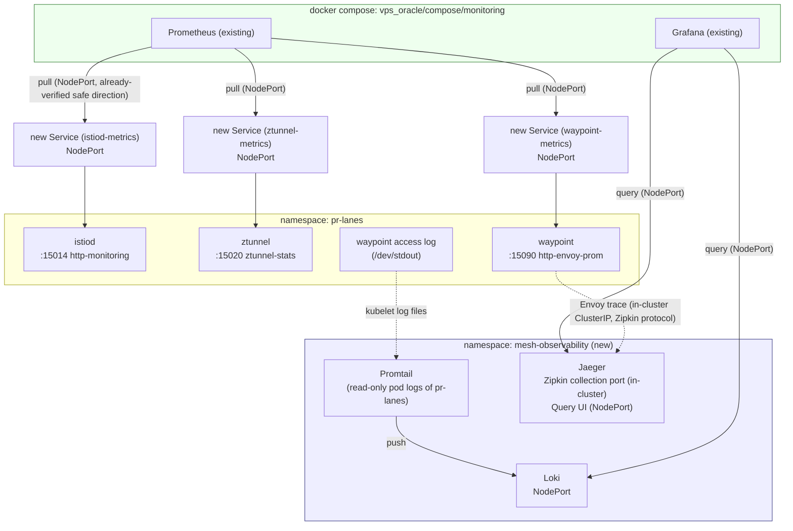

# K3s Phase K — Observability Integration Design

Date: 2026-08-24

Corresponds to Phase K of the [K3s Service Mesh Capabilities Roadmap](2026-08-19-k3s-mesh-capabilities-roadmap.md): metrics (the Prometheus endpoints of istiod/ztunnel/waypoint), logs (waypoint access log), and tracing (Envoy trace) must all be queryable in the existing Grafana/Jaeger UI.

**This document overturns the roadmap's original design premise for Phase K** ("reuse `lab-environment`'s existing Prometheus/Loki/Jaeger"); the reason and the new design are in "Scope" and "Known limitations" below. Precondition: [Phase J](2026-08-23-k3s-phase-j-authorization-design.md) is complete and merged into `main`; its `AuthorizationPolicy` `selector` only matches `app: hello-backend` and does not affect any resource added this phase (see the verification in the "Handoff" section below).

## Scope

**What this phase does:**
- Add a standalone k3s namespace (`mesh-observability`) hosting Loki + Jaeger + a Promtail scoped to `pr-lanes`, exposed to compose via NodePort
- Add a small NodePort `Service` for each of istiod / ztunnel / waypoint's existing Prometheus endpoints (no new Deployment — purely exposing existing ports)
- Add 3 new scrape targets to compose's existing Prometheus; add two new data sources, Loki + Jaeger, to the existing Grafana — **reusing compose's existing Prometheus/Grafana, not installing a separate new stack in compose**
- Point Istio's tracing config at the Jaeger in `mesh-observability` (in-cluster ClusterIP, not crossing a network boundary)
- Fix the docker network default-gateway priority for compose's `prometheus` and `grafana` services (see "Known limitations" below; this is the prerequisite fix that makes this phase possible — without it not a single NodePort is reachable)
- **Jaeger UI into NPM reverse proxy + homepage card (done 2026-08-24)**: `jaeger.jerome.cloudns.asia` → `10.0.0.95:30114` (mesh-observability's Jaeger-query NodePort), using the `self-only-and-auth` access list (id 2, including 3x-ui source + public IP + Basic Auth), NPM proxy host id 36, certificate id 38; homepage `Infra Services` section gains a `Jaeger` card (next to the main Grafana). Loki has no standalone UI; logs are viewed via the Loki data source in the existing Grafana (`grafana.jerome.cloudns.asia`)

**What this phase does NOT do (left to later phases or explicitly excluded):**
- Touch nothing in `lab-environment` — its own Prometheus/Grafana/Loki/Jaeger/Promtail (`replicas: 0`) stays intact for SRE practice use; `pr-lanes`'s observability neither depends on it nor shares its pipeline (this is exactly the "deliberate non-sharing" boundary declared at the top of `lab-environment/README.md`; the roadmap's original design violated this boundary, and this document corrects it)
- Not fixing the Cilium/istio-cni redirect rule `fwmark 0x200/0xf00 → table 2004 (route via lo)` — this is a cluster-level, existing limitation affecting any pod's outbound connection to a private-network address, not a problem introduced by this phase; fixing it is high-risk (could touch the core mechanism of ztunnel/waypoint's existing traffic redirection), and this phase's design completely routes around it; see "Known limitations"
- No HTTP method/path-level access control — Phase J scope
- Rate limiting — Phase L's evaluation scope

## Current-state constraints

Continuing the resource constraint listed in the roadmap (`pr-lanes-quota` current state: `limits.cpu 500m/1200m`, `limits.memory 640Mi/1536Mi` used; see the check below), but the components added this phase land **entirely outside `pr-lanes-quota`** — Loki/Jaeger/Promtail land in the new `mesh-observability` namespace with their own independent `ResourceQuota`; the new metrics `Service`s for istiod/ztunnel/waypoint are pure control-plane resources and consume no CPU/memory.

Host memory is still tight (the roadmap's recorded 2026-08-19 measurement: 23Gi total with only 813Mi truly free, swap 4Gi with 3.4Gi used) — `mesh-observability`'s resource requests are deliberately pushed to the minimum (see the component table below), and if after rollout swap keeps climbing or any OOMKilled is observed, evaluation should be paused first rather than forcing ahead. The roadmap itself already wrote this principle once; it is restated here.

## Architecture



All three telemetry types flow in the same direction: **compose (existing Prometheus/Grafana) actively connects out to k3s NodePorts** — the only cross-docker/k3s direction already run in production on this machine (NPM reverse-proxying headlamp/lab-environment grafana/argocd uses this path, and `host-firewall.sh` already added the `172.19.0.0/16 → NodePort range` allow rule on 2026-08-19, so this phase **needs no new firewall rules**). This completely avoids the "pod actively connecting out to docker bridge" direction — that path vanishes in front of the fwmark/table 2004 wall; see "Known limitations".

Promtail reads kubelet's pod log files and pushes them to Loki, entirely inside the k3s pod network (Promtail → Loki uses ClusterIP), not crossing a network boundary. The waypoint's Envoy trace goes to Jaeger's Zipkin collection port, also in-cluster ClusterIP, not crossing a boundary — only the Grafana querying Loki/Jaeger segment crosses a boundary, and that segment uses the already-verified direction.

## Components and configuration

| Item | Decision | Rationale |
|---|---|---|
| `mesh-observability` namespace | New, independent of `pr-lanes`, `lab-environment`. `ResourceQuota`: `requests.cpu: 200m / requests.memory: 320Mi`, `limits.cpu: 500m / limits.memory: 640Mi` | The three new components (Loki 128Mi/256Mi, Jaeger 64Mi/256Mi, Promtail 32Mi/64Mi; numbers reused from the specs `lab-environment` already ran) sum within this quota, leaving some headroom. A standalone namespace is a deliberate choice: not in `pr-lanes-quota` (avoid competing for resources with lane capacity; the roadmap already states this), not in `lab-environment` (avoid violating its self-declared isolation boundary) |
| Loki / Jaeger image and config | Copy the image versions and resource specs directly from `lab-environment/k8s/loki.yaml`, `jaeger.yaml`; change namespace and the Service exposure method (add NodePort) | These two YAMLs have already run and been verified to start in `lab-environment`; no reason to rebuild them — just change the namespace and make them resident (not `replicas: 0`) |
| Promtail scope | Change `promtail-config.yml`'s scrape glob to only match `/var/log/pods/pr-lanes_*` (`lab-environment`'s promtail uses the same technique to limit itself to its own namespace; see its `configmaps.yaml` comment) | Only collect `pr-lanes` logs, not the whole node — avoid also ingesting `kube-system`/`argocd` and other namespaces' logs, controlling volume and resource use |
| istiod metrics exposure | Add a `Service` (`istio-system` namespace, NodePort, selector `app=istiod,istio=pilot`, pointing to the existing `15014` port), **without modifying istiod's own ClusterIP Service managed by the istio-istiod Application** | istiod already has `http-monitoring:15014`, just not externally exposed; the standalone Service is to avoid touching ArgoCD-managed existing resources (a change would be overwritten by the next sync, or cause an unnecessary diff) |
| ztunnel metrics exposure | Add a `Service` (`istio-system` namespace, NodePort, selector `app=ztunnel`, pointing to the existing `15020 ztunnel-stats` port) | ztunnel currently has no Service at all; this is new creation, no modification of existing resources |
| Which ArgoCD Application owns the istiod/ztunnel metrics Services | Fold into the new `mesh-observability` Application (place in its `k8s/` directory, each file explicitly carrying `metadata.namespace: istio-system`), **not in `vps_oracle/k3s/istio/`** | The `istio-istiod`/`istio-ztunnel` Applications' `source` is a remote Helm chart (`istio-release.storage.googleapis.com`); files under `vps_oracle/k3s/istio/` are only used as Helm values (`valueFiles: - $values/vps_oracle/k3s/istio/istiod-values.yaml`), not a "files in this directory get auto-discovered" plain-manifests mode — new YAML dropped there would not be synced. ArgoCD allows an Application to manage resources outside `destination.namespace` as long as the manifest itself writes `metadata.namespace` explicitly; the existing YAML under `lab-environment` follows this same explicit-namespace convention, so reuse it |
| waypoint metrics exposure | Add a `Service` (`pr-lanes` namespace, NodePort, selector aligned to the waypoint pod's labels, pointing to the existing `15090 http-envoy-prom` port) | The waypoint already auto-created a Service from the Gateway API `Gateway` resource, but it only forwards `15021`/`15008`, not the metrics port — a standalone small Service fills this gap, without touching the one auto-generated by the Gateway resource |
| NodePort allocation | `istiod-metrics 30110`, `ztunnel-metrics 30111`, `waypoint-metrics 30112`, `loki 30113`, `jaeger-query 30114` (Jaeger's Zipkin collection port `9411` uses ClusterIP only, no NodePort needed) | Currently in use: `30083` (hello-frontend), `30090` (argocd), `30092-30098` (lab-environment + headlamp), `30512` (lab-environment jaeger zipkin, auto-assigned since not explicitly specified). Choose a contiguous, readable range; at implementation time re-run `kubectl get svc -A --field-selector spec.type=NodePort` to confirm no new conflicts (this may have changed in recent days) |
| compose Prometheus new scrape_configs | 3 new jobs, `static_configs.targets` pointing to `10.0.0.95:30110` / `:30111` / `:30112` | Follow `prometheus.yml`'s existing `static_configs` style (this file currently uses no service discovery mechanism, consistent with the rest of the jobs) |
| compose Grafana new data sources | Add two provisioning files, Loki (`http://10.0.0.95:30113`) and Jaeger (`http://10.0.0.95:30114`), under `grafana/provisioning/datasources/` | Follow the existing `prometheus.yml` provisioning pattern |
| Istio tracing config | In `istiod-values.yaml`'s `meshConfig`, add `extensionProviders` (`envoyOtelAls` or zipkin type, pointing to `jaeger.mesh-observability.svc.cluster.local:9411`); add a `Telemetry` CR in `pr-lanes` enabling tracing and referencing this provider | Istio's standard approach (`extensionProviders` + `Telemetry` CR), reusing lab-environment's jaeger.yaml `COLLECTOR_ZIPKIN_HOST_PORT: ":9411"` (Zipkin protocol-compatible; Envoy natively supports emitting Zipkin-format spans, no extra collector/sidecar needed) |
| **compose `prometheus`/`grafana` docker network default-gateway fix** (done 2026-08-24) | Change the compose project's own `default` network to `internal: true` (an internal network gets no gateway and does not participate in default-route election, making `proxy` the sole egress); `blackbox-exporter` gets an additional `egress` bridge network to keep public-internet reachability | **The hard prerequisite making this phase possible**; the full diagnosis is in the [troubleshooting record](../../incidents/2026-08-24-compose-prometheus-grafana-k3s-nodeport-gateway.md): these two containers originally resolved their default gateway to `monitoring_default`, not `proxy`, and testing showed `No route to host` connecting to k3s NodePorts. **Note: the originally planned `networks.proxy.priority: 1` was tested and ineffective on this machine** (compose 5.1.1/5.1.4/5.5.0 all fail to forward that field to the engine; `GwPriority` is always `0`) — do not go down that path again |

## Repo layout

```
vps_oracle/k3s/apps/mesh-observability/         # new directory
  k8s/
    namespace.yaml            # namespace + ResourceQuota
    loki.yaml                 # copied from lab-environment/k8s/loki.yaml, changed namespace + NodePort
    jaeger.yaml                # copied from lab-environment/k8s/jaeger.yaml, changed namespace + NodePort (UI/query)
    promtail.yaml              # copied from lab-environment/k8s/promtail.yaml, changed namespace + scrape glob scoped to pr-lanes
    configmaps.yaml            # loki-config / promtail-config (scrape glob: /var/log/pods/pr-lanes_*)
    istiod-metrics-service.yaml  # new: NodePort Service, metadata.namespace explicitly written istio-system, pointing to the 15014 selected by the existing istiod Service
    ztunnel-metrics-service.yaml # new: NodePort Service, metadata.namespace explicitly written istio-system, pointing to ztunnel's 15020

vps_oracle/k3s/argocd/apps/
  mesh-observability.yaml     # new, copied from lab-environment.yaml's format, path pointing to the directory above

vps_oracle/k3s/apps/hello/k8s/
  waypoint-metrics-service.yaml   # new: NodePort Service, pointing to the waypoint pod's 15090
  pr-lanes-telemetry.yaml         # new: Telemetry CR, enabling tracing and referencing istiod's zipkin provider

vps_oracle/k3s/istio/
  istiod-values.yaml           # modified: meshConfig.extensionProviders adds zipkin provider (this is a Helm values file; istiod-metrics-service.yaml does not go here, see the "Components and configuration" table note)

vps_oracle/compose/monitoring/
  docker-compose.yml           # done (2026-08-24): networks.default changed to internal: true, making proxy the
                               # sole egress for prometheus/grafana; blackbox-exporter gets an additional egress network to keep public reachability
                               # (the originally planned networks.proxy.priority is tested ineffective, do not re-add, see the "Components and configuration" table)
  prometheus/prometheus.yml    # modified: add 3 scrape_configs jobs
  grafana/provisioning/datasources/
    loki.yml                   # new
    jaeger.yml                 # new
```

(The decision to fold `istiod-metrics-service.yaml`/`ztunnel-metrics-service.yaml` into the `mesh-observability` Application is already finalized in the "Components and configuration" table, no longer a to-be-confirmed item.)

## Verification checklist (phase K pass criteria; the implement stage will refine into step-by-step)

1. The `mesh-observability` namespace is created, the ArgoCD Application is `Synced` + `Healthy`, and the Loki/Jaeger/Promtail three Pods are `Running`
2. `kubectl describe resourcequota -n mesh-observability` confirms usage is within quota, and **does not affect** `pr-lanes-quota` (`kubectl describe resourcequota pr-lanes-quota -n pr-lanes` usage should be completely unchanged; the three new metrics Services are all pure control-plane resources)
3. compose `prometheus`/`grafana`'s default-gateway fix is in effect (the `default` network changed to internal, both egressing via `proxy`): `docker exec prometheus wget -qO- http://10.0.0.95:<istiod-metrics NodePort>` responds successfully (use this as the minimal verification that "the network fix works", without waiting for a full Prometheus scrape cycle; `docker exec prometheus ip route`'s first line should be `default via 172.19.0.1`)
4. compose Prometheus targets page (`http://172.19.0.4:9090/targets`, internal only) shows all three new jobs `UP`
5. compose Grafana's newly added Loki/Jaeger data sources test-connect successfully (`Test` button green)
6. Send a round of test traffic against `hello-frontend`/`hello-backend`, and in compose Grafana:
   - istiod/ztunnel/waypoint metrics can be queried
   - the corresponding waypoint access log can be found in Loki
   - the trace of this call can be found in Jaeger (**known limitation**: Envoy trace is sampled by default; not every request produces a span — confirm the sampling rate in the `Telemetry` CR, or send more requests to raise the hit probability)
7. `lab-environment`'s components are unchanged (stay at `replicas: 0`; this phase touched no files under `lab-environment`)
8. Re-check all existing Applications still `Synced` + `Healthy`

## Known limitations

- **The roadmap's original design premise for Phase K is wrong; this document's architecture is the rewritten result of live diagnosis**. The original design assumed "pointing to `lab-environment`'s existing Prometheus/Loki/Jaeger", but verification found these components are all `replicas: 0` (not running normally), and `lab-environment/README.md` explicitly declares "deliberately not sharing the pipeline with `vps_oracle` real monitoring" — the original design's direction itself violates this boundary.
- **The pod → docker bridge direction is blocked dead by a cluster-level network redirect mechanism, deliberately not fixed this phase**: any pod in `pr-lanes` (including non-ambient-mesh members) timing out when connecting to a compose container's fixed IP, with packets not appearing on any network interface; the root cause is an existing `ip rule` — `fwmark 0x200/0xf00 → table 2004 (route via lo)` — almost certainly part of Cilium/istio-cni's traffic redirect mechanism. Not specific to `pr-lanes` — any k3s pod wanting to reach the docker compose network hits the same wall. Fixing this redirect mechanism is high-risk (could take down the currently working mesh traffic redirection with it); this phase chooses to route around it entirely, not depending on it being fixed. The full diagnosis process (tcpdump, cilium-dbg monitor, ip rule step-by-step elimination) is in the [troubleshooting record](../../incidents/2026-08-24-k3s-pod-to-docker-bridge-blackhole.md)
- **compose `prometheus`/`grafana` originally could not reach any k3s NodePort; the root cause was the two containers' docker network default gateway resolving to the wrong subnet** (`monitoring_default` rather than `proxy`). **Fixed and applied on 2026-08-24**: changed the compose project's `default` network to `internal: true` (the originally planned `networks.proxy.priority` tested ineffective; compose does not forward that field to the engine). Full diagnosis and other evaluated options are in the [troubleshooting record](../../incidents/2026-08-24-compose-prometheus-grafana-k3s-nodeport-gateway.md)
- **The gateway fix above only solved the first prerequisite layer — a docker-bridge container reaching a k3s NodePort actually has a second layer, discovered only in Task 6**: after the gateway was fixed, `prometheus`/`grafana` (and any other docker-bridge container, including the existing `npm` production container entirely unrelated to this phase) still got `Connection refused` connecting to `10.0.0.95:<NodePort>`. The root cause is `socketLB.hostNamespaceOnly: true` (required since Phase F/G for ambient mesh routing, irreversible) making Cilium's socket-level `connect()` rewrite for NodePort only apply to "processes in the host netns"; packets from docker containers are routed by the kernel directly to the local machine (`10.0.0.95` is a real address on `enp0s6`), hitting neither the socket-LB path nor the NIC's eBPF hook — both Cilium NodePort paths are untouched. What actually carries this direction is `vps_oracle/npm-nodeport-relay/` — the host-netns `socat` relay left from the 2026-08-19 incident, **registered per-NodePort** (`nodeport-relay@<port>.service`, listening on `127.0.0.1:<port>`, where socket-LB still works and can correctly forward to the backend Pod). This relay originally registered only 6 existing ports (`30090`, `30092`, `30094`-`30095`, `30097`-`30098` for NPM/headlamp — `30093` is `lab-environment`'s internal Prometheus, no relay needed), and the 5 new ports this phase adds (`30110`-`30114`) were found only in Task 6 to have no corresponding instances at all — even with Task 5's network gateway fix fully correct and applied, they still wouldn't connect, and the symptom (`connection refused`) is identical to "gateway not fixed", easy to misjudge as a Task 5 regression. Fixed in Task 6 by adding the five systemd instances `nodeport-relay@30110` through `nodeport-relay@30114` (`sudo systemctl enable --now`), and updating the port list/Install list in `vps_oracle/npm-nodeport-relay/README.md`. **For anyone adding a 6th k3s NodePort for compose in the future**: both prerequisite layers are needed — besides the docker network gateway (previous item), also remember to register a `nodeport-relay@<port>.service` instance for the new port, otherwise you'll hit the exact same `connection refused` and wrongly think the network gateway broke again. Full mechanism in the [2026-08-19 incident record](../../incidents/2026-08-19-npm-to-k3s-nodeport-outage.md)
- **Envoy trace sampling rate**: if the `Telemetry` CR does not explicitly raise the sampling rate, not every request will have a corresponding span in Jaeger; implementation and verification must note this, not misjudge "Jaeger has no trace for a request" as "the architecture isn't wired up"
- **The service name that actually appears in Jaeger is `waypoint.pr-lanes`, not `hello-frontend`/`hello-backend`**: under ambient mesh, `hello-frontend` → `hello-backend` traffic is intercepted by `pr-lanes`'s waypoint proxy, and the Zipkin span Envoy emits is tagged with the waypoint's own workload identity, not the endpoints' application names (the span's `operationName` is `hello-backend:80/*`, where the destination info is preserved). Additionally, the Jaeger all-in-one image's own self-instrumentation generates a second service name, `jaeger-all-in-one`; querying `/api/services` shows these two, the latter unrelated to this phase's architecture, a default behavior of the image. This document did not assume the exact names during design; Task 3 Step 6 and Task 7 Step 3 both record the observed results as-is, not predicted values
- **Istio tracing wiring worked on the first attempt; there was no provider-name mismatch between `extensionProviders`/`Telemetry`**: the `extensionProviders[].name` in `istiod-values.yaml` and the `providers[].name` in `pr-lanes-telemetry.yaml` are both `zipkin-mesh-observability`, and Task 3 implementation already compared them character by character, confirming consistency; the first round of verification (Task 3 Step 6) directly found real spans landing, with no spelling or config to fix. The two hiccups along the way were operational, not design issues, recorded for anyone hitting the same situations later: (1) before ArgoCD's default polling interval picks up the new commit, verification sees stale state — use the one-shot `argocd.argoproj.io/refresh=hard` annotation to speed up detection (Task 2 already used the same trick; non-destructive); (2) after Jaeger went live, `mesh-observability-quota`'s headroom was squeezed to just 64Mi (`limits.memory` 576Mi/640Mi), so anyone spawning a debug pod in this namespace to verify (including Task 4 and Task 7 themselves) can no longer rely on the LimitRange default (128Mi, doesn't fit in the remaining 64Mi) and must manually pass a smaller `--overrides` (e.g. request 10m/32Mi, limit 50m/64Mi)
- **The final NodePort allocation matches the design-stage plan exactly; Task 1 landed with no port collisions**: Task 1 Step 1 verified all five ports `30110`-`30114` were empty before creating any resource; the final landed ports (`istiod-metrics 30110`, `ztunnel-metrics 30111`, `waypoint-metrics 30112`, `loki 30113`, `jaeger-query 30114`) match the plan listed in the "Components and configuration" table above word for word, and this document's Task 7 wrap-up check (Step 1) re-confirmed these five ports are still correctly bound and usable
- **Loki/Promtail storage is temporary (added in the 2026-08-24 final review)**: `loki` mounts no volume for `/loki` (chunks/rules are in the container layer), and Promtail's positions file is at `/tmp/positions.yaml` — on pod recreation Loki clears stored logs and Promtail re-reads existing files (re-pushing recent lines as duplicates). The current volume is tiny (`pr-lanes` has no real user traffic) so it doesn't matter, but don't mistake this Loki for persistent storage; add a PVC if persistence is genuinely needed
- **This diagnosis process used `sudo iptables -L`, `cilium-dbg monitor`, and temporarily created/deleted diagnostic pods (`netdiag-tmp*`, all cleaned up, not left in the cluster) — read-only or one-shot resources throughout, no modification of any ArgoCD-managed existing resource, consistent with the "k3s resources git-first" principle**

## Handoff to later phases

**Phase J verification**: Phase J's design document's "Handoff to later phases" originally expected Phase K to be "`lab-environment` actively scraping `pr-lanes`", and reminded Phase K to re-confirm whether J's `AuthorizationPolicy` (`selector: app: hello-backend`) affects this path. This document confirms: in the new design, no component's selector is `app: hello-backend` (istiod/ztunnel/waypoint's metrics Services each select their own labels), so Phase J's two `AuthorizationPolicy`s do not affect any resource added this phase; this handoff item is considered resolved.

If Phase L takes the `EnvoyFilter` path for rate limiting, it is theoretically independent of this phase's tracing enabled on the waypoint (via the `Telemetry` CR, likewise stacked on Envoy config), but Phase L's evaluation should factor in that "Phase K already runs an extra tracing config on the waypoint" and confirm `EnvoyFilter` won't fight the tracing filter chain.