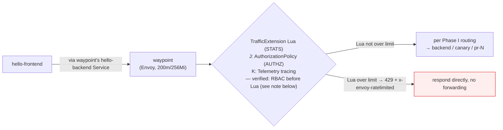

# K3s Phase L — Rate Limiting Design (TrafficExtension + Lua)

Date: 2026-08-25

Corresponds to Phase L of the [K3s Service Mesh Capabilities Roadmap](2026-08-19-k3s-mesh-capabilities-roadmap.md). The roadmap originally defined L as "evaluation" — evaluating the cost of two paths, Gateway API experimental-channel upgrade vs. Istio EnvoyFilter, **without presupposing a deliverable**. This document records the evaluation result: of the two original paths, one does not exist (the experimental channel has no native rate limiting) and one is not officially endorsed (EnvoyFilter under ambient), but **the verification process turned up a fourth, actually-landable path — Istio 1.30's `TrafficExtension` API + Lua token bucket, attached to the waypoint**. This design is that path.

## Evaluation summary (why the two original paths are infeasible, why a fourth was added)

See the [Phase L evaluation notes](./2026-08-25-k3s-phase-l-ratelimit-evaluation.md) for the full verification process. Only the conclusions are recorded here:

| Path | Conclusion | Key evidence |
|---|---|---|
| ~~Upgrade Gateway API to experimental channel for native rate limiting~~ | **Does not exist** | The roadmap's original text wrote "native rate limiting (GEP-2257)", but GEP-2257 is actually the [Duration string format standard](https://gateway-api.sigs.k8s.io/geps/gep-2257/), unrelated to rate limiting. The Gateway API official [GEP list](https://gateway-api.sigs.k8s.io/geps/list/) has no rate-limiting GEP; the cluster's installed v1.6.1 is the current latest version, and its experimental channel (`XBackendTrafficPolicy` etc.) has no rate limit field either |
| ~~Istio EnvoyFilter injecting the `local_ratelimit` filter~~ | **Not officially endorsed under ambient; high maintenance risk** | [Istio's official rate-limiting task page](https://istio.io/latest/docs/tasks/policy-enforcement/rate-limit/) is entirely based on sidecar mode (injecting the filter into the sidecar inbound chain); the waypoint extension mechanisms the ambient official docs list are only [Wasm](https://istio.io/latest/docs/ambient/usage/extend-waypoint-wasm/) and [Lua](https://istio.io/latest/docs/ambient/usage/extend-waypoint-lua/), EnvoyFilter not among them. Istio maintainer howardjohn said outright in [istio/istio#54391](https://github.com/istio/istio/issues/54391): "EnvoyFilter very very limited support in ambient". Real-world gotchas: [#57350](https://github.com/istio/istio/issues/57350) (ambient rate limiting not working, actually a wrong context) and [#57609](https://github.com/istio/istio/pull/57609) (the PR fixing envoyfilter+virtualservice conflict was abandoned) |
| ~~External rate limit service (Envoy gRPC + Redis)~~ | **Adds two components, violating constraints** | The roadmap's hard constraint "prefer reusing already-running components, no new Deployments"; and it adds infrastructure for a nonexistent traffic problem |
| **TrafficExtension + Lua token bucket (this design)** | ✅ **Landable** | `TrafficExtension` (`extensions.istio.io/v1alpha1`) is a formal Istio 1.30 API, its CRD already installed in the cluster with istio-base; istiod 1.30.3 source confirms the waypoint HTTP chain injects the Lua filter generated by TrafficExtension. **Pure CRD, zero new components** |

One important verification by-product: the EnvoyFilter path is actually **not completely dead** — 1.30.3 source proves the waypoint's EnvoyFilter using `context: SIDECAR_INBOUND` + `targetRefs` (kind Service/Gateway) can actually attach and inject filters ([#57350](https://github.com/istio/istio/issues/57350)'s failure was actually using `context: GATEWAY`, a configuration error). But the official maintainer says support is extremely limited, official test coverage is zero, and `local_ratelimit`'s token bucket is per-process shared (semantically less precise than Lua's per-worker), so if "precise global rate limiting" semantics are needed in the future, EnvoyFilter + `local_ratelimit` could be a v2 candidate — but that is an officially unendorsed escape hatch, not adopted this phase; see "Known limitations".

## Scope

**What this phase does:**
- Add a `TrafficExtension` CRD in `pr-lanes`, implementing **fixed-window token-bucket rate limiting** with Lua on the waypoint. `targetRefs: kind: Service, name: hello-backend` attaches only to the `hello-backend` Service's own inbound filter chain, not the whole waypoint (see "Known limitations"). This chain covers all traffic routed after resolving to the `hello-backend` VIP — including the portion internally forwarded to `hello-backend-canary` by the existing 90/10 `VirtualService` weight, and the PR-lane backends (`hello-backend-pr-N`) via HTTPRoute (`parentRefs: Service/hello-backend`) — the latter traffic also flows through this chain, so **the same Lua filter also processes them** (same mechanism as Phase J's Policy 1 attaching to the waypoint covering all downstreams). But it does **not cover** directly calling `hello-backend-canary.pr-lanes.svc.cluster.local` (that Service has its own independent inbound chain, not going through the `hello-backend` VIP), nor is it "the PR-lane Service itself having a waypoint label" — PR-lane Services have no `use-waypoint` label (see "Known limitations")
- Over-limit requests return HTTP 429 + the `x-envoy-ratelimited: true` header
- Rate-limit parameters are tunable: initially land with a loose threshold (e.g. 60 req/min/worker) and verify 429 behavior, then adjust as needed once false positives are ruled out

**What this phase does NOT do (left to later phases or explicitly excluded):**
- No "precise global rate limiting" — the Lua filter's counter state is per-worker (see "Known limitations"). Under a 200m CPU limit the waypoint most likely has only 1 worker, i.e. equal to global rate limiting; with 2 workers it is approximate semantics. This suffices for `pr-lanes`'s demo scenario (no real user traffic, protective rate limiting). If precise semantics are needed later, re-evaluate EnvoyFilter + `local_ratelimit` (see above)
- No external rate-limit service (Redis + ratelimit server) — violates the roadmap's "no new components" constraint
- No Gateway API / Istio upgrade — no newer version, and this design does not depend on upgrading
- Not touching the waypoint's two existing layers (Phase J's `AuthorizationPolicy`, Phase K's `mesh-tracing` Telemetry) — `TrafficExtension`'s `phase: STATS` injection point is independent of them (see "Architecture")
- Not modifying Phase I's `VirtualService`/`DestinationRule`/`httproute.yaml`

## Current-state constraints

- Cluster: k3s v1.36.2+k3s1 single node, Cilium CNI, Istio 1.30.3 ambient (istiod/ztunnel/istio-cni), Gateway API v1.6.1 standard channel
- `pr-lanes`: 4 Deployments (hello-backend, hello-backend-canary, hello-frontend, waypoint), 0 active PR lanes, no real user traffic
- `pr-lanes-quota`: requests 125m/320Mi (hard 400m/768Mi), limits 500m/640Mi (hard 1200m/1536Mi) — `TrafficExtension` is pure control-plane resource, **consumes no quota**
- waypoint pod: requests 50m/128Mi, limits 200m/256Mi, already running J (RBAC) + K (tracing) two layers
- Host swap 85% used, resources tight — this design adds zero components; Lua is inlined in the waypoint process, no extra memory overhead

## Architecture



Injection-point note: `TrafficExtension`'s `phase: STATS` injects a Lua filter at the `STATS` stage of the waypoint's Envoy HTTP filter chain (mechanism confirmed in the istiod source `listener_waypoint.go` → `extensionfilter.go` → `extension/lua.go`). This filter can use `handle:respond()` to return 429 directly without forwarding upstream. It is in a different filter/stage from Phase J's `AuthorizationPolicy` (Envoy RBAC filter, `AUTHZ` phase) and Phase K's tracing (`Telemetry` CR), so in theory they are mutually independent and non-conflicting — **verified**: in the actual filter chain `inbound-vip|80|http|hello-backend.pr-lanes.svc.cluster.local`, the real order is `rbac → grpc_stats → fault → cors → extensions.istio.io/trafficextension/pr-lanes.hello-backend-ratelimit → waypoint_upstream_peer_metadata → istio.stats → router` — **Phase J's RBAC is before this phase's Lua rate limiting**, so unauthorized calls are already rejected by RBAC before reaching the rate limiter, and rate-limit quota is not consumed by unauthorized traffic (verification method and full details in "Known limitations"). The relative order with Phase K's tracing was not specifically verified.

## Components and configuration

| Item | Decision | Rationale |
|---|---|---|
| API | `TrafficExtension` (`extensions.istio.io/v1alpha1`) | A formal Istio 1.30 API (the new API family replacing WasmPlugin), CRD already installed in the cluster with istio-base (confirmed via `kubectl get crd trafficextensions.extensions.istio.io`). Listed in the official docs as one of the waypoint's supported extension mechanisms; has more official design intent than the "escape hatch" EnvoyFilter |
| Attachment target | `targetRefs: [{kind: Service, name: hello-backend}]` + `match: [{mode: SERVER}]` | `kind: Service` attaches to the `hello-backend` Service (which has the `istio.io/use-waypoint: waypoint` label, so traffic flows through the waypoint). `mode: SERVER` limits processing to inbound (service-received) requests, not affecting outbound. **Verified**: `targetRefs: Service/hello-backend` actually attaches to the `hello-backend` Service's own inbound filter chain on the waypoint (`inbound-vip|80|http|hello-backend.pr-lanes.svc.cluster.local`), not the whole waypoint — not the same coverage scope as Phase J's Policy 1 attaching `targetRefs: Gateway/waypoint` (attaching to the whole waypoint Gateway resource, covering all traffic it carries); both just use the `targetRefs` mechanism. baseline/canary's 90/10 weight and PR lanes (HTTPRoute `parentRefs: Service/hello-backend`) all route after resolving to the `hello-backend` VIP, so this chain covers them; but `hello-backend-canary`'s own Service has an independent inbound chain, and directly calling it does not go through this filter (see "Known limitations"). **Note: also does not cover traffic "bypassing the waypoint and directly connecting to Pods"** (see "Known limitations") |
| Injection point | `phase: STATS` | Injected at the STATS stage of the Envoy filter chain, before the router, can use `respond()` to return 429 directly |
| Rate-limiting algorithm | Fixed-window token bucket, Lua implementation | Each worker each window (initial 60 seconds) allows N requests (initial 60). Simple, readable, no dependencies. Fixed window vs. sliding window: fixed window suffices for the demo scenario |
| Over-limit response | HTTP 429 + `x-envoy-ratelimited: true` | Standard rate-limiting response, unambiguous semantics, convenient for later observability integration |
| Threshold | Initial 60 req/min/worker, adjusted after verification | A loose threshold first verifies "the 429 behavior really works", avoiding false-positives on normal traffic; tighten as needed once confirmed |
| Deployment | ArgoCD git-first, placed in `vps_oracle/k3s/apps/hello/k8s/` | This directory is managed by the existing `hello` Application (`path: vps_oracle/k3s/apps/hello/k8s`); new YAML is auto-discovered by ArgoCD, no Application or kustomization change needed |

## Repo layout

```
vps_oracle/k3s/apps/hello/k8s/
  hello-backend-ratelimit-trafficextension.yaml   # new: TrafficExtension + Lua token bucket
```

Lands in the existing `k8s/` directory, following the `backend-*` naming convention. ArgoCD's `hello` Application auto-discovers it; no new Application needed.

## Rollout rhythm

1. Merge `hello-backend-ratelimit-trafficextension.yaml` (single commit)
2. Wait for ArgoCD sync (`kubectl -n argocd get application hello` → `Synced`)
3. Verify rate-limiting behavior (see "Verification checklist"): flood requests at the loose threshold (60 req/min), confirm 429 + `x-envoy-ratelimited: true` once over the limit
4. Confirm normal traffic is unaffected (J's RBAC and K's tracing both still working)
5. If needed, adjust the threshold (edit YAML, commit again)

## Verification checklist (phase L pass criteria)

**Pre-rollout:**
1. `kubectl -n argocd get application hello` → `Synced` + `Healthy`
2. `kubectl -n pr-lanes get trafficextension hello-backend-ratelimit` → exists

**Rate-limiting behavior:**
3. From the `hello-frontend` pod (has curl), flood requests continuously (`curl http://127.0.0.1:8080/api/`, traffic flows through the waypoint to the backend): the first N (below the threshold) return 200
4. Beyond the threshold, subsequent requests return **429** + `x-envoy-ratelimited: true`
5. After the window resets (60s), requests return 200 again

**Coexistence with existing layers:**
6. Phase J's RBAC still working: a caller lacking the `hello-frontend-sa` identity (a temporary debug pod) is still rejected (403/denied)
7. Phase K's tracing still working: `kubectl -n pr-lanes get telemetry mesh-tracing` exists, and the waypoint still emits spans normally (queryable if a Jaeger UI is available)
8. `kubectl describe resourcequota pr-lanes-quota -n pr-lanes` confirms quota unchanged (`TrafficExtension` is not counted)
9. Re-check all existing Applications still `Synced` + `Healthy`

**Rate-limit semantics confirmation:**
10. From the waypoint's config_dump, confirm the Lua filter's actual injection point at `phase: STATS`, and its order relative to J's RBAC filter (record the measured result, back-fill "Known limitations")
11. Confirm the waypoint's worker count (Envoy `--concurrency` or stats): if >1, record the approximate semantic "actual rate-limit ceiling ≈ config × worker count"
12. If any PR lane is active: flood requests to `hello-backend-pr-N`, confirming its waypoint-routed traffic is likewise rate-limited (HTTPRoute parentRefs to hello-backend → via waypoint); and confirm that traffic **directly** reaching `hello-backend-pr-N.pr-lanes.svc.cluster.local` (not via the hello-backend Service) is not rate-limited — verifying that the "Known limitations" coverage-boundary description matches reality

## Known limitations / risks to verify

- **Lua filter state is per-worker, not process-wide shared — verified, risk did not materialize**: the Envoy official docs state "all Lua environments are per worker thread". This design originally judged the waypoint pod's 200m CPU limit on a 4-core host most likely yields 1 worker (precise semantics), but kept the possibility of 2 workers (≈2x approximate rate limiting). After implementation Task 2 landed, checking the waypoint's Envoy `concurrency` setting confirmed `concurrency: 1` — single worker, so the Lua token-bucket state is indeed global, not an in-process approximation. The "≈2x approximate rate limiting" risk originally worried about did not materialize on this cluster; no extra approximate-semantics annotation needed
- **TrafficExtension is an Alpha API**: the API may change when upgrading Istio. This design does not upgrade Istio, so short-term risk is low; but this is a cost to remember at future upgrade time
- **Lua code bugs may cause false positives**: first go live with a loose threshold, tighten only after no false positives are confirmed. If Lua has a syntax error, TrafficExtension should be rejected by istiod (not pushed down), but the behavior needs actual testing
- **Coverage boundary: does not cover waypoint-bypassing direct connections** — TrafficExtension attaches to the waypoint, covering only "traffic through the waypoint". The PR-lane backend's Service (`hello-backend-pr-N`) itself has no `use-waypoint` label; if someone directly calls `hello-backend-pr-N.pr-lanes.svc.cluster.local` (not via the `hello-backend` Service's HTTPRoute), ztunnel won't route the traffic to the waypoint, and that traffic is **not subject to this rate limiting**. This is the same bypass path Phase J's Policy 2 faces — J uses Policy 2 (selector attached to each backend Pod) to block direct connections, but **rate limiting has no corresponding "block the bypass" mechanism**, so direct-connect traffic is not rate-limited. Acceptable for the demo scenario (anti-abuse), but must be clear: this rate limiting is at the "traffic through the waypoint" level, not the "all traffic reaching backends" level. **Verified, and a second, more precise, previously unrecorded boundary was found**: after implementation Task 2 landed, a further check via `kubectl exec` running `pilot-agent request GET config_dump` on the waypoint confirmed that `targetRefs: kind: Service, name: hello-backend` actually only attaches the Lua filter to the `hello-backend` Service's own inbound filter chain (`inbound-vip|80|http|hello-backend.pr-lanes.svc.cluster.local`), not the whole waypoint — that chain is confirmed to have the TrafficExtension filter attached (✅ covered), but `hello-backend-canary`'s own VIP chain (`inbound-vip|80|http|hello-backend-canary.pr-lanes.svc.cluster.local`) and the waypoint's `direct-http` chain do not (❌ not covered). Traffic internally forwarded to canary from the `hello-backend` VIP via the existing 90/10 `VirtualService` weight is still counted within rate limiting — the waypoint's 429 counter carries both `destination_service_name=hello-backend` and `destination_service_name=hello-backend-canary` labels at a ratio near 90/10, confirming this path is rate-limited; but directly calling `hello-backend-canary.pr-lanes.svc.cluster.local` (not via the `hello-backend` VIP / `VirtualService` split) completely bypasses rate limiting — this is a second bypass boundary, previously unrecorded, on top of "bypassing the waypoint and directly connecting to Pods" above. The precise scope of this rate limiting is "`hello-backend` Service's own inbound filter chain" level, not "the whole waypoint" level
- **The actual filter order of `phase: STATS` vs. Phase J's RBAC — verified, and a previously erroneous verification method has been corrected**: implementation Task 2's first verification used `grep -oE 'envoy\.filters\.http\.(lua|rbac)'` to do a full-text match over the whole waypoint config_dump, but what it matched was entries in Envoy's bootstrap capability declaration list (`node.extensions`, sorted alphabetically), not the real filter-chain order — `lua` sorts before `rbac` alphabetically, coincidentally producing the seemingly plausible but wrong conclusion "Lua before RBAC", once wrongly recorded as "requests from unauthorized callers first consume rate-limit quota before being rejected by RBAC". The correct verification method is to read the real filter chain's `http_filters` array itself (e.g. `istioctl proxy-config listener <waypoint-pod> -n pr-lanes -o json`, inspecting `filter_chains[].filters[].typed_config.http_filters[].name`), not a blind grep over the whole config_dump. Re-verifying with this method on the real chain `inbound-vip|80|http|hello-backend.pr-lanes.svc.cluster.local` confirmed the actual order is `rbac → grpc_stats → fault → cors → extensions.istio.io/trafficextension/pr-lanes.hello-backend-ratelimit → waypoint_upstream_peer_metadata → istio.stats → router` — **RBAC is before Lua rate limiting**, opposite to the earlier recording. The true semantics are "authorize first, then rate limit": unauthorized calls (rejected by Phase J's AuthorizationPolicy) never reach the rate limiter at all, safer than both possibilities originally envisioned, not more dangerous
- **Coexistence with the waypoint's existing layers — verified**: J's `AuthorizationPolicy` (AUTHZ phase), K's `mesh-tracing` (Telemetry CR), and this design's Lua filter (STATS phase) were originally just the inference "in different filters/stages, in theory mutually independent" — Phase I already stepped on the "Gateway API and VirtualService mixed on the same host overwrite each other" gotcha, so theoretical independence does not guarantee actual coexistence without conflict. Verified after checklist items 6 and 7 landed: Phase J's RBAC still works normally (a caller lacking the `hello-frontend-sa` identity still receives 403, and as confirmed above in "filter chain order", RBAC runs before Lua); Phase K's `mesh-tracing` Telemetry is also confirmed unaffected, with waypoint tracing functioning normally. The three layers coexist with no unexpected mutual overwrite or conflict
- **`local_ratelimit` (EnvoyFilter) has more precise semantics but is not officially endorsed**: if "precise global rate limiting" semantics are needed later (e.g. real-workload traffic is onboarded with accurate rate-limit ceiling requirements), EnvoyFilter + `local_ratelimit` (token bucket shared per-process) is a v2 candidate — 1.30.3 source proves `context: SIDECAR_INBOUND` + `targetRefs` can attach to the waypoint, but one must accept the official non-endorsement (howardjohn: "very very limited support in ambient") plus upgrade risk. Not adopted this phase; recorded as a future option
- **The problem rate limiting solves (abuse/overload) does not currently exist**: `pr-lanes` has no real user traffic. This design's value is "low-cost advance preparation" — one CRD + one snippet of Lua, putting the mechanism in place for the roadmap's "future onboarding of workloads-shaped real traffic". The cost is an order of magnitude lower than what evaluation originally envisioned (Gateway API upgrade / external ratelimit service)

## Handoff to later phases

None — L is the roadmap's last phase. Once this phase completes, all four phases I/J/K/L of the [K3s Service Mesh Capabilities Roadmap](2026-08-19-k3s-mesh-capabilities-roadmap.md) are converged.