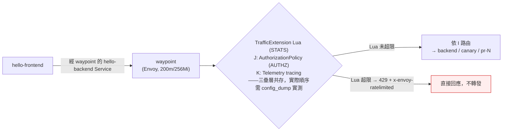

# K3s Phase L — 限流設計（TrafficExtension + Lua）

日期：2026-08-25

對應 [K3s 服務網格能力補完路線圖](2026-08-19-k3s-mesh-capabilities-roadmap.md) 的 L 階段。路線圖原把 L 定義為「評估性」——評估 Gateway API experimental channel 升級 vs. Istio EnvoyFilter 兩條路徑的成本，**不預設一定要交付**。本文件記錄評估結果：兩條原定路徑一條不存在（experimental channel 沒有原生限流）、一條官方不背書（ambient 下 EnvoyFilter），但**查證過程中發現了第四條真正可落地的路——Istio 1.30 的 `TrafficExtension` API + Lua 令牌桶，附加在 waypoint 上**。本設計就是這條路。

## 評估過程摘要（為何兩條原定路徑不可行，為何新增第四條）

完整查證過程見 [L 階段評估筆記](./2026-08-25-k3s-phase-l-ratelimit-evaluation.md)。這裡只記錄結論：

| 路徑 | 結論 | 關鍵證據 |
|---|---|---|
| ~~升級 Gateway API 到 experimental channel 拿原生限流~~ | **不存在** | 路線圖原文寫「原生限流（GEP-2257）」，但 GEP-2257 其實是 [Duration 字符串格式標準](https://gateway-api.sigs.k8s.io/geps/gep-2257/)，與限流無關。Gateway API 官方 [GEP 列表](https://gateway-api.sigs.k8s.io/geps/list/)沒有任何 rate limiting GEP；集群已裝的 v1.6.1 是當前最新版，其 experimental channel（`XBackendTrafficPolicy` 等）也無 rate limit 字段 |
| ~~Istio EnvoyFilter 塞 `local_ratelimit` filter~~ | **ambient 下官方不背書、維護風險高** | [Istio 官方限流任務頁](https://istio.io/latest/docs/tasks/policy-enforcement/rate-limit/)完全基於 sidecar 模式（把 filter 塞進 sidecar inbound chain）；ambient 官方文檔列出的 waypoint 擴展機制只有 [Wasm](https://istio.io/latest/docs/ambient/usage/extend-waypoint-wasm/) 與 [Lua](https://istio.io/latest/docs/ambient/usage/extend-waypoint-lua/)，EnvoyFilter 不在其中。Istio maintainer howardjohn 在 [istio/istio#54391](https://github.com/istio/istio/issues/54391) 明說「EnvoyFilter very very limited support in ambient」。實測坑：[#57350](https://github.com/istio/istio/issues/57350)（ambient 限流不生效，實為 context 用錯）、[#57609](https://github.com/istio/istio/pull/57609)（修 envoyfilter+virtualservice 衝突的 PR 被棄） |
| ~~外部 rate limit 服務（Envoy gRPC + Redis）~~ | **新增兩個元件，違反約束** | 路線圖硬約束「優先複用已運行元件、不新增 Deployment」；且為不存在的流量問題加基礎設施 |
| **TrafficExtension + Lua 令牌桶（本方案）** | ✅ **可落地** | `TrafficExtension`（`extensions.istio.io/v1alpha1`）是 Istio 1.30 正式 API，CRD 已隨 istio-base 裝在集群；istiod 1.30.3 源碼確認 waypoint HTTP chain 注入 TrafficExtension 生成的 Lua filter。**純 CRD、零新增元件** |

一個重要的查證副產物：EnvoyFilter 路線其實**沒有徹底死透**——1.30.3 源碼證明 waypoint 的 EnvoyFilter 用 `context: SIDECAR_INBOUND` + `targetRefs`（kind Service/Gateway）其實可以 attach 並塞 filter（[#57350](https://github.com/istio/istio/issues/57350) 的失敗實為用了 `context: GATEWAY`，是配置錯誤）。但官方 maintainer 明言支持極有限、官方測試零覆蓋、且 `local_ratelimit` 的 token bucket 是 per-process 共享（語義比 Lua per-worker 精確），所以若未來需要「精確全局限流」語義，EnvoyFilter + `local_ratelimit` 可作為 v2 候選——但那是官方不背書的逃生艙口，本階段不採用，見「已知限制」。

## 範圍

**這階段要做的：**
- 在 `pr-lanes` 新增一個 `TrafficExtension` CRD，用 Lua 在 waypoint 上實作**固定窗口令牌桶限流**，限定 `hello-backend`（含 `hello-backend-canary`）的入站流量。PR 泳道 backend（`hello-backend-pr-N`）的 HTTPRoute 以 `parentRefs: Service/hello-backend` 為父——流量同樣經 `hello-backend` Service 的 waypoint 導流，因此**同一個 waypoint 的 Lua filter 也會處理它們**（與 J 階段 Policy 1 掛在 waypoint 涵蓋所有下游的機制相同），但覆蓋是「經由 waypoint 的流量」層級，不是「PR 泳道 Service 本身有 waypoint label」——PR 泳道 Service 沒有 `use-waypoint` label（見「已知限制」）
- 超限請求返回 HTTP 429 + `x-envoy-ratelimited: true` header
- 限流參數可調：初始以寬鬆閾值（如 60 req/min/worker）落地並驗證 429 行為，確認無誤攔後再視需要調整

**這階段不做的（留給後續或明確排除）：**
- 不做「精確全局限流」——Lua filter 的計數狀態是 per-worker 的（見「已知限制」），waypoint 在 200m CPU limit 下大概率只有 1 個 worker，即等同全局限流；若有 2 個 worker 則是近似語義。這對 `pr-lanes` 的 demo 場景（無真實用戶流量、保護性限流）足夠。若未來需要精確語義，改評估 EnvoyFilter + `local_ratelimit`（見上）
- 不新增外部 rate limit 服務（Redis + ratelimit server）——違反路線圖「不加新元件」約束
- 不升級 Gateway API / Istio——無更新版本，且本方案不依賴升級
- 不碰 waypoint 上既有的兩疊層（J 階段 `AuthorizationPolicy`、K 階段 `mesh-tracing` Telemetry）——`TrafficExtension` 的 `phase: STATS` 注入位置與它們獨立（見「架構」）
- 不修改 I 階段的 `VirtualService`/`DestinationRule`/`httproute.yaml`

## 現狀約束

- 集群：k3s v1.36.2+k3s1 單節點，Cilium CNI，Istio 1.30.3 ambient（istiod/ztunnel/istio-cni），Gateway API v1.6.1 standard channel
- `pr-lanes`：4 個 Deployment（hello-backend、hello-backend-canary、hello-frontend、waypoint），0 條活躍 PR 泳道，無真實用戶流量
- `pr-lanes-quota`：requests 125m/320Mi（hard 400m/768Mi）、limits 500m/640Mi（hard 1200m/1536Mi）——`TrafficExtension` 是純控制面資源，**不佔 quota**
- waypoint pod：requests 50m/128Mi、limits 200m/256Mi，已跑 J（RBAC）+ K（tracing）兩疊層
- 宿主机 swap 85% 用掉，資源緊張——本方案零新增元件、Lua 內聯在 waypoint 進程內，無額外內存開銷

## 架構



注入位置說明：`TrafficExtension` 的 `phase: STATS` 會在 waypoint 的 Envoy HTTP filter chain 中、`STATS` 階段注入一個 Lua filter（istiod 源碼 `listener_waypoint.go` → `extensionfilter.go` → `extension/lua.go` 確認此機制）。該 filter 可以用 `handle:respond()` 直接返回 429 而不轉發到上游。與 J 階段 `AuthorizationPolicy`（走 Envoy RBAC filter，`AUTHZ` phase）和 K 階段 tracing（`Telemetry` CR）處在不同 filter/階段，理論上互相獨立、不衝突——**已查證確認**：`inbound-vip|80|http|hello-backend.pr-lanes.svc.cluster.local` 這條真正的 filter chain 裡，實際順序是 `rbac → grpc_stats → fault → cors → extensions.istio.io/trafficextension/pr-lanes.hello-backend-ratelimit → waypoint_upstream_peer_metadata → istio.stats → router`——**J 階段的 RBAC 在本階段的 Lua 限流之前**，未授權呼叫在抵達限流器之前就已經被 RBAC 拒絕，限流額度不會被未授權流量消耗（查證方法與完整細節見「已知限制」）。與 K 階段 tracing 的相對順序未特別查證。

## 元件與設定

| 項目 | 決定 | 理由 |
|---|---|---|
| API | `TrafficExtension`（`extensions.istio.io/v1alpha1`） | Istio 1.30 正式 API（替代 WasmPlugin 的新 API 家族），CRD 已隨 istio-base 裝在集群（`kubectl get crd trafficextensions.extensions.istio.io` 確認）。官方文檔列為 waypoint 的支援擴展機制之一，比 EnvoyFilter 這個「逃生艙口」有官方設計意圖 |
| 附加目標 | `targetRefs: [{kind: Service, name: hello-backend}]` + `match: [{mode: SERVER}]` | `kind: Service` 附加到 `hello-backend` Service（該 Service 有 `istio.io/use-waypoint: waypoint` label，流量經 waypoint）。`mode: SERVER` 限定只處理入站（service 收到）的請求，不影響出站。由於 waypoint 承接所有經 `hello-backend` 的路由（baseline/canary/PR 泳道，後者 HTTPRoute 以 `parentRefs: Service/hello-backend` 為父），`targetRefs: Service/hello-backend` 附加的是這個 waypoint，涵蓋它承接的全部流量——與 J 階段 Policy 1 掛 `targetRefs: Gateway/waypoint` 的機制同源，只是一個用 Service 一個用 Gateway。**注意：不涵蓋「繞過 waypoint 直連 Pod」的流量**（見「已知限制」） |
| 注入位置 | `phase: STATS` | 在 Envoy filter chain 的 STATS 階段注入，位於 router 之前，可用 `respond()` 直接返回 429 |
| 限流演算法 | 固定窗口令牌桶，Lua 實作 | 每 worker 每窗口（初始 60 秒）允許 N 個請求（初始 60）。簡單、可讀、無依賴。固定窗口 vs. 滑動窗口：demo 場景固定窗口足夠 |
| 超限回應 | HTTP 429 + `x-envoy-ratelimited: true` | 標準限流回應，語意明確，方便後續接入可觀測性 |
| 閾值 | 初始 60 req/min/worker，驗證後再調 | 寬鬆閾值先驗證「429 行為真的生效」，避免誤攔正常流量；確認無誤後再視需要收緊 |
| 部署 | ArgoCD git-first，放 `vps_oracle/k3s/apps/hello/k8s/` | 該目錄由既有 `hello` Application（`path: vps_oracle/k3s/apps/hello/k8s`）管理，新增 YAML 自動被 ArgoCD 撿到，不需改 Application 或 kustomization |

## Repo 佈局

```
vps_oracle/k3s/apps/hello/k8s/
  hello-backend-ratelimit-trafficextension.yaml   # 新增：TrafficExtension + Lua 令牌桶
```

落在既有的 `k8s/` 目錄，沿用 `backend-*` 命名慣例。ArgoCD `hello` Application 自動撿到，不需新增 Application。

## 上線節奏

1. 合入 `hello-backend-ratelimit-trafficextension.yaml`（單 commit）
2. 等 ArgoCD 同步（`kubectl -n argocd get application hello` → `Synced`）
3. 驗證限流行為（見「驗證清單」）：以寬鬆閾值（60 req/min）灌請求，確認超限後返回 429 + `x-envoy-ratelimited: true`
4. 確認正常流量不受影響（J 的 RBAC、K 的 tracing 都還正常）
5. 若需要，調整閾值（改 YAML、再 commit）

## 驗證清單（phase L 過關標準）

**上線前置：**
1. `kubectl -n argocd get application hello` → `Synced` + `Healthy`
2. `kubectl -n pr-lanes get trafficextension hello-backend-ratelimit` → 存在

**限流行為：**
3. 從 `hello-frontend` pod（有 curl）連續灌請求（`curl http://127.0.0.1:8080/api/`，流量經 waypoint 到 backend）：前 N 個（< 閾值）返回 200
4. 超過閾值後，後續請求返回 **429** + `x-envoy-ratelimited: true`
5. 等待窗口重置（60s）後，請求恢復 200

**與既有疊層共存：**
6. J 階段 RBAC 仍正常：不具備 `hello-frontend-sa` 身份的呼叫（臨時 debug pod）仍被拒絕（403/拒絕）
7. K 階段 tracing 仍正常：`kubectl -n pr-lanes get telemetry mesh-tracing` 存在，waypoint 仍正常發 span（若有 Jaeger UI 可查）
8. `kubectl describe resourcequota pr-lanes-quota -n pr-lanes` 確認 quota 無變化（`TrafficExtension` 不計入）
9. 全部既有 Application 複查仍 `Synced` + `Healthy`

**限流語義確認：**
10. 從 waypoint 的 config_dump 確認 `phase: STATS` 的 Lua filter 實際注入位置，與 J 的 RBAC filter 誰先誰後（記錄實測結果，回填「已知限制」）
11. 確認 waypoint 的 worker 數（Envoy `--concurrency` 或 stats）：若 >1，記錄「實際限流上限 ≈ 配置 × worker 數」的近似語義
12. 若有活躍 PR 泳道：向 `hello-backend-pr-N` 灌請求，確認其經 waypoint 的流量同樣被限流（HTTPRoute parentRefs 到 hello-backend → 經 waypoint）；並確認**直連** `hello-backend-pr-N.pr-lanes.svc.cluster.local`（不經 hello-backend Service）的流量不被限流——驗證「已知限制」的覆蓋邊界描述與實際一致

## 已知限制 / 待查證風險

- **Lua filter 是 per-worker 狀態，不是進程級共享——已查證確認，風險未發生**：Envoy 官方文檔明示「所有 Lua 環境都是 per-worker thread」，本設計原先評估 waypoint pod 的 200m CPU limit 在 4 核主機上大概率只有 1 個 worker（精確語義），但也保留了 2 個 worker（≈2 倍近似限流）的可能性。實作 Task 2 落地後查證 waypoint 的 Envoy `concurrency` 設定，確認為 `concurrency: 1`——單 worker，Lua 令牌桶狀態確實是全域的，不是進程內近似值。「≈2 倍近似限流」這個當初擔心的風險在這個叢集上沒有發生，不需要額外的近似語義註記
- **TrafficExtension 是 Alpha API**：升級 Istio 版本時 API 可能變動。本方案不升級 Istio，短期風險低；但這是未來升級時要記住的成本
- **Lua 代碼 bug 可能誤攔**：先以寬鬆閾值灰度，確認無誤攔再收緊。若 Lua 有語法錯誤，TrafficExtension 應被 istiod 拒絕（不會下發），但行為需實測
- **覆蓋邊界：不涵蓋繞過 waypoint 的直連**——TrafficExtension 掛在 waypoint 上，只涵蓋「經 waypoint 的流量」。PR 泳道 backend 的 Service（`hello-backend-pr-N`）本身沒有 `use-waypoint` label，若有人直接呼叫 `hello-backend-pr-N.pr-lanes.svc.cluster.local`（不經 `hello-backend` Service 的 HTTPRoute），ztunnel 不會把流量導去 waypoint，該流量**不受本限流管制**。這與 J 階段 Policy 2 面對的繞過路徑相同——J 用 Policy 2（selector 掛在每個 backend Pod 上）堵住直連，但**限流沒有對應的「堵繞過」機制**，直連流量不會被限。對 demo 場景（防濫用）可接受，但要明記：本限流是「經 waypoint 的流量」層級，不是「所有到達 backend 的流量」層級。**已查證確認，且發現一個更精確、先前未記錄的第二個邊界**：實作 Task 2 落地後用 `kubectl exec` 對 waypoint 執行 `pilot-agent request GET config_dump` 進一步查證，`targetRefs: kind: Service, name: hello-backend` 實際只把 Lua filter 掛到 `hello-backend` 這個 Service 自己的入站 filter chain（`inbound-vip|80|http|hello-backend.pr-lanes.svc.cluster.local`）上，不是整個 waypoint——該 chain 確認有掛 TrafficExtension filter（✅ 涵蓋），但 `hello-backend-canary` 自己的 VIP chain（`inbound-vip|80|http|hello-backend-canary.pr-lanes.svc.cluster.local`）與 waypoint 的 `direct-http` chain 都沒有掛（❌ 不涵蓋）。經由既有 90/10 `VirtualService` 權重、從 `hello-backend` VIP 內部轉發到 canary 的流量仍然算在限流內——waypoint 的 429 counter 同時帶有 `destination_service_name=hello-backend` 與 `destination_service_name=hello-backend-canary` 兩種標籤、比例貼近 90/10，證實這條路徑有被限流管制；但直接呼叫 `hello-backend-canary.pr-lanes.svc.cluster.local`（不經 `hello-backend` VIP / `VirtualService` 分流）完全繞過限流——這是繼上述「繞過 waypoint 直連 Pod」之後第二個先前未記錄過的繞過邊界。本限流的準確範圍是「`hello-backend` Service 自己的入站 filter chain」層級，不是「整個 waypoint」層級
- **`phase: STATS` 與 J 階段 RBAC 的實際 filter 順序——已查證確認，且先前一次查證方法有誤已更正**：實作 Task 2 第一次查證時用 `grep -oE 'envoy\.filters\.http\.(lua|rbac)'` 對整份 waypoint config_dump 做全文比對，命中的其實是 Envoy bootstrap 能力宣告清單（`node.extensions`，按字母排序）裡的條目，不是真正 filter chain 的順序——`lua` 字母序排在 `rbac` 之前，恰好巧合產生「Lua 在 RBAC 之前」這個看似合理但錯誤的結論，一度誤記錄成「未授權呼叫者的請求會先消耗限流額度才被 RBAC 拒絕」。正確的查證方法是讀真正的 filter chain 的 `http_filters` 陣列本身（例如 `istioctl proxy-config listener <waypoint-pod> -n pr-lanes -o json`，檢視 `filter_chains[].filters[].typed_config.http_filters[].name`），不是對整份 config_dump 做盲目 grep。重新以這個方法查證 `inbound-vip|80|http|hello-backend.pr-lanes.svc.cluster.local` 這條真正的 chain，確認實際順序是 `rbac → grpc_stats → fault → cors → extensions.istio.io/trafficextension/pr-lanes.hello-backend-ratelimit → waypoint_upstream_peer_metadata → istio.stats → router`——**RBAC 在 Lua 限流之前**，與先前記錄的方向相反。真實語意是「先授權、再限流」：未授權呼叫（被 J 階段 AuthorizationPolicy 拒絕）根本不會抵達限流器，比原先設想的兩種可能性都更安全，不是更危險
- **與 waypoint 上既有疊層的共存——已查證確認**：J 的 `AuthorizationPolicy`（AUTHZ phase）、K 的 `mesh-tracing`（Telemetry CR）與本方案的 Lua filter（STATS phase）原本只是「理論上處在不同 filter/階段，互相獨立」的推論——I 階段就踩過「Gateway API 與 VirtualService 混用同 host 互相覆蓋」的坑，理論獨立不保證實際共存不衝突。驗證清單第 6、7 項落地後查證：J 階段的 RBAC 仍正常運作（不具備 `hello-frontend-sa` 身份的呼叫仍收到 403，且如上「filter chain 順序」已查證確認 RBAC 在 Lua 之前執行）；K 階段 `mesh-tracing` Telemetry 也確認未受影響，waypoint 追蹤功能正常。三疊層共存沒有出現非預期的互相覆蓋或衝突
- **`local_ratelimit`（EnvoyFilter）語義更精確但官方不背書**：若未來需要「精確全局限流」語義（例如接入真實 workloads 流量、有準確的限流上限需求），EnvoyFilter + `local_ratelimit`（token bucket per-process 共享）是 v2 候選——1.30.3 源碼證明 `context: SIDECAR_INBOUND` + `targetRefs` 可 attach 到 waypoint，但需接受官方不背書（howardjohn：「very very limited support in ambient」）+ 升級風險。本階段不採用，記錄為未來選項
- **限流要解決的問題（濫用/過載）目前不存在**：`pr-lanes` 無真實用戶流量。本方案的價值是「低成本提前準備」——一個 CRD + 一段 Lua，為路線圖「未來接入 workloads 形態真實流量」做好機制。成本比評估時預想（升級 Gateway API / 外部 ratelimit 服務）低一個數量級

## 交棒給後續階段

無——L 是路線圖最後一個階段。本階段完成後，[k3s 服務網格能力補完路線圖](2026-08-19-k3s-mesh-capabilities-roadmap.md) 的 I/J/K/L 四階段全部收斂。
