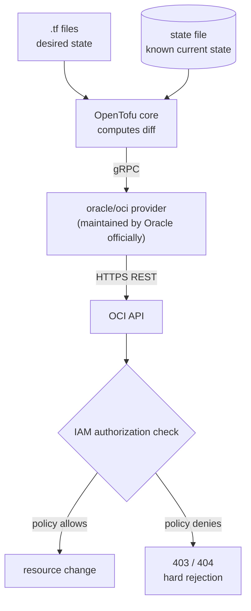

# OpenTofu Integration Design (vps_oracle adoption + vps_gcp sandbox)

Date: 2026-09-09

## Background

This repo has already declaratively managed several layers of infrastructure, but each layer has its own convergence mechanism: compose files rely on manual `docker compose up -d`, k3s relies on ArgoCD's GitOps loop, the host firewall relies on the idempotent `host-firewall.sh` script, and systemd units and dotfiles are brought under management via symlinks.

**The only layer with no management at all is the layer beneath these things — the cloud resources themselves.** OCI's VCN, subnet, route table, and security list exist only as prose scattered across the README (`vps_oracle/README.md` can only note "IPs change, defer to domain resolution"); the host-layer iptables rules have `host-firewall.sh` as their single source of truth, but upstream of it sits an OCI security-list layer that leaves no trace in the repo.

The repo currently has no IaC at all, and the host has none of the CLI tools `tofu` / `terraform` / `oci` / `gcloud`.

Additionally, there is a nearly idle GCP free-tier e2-micro instance currently outside this repo's field of view.

## Goals and scope

**The primary goal is learning** — practicing a complete IaC workflow in a real environment, equivalent in nature to the `k3s/` "real engineering as a learning platform" experiment. Practical value is a by-product, not the main driver.

Terraform/OpenTofu skill is actually two halves; this design deliberately assigns each half to one machine:

| | Machine | What it practices |
|---|---|---|
| **Brownfield** | vps_oracle | `import` existing resources already hand-modified in the console, tame drift, `ignore_changes`. This machine can never be rebuilt, so it only practices this half |
| **Greenfield** | vps_gcp | Full lifecycle: `apply` from zero → change → `destroy` → re-`apply` to verify reproducibility. This half is the soul of IaC, and one would never dare practice it on vps_oracle |

**In scope**:

- Adoption of OCI-side network and security resources (VCN / subnet / internet gateway / route table / security list).
- Building out a full set from zero on the GCP side (VPC / subnet / firewall rules / e2-micro instance / API enablement / budget alert).
- Two independent root modules, independent state, independent credentials and permissions.
- One path-scoped rule file and CI static checks.

**Non-goals**:

- **Not bringing OCI's compute instance and boot volume under management.** See "The IAM wall" below.
- **Not bringing the whole GCP machine into this repo.** That would mean growing a second complete `<host>/` tree (what runs there, how it deploys, how its README is written), a much larger effort, handled separately. This time `vps_gcp/` holds only `tofu/`.
- Not taking over any layer that already has an owner — see "Deliberately left undone".

## Mechanism: why OpenTofu can operate OCI

A necessary clarification, because it directly determines the security model.

OpenTofu itself does not understand any cloud at all. It is only an engine: reads `.tf` → compares desired state against the state file → computes the diff → hands it to a provider to execute. What actually speaks OCI is the **provider**, a separate binary plugin that tofu talks to over gRPC.



`oracle/oci` is written and maintained by Oracle itself; internally it wraps their OCI Go SDK, hitting the **same set of REST APIs** as the console and the `oci` CLI. So the precise statement is: OCI provides "REST API + IAM authorization model", and the provider just wraps that API set into resource types tofu recognizes. Tofu was not granted any special capability; it is merely another API client.

**The most important conclusion this design derives**: what tofu can do equals exactly — no more, no less — what the identity it was issued is authorized to do in IAM.

## The IAM wall (replacing prevent_destroy)

The intuitive approach is to attach `lifecycle { prevent_destroy = true }` to the compute instance. But that is only tofu's own gentleman's agreement, written in a file we manage ourselves — delete one line and it's gone.

Since the decision point for permissions is on the OCI side, the correct approach is **not granting the capability at the IAM layer in the first place**:

- The policy only grants `manage virtual-network-family`.
- It does **not** grant `manage instance-family`, nor block-storage-related permissions.

This way, even if `.tf` is written wrong, even if someone runs `tofu destroy` under `vps_oracle/tofu/`, the API returns 403 on the server side — it is capability-wise unable to touch the machine running all the services. This is a wall, not a fence.

Least privilege is set at IAM, not in Terraform — that is the first lesson this design aims to learn.

## Directory layout

Follow the repo's existing convention that "each subdirectory under `<host>/` is an independent scope" (parallel to `compose/`, `k3s/`, `host-native/`, `dotfiles/`), rather than creating a separate top-level `tofu/` directory — the latter would be orthogonal to the repo's host-first structure, adding an extra mental model.

```
vps_oracle/tofu/
├── README.md              # this scope's operations and conventions
├── versions.tf            # required_version / required_providers (pinned versions)
├── provider.tf            # auth = "InstancePrincipal"
├── network.tf             # VCN / subnet / IGW / route table / security list
└── imports.tf             # import {} blocks

vps_gcp/
├── README.md              # what this machine is; currently only the tofu layer is managed
└── tofu/
    ├── README.md
    ├── versions.tf
    ├── provider.tf
    ├── network.tf         # VPC / subnet
    ├── firewall.tf        # firewall rules
    ├── instance.tf        # e2-micro
    ├── services.tf        # google_project_service
    └── budget.tf          # google_billing_budget

.claude/rules/tofu-conventions.md   # paths scope: */tofu/**
```

Two independent root modules, two state files. A broken OCI state won't block GCP work, and the two sides' credentials and permissions are naturally isolated.

## OCI-side details (brownfield)

Use `import {}` blocks (declarative, committed to git, code-reviewable), not the old `tofu import` command (a one-shot side effect with no record).

Resources to adopt: `oci_core_vcn`, `oci_core_subnet`, `oci_core_internet_gateway`, `oci_core_route_table`, `oci_core_security_list`. The actual list must wait for exploration once credentials are ready — notably, OCI has dedicated resource types for "default" resources (`oci_core_default_route_table` / `oci_core_default_security_list`) whose semantics differ from the general ones; exploration is needed to know which this machine uses.

**Acceptance criterion: `tofu plan` outputs `No changes.`**

This step will take longer than expected. The OCI API returns a host of default fields the console never showed; aligning each one, or deciding which belong in `ignore_changes`, is the exercise of this section — that is the value of brownfield practice, not an obstacle.

## GCP-side details (greenfield)

That e2-micro is basically empty right now, so tofu can be given **complete ownership, including destroy rights**.

Buildout contents: custom VPC + subnet, firewall rules, e2-micro instance, `google_project_service` (declaratively managing "which APIs are enabled" itself), `google_billing_budget`.

**The free tier is a hard boundary; exceeding it means real money**: e2-micro is free only in us-west1 / us-central1 / us-east1, 30 GB total standard persistent disk, 1 GB egress per month (excluding China and Australia). One slip — writing `machine_type` as `e2-medium` or attaching one extra disk — and a bill appears. Therefore:

- Machine type, region, and disk size are hard-coded as literal values, not variables, and the free-tier boundary is noted in the README.
- The first batch of resources already includes `google_billing_budget` + alerting, not deferred to "add later".

**Acceptance criterion: after `tofu destroy`, `tofu apply` fully reproduces, and after reproduction `tofu plan` is `No changes.`**

## Authentication and permissions

The two sides are deliberately different; the asymmetry itself is part of what's to be learned.

**OCI — Instance Principal**: let this instance itself be the identity. Create a Dynamic Group in the console (matching this machine's OCID) + one policy, and set `auth = "InstancePrincipal"` in the provider. Zero long-lived credentials on disk, automatic credential rotation, and no possibility of accidentally committing one to git. The cost is that any process on this machine can use this identity, so the policy must be narrowed — and narrowing is exactly what "The IAM wall" above is about; the two converge into one thing here.

**GCP — dedicated service account + key**: here there **is no Instance Principal equivalent**. Instance Principal works precisely because tofu runs on the OCI machine; hitting the GCP API from the OCI machine cannot obtain a GCP metadata identity.

Two options and the trade-off:

- `gcloud auth application-default login` user credentials: no key management, but it hands **the personal account's full permissions** to tofu, running opposite to least privilege.
- Dedicated service account + key JSON, role narrowed to `roles/compute.networkAdmin`, `roles/compute.instanceAdmin.v1`, `roles/serviceusage.serviceUsageAdmin`: the private key lands on disk, needing gitignore and manual rotation, but the permission boundary is clear.

**This design adopts the latter.** The more orthodox approach is ADC + service account impersonation (no SA private key on disk, while keeping narrow permissions), but it needs gcloud installed and one more layer of config. Phase 1 first gets the key path working, then upgrades to impersonation later — **that upgrade itself is a lesson**, worth keeping as a follow-up exercise rather than piling complexity on from the start.

The repo's `.gitignore` already has `*credentials*.json` and `*.key`, which happens to fit; the key should still be stored outside the repo.

## State and secrets

Local files + gitignore. Sufficient for one person on one machine, and if state is lost it can be re-recovered via re-`import` (the OCI resources themselves still exist). If migrating to a remote backend later, **the migration itself is also a lesson**, suitable as a follow-up exercise.

`.gitignore` needs additions: `*.tfstate`, `*.tfstate.*`, `.terraform/`, `*.auto.tfvars`.

**`.terraform.lock.hcl` should be committed** — it locks provider versions and checksums, the same rationale as pinning image tags / digests in this repo.

## Guardrails

**Rule file** `.claude/rules/tofu-conventions.md`, `paths` scope `*/tofu/**`, same mechanism and auto-loading as the three existing path-scoped rules (`compose-conventions.md`, `k3s-gitops.md`, `docs-layout.md`). Its single most important red line, written in the same style as `host-native/host-firewall/README.md`'s `iptables-save` red line:

> **Forbidden to run `tofu destroy` under `vps_oracle/tofu/`.**

(The IAM wall already makes it unable to reach the instance, but the red line still must be spelled out — defense in depth, and the same explanation for both humans and Claude.)

**CI**: add `tofu fmt -check` and `tofu validate` to the existing `.github/workflows/repo-conventions.yml`. Both are pure static checks that never touch live resources. (`validate` needs `tofu init` first to download the provider plugin — only hits the registry, no cloud credentials needed.)

## Phase order

1. **Phase 1 — GCP greenfield**. Zero risk, can immediately run a full `apply` / `destroy` / `apply` cycle to build muscle memory.
2. **Phase 2 — OCI brownfield adoption**. The hard fight; go in carrying Phase 1's muscle memory.
3. **Phase 3 (uncommitted) — shared resource pool module**. Turn the minio bucket + postgres DB into a per-service module, letting `add-service` go from "manually open prod/dev pools by checklist" to writing a few lines of `.tf`. This is the only part with a clear practical return, but it suits being the third exercise, not the first: the community providers' quirks would steal attention away from learning Terraform itself. **redis ACL has no provider, so this path must keep relying on `gen-users-acl.sh` regardless.**

## Prerequisites (manual console operations, cannot be done by Claude)

- Install OpenTofu (arm64).
- OCI: create a Dynamic Group matching this machine's OCID; create a policy granting only `manage virtual-network-family`.
- GCP: create a dedicated service account, grant the three roles above, generate the key JSON and place it outside the repo.
- GCP: `google_billing_budget`'s permission is **attached to the billing account, not the project**; it needs `roles/billing.costsManager` (or equivalent) granted at the billing-account level. This is an easy spot to miss — however complete the project-level roles are, they don't reach the budget.

## Risks and mitigations

| Risk | Mitigation |
|---|---|
| tofu accidentally deletes the vps_oracle instance, full outage | IAM does not grant `manage instance-family` (wall) + rule-file red line (defense in depth) |
| GCP exceeds the free tier and incurs cost | Machine type/region/disk hard-coded as literals; first batch includes budget alerting |
| state file lost | OCI side re-`import`able; GCP side re-`destroy`-reconstructible (a design goal in the first place) |
| SA key leaked | Role narrowed to three; key stored outside the repo; `.gitignore` already covers the filename pattern |
| OCI drift never converges to No changes | This is expected exercise, not failure; `ignore_changes` on specific fields as needed and record the reason in the README |

## Verification method

- **OCI adoption complete**: `tofu plan` outputs `No changes.`
- **GCP reproducible**: `destroy` then `apply`, then `plan` yields `No changes.`
- **IAM wall actually exists** (a negative verification that is safe): place a `data "oci_core_instance"` data source pointing at this machine in the OCI root module; `tofu plan` should fail due to insufficient permission (OCI returns 404 for unauthorized resources). **This is a read-only operation, changes nothing**, yet proves tofu's identity cannot even "see" the instance, let alone delete it. Remove the data source after verification.
- **CI**: `tofu fmt -check` and `tofu validate` pass.

## Deliberately left undone (YAGNI)

| Left undone | Reason |
|---|---|
| NPM proxy host | The community provider is thin, and `add-proxy-host.sh` has accumulated three gotchas that **silently fail** (SSL toggle self-resetting, k3s NodePort must use the internal IP, API changing locations doesn't re-render the disk config). Replacing with a provider means throwing away experience bought with failures. Net negative |
| redis ACL users | No provider |
| docker containers / k8s manifests | compose and ArgoCD each already own that layer. Layering tofu on top means one resource, two owners |
| ClouDNS records | DDNS dynamic IP, subdomains may be wildcard; DNS records are Terraform's hello world with low learning value |
| Remote state backend | Not needed in Phase 1. Keep as a follow-up exercise (the migration itself is a lesson) |
| Cross-cloud shared module | OCI and GCP resource types are not interchangeable in the first place; the "multi-cloud shared module" is an illusion |
| OCI compute instance / boot volume | Blast radius far exceeds value, and changing some fields triggers destroy-recreate |