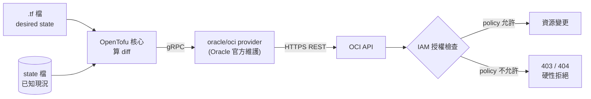

# OpenTofu 集成設計（vps_oracle 收編 + vps_gcp 沙盒）

日期：2026-09-09

## 背景

這個倉庫已經把好幾層基礎設施宣告化了，但每層各有各的收斂機制：compose 檔靠人手 `docker compose up -d`、k3s 靠 ArgoCD 的 GitOps 迴路、宿主機防火牆靠 `host-firewall.sh` 這個冪等腳本、systemd unit 與 dotfiles 靠符號連結納管。

**唯一完全沒有被納管的，是這些東西底下那一層——雲端資源本身。** OCI 的 VCN、subnet、路由表、security list 現在只以文字形式散落在 README 裡（`vps_oracle/README.md` 甚至只能備註「IP 會變，以域名解析為準」）；宿主機層的 iptables 規則有 `host-firewall.sh` 當唯一可信來源，但它上游還有一層 OCI security list，那層在倉庫裡沒有任何痕跡。

倉庫裡目前沒有任何 IaC，宿主機上也沒有 `tofu` / `terraform` / `oci` / `gcloud` 任何一個 CLI。

此外還有一台幾乎空置的 GCP 免費層 e2-micro 實例，目前完全不在這個倉庫的視野內。

## 目標與範圍

**首要目標是學習**——在真實環境裡練一套完整的 IaC 工作流，性質等同 `k3s/` 那個「用真實工程當學習平台」的實驗。實用價值是附帶收穫，不是主要驅動力。

Terraform/OpenTofu 的技能實際上是兩半，這次的設計刻意把兩半各分配一台機器：

| | 機器 | 練的是 |
|---|---|---|
| **Brownfield** | vps_oracle | `import` 已存在且被 console 手改過的資源、馴服 drift、`ignore_changes`。這台永遠不能重建，只能練這半 |
| **Greenfield** | vps_gcp | 完整生命週期：從零 `apply` → 改 → `destroy` → 再 `apply` 驗證可重現。這半是 IaC 的靈魂，而在 vps_oracle 上永遠不敢練 |

**範圍內**：

- OCI 側網路與安全資源（VCN / subnet / internet gateway / route table / security list）的收編。
- GCP 側從零建置一整套（VPC / subnet / firewall rules / e2-micro 實例 / API 啟用 / 預算告警）。
- 兩份獨立的 root module、獨立 state、獨立憑證與權限。
- 一份路徑範圍規則檔與 CI 靜態檢查。

**非目標**：

- **不納管 OCI 的運算實例與 boot volume。** 見下方「IAM 硬牆」。
- **不把 GCP 那台機器整台納入這個倉庫。** 那意味著要長出第二個完整的 `<host>/` 樹（那台跑什麼、怎麼部署、README 怎麼寫），規模大得多，另案處理。這次 `vps_gcp/` 底下只有 `tofu/`。
- 不接管任何已經有 owner 的層——見「刻意不做的事」。

## 機制：OpenTofu 憑什麼能操作 OCI

一個必要的澄清，因為它直接決定了安全模型。

OpenTofu 本身完全不懂任何雲。它只是一個引擎：讀 `.tf` → 比對 desired state 與 state 檔 → 算出差異 → 交給 provider 執行。真正會講 OCI 的是 **provider**，一個獨立的二進位插件，tofu 用 gRPC 跟它溝通。



`oracle/oci` 是 Oracle 自己寫並維護的，內部包的是他們的 OCI Go SDK，打的是跟 console、跟 `oci` CLI **同一組 REST API**。所以精確的說法是：OCI 提供的是「REST API + IAM 授權模型」，provider 只是把那組 API 包成 tofu 認得的資源型別。tofu 不是被授予了什麼特殊能力，它只是又一個 API client。

**由此推出本設計最重要的一條**：tofu 能做什麼，完全等於發給它的那個身分在 IAM 裡被授權做什麼，不多不少。

## IAM 硬牆（取代 prevent_destroy）

直覺做法是給運算實例掛 `lifecycle { prevent_destroy = true }`。但那只是 tofu 自己的君子協定，寫在我們自己管的檔案裡，刪一行就沒了。

既然權限的裁決點在 OCI 那端，正確的做法是**在 IAM 層就不給能力**：

- policy 只授權 `manage virtual-network-family`。
- **不授權** `manage instance-family`、不授權 block storage 相關。

這樣即使 `.tf` 寫錯、即使有人在 `vps_oracle/tofu/` 下執行 `tofu destroy`，API 在伺服器端就回 403——它在能力上根本碰不到這台正在跑所有服務的機器。這是硬牆，不是圍欄。

最小權限是在 IAM 設，不是在 Terraform 設，這是本次設計要學到的第一課。

## 目錄佈局

依照倉庫既有的「`<host>/` 底下每個子目錄是一個獨立 scope」慣例（與 `compose/`、`k3s/`、`host-native/`、`dotfiles/` 平行），而不是另建一個頂層 `tofu/` 目錄——後者會與倉庫的 host-first 結構正交，多出一種心智模型。

```
vps_oracle/tofu/
├── README.md              # 此 scope 的操作與約定
├── versions.tf            # required_version / required_providers（釘死版本）
├── provider.tf            # auth = "InstancePrincipal"
├── network.tf             # VCN / subnet / IGW / route table / security list
└── imports.tf             # import {} 區塊

vps_gcp/
├── README.md              # 這台機器是什麼、目前只納管 tofu 這一層
└── tofu/
    ├── README.md
    ├── versions.tf
    ├── provider.tf
    ├── network.tf         # VPC / subnet
    ├── firewall.tf        # firewall rules
    ├── instance.tf        # e2-micro
    ├── services.tf        # google_project_service
    └── budget.tf          # google_billing_budget

.claude/rules/tofu-conventions.md   # paths scope: */tofu/**
```

兩個獨立 root module、兩份 state。OCI 的 state 壞掉不會卡住 GCP 的工作，兩邊的憑證與權限也天然隔離。

## OCI 側細節（brownfield）

用 `import {}` 區塊（宣告式，進 git、可 code review），不用舊的 `tofu import` 指令（一次性副作用，沒有紀錄）。

待收編資源：`oci_core_vcn`、`oci_core_subnet`、`oci_core_internet_gateway`、`oci_core_route_table`、`oci_core_security_list`。實際清單要等憑證就緒後探查才能確定——特別是 OCI 對「預設」資源有專門的資源型別（`oci_core_default_route_table` / `oci_core_default_security_list`），它們的語意與一般資源不同，要在探查後才知道這台用的是哪種。

**驗收標準：`tofu plan` 輸出 `No changes.`**

這一步會比預期久。OCI API 會回一堆 console 從未顯示過的預設欄位，逐個對齊、或判斷哪些該進 `ignore_changes`，就是這節的功課——這正是 brownfield 練習的價值所在，不是障礙。

## GCP 側細節（greenfield）

那台 e2-micro 目前基本是空的，所以它可以被 tofu **完整擁有，包含 destroy 權**。

建置內容：自訂 VPC + subnet、firewall rules、e2-micro 實例、`google_project_service`（把「啟用哪些 API」本身也宣告化）、`google_billing_budget`。

**免費層是硬邊界，超出就是真的花錢**：e2-micro 僅在 us-west1 / us-central1 / us-east1 免費，30 GB 標準永久磁碟總額，每月 1 GB 出網（不含中國與澳洲）。一個手滑把 `machine_type` 寫成 `e2-medium`、或多掛一顆磁碟，帳單就會出現。因此：

- 機型、區域、磁碟大小寫死為字面值，不用變數，並在 README 標註免費層邊界。
- 第一批資源就包含 `google_billing_budget` + 告警，不等到「以後再加」。

**驗收標準：`tofu destroy` 之後 `tofu apply` 能完整重現，且重現後 `tofu plan` 為 `No changes.`**

## 認證與權限

兩邊刻意不同，這個非對稱性本身就是要學的東西。

**OCI — Instance Principal**：讓這台實例本身當身分。在 console 建一個 Dynamic Group（匹配這台機的 OCID）+ 一條 policy，provider 設 `auth = "InstancePrincipal"`。磁碟上零長期憑證，憑證自動輪換，也不可能不小心提交進 git。代價是這台機器上的任何行程都用得到這個身分，所以 policy 必須收窄——而收窄本來就是上面「IAM 硬牆」要做的事，兩件事在此收斂為同一件。

**GCP — 專用 service account + key**：這裡**拿不到 Instance Principal 的對等物**。Instance Principal 之所以成立，是因為 tofu 就跑在那台 OCI 機器上；從 OCI 機器打 GCP API，取不到 GCP 的 metadata 身分。

兩個選項與取捨：

- `gcloud auth application-default login` 的使用者憑證：不用管 key，但等於把**個人帳號的全部權限**交給 tofu，與最小權限背道而馳。
- 專用 service account + key JSON，角色收窄到 `roles/compute.networkAdmin`、`roles/compute.instanceAdmin.v1`、`roles/serviceusage.serviceUsageAdmin`：私鑰落在磁碟上，需要 gitignore 與人工輪換，但權限邊界清楚。

**本設計採後者**。更正統的做法是 ADC + service account impersonation（磁碟上沒有 SA 私鑰，又保有窄權限），但要多裝 gcloud、多一層設定。第一階段先用 key 跑順，之後再升級成 impersonation——**那次升級本身就是一課**，值得留著當後續練習，而不是一開始就把複雜度堆上來。

倉庫的 `.gitignore` 已有 `*credentials*.json` 與 `*.key`，剛好接得上；key 仍應存放在倉庫之外。

## State 與機密

本機檔案 + gitignore。單人單機夠用，而且 state 沒了還能重新 `import` 救回來（OCI 資源本身還在）。之後若要遷到遠端 backend，**遷移動作本身也是一課**，適合留作後續練習。

`.gitignore` 需補：`*.tfstate`、`*.tfstate.*`、`.terraform/`、`*.auto.tfvars`。

**`.terraform.lock.hcl` 要提交**——它鎖定 provider 版本與 checksum，跟這個倉庫釘死 image tag / digest 是同一個道理。

## 護欄

**規則檔** `.claude/rules/tofu-conventions.md`，`paths` 範圍 `*/tofu/**`，與現有三份路徑範圍規則（`compose-conventions.md`、`k3s-gitops.md`、`docs-layout.md`）同一機制、自動載入。其中最重要的一條紅線，寫法比照 `host-native/host-firewall/README.md` 的 `iptables-save` 紅線：

> **禁止在 `vps_oracle/tofu/` 執行 `tofu destroy`。**

（IAM 硬牆已經讓它打不到實例，但紅線仍要寫明——縱深防禦，且對人和 Claude 都是同一份說明。）

**CI**：在既有的 `.github/workflows/repo-conventions.yml` 加 `tofu fmt -check` 與 `tofu validate`。兩者都是純靜態檢查，不會碰到線上資源。（`validate` 需要先 `tofu init` 下載 provider 插件——只連 registry，不需要任何雲端憑證。）

## 階段順序

1. **Phase 1 — GCP greenfield**。零風險，能立刻跑完一整圈 `apply` / `destroy` / `apply`，建立手感。
2. **Phase 2 — OCI brownfield 收編**。硬仗，帶著 Phase 1 的手感再上。
3. **Phase 3（未承諾）— 共享資源池 module**。把 minio bucket + postgres DB 做成 per-service module，讓 `add-service` 從「照 checklist 手動開 prod/dev 兩套池」變成寫幾行 `.tf`。這是唯一有明確實用回報的部分，但它適合當第三題，不適合當第一題：社群 provider 的脾氣會搶走學 Terraform 本身的注意力。**redis ACL 沒有 provider，這條路無論如何都得繼續靠 `gen-users-acl.sh`。**

## 前置條件（需要人工在 console 操作，無法由 Claude 完成）

- 安裝 OpenTofu（arm64）。
- OCI：建立 Dynamic Group 匹配本機 OCID；建立 policy 只授權 `manage virtual-network-family`。
- GCP：建立專用 service account、賦予上述三個角色、產生 key JSON 並放到倉庫外。
- GCP：`google_billing_budget` 的權限**掛在帳單帳戶上、不是專案上**，需要在帳單帳戶層級授予 `roles/billing.costsManager`（或等效）。這是容易踩空的一點——專案層級的角色再全也管不到預算。

## 風險與緩解

| 風險 | 緩解 |
|---|---|
| tofu 誤刪 vps_oracle 實例，全站中斷 | IAM 不授予 `manage instance-family`（硬牆）+ 規則檔紅線（縱深） |
| GCP 超出免費層產生費用 | 機型/區域/磁碟寫死字面值；第一批資源就含預算告警 |
| state 檔遺失 | OCI 側可重新 `import`；GCP 側可 `destroy` 重建（本來就是設計目標） |
| SA key 外洩 | 角色收窄至三個；key 存倉庫外；`.gitignore` 已涵蓋該檔名樣式 |
| OCI drift 永遠收斂不到 No changes | 這是預期中的功課，不是失敗；必要時對特定欄位 `ignore_changes` 並在 README 記錄原因 |

## 驗證方式

- **OCI 收編完成**：`tofu plan` 輸出 `No changes.`
- **GCP 可重現**：`destroy` 後 `apply`，再 `plan` 得 `No changes.`
- **IAM 硬牆確實存在**（安全的負面驗證）：在 OCI root module 裡放一個 `data "oci_core_instance"` 資料源指向本機，`tofu plan` 應因權限不足而失敗（OCI 對未授權資源回 404）。**這是唯讀操作，不會變更任何東西**，卻能確證 tofu 的身分連「看見」實例都做不到，遑論刪除。驗證後移除該資料源。
- **CI**：`tofu fmt -check` 與 `tofu validate` 通過。

## 刻意不做的事（YAGNI）

| 不做 | 原因 |
|---|---|
| NPM proxy host | 社群 provider 很薄，而 `add-proxy-host.sh` 裡沉澱了三個會**靜默失敗**的坑（SSL 開關自我重置、k3s NodePort 必須填內網 IP、API 改 locations 不重新渲染磁碟配置）。換成 provider 等於把這些用故障換來的經驗丟掉。淨負值 |
| redis ACL 使用者 | 沒有 provider |
| docker 容器 / k8s manifest | compose 與 ArgoCD 已經各自擁有那一層。疊上 tofu 等於一個資源兩個 owner |
| ClouDNS 記錄 | DDNS 動態 IP，子域可能是萬用字元；DNS 記錄是 Terraform 的 hello world，學習價值低 |
| 遠端 state backend | 第一階段用不上。留作後續練習（遷移動作本身是一課） |
| 跨雲共用 module | OCI 與 GCP 的資源型別本來就不通用，「多雲共用 module」是幻覺 |
| OCI 運算實例 / boot volume | 爆炸半徑遠大於價值，且改某些欄位會觸發 destroy-recreate |
