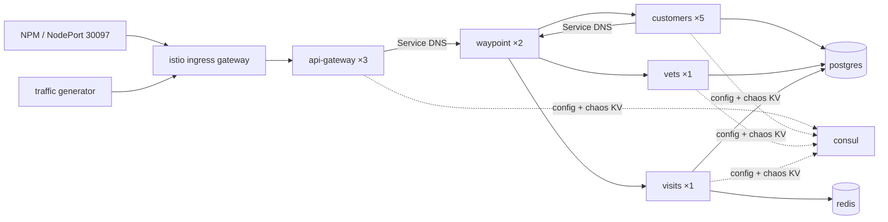

# lab-environment Production Baseline — Mesh, Multi-instance, Evidence Chain

Date: 2026-09-25

## Context and goal

`lab-environment` (k3s namespace, all pods pinned to vps-oracle2) runs the Spring PetClinic microservices fork (`api-gateway`, `customers-service`, `vets-service`, `visits-service`) plus Consul, PostgreSQL, Redis, Toxiproxy and its own Prometheus/Grafana/Loki/Jaeger. It was built as an isolated sandbox for evaluating an RCA agent.

The owner now wants to use it for **interview demos of SDLC capabilities** (canary/gray release, PR lanes, resilience, zero-trust, etc.), performed live by following a written runbook (later rendered as a web page). Every capability must be backed by evidence — logs, Jaeger traces, metrics — proving it is real platform behaviour, not demo code.

Guiding principle agreed during design: **the lab must simulate a realistic production environment, not a pretty lab.** Anything a real production system would have (mesh, resilience policies, authz, multiple replicas) is resident. Only things that would not exist in real production (e.g. header-triggered fault injection) are added temporarily during a demo. The RCA agent's eval baseline is re-established on the new environment; comparability with the 2026-07-31 runs is knowingly given up.

The work is decomposed into three sub-projects, each with its own spec → plan → implementation cycle (status and notes for all of them: [SDLC demo roadmap](2026-09-25-lab-sdlc-demo-roadmap.md)):

1. **This spec** — production baseline: mesh onboarding, multi-instance, service discovery migration, secrets, evidence chain
2. Demo scenarios and the `docs/demo/` runbook (rate limiting, canary/blue-green, mirroring, fault injection, chaos) — depends on 1
3. PR lanes for the lab (fork CI → GHCR → Cosign → ApplicationSet), plus Kyverno signature verification for lab images

The runbook becoming a web page is a later step; sub-project 2 structures the runbook for that.

## Current state (verified 2026-09-25)

- All 14 Deployments `replicas: 1`, `strategy: Recreate`, default ServiceAccount, on vps-oracle2 (2 CPU / 11Gi, ~4.6Gi used, ~7Gi available).
- Namespace has no ambient label — not in the mesh. ztunnel and istio-cni already run on vps-oracle2.
- Inter-service calls use Spring Cloud LoadBalancer over **Consul discovery with `PREFER_IP_ADDRESS=true`**: gateway routes `lb://<svc>`, `@LoadBalanced` `WebClient.Builder`/`RestTemplate` in the gateway and `@LoadBalanced RestTemplate` in customers-service (→ visits-service). Calls go straight to pod IPs, so any Service-attached mesh routing would be bypassed.
- Config center: Consul KV + Spring Cloud Consul Config. `config/<svc>/data/*` is imported at startup (`spring.config.import: optional:consul:`); `chaos/<svc>/*` toggles are polled every 5s by the fork's `ChaosToggleWatcher` via `ConsulClient`.
- **Every service start wipes its database**: `spring.sql.init.mode: always` with `schema.sql` beginning `DROP TABLE IF EXISTS ...` and non-idempotent `data.sql` inserts.
- Plaintext credentials: `POSTGRES_PASSWORD: petclinic` in `postgres.yaml`; `config/*/data/db.password` in Consul KV. The value is in public git history.
- Prometheus scrapes business services via `static_configs` on Service names — with multiple replicas each scrape would hit a random pod.
- App-level tracing works: Micrometer (W3C `traceparent` by default in Spring Boot 4) → Zipkin endpoint on the lab Jaeger (`jaeger:9411`), 100% sampling. Jaeger already lists all four services.
- Gateway has Resilience4j `CircuitBreaker` (with fallback) and a `Retry` filter that retries **POST** on 503.
- Actuator exposes `include: "*"` (including `env`, `heapdump`).
- Images are local-only mutable tags `ops-lab/<svc>:dev`, imported into vps-oracle2's k3s containerd.
- External access: NPM → NodePort `30097` (api-gateway) and `30092`–`30096` (consul/prometheus/grafana/jaeger/mcp-toolkit). Grafana `Lab API Down` probes `30097` via vps-oracle2's tailscale IP.

## Decisions

| # | Decision | Why |
|---|---|---|
| D1 | Service discovery moves to **K8s Service DNS + mesh** (option C). Consul stays as config center and chaos-toggle store only | Mainstream end state for Spring Cloud on K8s with a mesh: client-side LB conflicts with the mesh. "Consul discovery alongside mesh" (option A) is a migration intermediate; "register the Service VIP in Consul" (option B) is an anti-pattern |
| D2 | `ops-agent-toolkit-mcp`'s `get_service_health` reads K8s (EndpointSlices + pods) instead of Consul (option C1) | In K8s the source of truth for health is readiness/Endpoints; avoids leaving a register-only Consul residue |
| D3 | Replicas: `customers-service` ×5, `api-gateway` ×3, everything else ×1 | Owner's choice. customers is the target of most chaos scenarios; the gateway is a typical multi-replica entry point |
| D4 | Schema init moves out of app startup into an idempotent ArgoCD `PreSync` Job | Multi-replica startup would otherwise drop tables under running peers. Migration decoupled from app start is the real-world pattern |
| D5 | DB password → SealedSecret, **and rotated** | Secrets do not belong in a config center; the old value is public |
| D6 | Istio **ingress gateway** (Gateway API, `gatewayClassName: istio`) as the north-south entry, taking over NodePort `30097` | Mainstream entry pattern; gives the entry hop Envoy metrics/traces; keeps NPM and the `Lab API Down` probe unchanged |
| D7 | Timeouts/retries via Istio `VirtualService` (not `HTTPRoute`) | HTTPRoute retry is experimental-channel only; the cluster runs the standard channel. VirtualService on a waypoint is already proven in `pr-lanes` |
| D8 | Mesh owns retries; gateway's Resilience4j `Retry` filter is removed; `CircuitBreaker` + fallback stays | Retrying POST is a real bug (non-idempotent); stacked app + mesh retries multiply load. Fallback responses are business logic the mesh cannot provide |
| D9 | Envoy tracing uses Istio's **`opentelemetry` provider** (OTLP → lab Jaeger `:4317`), not Zipkin | Istio's Zipkin tracer propagates B3; Spring Boot 4 propagates W3C. Mismatched formats would split Envoy and app spans into separate traces |
| D10 | Immutable image tags (fork git SHA) | Rollback = revert the tag; a demo can show "this pod runs exactly this commit" |
| D11 | A resident low-rate traffic generator | Real systems always have traffic; dashboards and outlier detection need it |

## Design

### 1. Architecture

- Namespace `lab-environment` gets `istio.io/dataplane-mode: ambient`: all pods get ztunnel L4 mTLS.
- A namespace waypoint (`Gateway`, `gatewayClassName: istio-waypoint`) with **2 replicas**; only the four business Services carry `istio.io/use-waypoint`. postgres/redis/consul are L4-only (non-HTTP).
- Waypoint resources are set per-Gateway via `infrastructure.parametersRef` (≈ requests 100m/128Mi, limits 500m/256Mi). The cluster-wide default in `k3s/istio/istiod-values.yaml` (200m limit, sized for `pr-lanes`) would throttle under lab load and is left unchanged.
- The Kyverno mutate policy `lab-environment-on-oracle2` pins waypoint and ingress-gateway pods to vps-oracle2 automatically (it mutates every Pod in the namespace).
- Each business workload gets its own ServiceAccount (`api-gateway`, `customers-service`, `vets-service`, `visits-service`, plus `db-init`, `prometheus`, `mcp-toolkit`, `traffic-generator`).

### 2. Database init and multi-instance

**Database init**
- The three data services set `SPRING_SQL_INIT_MODE=never`.
- New `db-init` Job, annotated `argocd.argoproj.io/hook: PreSync` and `hook-delete-policy: BeforeHookCreation`, image `postgres` (psql), runs the schema and seed SQL from a ConfigMap. The SQL is an **idempotent rewrite** of the fork's `schema.sql`/`data.sql` per database: `CREATE TABLE IF NOT EXISTS`, `INSERT ... ON CONFLICT DO NOTHING`. Re-running on every sync is a no-op.
- The ConfigMap copy is the source of truth for the lab schema; the fork's `db/postgresql/*.sql` remain for the upstream `mode: always` local-dev path.

**Multi-instance**
- Replicas per D3. All business Deployments: `strategy: RollingUpdate`, `maxSurge: 1`, `maxUnavailable: 0` — also serialises JVM startups on the 2-core node.
- `PodDisruptionBudget` for customers-service (`minAvailable: 3`) and api-gateway (`minAvailable: 2`).
- No topology spread: single node. Recorded as a known gap.
- Memory: ≈ +4Gi (customers +4×768Mi, gateway +2×512Mi, waypoints, ingress gateway, generator) → ≈ 8.6Gi of 11Gi. Scale up in two steps, checking `free -h` on vps-oracle2 after each.

**Prometheus per-pod scraping**
- `spring-boot-services` job switches to `kubernetes_sd_configs` (`role: pod`, namespace `lab-environment`), keeping pods annotated `prometheus.io/scrape: "true"` with `prometheus.io/port`/`prometheus.io/path`; pod name becomes the `instance`/`pod` label.
- A second job scrapes Envoy stats (`:15020/stats/prometheus`) from waypoint and ingress-gateway pods.
- Prometheus gets its own ServiceAccount + `Role` (get/list/watch `pods`, `endpoints`, `services` in `lab-environment` only) + `RoleBinding`.

### 3. Service discovery migration (fork + toolkit)

**Fork (`spring-petclinic-microservices`)**
- Downstream URLs become configuration properties with Service-DNS defaults: `http://customers-service:8081`, `http://visits-service:8082`, `http://vets-service:8083`.
- Remove `@LoadBalanced` from the gateway's `RestTemplate`/`WebClient.Builder` and customers-service's `RestTemplate`; gateway routes `lb://<svc>` → `http://<svc>:<port>`.
- Remove `spring-cloud-starter-consul-discovery`, Spring Cloud LoadBalancer and `@EnableDiscoveryClient`. Keep the Consul config starter — `ChaosToggleWatcher` needs its `ConsulClient` bean.
- **Trace propagation must survive**: clients are built from Spring Boot's auto-configured `RestTemplateBuilder`/`WebClient.Builder` (which carry the observation instrumentation), never `new`/`WebClient.builder()`.
  - *Not implemented as written.* No test asserts this in the fork — the only occurrence of `traceparent` there is a comment in `spring-petclinic-api-gateway/pom.xml`. The property itself **is** established, by measurement rather than by a unit test: the acceptance trace `a341411396e7ab55c82c020cd18bbc60` carries 15 spans across `lab-ingress-istio`, `waypoint`, `api-gateway`, `customers-service` and `visits-service`, which is only possible if every hop propagated. A regression test is still worth adding, and belongs with sub-project 3's CI work rather than here.
- Gateway: remove the `Retry` default filter (D8); keep `CircuitBreaker` + fallback.
- Run the existing test suite; build with `scripts/build.sh` (tagging both `:dev` and `:<git-sha>`), import into vps-oracle2 containerd.

**Toolkit (`ops-agent-toolkit-mcp`)**
- `get_service_health(service)` queries the K8s API with the in-cluster ServiceAccount token: EndpointSlices (`kubernetes.io/service-name=<service>`) plus the backing pods. Returns one entry per instance: pod name, IP, ready, restart count. The response shape stays as close to the old "list of instances with status" as possible to limit agent-prompt impact; the docstring states the source is K8s.
- `mcp-toolkit` gets a ServiceAccount + `Role` (get/list `pods`, `endpointslices` in `lab-environment`).
- `get_service_config` and chaos tools keep reading Consul KV.
- Tests mock the K8s API responses, following the repo's existing test style.

**Rollout order**: new fork and toolkit images go live **before** the mesh (Service DNS works without a mesh), verified on their own: business pages work, traces stay connected end to end, `get_service_health` is correct.

### 4. Mesh onboarding and resident policies

**Ingress (D6)**
- `Gateway` with `gatewayClassName: istio` in `lab-environment`, HTTP listener, plus an `HTTPRoute` → `api-gateway:8080`. The generated Service is patched (via the Gateway's `infrastructure.parametersRef`) to `type: NodePort`, port `30097`. The `api-gateway` Service becomes `ClusterIP` in the same change.
- Must be verified end to end from NPM (inside the NPM container, per the known NodePort hairpin gotcha) and via the `Lab API Down` probe path.

**mTLS**
- `PeerAuthentication` `STRICT` for api-gateway, customers, vets, visits, postgres, redis (workload selectors).
- Ops UIs (grafana, jaeger, consul, prometheus, mcp-toolkit) stay `PERMISSIVE`: NPM is outside the mesh and reaches them in plaintext via NodePort. Known gap — production would front them with the ingress too.

**Authorization (least privilege, dry-run first)**

| Target | Allowed callers | Layer |
|---|---|---|
| customers-service | api-gateway | waypoint (L7) |
| visits-service | api-gateway, customers-service | waypoint (L7) |
| vets-service | api-gateway | waypoint (L7) |
| api-gateway | ingress gateway | waypoint (L7) |
| any `/actuator/*` via waypoint | **denied** | waypoint (L7) |
| business pods, direct (non-waypoint) | waypoint SA; prometheus SA on the metrics port only | ztunnel (L4) |
| postgres | customers, vets, visits, db-init | ztunnel (L4) |
| redis | visits | ztunnel (L4) |
| consul | no policy — ops UI reached by NPM in plaintext; an ALLOW policy would lock NPM out | — |

Kubelet probes are not subject to these policies. The waypoint L7 policies are applied with `istio.io/dry-run: "true"` for one observation round before enforcing, as in `pr-lanes` Phase J.

**Resilience (resident, production values)**
- `VirtualService` per business Service (D7):
  - GET: `timeout: 3s`, `retries: {attempts: 2, perTryTimeout: 1s, retryOn: "connect-failure,refused-stream,unavailable,503"}` — 500 is **not** retried (application bug, retrying does not help).
  - Non-GET: no retries, `timeout: 5s`.
- `DestinationRule` per business Service: `outlierDetection {consecutive5xxErrors: 5, interval: 10s, baseEjectionTime: 30s, maxEjectionPercent: 50}`; `connectionPool {tcp.maxConnections: 100, http.http1MaxPendingRequests: 100, http.http2MaxRequests: 200}` — far above the generator's ≈2 rps, so it only bites under a real overload. With ×1 replicas (vets, visits) 50% floors to 0 ejectable hosts — Envoy's protection behaviour, not a misconfiguration.

**RCA scenarios whose symptoms change (accepted)**

| Scenario | Old symptom | Expected new symptom |
|---|---|---|
| `customers_slow_query` | latency 3s+, slow page | per-try timeout 1s × 3 attempts → 504 `UT` from the waypoint at ≈3s; 3× query load on customers while active |
| `customers_downstream_error` | visit-history section fails | unchanged unless the status is 503 (then retried); actual status recorded at acceptance |
| `visits_redis_timeout` | visits P99 spike, failures | Redis timeout is 2s > perTryTimeout 1s → 504 `UT` at the waypoint; outlier ejection does not apply (×1 replica) |

The actual observed symptoms are recorded during acceptance so `scenarios.yaml` can be updated afterwards (lab-environment repo, outside this spec's commits).

### 5. Evidence chain

**Traces (D9)**
- `k3s/istio/istiod-values.yaml`: add an `extensionProviders` entry `otel-lab` (`opentelemetry`, `jaeger.lab-environment.svc.cluster.local:4317`). Additive; `pr-lanes` keeps its Zipkin provider.
- Jaeger all-in-one: ensure the OTLP gRPC receiver is enabled and port `4317` exposed on its Service.
- `Telemetry` in `lab-environment`: tracing provider `otel-lab`, `randomSamplingPercentage: 100`.
- Target: one trace shows `ingress gateway → api-gateway (app) → waypoint → customers-service (app) → waypoint → visits-service (app)`.

**Access logs**
- `envoyFileAccessLog` provider with a JSON format: `start_time, method, path, response_code, response_flags, duration, upstream_service_time, upstream_cluster, upstream_host, upstream_request_attempt_count, trace_id, request_id, downstream_peer (SAN), route_name`. Enabled via `Telemetry` for waypoint and ingress gateway.
- Promtail: add a `json` pipeline stage for those pods (fields stay in the line, only low-cardinality labels promoted).
- Grafana provisioning: Loki datasource `derivedFields` (`trace_id` → Jaeger); Jaeger datasource `tracesToLogsV2` → Loki. Spring's default log pattern already carries the traceId, so app logs are found by the same ID.

**Metrics / dashboard**
- Provisioned dashboard "Lab Mesh Overview": RPS per destination pod (load-balancing spread), status codes and `response_flags`, P99 per service, ejected hosts, retry counts.

**Traffic generator (D11)**
- Small Deployment (curl loop or equivalent, ≈50m/64Mi) hitting the ingress at ≈2 rps with a realistic mix: owners list, owner detail (fans out to visits), vets list.

**Immutable tags (D10)**
- `build.sh` tags `:<git-sha>` in addition to `:dev`; manifests reference the SHA tag. Old tags stay in containerd (the oracle2 prune check already keeps `ops-lab/*`).

## Implementation stages

Each stage is independently verifiable and revertible.

| Stage | Content | Rollback |
|---|---|---|
| 0 | Backup postgres + consul PV dirs; immutable image tags | — |
| 1 | `db-init` PreSync Job + `SPRING_SQL_INIT_MODE=never`; SealedSecret + password rotation (`ALTER USER`), remove KV passwords, update `init-consul-kv.sh` | revert manifests; old password restorable via `ALTER USER` |
| 2 | Traffic generator; RollingUpdate + PDBs; Prometheus pod SD + RBAC; scale to ×5/×3 in two steps | scale back / revert |
| 3 | Fork discovery removal + toolkit K8s health, deployed without mesh | previous SHA tags |
| 4 | Ambient label, ServiceAccounts, waypoint, ingress gateway (30097 handover), OTel tracing, access logs, Envoy scraping, Grafana links + dashboard | remove labels / Gateway, restore api-gateway NodePort |
| 5 | PeerAuthentication, AuthorizationPolicy (dry-run → enforce), VirtualService, DestinationRule | delete the CRs |
| 6 | Acceptance run, record new RCA symptoms, README updates | — |

Stage 4's 30097 handover causes a brief entry outage; do it in one sync.

## Verification spikes (do before depending on them)

Each is a minimal experiment during planning/implementation; a failure changes the design and returns here:

1. ztunnel enforces **workload-selector** `PeerAuthentication` STRICT in ambient.
2. Istio `opentelemetry` provider + Spring W3C propagation produce **one** continuous trace across app and Envoy spans.
3. Waypoint/ingress `infrastructure.parametersRef` works on Istio 1.30.3 (resources, replicas, NodePort 30097).
4. `ConsulClient` bean still exists with the discovery starter removed.
5. Envoy `%TRACE_ID%` populates in the access log under the OTel provider.
6. NPM → NodePort 30097 → ingress gateway on vps-oracle2 works from inside the NPM container.
7. Services start with `data.db.password` supplied only by the Secret-backed env var `DATA_DB_PASSWORD` (KV key removed).
8. The ingress `HTTPRoute` (parentRef: ingress Gateway) and the waypoint `VirtualService` for `api-gateway` coexist without one overriding the other (the `pr-lanes` VS/HTTPRoute conflict was on the same Service parentRef).

### Spike results (Task 1, 2026-09-25)

Run in throwaway namespaces `lab-spike` (ambient) / `lab-spike-out` (not meshed) on vps_oracle, then deleted.

- Spike 1: PASS — workload-selector `PeerAuthentication` STRICT is enforced by ztunnel: plaintext from a non-mesh pod to the STRICT pod fails (curl exit 52, empty reply), the PERMISSIVE neighbour returns 200, and a meshed client reaches the STRICT pod with 200.
- Spike 3: PASS — `infrastructure.parametersRef` ConfigMap applied: waypoint Deployment `replicas: 2` with requests 100m/128Mi, limits 500m/256Mi; ingress Service `type: NodePort`, `http=80/30198` as requested. The generated ingress Service also exposes `status-port` 15021 on an auto-assigned NodePort (32478 here) — not in the lab's 30092–30097 range. Generated ServiceAccounts are named `waypoint` and `<gateway-name>-istio`.
- Spike 8: PASS — ingress `HTTPRoute` served the request (200) and the waypoint `VirtualService` applied (`x-vs-applied: true`). **`istio.io/ingress-use-waypoint: "true"` on the backend Service is required**: with the label removed, the request still returned 200 but the VirtualService header disappeared, i.e. ingress traffic bypassed the waypoint.

## Acceptance criteria

1. Rolling-restart customers-service: data identical before/after, **0 errors** in the traffic generator's requests during the rollout.
2. Grafana shows traffic spread across all 5 customers pods.
3. Jaeger holds a full trace containing both app and Envoy spans; a Loki log line links to it and the trace links back to logs.
4. Unauthorised SA → 403; plaintext to a STRICT pod → rejected; `/actuator/env` via the waypoint → 403.
5. `get_service_health("customers-service")` returns 5 ready instances.
6. `Lab API Down` stays green; all 3 chaos scenarios still trigger, new symptoms recorded.
7. No plaintext password in postgres manifests or Consul KV; the old password no longer authenticates.

## Known gaps (accepted)

- Single node: no topology spread, no node-level HA.
- postgres/redis/consul single instance (stand-ins for managed services); Redis has no AUTH.
- Schema migration via idempotent SQL in a PreSync Job rather than Flyway/Liquibase with versioned migrations.
- Ops UIs PERMISSIVE and reached directly via NodePort rather than through the ingress.
- `vets-service` in-process cache is per-instance (only matters if vets is scaled later).
- Lab images are not in a registry, not signed, not Kyverno-verified — sub-project 3.

## Documentation

- Current state: `k3s/apps/lab-environment/README.md` (topology, replicas, mesh, secrets, NodePorts, db-init, rollback); lab-environment repo README/`init-consul-kv.sh`; toolkit README (`get_service_health` source).
- `docs/demo/` belongs to sub-project 2.

## Implementation results (2026-09-26)

All seven acceptance criteria were run against the live lab on 2026-09-26.

| Acceptance | Result | Evidence |
|---|---|---|
| 1 Rolling update | **PASS** | `customers-service` rolled 5/5 in 168 s via a `lab.jerome/rollout-rev` bump (17:12:09→17:14:57Z); `owners` count 10 before and 10 after (max id 10); **894/894 generator requests were 200, zero errors**. |
| 2 LB spread | **PASS** | 5 live customers pods, per-pod RPS 0.318 / 0.327 / 0.371 / 0.393 / 0.343 — evenly spread, no straggler. |
| 3 Log↔trace | **PASS** | Trace `a341411396e7ab55c82c020cd18bbc60`: 15 spans across `api-gateway`, `customers-service`, `visits-service`, `waypoint.lab-environment` and `lab-ingress-istio.lab-environment`. The same trace id appears in the waypoint and ingress JSON access logs, and Grafana's Loki→Jaeger and Jaeger→Loki links are provisioned in both directions. |
| 4 Authz/mTLS | **PASS** | `traffic-generator`→`customers-service:8081/owners` via the Service = **403** (L7, `sa/traffic-generator` not in `customers-service-callers`); `/actuator/env` via the ingress = **403**; plaintext from a `default`-namespace pod to a STRICT customers pod = **000, curl exit 56**; a meshed pod calling a pod IP directly = **reset** (L4); `traffic-generator`→`postgres:5432` = **reset** (L4). |
| 5 Health tool | **PASS** | `get_service_health("customers-service")` → `instance_count 5, healthy_instance_count 5`, `source: kubernetes`. |
| 6 Probe + scenarios | **PASS** | `probe_success{instance="http://100.100.140.33:30097/api/vet/vets"}` = 1 throughout, so `Lab API Down` stayed green. All three chaos scenarios still trigger — symptoms below. |
| 7 Secrets | **PASS** | 0 Consul KV keys contain `password`; `PGPASSWORD=<old> psql -h postgres` fails with exit 2 (verified over the scram path, not the pg_hba `trust` line). |

### Observed RCA scenario symptoms

Endpoints: `/api/gateway/owners/6` is the gateway's own aggregation (gateway → customers and gateway → visits); `/api/customer/owners/6/visits` is the customers-service aggregation (gateway → customers → visits). Scenario 2 only affects the latter — the hop it breaks is customers→visits, which the gateway path never touches.

| Scenario | Client codes | Duration | response_flags | attempts |
|---|---|---|---|---|
| `customers_slow_query` | 500 ×5 | ~1.02 s | waypoint `504 UT` at 1000 ms on `customers-service:8081` | 1 |
| `customers_downstream_error` (on `/api/customer/owners/6/visits`) | 502 ×5 | 27–99 ms | waypoint `502 -` on `customers-service:8081` | 1 |
| `visits_redis_timeout` | `/api/gateway/owners/6`: **200** ×5 @ ~1.03 s; `/api/customer/owners/6/visits`: **504** ×5 @ ~1.01 s | ~1.02 s | `504 UT` at 1000 ms on `visits-service:8082` | 1 |

Three things this table records that change how the lab should be read:

1. **The 1 s `perTryTimeout` fires, not the 3 s route timeout.** Every timeout-shaped symptom is truncated at exactly 1000 ms, so the injected delay's true size is invisible in the latency: `customers_slow_query` looks identical whether the delay is 1.1 s or 30 s.
2. **No retry is attempted on any of them (`attempts=1`).** `retryOn` is `connect-failure,refused-stream,unavailable,503`, which deliberately excludes both timeouts (`UT`) and 5xx — a 502/504 sails straight through. Retries therefore only appear on connection-level failures, not on the symptoms these three scenarios produce.
3. **The same downstream slowness yields 200 and 504 on two different paths**, purely from where the timeout sits: `visits_redis_timeout` makes `/api/gateway/owners/6` succeed slowly (~1.03 s) while `/api/customer/owners/6/visits` fails at 504 (~1.01 s), because only the latter's route carries the 1 s `perTryTimeout`. An RCA agent that assumes "one scenario = one symptom" will misdiagnose this.

### Deliberate full-outage measurement (Review Focus 4)

Deleting all five `customers-service` pods at once took **92 s** to recover to 5/5 (17:17:36→17:19:08Z) — five JVMs booting simultaneously on a 2-core node. During it the generator saw **117 failures**: `503` on `/api/customer/owners*` (no healthy upstream) and `500` on `/api/gateway/owners*`. `/api/vet/vets` served **148 × 200 with zero failures** throughout, which is why the end-to-end probe stayed green — the probe path does not touch customers-service.

The `500` is not a fallback, and the distinction is worth keeping straight. The gateway's Resilience4j circuit breaker wraps **only the visits call** (`ApiGatewayController`: `visitsServiceClient.getVisitsForPets(...)` with fallback `emptyVisitsForPets()`); `customersServiceClient.getOwner(...)` is unprotected, so a customers outage surfaces as Spring's default 500 rather than a handled response. `FallbackController` returns **503**, and it is not on this code path at all — `/api/gateway/owners/{id}` is a `@RestController` aggregation, not a Spring Cloud Gateway route, so the fallback filter never runs. An RCA agent told "500 = the gateway's fallback" would go looking for a circuit breaker in the wrong place; the real finding is that only one of the two downstream calls on that route is protected.

Deleting the `consul` pod cost nothing visible: **126/126 requests were 200** afterwards. The running apps do not depend on Consul to serve traffic, only to fetch config at startup and to read the chaos toggles.
