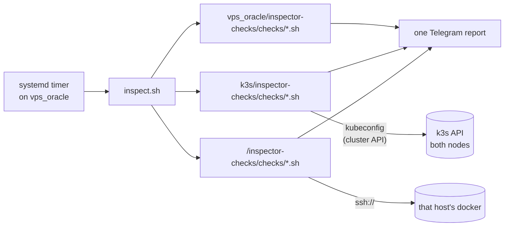

# k3s/inspector-checks

Inspection checks **about the k3s cluster**, **executed on vps_oracle**.

The cluster has no inspector of its own. The single inspector (`vps_oracle/host-native/inspector/`, a systemd timer on vps_oracle) discovers these checks in addition to its own and folds their results into the same Telegram report. This directory exists so that a check's location tells you what it inspects: `vps_oracle/inspector-checks/checks/` = vps_oracle itself, `<host>/inspector-checks/checks/` = that host, and here = the cluster — which is neither host alone.

That last point is why these checks are at the repo root rather than under a host. The k3s cluster is one component spanning two nodes (server on vps_oracle, agent on vps-oracle2), so it gets a root-level directory exactly like `k3s/` itself. They used to live beside the inspector engine (`vps_oracle/host-native/inspector/checks/`, which at the time also held every check about vps_oracle itself), so the report attributed cluster findings to vps_oracle — that is how the 2026-09-27 lab OOM was read as a vps_oracle problem while every `lab-environment` pod runs on vps-oracle2.

## Layout

- `checks/k3s-<name>.sh` — the full detection (and, for auto-tier, cleanup) logic for that check. Nothing cluster-wide is implemented under `vps_oracle/`.
- `lib/kube.sh` — sourced by every check: borrows `emit_result` and friends from the vps_oracle inspector's `lib/common.sh`. The kubeconfig path and the `kc` wrapper are deliberately still per-check (see the file's comment).
- `tests/test-k3s-<name>.sh` — one hermetic test per check (kubectl stub), same pairing rule as every other tree. CI enforces it, and its globs already cover this directory.

## How the report groups these

`inspect.sh` attributes each check to the directory it lives under, so everything here appears under the `k3s` block. No prefix in the alert text is needed — but a finding that concerns one node should name it, because the block does not. `k3s-oom-killed-containers.sh` therefore reports the pod's `nodeName`; do the same in any new check whose finding lands on a specific node.

## What does not belong here

- **Node-local checks.** `vps_oracle/inspector-checks/checks/k3s-containerd-images.sh` reads *vps_oracle's* containerd via `crictl` and correctly stays under `vps_oracle`, despite the `k3s-` prefix. The prefix does not decide this — what the check reads does. There is an `oracle2-k3s-containerd-images.sh` under `vps_oracle2/inspector-checks/` for the other node, over SSH.
- **Anything scoped to one host's docker.** That is what `<host>/inspector-checks/` is for.

## Requirements and gotchas

- The checks use the least-privilege kubeconfig written by `vps_oracle/host-native/inspector/kubeconfig/setup-kubeconfig.sh` (gitignored, mode 600). If it is missing they emit an alert naming that script rather than failing silently.
- **RBAC is part of the check's contract.** A check that needs a verb the ServiceAccount lacks reports a `Forbidden` fetch and points at `vps_oracle/host-native/inspector/kubeconfig/rbac.yaml`; see that file's ClusterRole before adding a check that reads a new resource. (Spelled out in full deliberately: this tree sits beside the repo-root `k3s/`, so a bare `k3s/rbac.yaml` would read as a root-level file that does not exist.)
- Events are not a reliable signal: Kubernetes Events expire after 1h, so anything looking for a past incident must read durable state instead (`containerStatuses[].lastState`, node `dmesg`) — the OOM check's comment covers this.

## Adding a check

Follow the `inspector-check` skill, but put the check and its test here rather than under `vps_oracle/`. Source `lib/kube.sh`, and name it `k3s-…` so it stays unique in `inspect.sh`'s crash reports.
