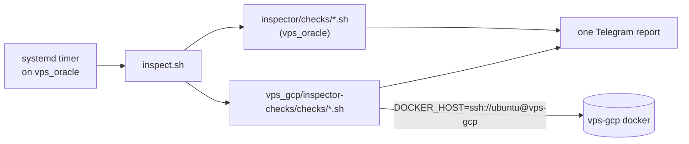

# vps_gcp/inspector-checks

Inspection checks **about vps-gcp**, but **executed on vps_oracle**.

vps-gcp runs no inspector of its own. The single inspector (`vps_oracle/host-native/inspector/`, a systemd timer on vps_oracle) discovers these checks in addition to its own and folds their results into the same Telegram report. This directory exists so that a check's location tells you which machine it inspects: `vps_oracle/host-native/inspector/checks/` = vps_oracle itself, `<host>/inspector-checks/checks/` = that host, reached remotely.



## Layout

- `checks/gcp-<name>.sh` — the full detection (and, for auto-tier, cleanup) logic for that check. Nothing about gcp is implemented under `vps_oracle/`.
- `lib/remote.sh` — sourced by every check: exports `DOCKER_HOST=ssh://ubuntu@vps-gcp`, wraps `docker` in a `timeout`, provides `require_daemon` (alert + exit when gcp is unreachable), and borrows `emit_result` from the vps_oracle inspector's `lib/common.sh`. Because `docker` is overridden, a check body reads exactly like its local counterpart.
- `tests/test-gcp-<name>.sh` — one hermetic test per check (docker stub), same pairing rule as the local inspector. CI enforces it.

## How alerts are told apart

The report is one logical inspection grouped by instance: `inspect.sh` attributes each check to the host directory it lives under, so a result from this directory always appears under the `vps_gcp` block. No prefix in the alert text is needed. An unreachable host raises `check:… docker daemon unreachable` under that block, which doubles as a liveness check.

## Current checks

Each mirrors the local check of the same name in `vps_oracle/host-native/inspector/checks/`, same tier and thresholds (env vars are shared, e.g. `INSPECTOR_STOPPED_CONTAINER_MAX_AGE_SECONDS`).

| Check | Tier | What it does on gcp |
|---|---|---|
| `gcp-docker-stopped-containers.sh` | auto | removes containers exited > 7 days |
| `gcp-docker-dangling-images.sh` | auto | removes dangling images older than 7 days |
| `gcp-docker-build-cache.sh` | auto | prunes build cache older than 7 days |
| `gcp-docker-unused-networks.sh` | auto | removes custom networks with no containers |
| `gcp-docker-restart-storms.sh` | alert | high RestartCount / stuck restarting |

The auto-tier ones **really delete on gcp** over SSH (`INSPECTOR_DRY_RUN=1` makes them only report `would-delete`, like the local ones). Not mirrored, deliberately: `docker-unused-volumes` (alert-only locally too; gcp has no named volumes today), and `docker-oversized-logs` (reads `/var/lib/docker/containers` on the host's filesystem, which `DOCKER_HOST` cannot reach; gcp's compose stacks set `max-size`). Override the target with `INSPECTOR_GCP_DOCKER_HOST`.

## Requirements and gotchas

- The timer runs as `ubuntu`, so `~/.ssh/config` must resolve `vps-gcp` (HostName, `~/.ssh/id_gcp`) and the host key must be in `known_hosts`.
- **SSH connection reuse is required for acceptable runtime.** Every `docker …` call over `DOCKER_HOST=ssh://` opens its own SSH connection, and vps-gcp (us-central1) is a cross-ocean hop from vps_oracle: measured ~5s per call, so the five checks took ~100s. Add this to the `vps-gcp` block in `~/.ssh/config` (host-local, not tracked in this repo) and they take ~23s:

  ```
  ControlMaster auto
  ControlPath /home/ubuntu/.ssh/cm-%C
  ControlPersist 60
  ```
- vps-gcp's public IP is ephemeral. If it changes, the next run alerts `unreachable` until `HostName` is updated (see `vps_gcp/tofu/README.md`).
- Remote calls are wrapped in `timeout` (`INSPECTOR_DOCKER_TIMEOUT`, default 30s) so a hung SSH session can't stall the whole run.

## Adding a check

Follow the `inspector-check` skill, but put the wrapper and its test here. Write the check here as a standalone script that sources `lib/remote.sh` and calls `require_daemon`. Name it `gcp-…` so its name stays unique in `inspect.sh`'s crash reports.
