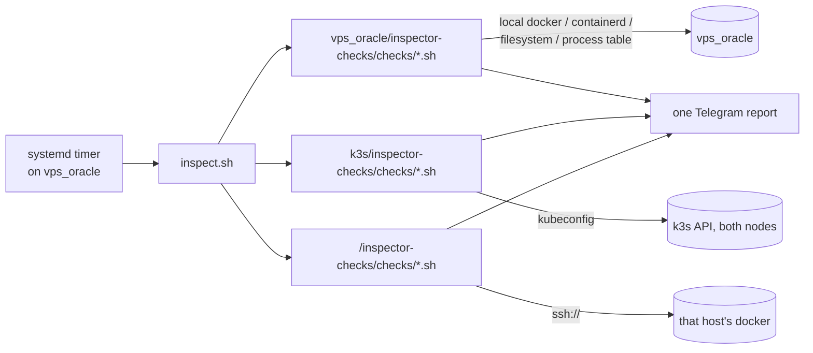

# vps_oracle/inspector-checks

Inspection checks **about vps_oracle itself**.

They are executed by the inspector engine ([`vps_oracle/host-native/inspector/`](../host-native/inspector/README.md), a systemd timer on this host) and folded into one Telegram report together with the other instances'. This directory exists so that a check's location tells you what it inspects: here = this host, `<other-host>/inspector-checks/checks/` = that host, `k3s/inspector-checks/checks/` = the cluster.

That rule is why these checks are *not* beside the engine, which is where they used to live. The engine must know nothing about who it inspects: it globs `<repo>/*/inspector-checks/checks/*.sh` and reads each finding's instance name off the directory the check was found in. Keeping vps_oracle's checks in the engine directory would reintroduce the one exception to that rule — and the exception is exactly the thing that misattributes findings (the 2026-09-27 lab OOM was reported under `vps_oracle` while every pod it concerned runs on vps-oracle2).

## Layout

- `checks/<name>.sh` — the full detection (and, for auto-tier, cleanup) logic for that check.
- `lib/local.sh` — sourced by every check. The thinnest of the four trees' `lib/` files: a check about the local host has nothing to redirect (no `DOCKER_HOST` like `remote.sh`, no kubeconfig like `kube.sh`), so it only borrows the engine's `lib/common.sh`.
- `tests/test-<name>.sh` — one hermetic test per check, same pairing rule as every other tree. CI enforces it.

## How the report groups these

Everything here appears under the `vps_oracle` block, since that is this directory's name. No prefix in the alert text is needed.

## Scope

These are the only checks that may read this host directly — `docker`, `crictl`, the process table, the filesystem. A check that reads the *cluster* API belongs in [`k3s/inspector-checks/`](../../k3s/inspector-checks/) even when the resource it examines happens to live on this node; a check about another machine belongs under that machine.

`k3s-containerd-images.sh` is the illustrative case: despite its `k3s-` prefix it reads **this host's** containerd through `crictl`, so it is node-local and belongs here. Its counterpart for the other node (`oracle2-k3s-containerd-images.sh`) lives under `vps_oracle2/inspector-checks/` and reaches it over SSH. The prefix decides nothing; what the check reads decides.

## Adding a check

Follow the `inspector-check` skill, and put the check and its test here. Source `lib/local.sh`.
