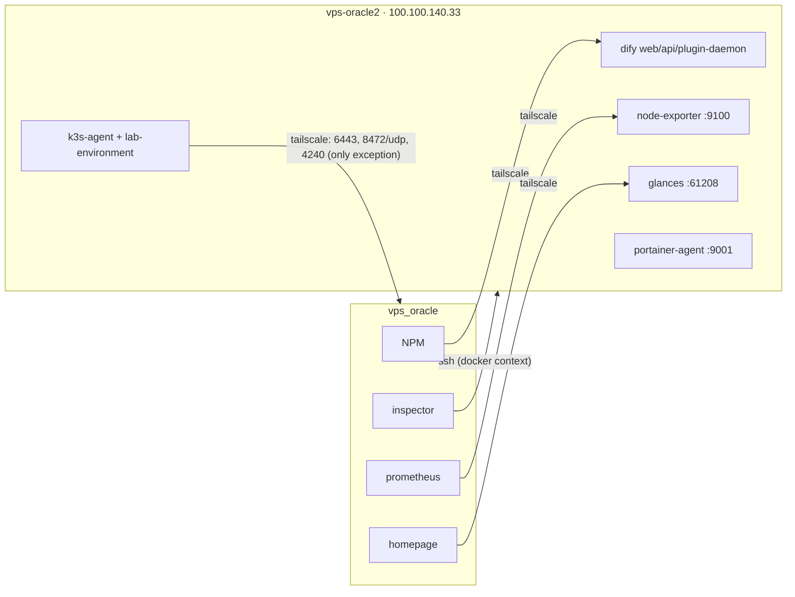

# vps_oracle2

A second Oracle Cloud instance in a **separate OCI tenancy** (`ap-singapore-1`, Always Free A1.Flex, 2 OCPU / 12 GB). Its role is to offload workloads from vps_oracle — dify (compose) and, since 2026-09-24, lab-environment as a **k3s agent node** of vps_oracle's cluster — and to serve as a remotely managed node.

The repo lives only on vps_oracle; this host has no clone. Everything is driven from vps_oracle over SSH (`ssh vps-oracle2`, dedicated key `~/.ssh/id_oracle2`). The public IP is ephemeral — see [../CLAUDE.local.md](../CLAUDE.local.md) for how to refresh it.

## Directory structure

| Directory | What it manages | Conventions in |
|---|---|---|
| `tofu/` | OpenTofu full-control adoption of the tenancy: network imported, instance created by tofu (`destroy` allowed, unlike `vps_oracle/tofu/`) | [tofu/README.md](tofu/README.md) |
| `compose/` | docker compose stacks, deployed remotely with `docker --context oracle2` | this file + root [README.md](../README.md) |
| `inspector-checks/` | inspection checks about this host, executed on vps_oracle by its inspector over SSH | [inspector-checks/README.md](inspector-checks/README.md) |

This host's k3s agent config and installer are part of the cluster, so they live with it at [`k3s/install/agent-vps-oracle2/`](../k3s/install/agent-vps-oracle2/README.md).

## Network model



- **Reachable over tailscale only.** The OCI security list allows just 22/TCP + ICMP, host iptables rejects the rest, and `rpcbind` is disabled. Every published port is bound to oracle2's tailscale IP `100.100.140.33`, never `0.0.0.0`.
- **One-directional ACL:** `tag:oracle-hub` → `tag:oracle2`. oracle2 cannot initiate anything toward oracle or gcp — **except** the k3s node ports toward oracle-hub (tcp 6443, udp 8472, tcp 4240, icmp) that the agent needs. The ACL is GitOps-managed in [`../tailscale/policy.hujson`](../tailscale/policy.hujson), whose `tests` pin exactly this. Never put oracle2 in `tag:oracle-hub`, or it inherits oracle-hub's access to gcp-lab.
- There is no shared docker `proxy` network with vps_oracle. Cross-host reverse proxying goes through NPM on vps_oracle, forwarding to the tailscale IP.
- If oracle2 re-registers on tailscale (e.g. after `tofu destroy`/`apply`), its tailscale IP changes: update every compose `ports:` binding here, the Glances/prometheus/blackbox references on vps_oracle, the dify NPM host (see [compose/dify/README.md](compose/dify/README.md)), and `node-ip` in [`k3s/install/agent-vps-oracle2/config.yaml`](../k3s/install/agent-vps-oracle2/config.yaml) (then rerun its `install.sh`).

## Compose stacks

Deploy from vps_oracle. One-time context setup:

```bash
docker context create oracle2 --docker "host=ssh://ubuntu@vps-oracle2"
docker --context oracle2 compose -f vps_oracle2/compose/<stack>/docker-compose.yml up -d
```

Bind-mount paths and relative `file:` configs resolve on **oracle2's** filesystem, not here, so they must already exist there or be avoided (inline as `configs: content:`). `.env` is read locally and needs no sync. See [../CLAUDE.local.md](../CLAUDE.local.md).

| Stack | Purpose | Port (tailscale IP) |
|---|---|---|
| `node-exporter` | scraped by vps_oracle's prometheus under the existing `node_oracle` job (`instance: vps-oracle2`), so it appears in the `node-exporter-full-oracle` dashboard | 9100 |
| `glances` | feeds the three "oracle2" cards (CPU/Memory/Disk) on vps_oracle's homepage | 61208 |
| `portainer-agent` | agent endpoint for the portainer on vps_oracle | 9001 |
| `dify` | self-hosted Dify, moved from vps_oracle on 2026-09-19 | 3000 / 5001 / 5002 |

## Monitoring

- **Metrics:** node-exporter → vps_oracle prometheus.
- **Inspection:** no inspector runs on oracle2 itself; the vps_oracle inspector runs `inspector-checks/` remotely and folds results into the same Telegram report.
