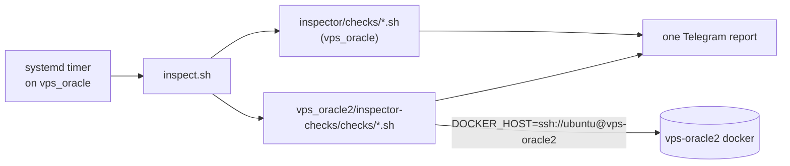

# vps_oracle2/inspector-checks

Inspection checks **about vps-oracle2**, but **executed on vps_oracle**.

vps-oracle2 runs no inspector of its own. The single inspector (`vps_oracle/host-native/inspector/`, a systemd timer on vps_oracle) discovers these checks in addition to its own and folds their results into the same Telegram report. This directory exists so that a check's location tells you which machine it inspects: `vps_oracle/host-native/inspector/checks/` = vps_oracle itself, `<host>/inspector-checks/checks/` = that host, reached remotely.

## Layout

- `checks/<name>.sh` — the full detection logic for that check. It only borrows `lib/common.sh` (`emit_result` etc.) from the vps_oracle inspector; the docker calls go to oracle2 via `DOCKER_HOST=ssh://…`. Nothing about oracle2 is implemented under `vps_oracle/`.
- `tests/test-<name>.sh` — one test per check (hermetic docker stub), same pairing rule as the local inspector. CI enforces it.

## How alerts are told apart

The report is one logical inspection grouped by instance: `inspect.sh` attributes each check to the host directory it lives under, so a result from this directory always appears under the `vps_oracle2` block. No prefix in the alert text is needed. An unreachable host raises `check:… docker daemon unreachable` under that block, which doubles as a liveness check.

## Current checks

- `oracle2-docker-restart-storms.sh` (alert) — containers with a high RestartCount or stuck restarting. Override the target with `INSPECTOR_ORACLE2_DOCKER_HOST`.

## Requirements and gotchas

- The timer runs as `ubuntu`, so `~/.ssh/config` must resolve `vps-oracle2` (HostName, `~/.ssh/id_oracle2`) and the host key must be in `known_hosts`.
- vps-oracle2's public IP is ephemeral. If it changes, the next run alerts `unreachable` until `HostName` is updated (see `vps_oracle2/tofu/README.md`).
- Remote calls are wrapped in `timeout` (`INSPECTOR_DOCKER_TIMEOUT`, default 30s) so a hung SSH session can't stall the whole run.

## Adding a check

Follow the `inspector-check` skill, but put the wrapper and its test here. Write the check here as a standalone script: `export DOCKER_HOST`, wrap docker calls in `timeout`, and alert when the host is unreachable. Name it `oracle2-…` so its name stays unique in `inspect.sh`'s crash reports.
