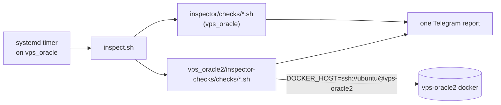

# vps_oracle2/inspector-checks

Inspection checks **about vps-oracle2**, but **executed on vps_oracle**.

vps-oracle2 runs no inspector of its own. The single inspector (`vps_oracle/host-native/inspector/`, a systemd timer on vps_oracle) discovers these checks in addition to its own and folds their results into the same Telegram report. This directory exists so that a check's location tells you which machine it inspects: `vps_oracle/host-native/inspector/checks/` = vps_oracle itself, `<host>/inspector-checks/checks/` = that host, reached remotely.

## Layout

- `checks/<name>.sh` — thin wrapper: sets `DOCKER_HOST` and `INSPECTOR_INSTANCE=vps-oracle2`, then `exec`s the shared implementation under `vps_oracle/host-native/inspector/checks/`. No detection logic is duplicated here.
- `tests/test-<name>.sh` — one test per check (hermetic docker stub), same pairing rule as the local inspector. CI enforces it.

## How alerts are told apart

The report title only says `vps_oracle`, so every line from a remote check carries the instance in its target: `[vps-oracle2] docker container <name>`. An unreachable host raises `[vps-oracle2] check:… docker daemon unreachable`, which doubles as a liveness check. Local alerts have no prefix.

## Current checks

- `oracle2-docker-restart-storms.sh` (alert) — containers with a high RestartCount or stuck restarting. Override the target with `INSPECTOR_ORACLE2_DOCKER_HOST`.

## Requirements and gotchas

- The timer runs as `ubuntu`, so `~/.ssh/config` must resolve `vps-oracle2` (HostName, `~/.ssh/id_oracle2`) and the host key must be in `known_hosts`.
- vps-oracle2's public IP is ephemeral. If it changes, the next run alerts `unreachable` until `HostName` is updated (see `vps_oracle2/tofu/README.md`).
- Remote calls are wrapped in `timeout` (`INSPECTOR_DOCKER_TIMEOUT`, default 30s) so a hung SSH session can't stall the whole run.

## Adding a check

Follow the `inspector-check` skill, but put the wrapper and its test here. Prefer wrapping an existing local check via `INSPECTOR_INSTANCE` + `DOCKER_HOST` over copying logic.
